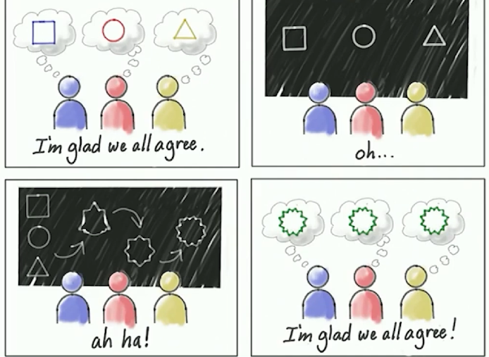
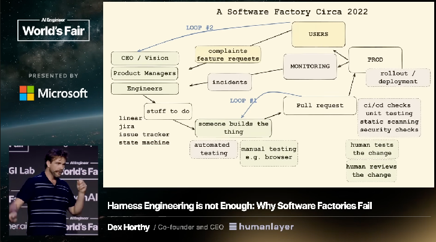
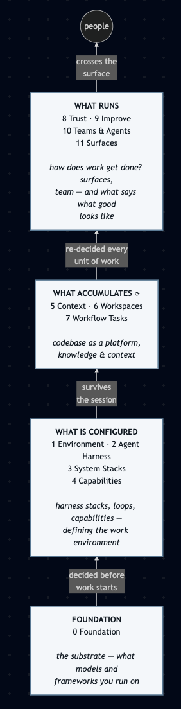
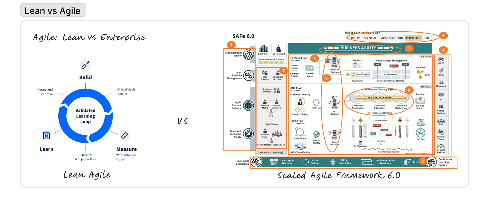
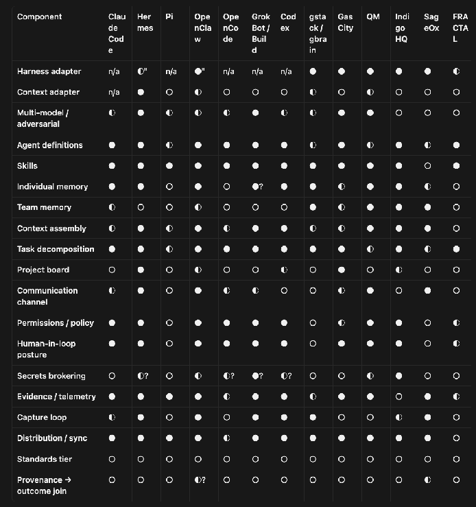
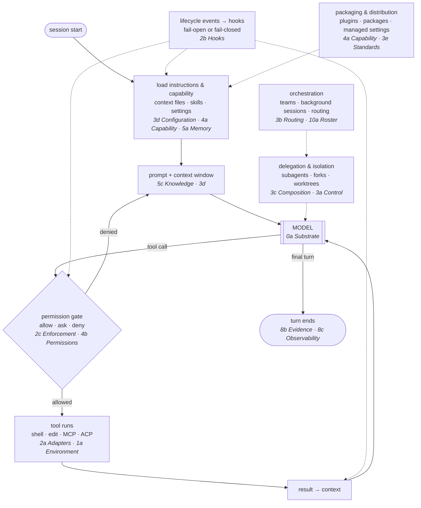

# harness-atlas

**A wiki that tears agent harnesses down into the primitives they actually ship, scores them on one
fixed component grid, and places them on a maturity range.** Every profile is built the same way from
the harness's own documentation, code and configuration, so that an engineer can *grok* a harness —
its loop, its primitives, its limits — from one page, and compare it to the next one cell for cell.

**Start here** — [the map](./index.md) · [one profile](./content/claude-code.md) · [the grid](./components/MATRIX.md) · [one component, every harness](./components/2b-hooks.md) · [the scorecard](./spectrums/01-scorecard.md)

This page is the argument, and the highlights.

---

## Why this exists

Back in March I was a contractor, and Cursor was my toolchain. I liked that it let me use different
models, and I'd built a good workflow around a spec and a test-driven process.

Then in April I accepted a full-time position, and the full-time obligations that came with it. The way I worked had to change: I was restricted to the corporate VM. No Claude Desktop, no AI IDEs. Just VSCode and a Claude API key.

As the world moved into context engineering, building loops, and experimenting with AI subscriptions our team couldn't get approved I realised I had to start building my own tools. After I built a workflow for orchestrating agents, I was able to ship a feature. Then I shared my repo with my team and realised what we were missing was shared context, so I built a decision ledger. **Next thing I know, the stack I had built, the industry was calling a harness.**

Fast forward to today. For the past month I've been trying to compare what I'd built, and realised I  
had a very hard time describing my own workflow.

As AI developers we have a unique challenge: the way we work with agents is vastly different based on what we're building and how we ship code. If working with engineers has taught me anything, we are very opinionated about what good code looks like, and it isn't productive to tell someone how to code. That being said, **for individuals opinions are fine and you can work the way you want, but teams need structure, shared understanding, and frameworks.**

[Jeff Patton & Luke Barret - I'm glad we all agree](https://jpattonassociates.com/glad-we-all-agree-2/) & [User Story Mapping](https://jpattonassociates.com/story-mapping-quick-ref/)

In the age of AI convenience, it's hard to advocate for alignment when nobody reads. One of my favourite
graphics encapsulates this, and why it's important to at least nail down the shape of what your team is
building before AI completes and ships a shape you didn't expect.

**So this repo is my attempt to build a map** and document the shape of what your team harness looks
like, so we have an easy tool to see what's similar and what's different about our workflows.

- AI **profiles and teardowns** for each harness, and a mental model of its workflows.
- **Stat sheets, feature comparisons and diagrams** to track trends.
- ...and some insights on what I've learned along the way (mostly not from the AI analysis)

## The five-minute version

1. **Don't assume your team's goal is AI-native.** The best framework for your team is a mapped environment that lets users *and* agents get the job done.

**This is not a refutation of the bitter lesson so much as a different question.** The bitter lesson is about what wins; this is about how teams build with AI. And on the evidence here it has already happened at the bottom of the stack:  adapters, hooks, configuration and skills converged across every harness in roughly eighteen months. 

My key takeaway has been realizing that mapping a mental model for the 4 layers of your harness can provide enough loose structure to adapt to most of the variance in your team's AI-maturity. 

#### **2. Fundamentally, as developers and system designers we are trying to answer "How do we work?"**

 *Harness Engineering is not Enough: Why Software Factories Fail  (Dex Horthy, HumanLayer)* ([https://youtu.be/Ib5GBkD555M](https://youtu.be/Ib5GBkD555M?si=6m8aScOdVPZf50Sc))

1. **Four layers answer it** — and they are the twelve layers of the grid, read at a distance.

 *The four bands, bottom-up — source* `[assets/templates/layer-stack-4-bands.mmd](./assets/templates/layer-stack-4-bands.mmd)`*. The full twelve-layer version is* `[assets/templates/layer-stack.mmd](./assets/templates/layer-stack.mmd)`*.*

**A harness is strikingly similar to SDLC.** Like agile ranging from lean to SAFe 6.0, the complexity of your harness scales as you grow and migrate toward mature enterprise platforms.

 *Lean Agile's validated learning loop vs. the [Scaled Agile Framework 6.0](https://scaledagileframework.com/) (Leffingwell et al. © Scaled Agile, Inc.) — the same discipline, two orders of magnitude apart in ceremony.*

1. **Harnesses and loop engineering mostly have the same shape.** That shape is the section below, and the thirty-three components inside these four bands are the section after it.

### The trends

- **Everybody has agreed on the plumbing** — substrate, adapters, hooks, configuration, skills. Five of
thirty-three components, named primitives in all seven harnesses read at source, and every one is a
way to *plug something in*.
- **Multiplayer and context for teams is the next frontier** — team knowledge, secrets brokering,
decision ledgers, cost optimisation. `5b` [Team Memory](./components/5b-team-memory.md) is **0 of 7**.
- **Surfaces are a differentiator** — making your harness and agents accessible. AI tools trend toward
convenience; adapters and gateways make switching costs lower.
- **Most harnesses don't do deterministic validation by default.** Grok Build: *"Hooks fail open."*
Hermes defaults to `fail_closed`. Same mechanism, opposite safety posture, both shipping.
- **Nobody ships the standards or the evals.** `3e` [Standards](./components/3e-standards.md) **0 of 7**,
six of them hard absences. `8a` [Evals](./components/8a-evals.md) **0 of 7**, every one dev-facing.

### The hot takes

- **If agents work the entire environment, you need to map the entire environment** — the company turns
into a monorepo, or a virtual one. `1a` [Environment](./components/1a-environment.md) and
`6c` [Estate](./components/6c-estate.md) are both **0 of 7**.
- **Rituals — standups, retros, planning — don't have agents present**, so they stay manual maintenance
until agents are part of the team. `9b` [Rituals](./components/9b-rituals.md) is **0 of 7**.
- **Ecosystems lead to longevity.** Marketplaces and network effects are the next era; the alternative is
a harness nobody uses.

The grid, every system against every component — `[components/MATRIX.md](./components/MATRIX.md)` §1

## The anatomy of a harness

One loop, and the insertion points around it. Each insertion point is labelled with the component
that grades it, so a profile's 33-row table lands on this picture.

*Source:* `[assets/templates/harness-loop.mmd](./assets/templates/harness-loop.mmd)`*. Generalised from the
"seven insertion points" reading of Claude Code in*
`[content/claude-code/20-consolidated-guide.md](./content/claude-code/20-consolidated-guide.md)` *§1 —
this repo's own synthesis, not a vendor diagram. Vendor diagrams, redrawn, live under*
`[assets/projects/](./assets/projects)`*.*

## The layers, and what the core has agreed on

Twelve layers, thirty-three components. **✅ marks a named primitive in all seven** harnesses read at
source — Hermes · Pi · OpenClaw · OpenCode · Grok · Codex · Claude Code. **⛔ marks zero of seven.**

**FOUNDATION**

- **0 Foundation** — `0a` [Substrate](./components/0a-substrate.md) ✅
- **1 Environment** — `1a` [Environment](./components/1a-environment.md) ⛔

**CONFIGURED** — decided before any unit of work starts

- **2 Agent Harness** — `2a` [Adapters & Middleware](./components/2a-adapters-and-middleware.md) ✅ · `2b` [Hooks](./components/2b-hooks.md) ✅ · `2c` [Enforcement](./components/2c-enforcement.md)
- **3 System Stacks** — `3a` [Control](./components/3a-control.md) · `3b` [Routing](./components/3b-routing.md) · `3c` [Composition](./components/3c-composition.md) · `3d` [Configuration](./components/3d-configuration.md) ✅ · `3e` [Standards](./components/3e-standards.md) ⛔
- **4 Capabilities** — `4a` [Capability](./components/4a-capability.md) ✅ · `4b` [Capability Permissions](./components/4b-capability-permissions.md)

**ACCUMULATES** ⟳ — survives the session, cannot be re-decided per unit

- **5 Context** — `5a` [Individual Memory](./components/5a-individual-memory.md) · `5b` [Team Memory](./components/5b-team-memory.md) ⛔ · `5c` [Knowledge](./components/5c-knowledge.md)
- **6 Workspaces** — `6a` [Product](./components/6a-product.md) ⛔ · `6b` [Infrastructure](./components/6b-infrastructure.md) · `6c` [Estate](./components/6c-estate.md) ⛔ · `6d` [Delivery](./components/6d-delivery.md)
- **7 Workflow Tasks** — `7a` [Workflow Tasks](./components/7a-workflow-tasks.md), the unit of work written down

**RUNS** — judgements re-decided for every unit

- **8 Trust** — `8a` [Evals](./components/8a-evals.md) ⛔ · `8b` [Evidence](./components/8b-evidence.md) · `8c` [Observability](./components/8c-observability.md) · `8d` [Efficiency](./components/8d-efficiency.md)
- **9 Improve** — `9a` [Learning](./components/9a-learning.md) · `9b` [Rituals](./components/9b-rituals.md) ⛔ · `9c` [Cadence](./components/9c-cadence.md) · `9d` [Anti-fragile Lifecycle](./components/9d-anti-fragile-lifecycle.md) ⛔ · `9e` [Raise the Floor](./components/9e-raise-the-floor.md) ⛔ · `9f` [Diagnose the Bottleneck](./components/9f-diagnose-the-bottleneck.md) ⛔
- **10 Teams & Agents** — `10a` [Roster](./components/10a-roster.md) · `10b` [Org](./components/10b-org.md)
- **11 Surfaces** — `11a` [Surfaces](./components/11a-surfaces.md), where work is seen and which version is true

**The core, counted.** Five components are named primitives in all seven; all five sit at layer 4 or
below. Ten are named primitives in none; nine of those sit at layer 3e or above. The line runs between
the plumbing and the practice — `[components/ALIGNMENT.md](./components/ALIGNMENT.md)` §2.

## How to read a profile

Every page under `[content/](./content)` has the same shape, produced by
`[skills/harness-teardown/SKILL.md](./skills/harness-teardown/SKILL.md)`:

1. **Thirty seconds.** A one-line thesis and an **at-a-glance card**: altitude, primitives, the
  one structured output it optimises for, whether it binds mechanically, where state lives, who it
   serves, what it refuses, and a coverage count.
2. **The picture.** The vendor's own **system map**, redrawn, with one paragraph on how it thinks
  about work; then one to three **workflows** transcribed from the vendor's docs — the turn,
   delegation, the signature flow. Never invented: a harness with no vendor diagram gets a
   clearly-labelled overlay of the atlas anatomy, or an absence line.
3. **The matrix.** Thirty-three components under twelve layers, one mark each — `●` named
  primitive · `◐` present, not first-class · `○` absent · `n/a` — with the primitive's name or a
   ten-word note. Every row links to its detail.
4. **The primitive set** — the vendor's own names and definitions, verbatim, counted. Five to seven
  is healthy; twelve-plus is accommodation failure; a published refusal list is the strongest form.
5. **Open what you need.** Details per component (what it ships, the path, the source — `✅` direct ·
  `↪` relayed · `⚠️` unverified), then identity and the inclusion test, stated limits quoted without
   commentary, sources down to the `gh api` commands run, and what could not be verified — all
   collapsed, all mandatory. Absence is written *"Nothing here — checked README, docs index,
   settings, examples"*. **Never inferred.**

## Highlights

Six of the profiles, chosen because each stakes a different position. The full set, and the queue,
are in `[index.md](./index.md)` §1.

| Harness         | Altitude                                                            | In one line                                                                                                                                                                                                                                             | Its structured output                                                                                                                            | Profile                                                                                                                                                            |
| --------------- | ------------------------------------------------------------------- | ------------------------------------------------------------------------------------------------------------------------------------------------------------------------------------------------------------------------------------------------------- | ------------------------------------------------------------------------------------------------------------------------------------------------ | ------------------------------------------------------------------------------------------------------------------------------------------------------------------ |
| **Claude Code** | runtime                                                             | An agent loop wrapped in an "agentic harness"; it optimises for a single operator's turn binding mechanically at the tool-call boundary, everything upstream shaping behaviour by prose                                                                 | the `claude_code.interaction` OTel trace, whose `claude_code.tool` spans carry the `tool_decision` permission-audit record — verified 2026-09-04 | `[content/claude-code.md](./content/claude-code.md)`                                                                                                               |
| **Pi**          | runtime                                                             | Defined by subtraction — *"No MCP. No sub-agents. No permission popups."* — each shipped as an example extension instead; holds at eight primitives                                                                                                     | the session JSONL *tree*, which doubles as the run receipt                                                                                       | `[content/pi.md](./content/pi.md)`                                                                                                                                 |
| **Hermes**      | gateway / host                                                      | Makes *learning* the headline: authors skills from experience, caps memory files, ages skills out; hosts the Codex app-server as an alternate loop                                                                                                      | the kanban that owns *"lifecycle truth"*                                                                                                         | `[content/hermes.md](./content/hermes.md)`                                                                                                                         |
| **Gas City**    | gateway / host, with an install-into-a-loop mechanism nested inside | Yegge's *software factory*: six declared primitives with a published admission test for adding one — and a documented deletion of one — driving fifteen-plus coding-agent CLIs through shared state                                                     | the Bead — the one substrate every other primitive writes through                                                                                | `[content/gas-city.md](./content/gas-city.md)` *(supersedes the short profile, whose "seven" and "Factory Worker Protocol" did not survive a primary-source read)* |
| **LoomWarp**    | process layer                                                       | The system this atlas was cut out of, scored here as a peer with no special status — its primitive set reads **0 named**: stated once in a superseded spec, then dropped; six candidates listed apart from the verdict                                  | `control/events.jsonl` — thirteen lines, three event types, none schema-validated                                                                | `[content/loomwarp.md](./content/loomwarp.md)`                                                                                                                     |
| **FRACTAL**     | process layer                                                       | KD-built, graded by the same rules, read at three instances (upstream · a fork since removed from GitHub · this repo, un-routed): five named artifacts — STRATEGIST, BLUEPRINT, PRD, HANDOFF, PULSE — never stated as a set; this repo runs two of them | the `HANDOFF.md` — the mandatory terminal artifact every workstream writes before state advances                                                 | `[content/fractal.md](./content/fractal.md)`                                                                                                                       |

## The deep reads

Beneath each profile sits a folder cut by **the vendor's own vocabulary** rather than by our 33
components — `content/<harness>/`. The profile answers *what is this and how does it compare*; the deep
read answers *how does this surface actually work*, at a grain a table row cannot hold: an execpolicy
grammar, a memory pipeline's two phases, twelve hook events with their payloads.

**The two cuts disagree on purpose.** A reader comparing harnesses reads the profile. A reader using one
reads the deep read.

Ten of ten harnesses, **118 documents**, each carrying the version it was read at, the date, and a
ledger of what the vendor claims the thing is *for* — walked against the mechanisms actually found.

→ `[content/openclaw/](./content/openclaw/00-README.md)` is the largest at 21 documents ·
`[content/pi/](./content/pi/00-README.md)` the smallest at 5, because Pi ships less and documents it
better · `[content/codex/](./content/codex/00-README.md)` is the worked example the others were built
against.

## Contents

The four tiers, and what each one answers. Every row is a place to start reading; the tier column says
how deep you are standing.

|        | Where                         | Answers                                             | Start with                                                                                                                                   |
| ------ | ----------------------------- | --------------------------------------------------- | -------------------------------------------------------------------------------------------------------------------------------------------- |
| **0**  | `README.md` — you are here    | *Why does this exist, and what did it find?*        | the [five-minute version](#the-five-minute-version)                                                                                          |
| **1**  | `[index.md](./index.md)`      | *What is the shape of the whole thing?*             | the grid, the range, the layers, the words — one screen                                                                                      |
| **2**  | `[components/](./components)` | *What is this one component, across every harness?* | `2b` [hooks](./components/2b-hooks.md) · `5b` [team memory](./components/5b-team-memory.md) · `3e` [standards](./components/3e-standards.md) |
| **3**  | `[content/](./content)`       | *What is this one harness?*                         | [Claude Code](./content/claude-code.md) · [Pi](./content/pi.md) · [Gas City](./content/gas-city.md) · [all ten](./index.md#1-the-instrument) |
| **3+** | `content/<harness>/`          | *How does this one surface actually work?*          | [Codex](./content/codex/00-README.md), the worked example · [OpenClaw](./content/openclaw/00-README.md), 21 documents                        |

### The instruments

|                                                          | Question                                                                      | Unit                     |
| -------------------------------------------------------- | ----------------------------------------------------------------------------- | ------------------------ |
| `[components/MATRIX.md](./components/MATRIX.md)`         | **What does it ship?** — the grid, 19 concept rows × 15 systems               | `●` `◐` `○` `n/a`        |
| `[components/ALIGNMENT.md](./components/ALIGNMENT.md)`   | **What does it ship?** — the same read at 33 components, harness columns only | `●` `◐` `○`              |
| `[spectrums/positioning.md](./spectrums/positioning.md)` | **Where does it sit?** — seven DX dimensions over ten axes, no good end       | `−3 … +3`                |
| `[maturity/](./maturity)`                                | **How are we doing?** — six stages, three eras, one commitment threshold      | `1 … 6`, minimum governs |
| `[vocabulary.md](./vocabulary.md)`                       | **What do we call it?** — term → concept → who says it → our component        | the ledger               |

### The machinery

|                                                                            |                                                                                               |
| -------------------------------------------------------------------------- | --------------------------------------------------------------------------------------------- |
| `[components/00-README.md](./components/00-README.md)`                     | the ID register — all 33, and the question each answers                                       |
| `[components/CROSSWALK.md](./components/CROSSWALK.md)`                     | recorded gaps, the rulings that closed them, the candidates register                          |
| `[components/RELATIONS.md](./components/RELATIONS.md)`                     | which components `require` which                                                              |
| `[rulings/](./rulings/00-README.md)`                                       | every decision that changed a rule, an id or a name                                           |
| `[skills/harness-teardown/SKILL.md](./skills/harness-teardown/SKILL.md)`   | the template every profile follows                                                            |
| `[skills/harness-deep-read/SKILL.md](./skills/harness-deep-read/SKILL.md)` | the procedure every deep read follows                                                         |
| `[assets/](./assets)`                                                      | `templates/` the core diagrams · `projects/<harness>/` the vendor ones, redrawn               |
| `[CONTRIBUTING.md](./CONTRIBUTING.md)`                                     | how to argue with a cell                                                                      |
| `[archive/](./archive)`                                                    | the v1 specification, `craft/`, and the superseded comparisons — by ruling, never by deletion |

**Standing rules**, in full in `[CLAUDE.md](./CLAUDE.md)`: markdown is not code · absence is recorded,
never inferred · a primitive set is 5–7 and forces a choice · do not borrow a word and change its
referent · archive by ruling, never by deletion · vendor's words only in a primitives table.

## Licence, and what "drafted" means on every page

**MIT** — `[LICENSE](./LICENSE)`. Published **for educational purposes**: this is a research and teaching
instrument, not a buyer's guide and not an endorsement of any product. Quoted vendor documentation
stays the property of its owners and is cited and dated on every page. See `[NOTICE](./NOTICE)`.

**You will see a *drafted, not yet verified* banner on almost every page. That is the instrument
working, not an unfinished draft.** Every profile, scorecard card and deep-read document records which
model drafted it and when, and the banner comes off only when a person re-reads the page and signs it.
Nothing here claims a human sign-off it has not had — which is the same discipline as *absence is
recorded, never inferred*, turned on the corpus itself.

Each page also records the version it was read at and the date. Harnesses here ship weekly; **read
anything load-bearing at the source**, which is cited on the page for exactly that reason.

---

*Cut from* `loomwarp-team-system/projects/loomwarp` *on 2026-09-02; provenance in*
`[rulings/2026-09-02-spinout.md](./rulings/2026-09-02-spinout.md)`*. Front page and structure agreed in
the W0 alignment workstream, 2026-09-03.*