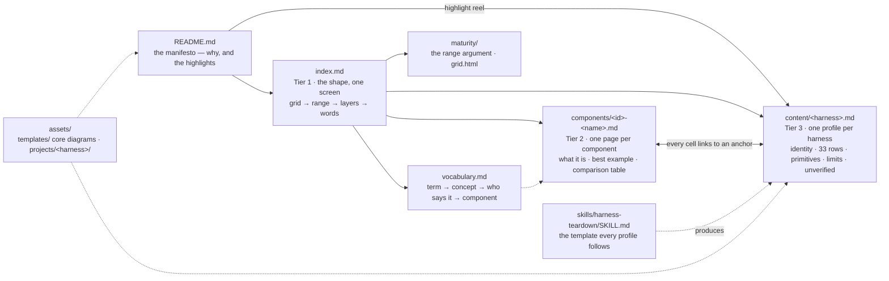

# harness-atlas

**A wiki that tears agent harnesses down into the primitives they actually ship, scores them on one
fixed component grid, and places them on a maturity range.** Every profile is built the same way from
the harness's own documentation, code and configuration, so that an engineer can *grok* a harness —
its loop, its primitives, its limits — from one page, and compare it to the next one cell for cell.

Start at [`index.md`](index.md) for the whole map. This page is the argument, and the highlights.

---

## Why this exists

> What we're trying to build is a strong "manifesto" and system-design-principled doc that helps to
> build a framework to evaluate and show the system design of modern-day harnesses. The audience is
> other AI engineers and builders, and it needs to provide a framework and mental model to track and
> "grok" (gain an instant understanding, not the AI service) a harness from its profile page. We want
> to build a map and framework from the README that is somewhat universal, to show how agent
> harnesses and systems work from a high-level structural system design — and then each individual
> page has a harness with its system design, declared primitives/components, and a consolidated guide
> built from the harness documentation, code, infrastructure, context engineering, and how the agent
> logically handles its work. Like the "Claude Code leak teardown" posts and articles, these can
> provide a standardized view in a wiki-style way that allows viewers to digest a harness in a
> meaningful way from just visiting the GitHub page.
>
> — KD, 2026-09-03, the W0 alignment session

The field settled on one word — *harness*, `Agent = Model + Harness`, *"every piece of code,
configuration, and execution logic that isn't the model itself"* — and then used it for two different
altitudes at once: the runtime that owns the loop (Pi, Claude Code, Codex), and the process layer
installed *into* a runtime (Gas City, gstack, LoomWarp). Teardowns of individual harnesses are
excellent and incomparable: each invents its own headings. This atlas fixes the headings.

## The five-minute version

**Memory lives in files.** Every harness is a model, a loop that feeds it tools, and a directory of
files the loop reads on the way in — instructions, skills, settings, hooks, memory. Those files are
where a team's decisions live. A harness with no files is a chat window.

**The harness loads them — and *how* is the whole design.** Two questions govern every choice a
harness makes: *when does it load* (session start, every turn, every tool call) and *who enforces it*
(prose the model may ignore, or a hook that returns exit 2). Every harness answers the same questions
differently. The named, single-sanctioned ways it answers them are its **primitives** — and a healthy
set is five to seven, because *"an agent offered three ways picks differently each session, or invents
a fourth."*

**The system compounds, or it doesn't.** What persists across sessions, serves more than one person,
and binds mechanically accumulates into a team's operating model. What fails any of the three is
dotfiles, or a style guide. The maturity range measures how much of a team's judgement has moved out
of people's heads and into the loop — and what breaks at each step.

## The anatomy every harness shares

One loop, and the insertion points around it. Each insertion point is labelled with the component
that grades it, so a profile's 33-row table lands on this picture.

*Source: [`assets/templates/harness-loop.mmd`](assets/templates/harness-loop.mmd). This picture is
this repo's own synthesis — generalised from the "seven insertion points" reading of Claude Code in
[`content/claude-code/20-consolidated-guide.md`](content/claude-code/20-consolidated-guide.md) §1,
which is itself a synthesis, not a vendor diagram. Vendor diagrams, redrawn, live under
[`assets/projects/`](assets/projects/). The twelve layers those component IDs belong to are drawn in
[`index.md`](index.md) §3.*

## How to read a profile

Every page under [`content/`](content/) has the same shape, produced by
[`skills/harness-teardown/SKILL.md`](skills/harness-teardown/SKILL.md):

1. **Three paragraphs at the top** — *why this file exists · in one screen · what it does not claim.*
   Read only these and you have the thesis.
2. **Identity, and three tests.** Does state persist across sessions, and where? Does it serve more
   than one person? Does it bind mechanically, or only by prose? Then the loop question: does it run
   the loop itself, host other loops, or install into one — which fixes its **altitude**.
3. **Thirty-three rows**, one per component, each with a path, a source and a mark
   (`✅` direct · `◐` relayed · `⚠️` unverified). Absence is written *"Nothing here — checked README,
   docs index, settings, examples"*. **Never inferred.**
4. **The primitive set** — the vendor's own names and definitions, verbatim, counted. Five to seven
   is healthy; twelve-plus is accommodation failure; a published refusal list is the strongest form.
5. **Stated limitations**, quoted without commentary; **sources**, down to the `gh api` commands run;
   and **what could not be verified** — mandatory, never empty.

## Highlights

Six of the profiles, chosen because each stakes a different position. The full set, and the queue,
are in [`index.md`](index.md) §1.

| Harness | Altitude | In one line | Its structured output | Profile |
|---|---|---|---|---|
| **Claude Code** | runtime | An agent loop with seven insertion points; every choice is *when does it load* × *who enforces it* | OTel spans + `tool_decision` audit records | [`content/claude-code/`](content/claude-code/20-consolidated-guide.md) *(pre-template deep read; template profile pending)* |
| **Pi** | runtime | Defined by subtraction — *"No MCP. No sub-agents. No permission popups."* — each shipped as an example extension instead; holds at eight primitives | the session JSONL *tree*, which doubles as the run receipt | [`content/pi.md`](content/pi.md) |
| **Hermes** | gateway / host | Makes *learning* the headline: authors skills from experience, caps memory files, ages skills out; hosts the Codex app-server as an alternate loop | the kanban that owns *"lifecycle truth"* | [`content/hermes.md`](content/hermes.md) |
| **Gas City** | gateway / host, with an install-into-a-loop mechanism nested inside | Yegge's *software factory*: six declared primitives with a published admission test for adding one — and a documented deletion of one — driving fifteen-plus coding-agent CLIs through shared state | the Bead — the one substrate every other primitive writes through | [`content/gas-city.md`](content/gas-city.md) *(supersedes the short profile, whose "seven" and "Factory Worker Protocol" did not survive a primary-source read)* |
| **LoomWarp** | process layer | The system this atlas was cut out of, scored here as a peer with no special status — *its primitive-set row stays blank until someone earns it* | `events.jsonl` — eight real events, none schema-validated | queued (W4) |
| **FRACTAL** | process layer | A PRD-per-workstream process with an append-only defect ledger, run un-routed in this very repo; KD-built, graded by the same rules | the `HANDOFF.md` beside each PRD, and `ISSUES.md` | [`comparisons/systems/kd-built-frameworks/03-fractal-as-iterated.md`](comparisons/systems/kd-built-frameworks/03-fractal-as-iterated.md) *(delta doc; template profile queued)* |

## The map

**Standing rules**, in full in [`CLAUDE.md`](CLAUDE.md): markdown is not code · absence is recorded,
never inferred · a primitive set is 5–7 and forces a choice · do not borrow a word and change its
referent · archive by ruling, never by deletion · vendor's words only in a primitives table.

---

*Cut from `loomwarp-team-system/projects/loomwarp` on 2026-09-02; provenance in
[`RULING-2026-09-02-spinout.md`](RULING-2026-09-02-spinout.md). Front page and structure agreed in
[`fractal/workstreams/W0-alignment.md`](fractal/workstreams/W0-alignment.md), 2026-09-03.*
