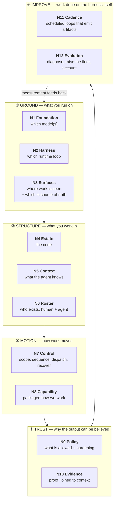
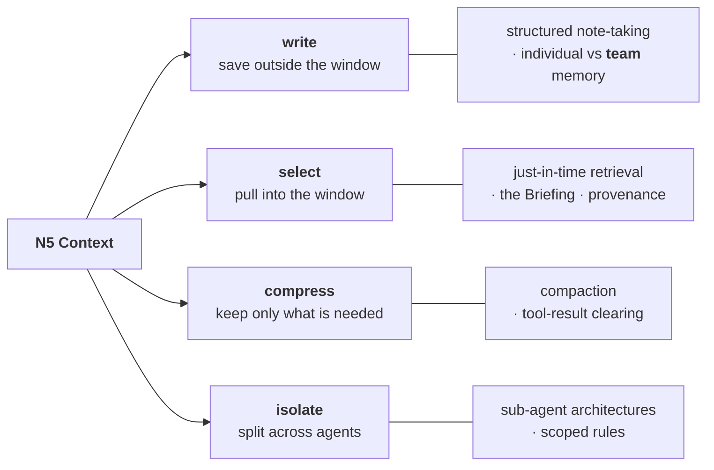
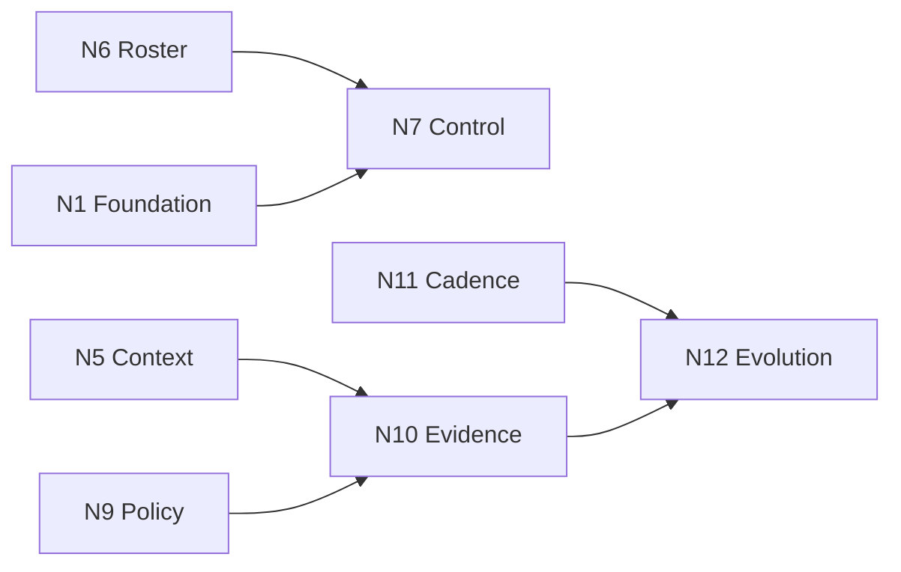

# The map

> ## ⛔ ARCHIVED — superseded by [`../v0/02-functions.md`](./v0/02-functions.md)
>
> **History, not the model.** This is the derivation behind the twelve, and it is the *precedent* the
> successor follows: this document retired the `N1`–`N12` vocabulary not by deleting it but by writing
> a ruling, publishing an `N→E` crosswalk, and re-heading the loser. `02-functions.md` retires `E<n>`
> the same way. **Retiring a vocabulary is a documented method in this corpus, not an improvisation.**
>
> `N<n>` → `E<n>` is below; `E<n>` → `F<n>` is in [`00-README.md`](./00-README.md).

**What this is.** The map of how AI-native team work is done: what the parts are, what each one
does, who currently provides it, and when a team first needs it. **The filled-in map is a
configuration** — the same object `05-preflight-spec.md` §5 already emits as `preflight.json`.

**Why the elements were not enough.** Three complaints, from two different sessions, all pointing at
the same thing:

- `02-elements.md:471` — *"too abstract and expansive… we need a 'holistic view' but also… 'grok-able'."*
- `02-elements.md:472` — *"we're basically decomposing… SAFe 6.0 into a simple agile or lean startup infographic."*
- 2026-08-27 — *"two elements like 'context engineering' and 'harness' encompass a large bulk, we also aren't labeling the 'foundation'."*

A flat list of nine nouns cannot answer *"how do we work?"* — it answers *"what would you grade us
on?"*, which is a different and later question. This document is the first; the Grid stays the second.

> ### ✅ RESOLVED 2026-08-27 — this proposal was adopted into `02-elements.md`
>
> The `N1…N12` IDs below were scaffolding, chosen so the proposal could not collide with the canonical
> scheme before ratification. **It has been ratified.** The canonical vocabulary is
> [`02-elements.md`](./02-elements.md) §1 — twelve elements, `E0–E11`, five bands — and that is what
> `scripts/check-element-vocabulary.mjs` parses.
>
> **Cite `02-elements.md`, not this file, for the element set.** This one is retained for the
> *derivation*: why the foundation is named, how the oversized nodes decompose, and how the two
> candidate groupings were reconciled.
>
> | Here | Canonical |
> |---|---|
> | `N1 Foundation` + `N2 Harness` | **`E0 Substrate`** — both are named sub-decisions of it, plus portability and distribution-fit as properties |
> | `N3 Surfaces` · `N4 Estate` · `N5 Context` | `E1` · `E2` · `E3` |
> | `N6 Roster` | **`E9 Roster`** |
> | `N7 Control` · `N8 Capability` · `N9 Policy` · `N10 Evidence` | `E4` · `E5` · `E6` · `E7` |
> | `N11 Cadence` | **`E10 Cadence`** |
> | `N12 Evolution` | **split** — promotion is `E8 Learning`, measurement is **`E11 Instrumentation`** |
>
> **What changed at ratification.** `N1`/`N2` merged back into one element, because renaming
> `E0 Substrate` would have cost ~250 citations across 24 files and re-opened the two-scheme ambiguity
> closed a week earlier; the model is named *inside* it instead. And `N12` split, because promoting a
> convention and measuring a bottleneck are different jobs with different failure modes.

---

## 0. The two rulings this obeys

Both were made earlier in this corpus and are load-bearing.
[`06-lineage.md`](./v0/06-lineage.md) §6 states them in full.

| | Ruling | Consequence here |
|---|---|---|
| **1** | *"The map we owe a reader is not a containment tree of abstract layers — it is **the set of primitives a harness needs, in the order a team comes to need them.**"* — [`04-primitives-ontology-platform.md`](../comparisons/2026-08-research/04-primitives-ontology-platform.md) §5 | §3 is ordered by **when a team first needs it**, not by conceptual tidiness. The bands in §1 are a reading aid, not a hierarchy |
| **2** | Ontology-as-description **measurably fails** — ETH Zürich `arXiv:2602.11988` found repository overviews *"are not helpful"* while raising cost 20%+. What survives is **verb-bounding** | §7 gives every node typed relations and a config key. A node that cannot be written down as configuration does not belong on the map |

**The test this document must pass:** a reader should be able to fill it in for their own team in
twenty minutes and recognise the result as a description of how they actually work.

---

## 1. The map in one screen

Five bands. Twelve nodes. The bands are the grok-able layer; the nodes are the configuration layer.

**Read the bands top to bottom; decisions flow downward.** You cannot choose a Control model before
you know your Harness. **The dashed edge is the point of the fifth band** — `IMPROVE` is the only one
whose output re-enters the system, and it is the band every published instrument omits.

**Three changes from the nine elements**, each answering a stated objection:

| Change | Answers |
|---|---|
| `E0 Substrate` **splits** into `N1 Foundation` + `N2 Harness` | *"we aren't labeling the foundation."* Also fixes `01-concepts.md` §3.2's own complaint that *"`E0` conflates the runtime with the portability posture"* |
| `N6 Roster` **is new** | `J14 know who exists` had no home, and `J3 route` depends on it — *"a resolver is an org chart"* presumes the chart |
| `IMPROVE` **is a new band** — `N11 Cadence`, `N12 Evolution` | Four jobs (`J12`, `J16`, `J17`, and partly `J9`) act on the harness rather than on a unit of work. `03-jtbd.md` §4: *"not four separate gaps — one gap with four names"* |

---

## 2. The foundation, named

**Three of our own documents disagreed about whether the model belongs on the map. Resolved here:
it does.**

| Document | Said |
|---|---|
| [`01-concepts.md`](../comparisons/01-concepts.md) §1 | **MODEL** is the bedrock of the five-layer stack |
| [`01-concepts.md`](../comparisons/01-concepts.md) §3.1 | *"None — it is an input to `E0`, **deliberately not an element**… ✅ Correctly excluded"* |
| [`03-agentos-harness-multiplayer.md`](../comparisons/2026-08-research/03-agentos-harness-multiplayer.md) | *"stack diagram forces the answer: **model as bedrock, below Ground**; Substrate is the harness"* |

### The exclusion, and why it is overturned

**The original argument**, preserved rather than quietly edited. `references/elements.md` ruled
workers and runtime a non-element because *"the framework's own principle is **deterministic control,
probabilistic labor** — which makes the worker substitutable by design… it is not something LoomWarp
builds or owns."*

**Why that does not survive.** The argument proves the model is **not built by us**. It does not
prove the model is **not decided by us**, and a map of how work is done records decisions, not
authorship. By that same reasoning we would drop `N2 Harness` (we do not build Claude Code) and
`N3 Surfaces` (we do not build Slack) — and nobody proposes that.

Four things make it a real, gradeable decision:

1. **The field's own equation is `Agent = Model + Harness`.** A map omitting one half of a two-term
   definition is incomplete on its face.
2. **`J3 route` and `J12 account` both hang off it.** Which model runs which job, at what cost, is
   the routing decision — and routing plus cost are two of the three slots
   [`02-harness-taxonomies.md`](../comparisons/2026-08-research/02-harness-taxonomies.md)
   §3 finds absent from every published taxonomy.
3. **Model choice is already a quality technique, not only a portability property.** `01-concepts.md`
   §3.1 records the counter-evidence against its own verdict: Gas City runs its code-review formula
   across Codex, Claude and Gemini *in parallel* because *"each one has been trained differently and
   has a different point of view."*
4. **Every published stack diagram names it** — see [`06-lineage.md`](./v0/06-lineage.md) §5. Ours is the
   outlier.

### ⚠️ And the name `Substrate` does not survive either

`Substrate` is **not attested in any published stack diagram found**. It is house vocabulary sitting
in the one slot where the field has settled names.

| Published | Source |
|---|---|
| **Models and Inference** | Perrone, O'Reilly Radar, 2026-06-08 |
| **Compute and Foundation Models** | Menlo Ventures |
| **LLM models & storage** | Letta, 2024-11 |

**Proposed: `N1 Foundation`.** It is the shortest form of the settled convention, it reads correctly
to someone who has seen any AI stack diagram, and it leaves *harness* free to mean the one thing the
field agrees it means. The portability posture — *strictly portable · portable-where-cheap ·
single-harness* — stops being a node and becomes **a property recorded on `N1` and `N2`**, which is
what `01-concepts.md` §3.2 asked for.

> `OPEN-10` — Do `N1` and `N2` stay separate, or is `Foundation` a property of `Harness`?
> **The case for separate:** different vendors, different reversal costs, and multi-model review is a
> real technique. **The case for merged:** most teams choose them together and never revisit.

---

## 3. The nodes, in the order a team comes to need them

Per Ruling 1. **The order is the deliverable**, not the numbering — `N1…N12` are stable identifiers,
not a sequence.

| Order | Node | The decision it records | Jobs | Provider today | Config key |
|---|---|---|---|---|---|
| 1 | **N1 Foundation** | Which model(s); when to use more than one; who pays | `J13` `J3`◐ `J12`◐ | vendor | `foundation.models[]`, `foundation.routing` |
| 2 | **N2 Harness** | Which runtime loop; how portable you intend to stay | `J13` | vendor | `harness.primary`, `harness.portability` |
| 3 | **N5 Context** | What the agent knows, and how that is assembled | `J1` `J2` `J8`◐ | **native + you** | `context.*` — see §4 |
| 4 | **N4 Estate** | What code exists and how it is found | `J10`◐ | native config | `estate.topology`, `estate.registry` |
| 5 | **N3 Surfaces** | Where work is seen and done — **and which one is the source of truth** | `J11`◐ | native MCP; **SoT is yours** | `surfaces[]`, `surfaces.source_of_truth` |
| 6 | **N7 Control** | How work is scoped, sequenced, dispatched, and recovered | `J4` `J3` `J7` | native teams/workflows | `control.model`, `control.durable` |
| 7 | **N9 Policy** | What an agent may do, enforced where the model cannot reach; and the hardening bar | `J5` `J15` | native, fully | `policy.enforcement`, `policy.risk_tier` |
| 8 | **N8 Capability** | The packaged, distributable unit of *how we work* | `J10` | native marketplace | `capability.standards`, `capability.distribution` |
| 9 | **N6 Roster** | Who exists — human and agent — what each may do, who answers for the result | `J14` | **nobody** | `roster.actors[]`, `roster.accountable` |
| 10 | **N10 Evidence** | How a claim is proven to someone who did not watch it happen | `J8` `J6`◐ | native OTel | `evidence.schema`, `evidence.addressee` |
| 11 | **N11 Cadence** | Which checks run on a schedule, and what artifact each emits | `J11` `J6`◐ | **nobody** | `cadence.rituals[]` |
| 12 | **N12 Evolution** | How the harness gets better: what limits you, what graduates, what it costs | `J9` `J16` `J17` `J12` | **nobody** | `evolution.*` |

`◐` = partial. **Three nodes have no provider at all** — `N6`, `N11`, `N12` — and they are the three
newest. That is the same finding `03-jtbd.md` reached from the jobs side and
`06-frameworks-addendum.md` §5.4 reached from the instruments side, arrived at a third time from a
different direction.

**Why `N9 Policy` is early, out of band order.** It is the one node whose absence is not recoverable
after the fact: an agent that could reach production for a week was reaching production for a week.
`04-decision-layers.md` §4 already sequences it this way.

---

## 4. The two oversized nodes, decomposed

The direct answer to *"context engineering and harness encompass a large bulk."* Neither was ever one
decision.

### 4.1 Context — four verbs, not one row

Adopted from **Lance Martin's** decomposition, with **Anthropic's** technique inventory as the fill
([`06-lineage.md`](./v0/06-lineage.md) §4). Both are published and widely reused; we do not need to invent
this.

| Verb | Techniques | Jobs | What it is for us |
|---|---|---|---|
| **write** | structured note-taking; agentic memory | `J2` | **This is where the individual/team split lives** — `OPEN-5`, and `01-concepts.md` §3.6 calls it uncovered. Four peer systems treat it as first-class |
| **select** | just-in-time retrieval; lightweight identifiers | `J1` | The **Briefing** — a per-job manifest with provenance. Narrowed: `ox agent prime` ships this |
| **compress** | compaction; tool-result clearing | `J1` | Least differentiated. Native, and improving fast |
| **isolate** | sub-agent architectures; path-scoped rules | `J1` `J5`◐ | Where context engineering touches policy — a sub-agent's context *is* a bound |

**What this buys.** Four sub-decisions a team answers separately, each with its own maturity — which
is exactly `B-1`'s *"an element may carry nested decisions… pre-recommended based on your maturity
selection."* The old single `E3 Context` row forced one grade onto four independent capabilities,
and `02-elements.md` §4 already noticed the symptom: *"Fabric is real and usable. Briefing does not
exist"* — one row, two systems, wildly different maturity.

### 4.2 Harness — three things wearing one word

Weng nests **loop engineering, context engineering and evals inside harness engineering**. That is
the altitude problem [`02-harness-taxonomies.md`](../comparisons/2026-08-research/02-harness-taxonomies.md)
§4 names, and it is why *harness* felt oversized.

| The word covers | On this map |
|---|---|
| The runtime that runs the agent loop | **`N2 Harness`** — the only sense kept |
| What the agent knows | **`N5 Context`** |
| Whether the output is good | **`N10 Evidence`** + `N9 Policy` |
| What repeats, and how often | **`N11 Cadence`** |
| The team's installed way of working | **not a node — it is the whole map.** This is our *process layer* claim |

**The last row is the important one.** *"You do not write an adapter for the thing you are"* —
`01-concepts.md` §2. We are not a harness; we are what gets installed into one. **The map is the
process layer**, which is why *harness* cannot be a node that contains everything.

---

## 5. All seventeen jobs, placed

`03-jtbd.md` §3 left **six jobs with no element** and two miscovered. All are placed here.

| Job | Layer | Was | Now | Note |
|---|---|---|---|---|
| `J13` choose the ground | GROUND | `E0` | **`N1` + `N2`** | The split it always needed |
| `J1` compose context | KNOW | `E3` | **`N5` select/compress** | |
| `J2` remember | KNOW | `E3` ⚠️ | **`N5` write** | ⚠️ resolved — the individual/team split is a property of *write* |
| `J4` decompose and sequence | MOVE | `E4` | **`N7`** | |
| `J7` recover | MOVE | **none** | **`N7`** | Retry, escalation and self-heal are control-flow, not a separate concern |
| `J3` route | MOVE | `E4` | **`N7`**, resolving against **`N6`** | The dependency `03-jtbd.md` names is now structural |
| `J10` distribute | EQUIP | `E5` | **`N8`** | |
| `J14` know who exists | EQUIP | **none** | **`N6` Roster** | New node. Hassan's **actors** pillar is the peer-reviewed precedent |
| `J5` bound | TRUST | `E6` | **`N9`** | |
| `J6` validate | TRUST | `E7` `E8` | **`N10`** + **`N11`** | Gates are evidence; *scheduled* gates are cadence |
| `J15` secure and harden | TRUST | `E6` ⚠️ | **`N9`** | ⚠️ resolved by widening Policy from *permission* to *permission + hardening bar*. `security` 62 in the corpus, with its own track |
| `J8` prove | TRUST | `E3` `E7` | **`N10`**, joined to **`N5`** | The join is the claim; it stays a join |
| `J11` coordinate humans | TOGETHER | **none** | **`N3`** + **`N11`** | Channel is a surface; *rhythm* is cadence |
| `J9` compound | IMPROVE | `E8` | **`N12`** | |
| `J16` raise the floor | IMPROVE | **none** | **`N12`** | Graduating a convention into the single sanctioned way — the mechanism that *creates* primitives |
| `J17` diagnose the bottleneck | IMPROVE | **none** | **`N12`**, fed by **`N11`** | See below |
| `J12` account | IMPROVE | **none** | **`N12`** | |

### `J17` finally has an input, and that resolves `OPEN-8`

`03-jtbd.md` states the dependency and then strands it: *"`J17 diagnose` requires `J12 account` **and
ritualized checks**… You cannot name a constraint without measurement."* Nothing produced that
measurement, because **Rituals** had been ruled out as an element on corpus frequency — `standup` 0,
`ceremon` 0, `ritual` 1.

**The frequency argument was answering the wrong question.** On KD's reframing, *a ritual is not a
meeting — it is a scheduled loop that emits an artifact*, and the corpus supports that directly:
cron-triggered reviews, scheduled quality checks, nightly maintenance, `transcri` **12**. As
`03-jtbd.md` §4 records, the original dismissal applied **two different thresholds to two concepts** —
`multiplayer` (6) was called *"real but emerging"* while Rituals (1) was called dead.

**`N11 Cadence` is that node, named for the mechanism rather than the ceremony.** It is what
`N12 Evolution` reads. **If cadence is not modelled, `J17` has no input** — which is the best
available explanation for why the Grid computes a bottleneck that nothing ever refreshes.

> `OPEN-11` — Is `N11 Cadence` its own node, or is it a **property** (a schedule) attachable to any
> node's checks? **For separate:** it is independently gradeable, and three peer systems ship
> scheduled work while ours does not. **For property:** cadence without a check is empty, so it may
> be an attribute of `N9`/`N10` rather than a peer.

---

## 6. The two candidate groupings, reconciled

Both were on the table. Neither is discarded; they answer different questions.

| | **A — job-derived** | **B — KD's 10-layer** |
|---|---|---|
| Where | `03-jtbd.md`'s seven layers | `01-concepts.md` §1, recorded as an open question since 2026-08-11 |
| Derived | bottom-up, corpus-measured | top-down, from how a PM narrates work |
| Shape | GROUND · KNOW · MOVE · EQUIP · TRUST · TOGETHER · IMPROVE | Model · Harness · Process layer · Context · Planning · The Work · Evaluation · Evidence · Rituals · Learning |
| Strength | every row traces to measured evidence | **a stranger recognises their own week in it** |
| Weakness | `KNOW`/`EQUIP`/`TOGETHER` are not how anyone describes their work | `Process layer` is a category, not a peer of the others; `The Work` hides most of the difficulty |

**The five bands above are B's narrative arc carrying A's evidence.** KD's own consolidation question
— *"is this stronger as 10 layers or 6-7 where 'the work' consolidates 5-7 and 8-10 consolidate into
observe and learn"* — is answered **yes, consolidate**, and this is that consolidation:

| KD's layer | Lands as |
|---|---|
| 1 Model · 2 Harness | **① GROUND** `N1` `N2` |
| 3 Process layer | **not a node — it is the map itself** (§4.2) |
| 4 Context (team vs individual) | **② STRUCTURE** `N5`, with team/individual as a property of *write* |
| 5 Project definitions and planning | **② STRUCTURE** `N5` + **③ MOTION** `N7` |
| 6 "The Work" | **③ MOTION** `N7` `N8` — *"the work" is the weft, not the warp* |
| 7 Evaluation · 8 Evidence | **④ TRUST** `N10` `N9` |
| 9 Rituals | **⑤ IMPROVE** `N11` — **the layer A was missing and B had all along** |
| 10 Learning and improvement | **⑤ IMPROVE** `N12` |

**B was right about Rituals a full session before the evidence caught up.** It sits at layer 9 in a
model written 2026-08-11, was argued closed on frequency grounds, and is now reinstated on the
scheduled-loop reframing. Worth recording, because it is the second time a KD note has overturned a
frequency-based dismissal.

**Two things B has that this map still does not:**

- **`5 Planning` as its own step.** Here it is split across `N5` and `N7`, which may be a real loss —
  *what we are building* is a different artifact from *how it is sequenced*.
- **`3 Process layer`** named explicitly. §4.2 argues it is the whole map, but a reader may need it
  said out loud rather than implied.

> `OPEN-12` — Does **Planning** deserve its own node between `N5` and `N7`?

---

## 7. Typed relations — what makes this a config and not a diagram

Per Ruling 2: what survives of ontology is **verb-bounding** — *"typed entities and relationships
that tools must respect."* Six relations, each mechanically checkable.

| Relation | Reads | Enforces |
|---|---|---|
| `N` **performs** `J` | a node performs jobs | Every job has a node, or a written reason it has none. **Currently: all 17 placed** |
| `N` **provided-by** `P` | native · vendor · you · nobody | *"nobody"* is a valid, and useful, answer |
| `N` **requires** `N'` | `N7 Control` requires `N6 Roster` | A config choosing routing without a roster is **invalid, not merely immature** |
| `N` **records-in** `path` | where the decision physically lives | Enforced by `check-referenced-artifacts.mjs` |
| `N` **graded-by** `stage` | 1–6, the Grid | The maturity view |
| `N` **targets** `stage` | the *correct* stage for this team | Supplied by the target function — `09-config.md`, not yet written |

**The one that does real work is `requires`.** It is the difference between a checklist and a model:
it makes some configurations *wrong* rather than merely *early*.

Each edge is a published or measured dependency: *a resolver is an org chart* (`N6→N7`) · the
provenance-to-outcome join (`N5→N10`) · `J17` requires ritualized checks (`N11→N12`) · and `N9→N10`
is `W-1` before `W-2` — *an evidence artifact produced by a gate the agent can disable is worse than
the one it replaces*.

---

## 8. ✅ The gate — how each question was decided

| # | Question | Decided |
|---|---|---|
| **G-1** | Twelve nodes in five bands — or fewer? | **Adopt.** The count grew by three and every one closes a homeless job. Merge candidates if it must shrink: `N1`+`N2`, `N11`+`N12` |
| **G-2** | Is `Foundation` the right name, retiring `Substrate`? | **Overruled at ratification — `Substrate` kept, under protest.** The naming argument stands (`Substrate` is unattested in any published stack diagram) but renaming costs ~250 citations across 24 files and would re-open the two-scheme ambiguity closed a week earlier. Recorded as open debt, `02-elements.md` `C-3` |
| **G-3** | Do the five bands replace the four (`GROUND·STRUCTURE·MOTION·TRUST`)? | **Yes** — `IMPROVE` is the band every instrument omits, and omitting it is our own recorded error |
| **G-4** | `OPEN-10` — `N1` and `N2` separate? | **Overruled — merged.** Both are named sub-decisions *inside* `E0 Substrate`, which names the foundation without paying the rename. A fourth sub-decision was added from LangChain: **how far out of distribution is your work** |
| **G-5** | `OPEN-11` — is `Cadence` a node or a property? | **Node.** Without it `J17` has no input |
| **G-6** | `OPEN-12` — does Planning deserve its own node? | **Still open**, and carried forward to `02-elements.md` §10. The weakest part of this proposal |

**Ratified 2026-08-27.** `02-elements.md` §1's map block now carries twelve elements and the
vocabulary check parses all of them — its ID regex was widened from `E(\d)` to `E(\d+)` in the same
commit, because it had been **silently ignoring any two-digit element**. `LEGACY_NAMES` needed no
change: `E0`–`E8` kept their names, so the only legacy vocabulary remains the superseded seven.
`grid.html` is **not** re-pointed yet — that is `R-6`, and it is sequenced after the map settles.

**Still not written**, and dependent on this gate: `08-providers.md` (who fills each node, and which
vendors are moving) · `09-config.md` (the schema, and the target function that supplies `targets`).

---

*Prior: [`06-lineage.md`](./v0/06-lineage.md) — the published models this places itself among.*
*The jobs: [`../../references/comparisons/03-jtbd.md`](../comparisons/03-jtbd.md).*
*The current canonical elements: [`02-elements.md`](./02-elements.md) §1.*
