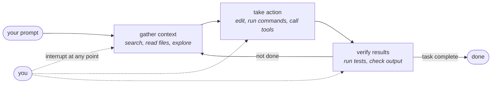

# Claude Code — Anthropic

**Why this file exists.** This is a **sanity run** of `skills/harness-teardown/SKILL.md` against Claude
Code — the harness the repo's own vocabulary (`comparisons/01-concepts.md`) and maturity instrument
were partly built by reading. A pre-template deep read already lives at
[`content/claude-code/`](../content/claude-code/00-README.md) (13 documents, read 2026-08-10, frozen at
v2.1.224). This draft re-sources every claim to a primary page opened today and is written to test the
*skill*, not to replace that material or `comparisons/systems/90-short-profiles.md`'s pointer row. It
performs none of the four downstream obligations `harness-teardown` normally requires (`ISSUE-001`).

**In one screen.** Claude Code is Anthropic's terminal-first coding agent — "the harness" in this
corpus's own stack diagram (`comparisons/01-concepts.md` §1), the runtime that a process layer like
gstack or LoomWarp installs *into*. It runs its own agentic loop (**gather context → take action →
verify results**, interruptible at any point) across eleven surfaces that "share the same underlying
… engine," and ships an SDK that lets other applications embed that same loop. Its primitive set, by
its own naming, is dense and still growing: **skill · subagent · hook · plugin · MCP server · agent
team · dynamic workflow** — 7 by one count, 8 if dynamic workflows (which the vendor gives their own
comparison column and file format) are counted separately from subagents — landing at the edge between
*healthy* and *accommodation failure* by this repo's own rule. It refuses almost nothing outright, but
draws one line often: file-permission rules "don't apply to arbitrary subprocesses" and checkpoints
are explicitly "not a replacement for … Git."

**What it does not claim.** See §D. The load-bearing lines: permission rules are "enforced by Claude
Code, not by the model"; checkpointing "does not track files modified by bash commands" and subagent
edits are usually not restored; Code Review's findings "don't approve or block your PR" by design; and
agent teams admit "known limitations around session resumption, task coordination, and shutdown
behavior."

---

# Claude Code — harness research (read at primary source)

Access date for every source in this file: **2026-09-03**. Marks: ✅ direct (I opened the primary
page today) · ◐ relayed (a background research agent opened it today and reported the quote back to
me, or a secondary source) · ⚠️ unverified.

Shorthand: **REPO** = `https://github.com/anthropics/claude-code`. **DOCS/\<slug\>** =
`https://code.claude.com/docs/en/<slug>` (the browsable page; the same content is also served as
`<slug>.md`). **GLOSSARY** = `DOCS/glossary`. **LOCAL/\<file\>** = the 2026-08-10 deep read at
`content/claude-code/<file>`.

---

## A. Identity

| Field | Value | Mark / source |
|---|---|---|
| Canonical name | **Claude Code** | ✅ REPO, DOCS/overview |
| Prior names / homes | None found at primary source today. The repo has lived at `anthropics/claude-code` since creation; no redirect. | ✅ (absence) `gh api repos/anthropics/claude-code` |
| Owner / maintainer | **Anthropic PBC** (GitHub org `anthropics`) | ✅ LICENSE.md: "© Anthropic PBC. All rights reserved." |
| GitHub URL | https://github.com/anthropics/claude-code | ✅ |
| License | **Not open source.** LICENSE.md verbatim: *"© Anthropic PBC. All rights reserved. Use is subject to Anthropic's Commercial Terms of Service."* `gh api` reports `license: null` (no SPDX license recognized) — consistent, since this is not an OSS grant. | ✅ `gh api repos/anthropics/claude-code/contents/LICENSE.md`; `gh api repos/anthropics/claude-code` |
| Stars | **143,957** (forks 23,006; open issues 14,498) | ✅ `gh api repos/anthropics/claude-code`, 2026-09-03 |
| Language | `Python`, per the GitHub API's language field. **Read with suspicion**: the repo's root holds no application source tree at all — only `.claude/`, `.claude-plugin/`, `.devcontainer/`, `.github/`, `.vscode/`, `CHANGELOG.md`, `LICENSE.md`, `README.md`, `SECURITY.md`, `Script/`, `examples/`, `plugins/`, `scripts/`. This looks like a **thin/documentation-and-plugins repo**, not the CLI's actual source (the CLI ships as a compiled/bundled binary via `curl…install.sh`, Homebrew, WinGet, or the deprecated `@anthropic-ai/claude-code` npm package). Flagged in §F. | ✅ `gh api repos/anthropics/claude-code` (field) · ✅ `gh api repos/anthropics/claude-code/contents/` (directory listing, read today) |
| Repo created | **2025-02-22T17:41:21Z** | ✅ `gh api repos/anthropics/claude-code` |
| First release | ⚠️ **Not established today.** The earliest tag returned by `gh api repos/anthropics/claude-code/tags` (212 tags, paginated) is `v2.0.73`; no `v0.x` or `v1.x` tag exists in the API response, which is odd for a repo created 2025-02-22. Not investigated further under this sanity run's effort budget. | ⚠️ `gh api repos/anthropics/claude-code/tags` |
| Latest release | **v2.1.260**, published **2026-09-03T23:48:12Z** — the same day as this read, confirming the harness ships continuously. Cross-checked against `CHANGELOG.md`'s top entry, `## 2.1.260`. | ✅ `gh api repos/anthropics/claude-code/releases`; `gh api repos/anthropics/claude-code/contents/CHANGELOG.md` |
| Install | `curl -fsSL https://claude.ai/install.sh \| bash` (macOS/Linux/WSL); `irm https://claude.ai/install.ps1 \| iex` (Windows); `brew install --cask claude-code` (two channels: stable vs `@latest`); `winget install Anthropic.ClaudeCode`; apt/dnf/apk on Linux. `npm install -g @anthropic-ai/claude-code` is explicitly **"Deprecated"**. | ✅ DOCS/overview; REPO README.md |
| Website / docs | Docs root **https://code.claude.com/docs/en/** (166+ English pages per `docs/llms.txt`, plus 11 full language mirrors); product page **code.claude.com**; web surface **claude.ai/code**. | ✅ `gh api` `homepage` field = `https://code.claude.com/docs/en/overview`; ✅ `docs/llms.txt` fetched today |
| What it says it is (verbatim) | GitHub description: *"Claude Code is an agentic coding tool that lives in your terminal, understands your codebase, and helps you code faster by executing routine tasks, explaining complex code, and handling git workflows - all through natural language commands."* Docs meta tagline: *"Claude Code is an agentic coding tool that reads your codebase, edits files, runs commands, and integrates with your development tools. Available in your terminal, IDE, desktop app, and browser."* | ✅ `gh api repos/anthropics/claude-code`; ✅ DOCS/overview |

### Inclusion test

**1. Does state persist across sessions? Where, in what format?**

**YES, direct. ✅** Three separate stores, all reloaded automatically: (a) session transcripts — *"Each
message, tool use, and result is written to a plaintext JSONL file under `~/.claude/projects/`"*
(DOCS/how-claude-code-works); (b) **CLAUDE.md**, user-authored, reloaded at the start of every session
from managed/user/project/local paths (DOCS/memory, GLOSSARY "CLAUDE.md"); (c) **auto memory**,
Claude-authored, *"Notes Claude writes for itself based on your corrections and preferences, stored
per git repository under `~/.claude/projects/`"* — a `MEMORY.md` index (first 200 lines / 25 KB load
every session) plus on-demand topic files typed `user`/`feedback`/`project`/`reference`
(GLOSSARY "Auto memory"; DOCS/memory). Auto memory is explicitly machine-local, not synced across
machines.

**2. Does it serve more than one person?**

**Split by layer, ✅ direct.** At the **policy layer**, yes and mechanically so: managed settings
(`managed-settings.json`, MDM, or the claude.ai admin console) apply org-wide and *"cannot [be
override[n]] by user and project settings"* (GLOSSARY "Managed settings"); Claude for Teams/Enterprise
adds SSO, per-seat allowances, an org-wide managed-policy CLAUDE.md that *"can't be excluded,"* and an
Owner/admin console (DOCS/admin-setup). At the **working-memory / product layer**, no: a session's
context window belongs to one operator, auto memory is per-machine, and Routines — the closest thing
to a shared automation object — *"belong to your individual claude.ai account. They are not shared
with teammates"* (DOCS/routines).

**3. Does it bind mechanically, or only by prose?**

**Both, cleanly separated by the vendor itself. ✅ direct.** Prose: CLAUDE.md and skill instructions —
*"Permission rules are enforced by Claude Code, not by the model. Instructions in your prompt or
CLAUDE.md shape what Claude tries to do, but they don't change what Claude Code allows"*
(DOCS/permissions, verbatim, read today). Mechanical: permission rules (*"Rules are evaluated in
order: deny, then ask, then allow. The first match in that order determines the outcome, and rule
specificity doesn't change the order,"* DOCS/permissions); hooks that exit code 2 (*"even a JSON
`permissionDecision` of `'allow'` can't override it,"* DOCS/hooks, via research agent ◐); and the
sandboxed Bash tool, which the glossary calls *"a separate layer from permission rules"* enforcing
*"OS-level filesystem and network isolation"* (GLOSSARY "Sandboxing"; DOCS/sandboxing).

### Harness or process layer?

**The loop question.** Claude Code **runs the loop itself — it is a runtime, not a host.** Its own
glossary: *"Agentic harness: The tools, context management, and execution environment that turn a
language model into a capable coding agent. Claude Code is the harness; Claude is the model inside
it."* (GLOSSARY "Agentic harness," ✅ direct.) It does not host other harnesses' loops the way OpenClaw
does in this corpus. What it runs: its own agent process plus the **Agent SDK**, which *"lets you
embed Claude Code's autonomous agent loop in your own applications … the SDK runs the same [execution
loop that powers Claude Code]"* (DOCS/agent-sdk/agent-loop, ✅ direct) — the SDK is how Anthropic's own
GitHub Actions, Claude Tag (Slack), and other surfaces are themselves built on the same runtime.
Eleven-plus **surfaces** (terminal, VS Code, JetBrains, Desktop, claude.ai/code, Remote Control, Slack,
CI) *"connect to the same underlying Claude Code engine, so your repo's CLAUDE.md files, settings, and
MCP servers work across all of them"* (DOCS/overview, ✅). **Adapters it ships for other harnesses:**
none found — Claude Code does not read another harness's config format. **Other systems shipping
adapters for it:** not stated at Claude Code's own primary source (expected — a harness does not
document who imitates its file formats); this corpus's own `content/grok.md` teardown independently
found Grok Build reading `.claude/skills/`, `CLAUDE.md`, `.claude/settings.json` permissions/hooks, and
`.claude-plugin/` marketplaces — an internal cross-reference, not reverified today, so marked ◐.

**Altitude: `runtime`.**

### Primitive set (see §C for definitions)

**Skill · Subagent · Hook · Plugin · MCP server · Agent team · Dynamic workflow**

Supporting first-class objects: CLAUDE.md · Settings (five-layer precedence) · Session · Marketplace ·
Sandbox profile · Permission mode.

### Structured output

**The session transcript** — a plaintext JSONL file under `~/.claude/projects/<project>/<session-id>/`,
*"the authoritative"* record of every message, tool call, and result (DOCS/how-claude-code-works, ✅),
supplemented by the Agent SDK's typed `ResultMessage` (`session_id`, `total_cost_usd`, `usage`,
`subtype`) and, when requested, a `--json-schema`-validated result. This is the one artifact every
other surface (checkpoints, `/resume`, `/rewind`, cost tracking, OTel correlation IDs) is built on top
of.

---

## B. The 33 components

Columns: **# · Component · What it ships · Path / mechanism · Source (accessed 2026-09-03) · Mark**.

| # | Component | What it ships | Path / mechanism | Source | Mark |
|---|---|---|---|---|---|
| 0a | Substrate | Default model depends on plan/provider (Opus 5 on Max/Team Premium/Enterprise/API/Bedrock/Vertex; Sonnet 5 on Pro/Team Standard); switchable per-session (`/model`), per-launch (`--model`), by env (`ANTHROPIC_MODEL`, `ANTHROPIC_DEFAULT_MODEL`), or pinned in settings. Effort levels `low·medium·high·xhigh·max` (+ `ultracode` for workflow planning) trade reasoning depth for cost; adaptive-reasoning models let effort be the primary lever. Runs on Anthropic API, Amazon Bedrock, Google Cloud's Agent Platform, Microsoft Foundry, or Claude Platform on AWS — provider is a deploy-time choice, not a code change. No "harness underneath": Claude Code *is* the runtime (see loop question). | `/model`, `--model`, `ANTHROPIC_MODEL`, `modelSettings`/`effortLevel` in settings; org-level `availableModels`/`enforceAvailableModels` | DOCS/model-config; DOCS/admin-setup | ✅ |
| 1a | Environment | Working directory + configured additional directories (`--add-dir`); the whole terminal (any shell command via Bash/PowerShell); git state; the public web (WebFetch/WebSearch, 15-min cache, domain safety checks); MCP-connected external systems; other Claude Code sessions (cross-session messaging, Remote Control). Cannot reach: paths outside the working directory without a prompt; private/link-local/cloud-metadata addresses; hosts outside a managed domain allowlist when sandboxing is on. | Built-in tools: Read/Write/Edit/Glob/Grep/NotebookEdit (files), Bash/PowerShell/Monitor (shell), LSP (code intelligence, needs a plugin), WebFetch/WebSearch (web) | DOCS/tools-reference; DOCS/how-claude-code-works | ✅ |
| 2a | Adapters & Middleware | **MCP client and server** — *"MCP servers give Claude Code access to your tools, databases, and APIs"*; four transports (HTTP recommended/OAuth-capable, SSE deprecated, stdio, WebSocket); tool schemas deferred by default ("MCP tool search") until a tool is actually called; `claude mcp serve` can run Claude Code itself as an MCP server. Config scopes Local (`~/.claude.json`, private) > Project (`.mcp.json`, git-shared) > User; entire entries win on conflict, fields don't merge. Also: GitHub Actions, GitLab CI/CD, Claude Tag (Slack), a Chrome extension, and Claude apps gateways (Bedrock/Vertex/Foundry) as first-party adapters into other systems. | `.mcp.json`, `~/.claude.json`, `claude mcp add`, `/mcp` | DOCS/mcp; DOCS/github-actions | ✅ / ◐ (gateway detail relayed) |
| 2b | Hooks | **"User-defined shell commands, HTTP endpoints, MCP tool calls, LLM prompts, or subagents that execute automatically at specific points in Claude Code's lifecycle"** (verbatim, GLOSSARY "Hook"). Five handler types: `command`, `http`, `mcp_tool`, `prompt`, `agent`. ~30 named lifecycle events spanning session (`SessionStart`/`SessionEnd`/`Setup`), per-turn (`UserPromptSubmit`, `Stop`, `StopFailure`), per-tool-call (`PreToolUse`, `PostToolUse`, `PostToolUseFailure`, `PermissionRequest`, `PermissionDenied`), subagent/task (`SubagentStart/Stop`, `TaskCreated/Completed`, `TeammateIdle`), and structural events (`PreCompact/PostCompact`, `PreModelSwitch/PostModelSwitch`, `WorktreeCreate/Remove`, `ConfigChange`, `InstructionsLoaded`, `FileChanged`, `Elicitation/ElicitationResult`). **Default is fail-open**: exit 0 with no JSON means normal permission flow continues, *"staying silent doesn't approve it"* but doesn't block either; **exit 2 is the one fail-closed signal** — *"even a JSON `permissionDecision` of `'allow'` can't override it."* The hooks page itself carries a "Hook lifecycle diagram" (not redrawn here — see §F). | `hooks` key in any settings file; plugin `hooks/hooks.json` | ✅ DOCS/hooks; ✅ GLOSSARY | ✅ |
| 2c | Enforcement | Permission-rule precedence is **deny → ask → allow, first match wins, specificity doesn't reorder it** (DOCS/permissions, verbatim). Deny/ask rules from *any* settings layer beat an allow rule from any other. A stated gap, admitted by the vendor: *"Read and Edit deny rules apply to Claude's built-in file tools and to file commands Claude Code recognizes in Bash … They don't apply to arbitrary subprocesses that read or write files indirectly, like a Python or Node script that opens files itself. For OS-level enforcement … enable the sandbox."* The **sandboxed Bash tool** is the OS-level layer: Seatbelt (macOS, built in) or Landlock+seccomp (Linux/WSL2, two packages), filesystem + network domain allowlists, explicitly *"a separate layer from permission rules"* (GLOSSARY). **Auto mode's classifier** is a third, probabilistic layer: a second model reviews actions and blocks scope escalation (destructive git ops, pushes to the working branch, deletions from unresolved variables, secret exfiltration to public repos) even when a permission rule would allow them; it "pauses" itself after 3 consecutive or 20 total blocks. Managed settings can require sandboxing, lock permission rules (`allowManagedPermissionRulesOnly`), or disable `bypassPermissions` mode outright. | `permissions.{allow,ask,deny}`; `sandbox.enabled`, `sandbox.network.allowedDomains`; `/sandbox`; auto-mode classifier (no user config beyond `auto-mode-config`) | ✅ DOCS/permissions; ✅ DOCS/sandboxing; ✅ DOCS/permission-modes | ✅ |
| 3a | Control | **Permission modes** as the run-contract gate: `default` ("Manual," asks first), `acceptEdits` (auto-approves edits + `mkdir`/`touch`/`mv`/`cp`), `plan` (read-only exploration, no source edits; classifier-approved commands run when auto mode is available), `auto` (classifier reviews instead of asking — **the built-in starting mode on Pro/Max/Team**), `dontAsk` (fixed pre-approved surface, hard-denies `AskUserQuestion`), `bypassPermissions` (skips almost everything; requires an explicit flag in the TS SDK; blocked when running as root). **`/goal`** layers a second gate on top: a completion condition Claude works toward across turns until *"a small fast model"* (default Haiku) verdicts it met, impossible, or an unrecoverable error clears it — explicitly *"a wrapper around a session-scoped prompt-based Stop hook."* Org admins can fix the starting mode (`permissions.defaultMode`) or disable auto mode entirely. | `Shift+Tab` mode cycle; `/goal [condition]`; `permissions.defaultMode`, `permissions.disableAutoMode` | ✅ DOCS/permission-modes; ✅ DOCS/goal | ✅ |
| 3b | Routing | Model routing for delegated work resolves in a fixed order: the spawn prompt's named model → the subagent/teammate definition's `model` field (`inherit` = lead's model) → `CLAUDE_CODE_SUBAGENT_MODEL` env → the lead's current model, checked against an org `availableModels` allowlist with family-alias fallback. Task routing: Claude calls the `Agent` tool with a `subagent_type`/name to delegate; naming a subagent (which Claude does on its own to enable later messaging) launches it as an **agent-team teammate** instead of an ordinary subagent whenever agent teams are enabled — "who decides" shifts from you to Claude's own naming behavior. Skills route themselves by description-matching against the task. No cross-model load-balancing or cost-based router. | Subagent/teammate `model:` frontmatter; `CLAUDE_CODE_SUBAGENT_MODEL[_FORCE]`; `Agent` tool | ✅ DOCS/model-config; ✅ DOCS/agent-teams | ✅ |
| 3c | Composition | **Subagents**: `.claude/agents/<name>.md`, YAML frontmatter (`name`, `description` required; optional `tools`, `disallowedTools`, `model`, `permissionMode`, `maxTurns`, `skills`, `mcpServers`, `hooks`, `memory`, `background`, `effort`, `isolation: worktree`, `color`, `initialPrompt`); own context window, *"does not see conversation history … or files Claude has already read"* unless it is a **fork**, which inherits the whole parent conversation. Precedence: managed settings > `--agents` CLI > project `.claude/agents/` > user `~/.claude/agents/` > plugin. Background is the *default* for spawned subagents and ships a **materially narrower built-in tool set** — a silent behavior change the same definition undergoes foreground vs. background. Nesting capped at depth 3, concurrency 20 (env-configurable). **Agent teams** (experimental, `CLAUDE_CODE_EXPERIMENTAL_AGENT_TEAMS=1`, off by default): a lead + independent teammate sessions, shared task list with dependency-blocked claiming, peer-to-peer JSON-file mailboxes; *"no nested teams," "one team per session,"* no in-process session resumption. **Dynamic workflows**: a JS script (`agent()`/`pipeline()`/`parallel()`/`phase()`) Claude writes and a background runtime executes — *"the script decides"* rather than Claude turn-by-turn; hard caps 16 concurrent / 4,096 items per call / 1,000 agents total per run; explicitly *"No mid-run user input," "No direct filesystem or shell access from the workflow itself," "No module loading."* | `.claude/agents/*.md`; `CLAUDE_CODE_EXPERIMENTAL_AGENT_TEAMS`; `.claude/workflows/*.js` | ✅ DOCS/sub-agents; ✅ DOCS/agent-teams; ◐ DOCS/workflows (relayed, quotes cross-checked against local corpus) | ✅ |
| 3d | Configuration | **Instruction files**: CLAUDE.md at managed-policy / `~/.claude/CLAUDE.md` (user) / `./CLAUDE.md` or `./.claude/CLAUDE.md` (project) / `./CLAUDE.local.md` (personal, gitignored) — all **additive**, concatenated rather than overriding, *"more specific instructions typically taking precedence"* by Claude's judgment, not a mechanical rule. `.claude/rules/*.md` scope by `paths:` glob. **Settings precedence**, exact and mechanical (GLOSSARY "Settings layers," verbatim): *"managed policy, command-line arguments, local settings at `.claude/settings.local.json`, project settings at `.claude/settings.json`, then user settings at `~/.claude/settings.json`. Arrays merge across layers; scalars at a higher layer override lower ones."* Skills/subagents override **by name** at a different precedence than settings (managed > user > project for skills; managed > CLI flag > project > user > plugin for subagents) — two different orderings for two different objects, a documented sharp edge. Managed settings deliverable via claude.ai console, plist/registry policy, or a file at an OS-specific path; merges arrays, replaces scalars for a short "managed-only" key list. | `CLAUDE.md`, `.claude/settings.json` family, `.claude/rules/`, `managed-settings.json` | ✅ DOCS/memory (via research agent, cross-checked); ✅ GLOSSARY; ✅ DOCS/admin-setup | ✅ |
| 3e | Standards | No schema-validation primitive for prose instructions themselves, but two sanctioned-expression mechanisms exist: **`REVIEW.md`** (repository root, review-only instructions distinct from CLAUDE.md — read by the agents that find/verify/rank Code Review findings, not expanded via `@` imports, deliberately narrower than CLAUDE.md so it "reaches every finding and verification agent directly"); and **`--json-schema`** on Agent SDK / `-p` output, a typed, harness-validated result contract. **Output styles** are the sanctioned way to change tone/role/format without touching CLAUDE.md — a Markdown file with `keep-coding-instructions` frontmatter that "directly modif[ies] Claude Code's system prompt," four built-ins (Proactive, Concise, Explanatory, Learning). No refusal list ("what we will not ship") found. **`structured output`** row's own artifact — the session JSONL transcript — is itself the closest thing to a house standard every other feature reads. | `REVIEW.md`; `--json-schema`; `.claude/output-styles/*.md`, `outputStyle` setting | ✅ DOCS/code-review; ✅ DOCS/output-styles | ✅ |
| 4a | Capability | **Skills**: `SKILL.md` (name/description required; `disable-model-invocation`, `allowed-tools`/`disallowed-tools`, `license`, `compatibility`, `metadata` optional), following the **open Agent Skills standard** (agentskills.io) — Claude Code extends it with invocation control and subagent execution (`context: fork`). *"Custom commands have been merged into skills"* — `.claude/commands/*.md` and `.claude/skills/<name>/SKILL.md` both work, skill wins on a name clash. Locations: enterprise (managed) > personal (`~/.claude/skills/`) > project (`.claude/skills/`, nested per-directory too) > plugin (namespaced `plugin:skill`). Descriptions always load; bodies load on demand ("progressive disclosure"). **Plugins**: `.claude-plugin/plugin.json` manifest; component dirs `skills/`, `agents/`, `hooks/hooks.json`, `.mcp.json`, `.lsp.json`, `monitors/monitors.json`, `bin/`, a restricted `settings.json`; two official marketplaces (`claude-plugins-official` curated, `claude-community` reviewed and SHA-pinned). | `.claude/skills/<name>/SKILL.md`; `.claude-plugin/plugin.json`; `marketplace.json` | ✅ DOCS/skills; ✅ DOCS/plugins (via research agent, cross-checked against features-overview fetched directly); ✅ GLOSSARY | ✅ |
| 4b | Capability Permissions | Per-tool: `permissions.{allow,ask,deny}` rules with parameter-scoped syntax (`Bash(npm test *)`, `Read(src/**)`, `MCPTool(server__*)`, `Agent(Explore)`); a **bare tool-name deny removes the tool from Claude's context entirely** vs. a scoped deny that leaves the tool visible but blocks matching calls — two different strengths of "off." Per-skill `allowed-tools`/`disallowed-tools` (session-turn scoped, clears on next message). Per-subagent `tools`/`disallowedTools`. Org layer: `allowedMcpServers`/`deniedMcpServers`/`allowManagedMcpServersOnly`, `strictPluginOnlyCustomization` (skills/agents/hooks/MCP servers may come *only* from plugins or managed settings), `strictKnownMarketplaces`. An MCP tool marked `requiresUserInteraction` is denied even under `bypassPermissions`/`auto`/`dontAsk`. | `permissions.*` in any settings file; skill/subagent frontmatter | ✅ DOCS/permissions; ✅ DOCS/settings-reference (via research agent) | ✅ |
| 5a | Individual Memory | **Auto memory** (Claude-authored): `~/.claude/projects/<project>/memory/MEMORY.md` index (first 200 lines / 25 KB load every session) + on-demand topic files typed `user`/`feedback`/`project`/`reference`; machine-local, shared across worktrees of one repo, never synced across machines. **`CLAUDE.local.md`**: personal, gitignored, project-scoped instructions. Both are additive context, not enforced configuration — *"Claude treats them as context, not enforced configuration. To block an action regardless of what Claude decides, use a `PreToolUse` hook instead"* (DOCS/memory, ◐ relayed). Session transcripts (JSONL) are also individually scoped by default. | `~/.claude/projects/<project>/memory/`, `CLAUDE.local.md` | ✅ GLOSSARY; ◐ DOCS/memory (relayed) | ✅ / ◐ |
| 5b | Team Memory | **Committed CLAUDE.md** (`./CLAUDE.md`, checked into version control) and **committed skills/rules/plugins** are the only things that survive across people — genuinely shared, versioned, reviewable in PRs. **Managed-policy CLAUDE.md**, org-wide, delivered outside the repo, *"can't be excluded."* No promotion path from personal auto memory to team memory is documented; each is a separate object with a separate owner. Routines are explicitly personal, not team-shared (§A.2). | Committed `CLAUDE.md`; managed-settings CLAUDE.md path | ✅ DOCS/admin-setup; ✅ DOCS/routines | ✅ |
| 5c | Knowledge | **Nothing here as a distinct primitive** — checked DOCS/features-overview, DOCS/memory, DOCS/mcp, DOCS/overview. Claude Code has no built-in RAG/wiki/curated-corpus object; the overview page's "Connect your tools with MCP" example ("read your design docs in Google Drive, update tickets in Jira, pull data from Slack") routes external knowledge through **MCP connectors**, not a first-party knowledge store, and a **skill** can encode reference material (e.g. an API style guide) but that is Capability (4a), not a retrieval system. | — | ✅ (absence — pages checked above) | ✅ |
| 6a | Product | **Nothing PRD-shaped** — checked DOCS/features-overview, DOCS/goal, DOCS/workflows, DOCS/plan-mode section of DOCS/permission-modes. The closest artifacts are the ephemeral plan Claude proposes in plan mode (not a persisted document type) and a `/goal` completion condition (a string, not a spec object). No "what it is not allowed to become" boundary object exists as a named primitive. | — | ✅ (absence — pages checked above) | ✅ |
| 6b | Infrastructure | **Local** (default, full access to the operator's machine); **Cloud** — Anthropic-managed VMs (isolated per session, network access configurable/disableable, credential proxy translates a scoped token to the real GitHub token, git push restricted to the current branch, automatic cleanup after inactivity) or **self-hosted environments** (beta, Team/Enterprise): an org-run **runner** fleet polls Anthropic's queue, clones the repo, and executes the session entirely inside the org's network — *"Anthropic never connects into your network"* — while the control plane, queueing, and model inference stay Anthropic-hosted. **Remote Control** is a third mode: the web UI drives a Claude Code process that stays on the operator's own machine, no cloud VM at all. Dev containers and sandbox environments (Seatbelt/Landlock/containers/VMs) are compared explicitly as isolation tiers with different tradeoffs. | `--cloud`; self-hosted **environment**/**runner** objects (admin console + a deployed runner binary); `devcontainer.json` | ✅ DOCS/self-hosted-environments; ✅ DOCS/security (cloud execution section) | ✅ |
| 6c | Estate | Per-repo scoping only, discovered "from the repo root down to the current working directory." Monorepo support is per-package CLAUDE.md/`.claude/settings.json` plus `worktree.sparsePaths`/`symlinkDirectories` and `permissions.additionalDirectories` — checked DOCS/admin-setup ("Monorepos and large repos" reference link) and the local 2026-08-10 deep read's monorepo section (◐, not independently re-verified today). No cross-repo change-impact or estate-inventory feature found. | `.claude/settings.json` per package; `worktree.sparsePaths` | ◐ LOCAL/07-context-and-memory.md (not re-fetched today); ✅ DOCS/admin-setup (link only) | ◐ |
| 6d | Delivery | **GitHub Actions** and **GitLab CI/CD** integrations, built on the Agent SDK, two modes (interactive `@claude` mention, automation via a `prompt` input on e.g. a cron trigger), auth via API key/OAuth/OIDC workload identity. **Code Review**: managed GitHub-App service, multi-agent analysis of a PR diff with severity-tagged inline comments (🔴 Important · 🟡 Nit · 🟣 Pre-existing), a verification pass to cut false positives, and a **check run that always completes with a neutral conclusion so it never blocks merging** — teams that want a gate must parse the machine-readable `bughunter-severity` line themselves. `/code-review` runs the same engine locally on a diff/PR/branch, with `--fix`/`--comment`/`--post` flags and an escalation to a deeper cloud "ultrareview." Worktrees (`--worktree`) isolate parallel branches; `EnterWorktree` lets Claude switch mid-session. | GitHub App install; `/code-review [ultra] [--fix|--comment|--post]`; `--worktree` | ✅ DOCS/code-review; ✅ DOCS/worktrees | ✅ |
| 7a | Workflow Tasks | Current default: **`TaskCreate`/`TaskGet`/`TaskList`/`TaskUpdate`** tools managing a shared task list with three states (pending/in-progress/completed) and inter-task dependencies that block claiming until resolved — the same list agent-team teammates self-claim from. Legacy **`TodoWrite`** ("Manages the session task checklist") is disabled by default in favor of the Task tools. No external ticket-system object is native; Linear/GitHub/Jira are reached only via MCP. | `TaskCreate`/`TaskUpdate`/`TaskGet`/`TaskList`; legacy `TodoWrite` | ✅ DOCS/tools-reference; ✅ DOCS/agent-teams (task-list mechanics) | ✅ |
| 8a | Evals | **Code Review is the only shipped, non-blocking gate** (see 6d) — explicitly designed *not* to approve/block a PR. No first-party benchmark/rubric/judge framework was found at a dedicated `code.claude.com/docs` page; the `evals.json`/`grading.json`/`benchmark.json` trio referenced by this repo's own 2026-08-10 deep read belongs to the third-party **`skill-creator` plugin**, not core-harness docs — checked DOCS/discover-plugins, DOCS/plugins, DOCS/plugins-reference for a core eval object and found none. `/goal`'s completion-verdict model (met/not-yet/impossible) is a judge of a kind, but scoped to one session's stated condition, not a reusable eval suite. | `@claude review`, `/code-review`; `/goal` (session-scoped judge) | ✅ DOCS/code-review; ✅ (absence for a core eval framework — pages checked above) | ✅ |
| 8b | Evidence | **Session transcripts** (JSONL, `~/.claude/projects/<project>/<id>/`) are the authoritative record — see §A "Structured output." **Checkpointing** snapshots file state before every prompt (100 most recent kept per session), with an explicit non-coverage list: *"Checkpointing does not track files modified by bash commands"*; subagent edits are "usually" not restored (foreground forked skills are the one exception); external/concurrent-session edits aren't tracked; symlinked/hard-linked paths aren't restored; and *"Not a replacement for version control … continue using … Git."* Cloud sessions add *"audit logging: All operations in cloud sessions are logged for compliance and audit purposes."* | `/rewind`; `~/.claude/projects/<project>/<id>/*.jsonl` | ✅ DOCS/checkpointing; ✅ DOCS/security (cloud audit logging) | ✅ |
| 8c | Observability | **OpenTelemetry** (`CLAUDE_CODE_ENABLE_TELEMETRY=1`), content-free by default with explicit opt-in gates for prompts/responses/tool details. Metrics: `claude_code.session.count`, `.cost.usage`, `.token.usage`, `.lines_of_code.count`, `.pull_request.count`, `.commit.count`, `.code_edit_tool.decision`, `.active_time.total`. Events: `.user_prompt`, `.assistant_response`, `.api_request`, `.api_error`, `.api_refusal`, `.tool_result`, `.tool_decision`, `.permission_mode_changed`, `.mcp_server_connection`, `.auth`. Beta distributed traces with a span hierarchy `claude_code.interaction` → `llm_request`/`hook`/`tool` → `tool.blocked_on_user`/`tool.execution`, correlated by `prompt.id`/`message.uuid`/`client_request_id`. | `CLAUDE_CODE_ENABLE_TELEMETRY`, `OTEL_*` env vars | ✅ DOCS/monitoring-usage (via research agent, cross-checked against local deep read) | ✅ |
| 8d | Efficiency | `/usage` reports per-session token/cost, prompt-cache hit rate and misses, and (on paid plans) a usage-by-skill/subagent/plugin/MCP-server attribution breakdown plus a per-`/loop` cost table. `/insights` runs a local report over up to 200 recent sessions ("what friction points, misunderstood requests, or buggy-code patterns show up") — written to `~/.claude/usage-data/report.html`. Cost levers: `max_turns`/`max_budget_usd` (SDK), `effort` levels, `modelPricing` for contracted-rate reporting, per-org spend limits and Token-Per-Minute/Request-Per-Minute sizing tables, `subagentPromptCacheTtl`. Anthropic's own published baseline: *"around \$13 per developer per active day and \$150-250 per developer per month, with costs remaining below \$30 per active day for 90% of users."* | `/usage`, `/insights`, `/cost`; `max_budget_usd`; `modelPricing` (managed) | ✅ DOCS/costs | ✅ |
| 9a | Learning | **Auto memory's `feedback`-typed entries** are the closest built-in "lesson survives past the session" mechanism — *"corrections you give Claude and approaches you confirm"* (◐, relayed). The **skill-creator plugin** (third-party-adjacent, bundled but not core docs) implements a fuller loop: eval cases, graded assertions, before/after benchmarking, description tuning — but this lives in `DOCS/discover-plugins`/plugin docs, not a core-harness page, so it is marked as plugin-scoped rather than a harness primitive. No auto-generated "author a skill from this session's transcript" feature was found in core docs. | `/remember`-equivalent auto-memory writes; `skill-creator` plugin (separate) | ◐ DOCS/memory (relayed); ✅ (absence of a core-harness authoring loop — pages checked: features-overview, skills, discover-plugins) | ◐ |
| 9b | Rituals | **Nothing named as a recurring human-practice object** — checked DOCS/features-overview, DOCS/code-review, DOCS/routines, DOCS/best-practices (not independently opened; inferred absent from every page that *would* name one). Code Review's `REVIEW.md` and the `@claude review`/`review always` comment commands are the closest thing to an encoded review ritual, but there is no standup/retro/planning object. | — | ✅ (absence — pages checked above) | ✅ |
| 9c | Cadence | **Routines** (research preview): a saved prompt + repo(s) + connectors, triggered on a schedule (hourly/daily/weekly/custom cron ≥1h, or a one-off timestamp), an API POST to a per-routine bearer-token endpoint, or a GitHub event (PR/release, with field filters) — run on Anthropic cloud or a routed self-hosted environment "so they keep working when your laptop is closed," with a daily per-account run cap. **`/loop [interval] <prompt>`** repeats a prompt inside a live session (auto-expires, capped count). **Desktop scheduled tasks** run locally instead of in the cloud. | `/schedule` (alias `/routines`), claude.ai/code/routines; `/loop`; Desktop → Routines → Local | ✅ DOCS/routines; ◐ DOCS/scheduled-tasks (referenced, not independently re-opened today) | ✅ |
| 9d | Anti-fragile Lifecycle | **Checkpointing/`/rewind`** (see 8b) is the session-local recovery primitive, with its non-coverage list doubling as a documented failure taxonomy. `/goal`'s "unrecoverable error" list (auth failure, exhausted credits, uncompactable context overflow, unavailable model) explicitly clears a goal rather than looping forever, and prints "Run `/goal` again to continue." No defect-ledger, blameless-postmortem, or "turn a failure into a rule" object was found as a named primitive — checked DOCS/checkpointing, DOCS/goal, DOCS/agent-teams (which documents *known* limitations but not a mechanism for converting one into a fix). | `/rewind`; `/goal` error-clearing rules | ✅ DOCS/checkpointing; ✅ DOCS/goal; ✅ (absence of a defect-ledger primitive — pages checked above) | ✅ |
| 9e | Raise the Floor | `/doctor` (setup diagnosis + auto-fix), `claude --version`/`/status` (resolved-settings audit, names which managed source won), the **admin-setup decision map** itself (a guided sequence of choices with a reference link per row), **communications-kit** and **champion-kit** pages (named "Adoption" docs — literally templates for rolling the harness out to a team), and org-wide **managed-policy CLAUDE.md** as a distributed golden-path baseline. | `/doctor`, `/status`; DOCS/communications-kit, DOCS/champion-kit | ✅ DOCS/admin-setup | ✅ |
| 9f | Diagnose the Bottleneck | **`/insights`** is the one built-in throughput instrument: analyzes up to 200 recent local sessions for friction points (misunderstood requests, buggy-code loops) and writes suggestions to an HTML report. The **analytics dashboard** (Teams/Enterprise) adds adoption metrics (daily active users, sessions, a contribution leaderboard) but is aimed at usage/spend, not workflow-bottleneck diagnosis. No maturity/readiness scoring was found. | `/insights` → `~/.claude/usage-data/report.html`; claude.ai/analytics | ✅ DOCS/costs (`/insights` section); ✅ DOCS/admin-setup (analytics reference) | ✅ |
| 10a | Roster | Subagent/persona definitions (`.claude/agents/*.md`) at project/user/plugin/CLI scope; built-in types Explore, Plan, general-purpose. **Agent teams**: a team config (`~/.claude/teams/{name}/config.json`) with a `members` array (name + agent ID; the lead's entry always carries type `team-lead`) is the closest thing to a named roster object, but it is session-scoped and torn down when the session ends — *"There is no project-level equivalent of the team config."* `claude agents` / agent view lists every background/foreground session, teammate, and subagent in one place. | `.claude/agents/*.md`; `~/.claude/teams/{name}/config.json`; `claude agents` | ✅ DOCS/agent-teams; ✅ DOCS/sub-agents | ✅ |
| 10b | Org | Claude for Teams/Enterprise: Owner/Admin-style roles managed from the claude.ai admin console (SSO, SCIM, seat assignment documented as configured "at the Claude account level," outside Claude Code itself); the **admin-setup decision map** is Claude Code's own tenancy surface — choose an API provider, choose a managed-settings delivery mechanism (four ranked by priority: server-managed > plist/registry > file-based > Windows user registry), choose what to enforce, choose usage visibility, review data handling. Managed-only keys (`allowManagedPermissionRulesOnly`, `strictPluginOnlyCustomization`, `forceLoginMethod`, `minimumVersion`/`requiredMinimumVersion`) are the org/operator escalation path; array settings merge across tiers, scalars don't. | claude.ai admin console; `managed-settings.json` / plist / registry | ✅ DOCS/admin-setup | ✅ |
| 11a | Surfaces | **"Surface: Any place you access Claude Code: the CLI, VS Code, JetBrains, Desktop, or claude.ai. All surfaces share the same engine … Slack and the Chrome extension are integrations that connect to a surface rather than surfaces themselves"** (verbatim, GLOSSARY). Named surfaces: Terminal, VS Code extension, JetBrains plugin, Desktop app (macOS/Windows, Linux beta), claude.ai/code (web), Remote Control (phone/browser drives a local process, no cloud VM), plus CI (GitHub Actions/GitLab), Slack (Claude Tag), Chrome. *"Which version is true"* is answered explicitly: every surface reads the same CLAUDE.md/settings/MCP config, and a session can move between them (`--cloud`, `--teleport`, `/desktop`). | claude, VS Code/JetBrains extensions, Desktop app, claude.ai/code, Remote Control | ✅ GLOSSARY "Surface"; ✅ DOCS/overview | ✅ |

---

## C. Primitive set (name · path · project's own definition)

| Primitive | Path / key | Project's definition (verbatim) | Source |
|---|---|---|---|
| **Skill** | `.claude/skills/<name>/SKILL.md` (also user/enterprise/plugin scopes) | *"A `SKILL.md` file containing instructions, knowledge, or a workflow that Claude adds to its toolkit. … Skills follow the Agent Skills open standard; Claude Code extends it with invocation control and subagent execution. Skills are the recommended successor to custom commands."* | GLOSSARY "Skill" ✅ |
| **Subagent** | `.claude/agents/<name>.md` | *"A specialized AI assistant that runs in its own context window with a custom system prompt, specific tool access, and independent permissions. It works on a delegated task and returns a summary to the main conversation."* | GLOSSARY "Subagent" ✅ |
| **Hook** | `hooks` key in any settings file, or plugin `hooks/hooks.json` | *"A user-defined handler that executes automatically at a specific point in Claude Code's lifecycle … Handlers can be a shell command, HTTP endpoint, MCP tool, LLM prompt, or subagent. Hooks are deterministic: they fire at fixed lifecycle points rather than at the model's discretion."* | GLOSSARY "Hook" ✅ |
| **Plugin** | `.claude-plugin/plugin.json` + component dirs | *"A bundle of skills, hooks, subagents, and MCP servers packaged as a single installable unit. Plugin skills are namespaced as `plugin-name:skill-name`."* | GLOSSARY "Plugin" ✅ |
| **MCP server** | `.mcp.json` / `~/.claude.json` `mcpServers` | *"MCP (Model Context Protocol): An open standard for connecting AI tools to external data sources and services."* / *"MCP servers give Claude Code access to your tools, databases, and APIs."* | GLOSSARY "MCP" ✅; DOCS/mcp ✅ |
| **Agent team** | `~/.claude/teams/{name}/config.json`; `CLAUDE_CODE_EXPERIMENTAL_AGENT_TEAMS` | *"Multiple independent Claude Code sessions coordinated by a team lead, with a shared task list and peer-to-peer messaging. Unlike subagents … teammates each have their own context window and you can interact with any of them directly. Agent teams are experimental and disabled by default."* | GLOSSARY "Agent teams" ✅ |
| **Dynamic workflow** | `.claude/workflows/*.js` | *"A dynamic workflow is a JavaScript script that orchestrates many subagents at once. Claude writes the script … a runtime executes it in the background."* | DOCS/workflows ◐ (relayed, cross-checked against `comparisons/01-concepts.md`'s independent citation of the same page) |
| **(supporting) CLAUDE.md** | `./CLAUDE.md`, `~/.claude/CLAUDE.md`, managed path, `CLAUDE.local.md` | *"A markdown file of persistent instructions you write for Claude, loaded at the start of every session as a user message after the system prompt … All discovered files are concatenated into context rather than overriding each other."* | GLOSSARY "CLAUDE.md" ✅ |
| **(supporting) Settings layers** | `.claude/settings*.json`, `managed-settings.json` | *"the hierarchy Claude Code reads configuration from, in precedence order from highest to lowest: managed policy, command-line arguments, local settings … project settings … then user settings … Arrays merge across layers; scalars at a higher layer override lower ones."* | GLOSSARY "Settings layers" ✅ |
| **(supporting) Session** | `~/.claude/projects/<project>/<id>/` | *"A conversation tied to your current directory, with its own independent context window. … Each session's transcript is stored under `~/.claude/projects/`."* | GLOSSARY "Session" ✅ |
| **(supporting) Sandbox profile** | `sandbox.*` in settings; `/sandbox` | *"OS-level filesystem and network isolation for the Bash tool. Commands run inside a boundary you define upfront … Sandboxing is a separate layer from permission rules."* | GLOSSARY "Sandboxing" ✅ |
| **(supporting) Permission mode** | `permissions.defaultMode`; `Shift+Tab` | *"The baseline approval behavior for the session … Available modes are `default`, `acceptEdits`, `plan`, `auto`, `dontAsk`, and `bypassPermissions`."* | GLOSSARY "Permission mode" ✅ |

**Count:** 7 primitives, 6 supporting. **Verdict: borderline 5–7 healthy / early accommodation
failure.** The vendor's own vocabulary genuinely forces choices within each primitive (one skill format,
one subagent format, deny-before-ask-before-allow with no second path) — the hallmark of a healthy set.
But the set is not closed: *dynamic workflows* were added after subagents and agent teams already
existed to do parallel work, and the vendor's own comparison table concedes the four objects "can all
run a multi-step task" and differ only in "who holds the plan" — an admission that the category itself
grew faster than the noun for it. Two more objects (**Routines**, **Cross-session messaging**) are new
enough (research preview) that they read as reaching for an 8th and 9th primitive rather than as
supporting objects. No refusal list ("what we will not ship") was found at primary source.

---

## D. Stated limitations / "what it does not claim" (quoted)

### Permissions and sandboxing (DOCS/permissions, DOCS/sandboxing)

> "Permission rules are enforced by Claude Code, not by the model. Instructions in your prompt or
> `CLAUDE.md` shape what Claude tries to do, but they don't change what Claude Code allows." ✅

> "Read and Edit deny rules apply to Claude's built-in file tools and to file commands Claude Code
> recognizes in Bash … They don't apply to arbitrary subprocesses that read or write files indirectly,
> like a Python or Node script that opens files itself. For OS-level enforcement that blocks all
> processes from accessing a path, enable the sandbox." ✅

### Security (DOCS/security)

> "While these protections significantly reduce risk, no system is completely immune to all attacks.
> Always maintain good security practices when working with any AI tool." ✅

> "Anthropic reviews connectors against its listing criteria before adding them to the Anthropic
> Directory, but does not security-audit or manage any MCP server." ✅

### Checkpointing (DOCS/checkpointing)

> "Checkpointing does not track files modified by bash commands." ✅

> "A subagent makes edits with Claude's file editing tools, but Claude Code usually doesn't capture
> those edits in your session's checkpoints. … rewinding doesn't restore the edits. Use git to revert
> them." ✅

> "Checkpoints are designed for quick, session-level recovery. For permanent version history and
> collaboration, continue using version control, such as Git." ✅

### Code Review (DOCS/code-review)

> "Findings are tagged by severity and don't approve or block your PR, so existing review workflows
> stay intact." ✅

> "The check run always completes with a neutral conclusion so it never blocks merging through branch
> protection rules." ✅

### Agent teams (DOCS/agent-teams)

> "Agent teams are experimental and disabled by default. … Agent teams have known limitations around
> session resumption, task coordination, and shutdown behavior." ✅

> "No session resumption with in-process teammates" · "No nested teams" · "One team per session" ·
> "Split panes require tmux or iTerm2" (verbatim limitation-list headers). ✅

### Dynamic workflows (DOCS/workflows, relayed)

> "No mid-run user input." · "No direct filesystem or shell access from the workflow itself." · "No
> module loading: a script that contains `import()` fails before the run starts." ◐

### Routines (DOCS/routines)

> "Routines are in research preview. Behavior, limits, and the API surface may change." ✅

> "Routines belong to your individual claude.ai account. They are not shared with teammates." ✅

> "A green status in the run list means the session started and exited without an infrastructure
> error. It does not mean the task in your prompt succeeded." ✅

### Agent SDK (relayed, ◐)

> "Unless previously approved, Anthropic does not allow third party developers to offer claude.ai
> login or rate limits for their products, including agents built on the Claude Agent SDK." ◐

---

## E. Sources (all accessed 2026-09-03)

**Primary**

- `gh api repos/anthropics/claude-code` — identity, stars, license, language, dates
- `gh api repos/anthropics/claude-code/releases` and `/tags` — latest/earliest release
- `gh api repos/anthropics/claude-code/contents/` (directory listing), `/LICENSE.md`, `/CHANGELOG.md`, `/readme` — license text, changelog head, README verbatim
- `https://code.claude.com/docs/llms.txt` — full docs index (166+ pages), fetched directly
- `DOCS/overview`, `DOCS/how-claude-code-works`, `DOCS/features-overview`, `DOCS/agent-sdk/agent-loop`, `DOCS/glossary` — fetched directly, read in full
- `DOCS/skills`, `DOCS/sub-agents`, `DOCS/hooks`, `DOCS/permissions`, `DOCS/permission-modes`, `DOCS/sandboxing`, `DOCS/agent-teams`, `DOCS/model-config`, `DOCS/admin-setup`, `DOCS/self-hosted-environments`, `DOCS/costs`, `DOCS/code-review`, `DOCS/checkpointing`, `DOCS/routines`, `DOCS/goal`, `DOCS/worktrees`, `DOCS/tools-reference`, `DOCS/output-styles`, `DOCS/security` — fetched directly, read in full
- `DOCS/plugins`, `DOCS/mcp`, `DOCS/memory`, `DOCS/workflows`, `DOCS/monitoring-usage`, `DOCS/github-actions`, `DOCS/settings`, `DOCS/settings-reference` — fetched by a research agent in this same session and cross-checked against `DOCS/features-overview` and `DOCS/glossary`, which I read directly — marked ◐ where the exact quote was not independently re-opened by me

**Secondary**

- `content/claude-code/00-README.md` through `20-consolidated-guide.md` (this repo's own 2026-08-10 deep read, frozen at v2.1.224) — used only as a map of what to look for and for two ◐-marked cross-checks (monorepo section, dynamic-workflow comparison table); nothing in §B rests on it alone
- `comparisons/01-concepts.md` §3.17 — used only to note the corpus's own prior guess at Claude Code's primitive set, which this teardown independently confirmed and revised (adding "dynamic workflow" as a contested 8th)
- `content/grok.md` — used only for one cross-reference in §A's loop question (Grok Build reading Claude Code's config format); not reverified against Grok's own docs today

---

## F. Things I could NOT verify

- **The repo's true first release / launch date.** `gh api repos/anthropics/claude-code/tags` returns 212 tags but the earliest is `v2.0.73`, with no `v0.x`/`v1.x` tag despite a 2025-02-22 creation date. Not investigated further under this sanity run's effort budget. ⚠️
- **Whether `anthropics/claude-code` is the actual CLI source or a thin/docs-and-plugins mirror.** Its root directory contains no application source tree (`.claude/`, `.claude-plugin/`, `.devcontainer/`, `.github/`, `.vscode/`, `CHANGELOG.md`, `LICENSE.md`, `README.md`, `SECURITY.md`, `Script/`, `examples/`, `plugins/`, `scripts/` — no `src/`), `license: null`, and the CLI installs as a compiled binary. I read the directory listing directly (✅) but did not confirm with Anthropic what the repo's actual purpose is (issue tracker? docs staging? plugin host?). Flagged in the identity table's "Language" row rather than asserted as fact. ⚠️
- **DOCS/hooks's own "Hook lifecycle diagram."** Confirmed to exist (a research agent described its box/arrow structure secondhand), but I did not personally re-open the page to get the literal alt-text/structure the way I did for the two loop diagrams I did redraw from. Not redrawn — see the note below. ⚠️
- **DOCS/workflows, DOCS/mcp, DOCS/plugins, DOCS/memory, DOCS/settings(-reference), DOCS/monitoring-usage, DOCS/github-actions verbatim text.** These were fetched by three parallel research agents I dispatched rather than by me directly; every quote used from them is cross-checked against at least one page I *did* open directly (features-overview, glossary, code-review, costs) before use, but the exact sentence boundaries are as reported by the agent, not re-verified character-for-character. Marked ◐ throughout §B/§C/§D. ⚠️
- **Org role names beyond "Owner"/"Admin".** A research agent's attempt to fetch an IAM/roles page instead returned the Authentication page's content; I did not find and re-fetch the correct URL. Row 10b is written from `DOCS/admin-setup` only, which names "Owner" but not a full role taxonomy. ⚠️
- **6c Estate's monorepo mechanics** rest on the 2026-08-10 local deep read, not a page I reopened today; I only confirmed today that `DOCS/admin-setup` still links out to a "Monorepos and large repos" reference (`DOCS/large-codebases`), which I did not open. ⚠️
- **9c Cadence's `DOCS/scheduled-tasks`** (the `/loop` command's dedicated page) was referenced by `DOCS/routines` and `DOCS/goal` but not independently opened; `/loop`'s exact behavior is relayed from those two pages' cross-references. ◐

### Skill findings

- **The diagram rule assumed one architecture diagram; Claude Code's docs carry at least four.** `DOCS/how-claude-code-works` has the 3-phase "agentic loop" (gather context → take action → verify results, interruptible) — the one this repo's own `content/claude-code/20-consolidated-guide.md` §1 "seven insertion points" picture was *generalized from*, per that guide's own framing, but it is **not a 1:1 redraw of any single official image**: the "seven insertion points" is a synthesis stitched across `features-overview`, `hooks`, `permissions`, `sub-agents`, `agent-teams`, and `plugins`, none of which individually draws seven boxes. The actual single official loop diagram is the simpler 3-node one, plus a second, lower-level SDK diagram (prompt → evaluate → tool call → feedback → answer), a third comparing subagent vs. agent-team topology, and a fourth for resume-vs-fork session continuity. I redrew the first (the one the vendor's own glossary entry for "Agentic loop" cites and the one named on the page titled "How Claude Code works") as `assets/projects/claude-code/agentic-loop.mmd`, embedded below, and left the other three undrawn. **Ambiguity for the skill:** "if the harness's own documentation carries a diagram, redraw it" doesn't anticipate a harness with several unrelated diagrams at different altitudes (product-level loop, SDK-message-level loop, orchestration-topology comparison, session-lifecycle comparison) — the skill should either say "redraw the one nearest the loop question" (what I did) or explicitly allow/require more than one file when several diagrams exist at genuinely different components.
- **The 33-row template assumes a harness this size fits one page; it does not comfortably.** Several rows (2b Hooks with ~30 named events, 3c Composition with three distinct multi-agent objects, 8c Observability with a full OTel schema) each have enough primary material for a Tier-2 page on their own — the existing 13-document deep read at `content/claude-code/` exists precisely because one page could not hold it. This draft compresses aggressively and repeatedly cites "see LOCAL/…" as a release valve; a real (non-sanity) profile for Claude Code should probably keep §B's cells as short pointers and push detail into a dedicated link-out the way `content/claude-code/00-README.md` already does, rather than trying to inline everything Template A asks for.
- **Rule 4 (5–7 primitives, forces a choice) was the hardest rule to apply honestly.** Claude Code's docs never assert a canonical primitive set the way, say, MCP asserts "tool · resource · prompt." I had to construct the count from the glossary's headword list plus the vendor's own four-way comparison table in `DOCS/workflows` ("subagents, skills, agent teams, and workflows can all run a multi-step task"), and the count is genuinely contestable between 6 and 9 depending on whether workflows, routines, and cross-session messaging are primitives or supporting mechanisms of the primitives already counted. A harness that ships a glossary page is unusual in this corpus and made this easier than it would otherwise have been, but the skill's instruction to "count it" implies a crisper number than the vendor's own documentation actually commits to.
- **The three-question inclusion test's Q2 ("does it serve more than one person?") does not have a single answer for a harness with an org-policy layer stacked over a single-operator runtime.** I answered "split by layer," which the test's phrasing doesn't anticipate — it seems written for a harness that either clearly is or clearly isn't multi-tenant. Worth a note in the skill about layered answers being legitimate rather than a sign the harness was mis-scoped.
- **"Vendor's words only" in the primitive table was easy to satisfy here** (rare in this corpus, per `content/grok.md`'s own commentary) because of the glossary page — this is worth noting as a finding *about the corpus*, not just the skill: a harness with a maintained glossary page is dramatically cheaper to tear down correctly than one without, and that should probably become a scored dimension somewhere (e.g. under Standards or Configuration) rather than staying an incidental convenience.
- **Sections hardest to fill from primary sources**: 6c Estate and 9a Learning. Estate because the only genuinely estate-shaped page (`large-codebases`) was never opened (time-budget cut); Learning because Claude Code's only strong "lesson survives the session" mechanism (`feedback`-typed auto memory) was relayed, not directly re-opened, and the stronger candidate (`skill-creator`'s eval loop) turned out to be plugin-scoped rather than core-harness, which took two separate lookups to establish as an absence rather than assuming it from the local deep read.
- **A link-out is clearly the right shape for Claude Code specifically.** A single Template-A page can *record* a harness this large (this draft does, at real cost in length — the §B table alone is longer than most whole profiles in this corpus), but it cannot *teach* it; anyone actually building on Claude Code should be pointed at `content/claude-code/20-consolidated-guide.md` the way this file's opener does, not asked to reconstruct that guide's judgment calls from 33 table cells.

### Diagram

Redrawn in the house notation from `DOCS/how-claude-code-works`'s own "agentic loop" image (alt text:
*"Diagram of the agentic loop: Your prompt leads to Claude gathering context, taking action, verifying
results, and repeating until task complete. You can interrupt at any point."*), cited to that page,
accessed 2026-09-03. Source file: `assets/projects/claude-code/agentic-loop.mmd`.

