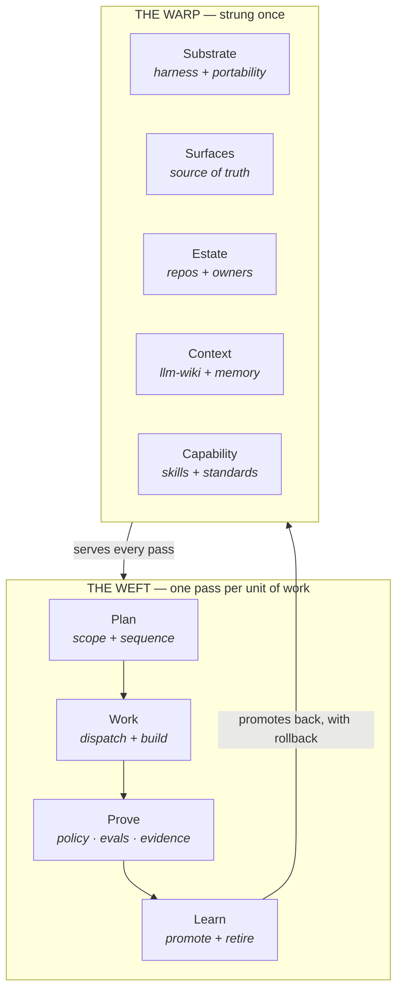

# A guide to LoomWarp for teams that used Agile

**What this is.** The front door. If you read one document about LoomWarp, read this one — the twelve functions, the Grid and the pre-flight generator are all behind it, and none of them are the point.

**Who it is for.** A product owner, a lead, or an architect deciding whether any of this applies to their team. It assumes you know how software teams work and nothing about this framework.

> **Status: DRAFT, and the count is not settled.** This document proposes a frame. Three concepts it produces — Agents, Rituals and Scope — do not have functions yet, and whether they become functions is `OPEN-3`. Where something is unsettled it says so rather than rounding up.

> KD Note: i'm not sure if the agile -> ai-native framework is the *spine* i think this was more of a metaphor that would probably be helpful to newcomers, but to an AI-native
  person it raises an eyebrow of "why are you trying to write old styles of code with AI?"

---

## 1. The one-line version

> **Agile is a process layer for humans. This is a process layer for teams that are part human and part agent.**

Not simpler than SAFe. Not more complex than lean. **Built for a worker that reads the documentation and has no memory of yesterday.**

That difference is the whole thing. Agile was designed for a co-located team of people who talk to each other, remember last week, and can be trusted to use judgement. Replace half that team with agents and each of those three assumptions fails at once — not gradually, and not in a way more communication fixes.

---

## 2. What translates

Most of agile survives contact with agents. The shapes are the same; what fills them changes.

| Agile has | The AI-native form | Why it had to change |
|---|---|---|
| **Roles** — PO, lead, dev, reviewer | **Agents** — defined in files, scoped to a project, versioned like code | A role used to be a person you hired. Now some of them are a file you write, review and roll back |
| **Ceremonies** — standup, planning, review, retro | **Rituals** — each with a named seat for an agent | The meeting still happens. The question is whether an agent is in it, and what it is allowed to do there |
| **Artifacts** — backlog, increment, DoD | **Blueprint · PRD · handoff · decision ledger** | An artifact used to be a shared reminder. Now it is the entire context a worker gets |
| **Information radiators, the board** | **Surfaces** — and a codified answer to *which one is the source of truth* | When four surfaces disagree, a human asks. An agent picks one and sounds confident |
| **Definition of done** | **Standards** — versioned, inherited, tightened but never contradicted | Prose on a wiki page does not bind a model |
| **Retro, inspect-and-adapt** | **The learning loop** — promotion with rollback | A retro that changes nothing mechanical changes nothing |
| **The team's tools** | **Harness and estate**, team-wide rather than per-developer | Every coding harness was built for one developer. That is the break every system in this landscape exists to fix |

---

## 3. What agile assumed, and what you now have to build

This is the part worth arguing with, because it is the thesis.

Agile never named context, scope, or trust — not from oversight, but because a co-located human team gets all three for free. **Every one of them has to be constructed when the worker is a fresh agent each session.**

| Agile assumed                                              | Because                                           | What replaces the assumption                                                                                                                                 |
| ---------------------------------------------------------- | ------------------------------------------------- | ------------------------------------------------------------------------------------------------------------------------------------------------------------ |
| **Shared context** — everyone knows why we did it that way | People remember, and can be asked                 | **The llm-wiki**, plus a rule routing each fact to team memory or individual memory. Knowledge has to *compound*, not just be retrievable                    |
| **Co-location** — the right people hear the right things   | You sit near your team and not near the other one | **Scope** — which standards, policies and agents apply where. A backend repo should not load the frontend guide                                              |
| **Trust** — the team is competent and honest               | You hired them, and you watch them work           | **Trust, constructed**: policy enforced where the model cannot reach it, evals, observability, and provenance evidence that every completion claim points at an artifact |

**Those three gaps are where the industry converged independently, and they explain the two things that actually happened in the last eighteen months:**

- **The harness broadened to the team** because co-location broke. Claude Code, Codex and Cursor were built for one developer; every process layer in the landscape — gstack, Gas City, QM, Indigo HQ, SageOx — exists because that assumption failed at team scale.
- **The llm-wiki appeared** because shared context broke. Karpathy named the pattern; at least five systems built it independently. Its acceptance test is the sharpest bar in the category: *does knowledge compound, or does it just get retrieved?*

Sources and the full landscape: [`../../references/comparisons/`](../../comparisons).

---

## 4. Which seats an agent can hold

*"The scrum master is now also an agent"* is true, and the useful version of it has a limit.

| The seat | Held by | What that looks like in practice |
|---|---|---|
| **Scrum master** — facilitation, unblocking, keeping the ceremony honest | **Agent** | A librarian tier that ingests on drop, lints on a schedule, and reports rather than silently rewriting |
| **Tech lead / architect** — routing, decomposition, composing the task | **Agent, scoped to the project** | It holds the epic and never reads implementation detail; anything over ~3 steps or ~2 files is delegated |
| **Developer** | **Agent** | Executes one workstream against an enumerated read/write manifest and a runnable gate |
| **Reviewer** | **Agent** | Layered evaluation where only the deterministic and judgement layers block |
| **Product owner** — deciding what to build, and accepting it | **Human. This is the boundary** | The agent runs the interview; it does not answer it |

**The last row is the framework's answer to "where is the human in the loop."** It is not a slider between *strict* and *dangerous*. It is one named seat that does not get automated, and every other seat is a question of how much evidence you require before you stop watching.

---

## 5. The picture

The name is the model. A loom holds two kinds of thread.

```
              THE WARP — strung once, by the team, under tension
                 │      │      │      │      │      │
   ┌─────────────┼──────┼──────┼──────┼──────┼──────┼─────────┐
   │             │      │      │      │      │      │         │
   │  unit  ═══════════════════════════════════════════════▶  │  the weft: one
   │  of work    │      │      │      │      │      │         │  pass, over and
   │             │      │      │      │      │      │         │  under, per job
   │  unit  ═══════════════════════════════════════════════▶  │
   │  of work    │      │      │      │      │      │         │
   └─────────────┼──────┼──────┼──────┼──────┼──────┼─────────┘
                 │      │      │      │      │      │
              substrate │  estate │  capability │  evidence
                    surfaces  context      policy
```

The warp never becomes the product. It is what makes the product possible, and **you cannot weave on a warp you have not strung.**

Two consequences fall directly out of the metaphor, and both are load-bearing:

**The cloth tears at the weakest warp thread.** Not the average one. A team with excellent context, mature standards and no enforcement is a team whose fabric fails at enforcement — and the honest grade is the minimum, not the mean. *Minimum governs.*

**Doer agents weave the weft; steward agents maintain the warp.** They are different jobs with different failure modes, and most teams staff only the first.

---

## 6. One unit of work, end to end

The warp is what you set up. This is what happens every time work moves through it.



**The loop is where rituals live.** A standup is *Plan* given a time and an attendee list; peer review is *Prove* as an event; a retro is *Learn* as an event. That is why rituals kept absorbing two other concepts that looked separate — a ritual is simply where humans and agents meet at a step of this loop.

---

## 7. The four bands

The functions group by *who decides, how often, and what it costs to be wrong*.

| Band | The decision is | Decided by | Cost to reverse | Fails as |
|---|---|---|---|---|
| **Ground** | What we run on | Platform owner | **Very high** | Lock-in |
| **Structure** | What we work in | Architect | High — migrations | Sprawl |
| **Motion** | How work moves | The team | Moderate | Inconsistency |
| **Trust** | Why we believe it | Lead and org | Low to add, **high to have skipped** | *"It said it was done"* |

**Cost to reverse falls as you go down; cost of omission rises.** Getting Ground wrong is expensive and obvious immediately. Skipping Trust is cheap to fix and invisible until it is not — which is exactly why it is the band teams skip.

> **On the name.** This band was previously called *Guarantee* in one document and *Trust* in another. **Trust** is correct, and not only because it settles the drift: *guarantee* names a promise, while *trust* names the thing agile assumed and this framework has to construct. It also holds the whole set — policy, evals, observability and evidence are four mechanisms for one outcome.

---

## 8. What this document does not settle

Recorded here rather than smoothed over.

| # | Open |
|---|---|
| **Agents** | The frame produces a function agile already had as *roles*, and v0 has none. Function, or a system under Capability? |
| **Rituals** | Same, for ceremonies. Reached independently at [`comparisons/01-concepts.md`](../../comparisons/01-concepts.md) §3.15 — two routes, one gap |
| **Scope** | Which standards, policies and agents apply where. Four peer systems treat it as first-class; v0 has no function for it |
| **The count** | **Twelve functions.** `OPEN-3` resolved as `C-12`: the count grew because the *jobs* grew from 12 to 17, not because the model inflated. This document still leads with the frame, not the count |

---

*Next: [`01-problem.md`](./01-problem.md) — the derivation · [`02-functions.md`](./02-functions.md) — the twelve functions in full, with providers · [`03-maturity.md`](./03-maturity.md) — how a team grows · [`../../references/comparisons/`](../../comparisons) — the landscape this is positioned against*
