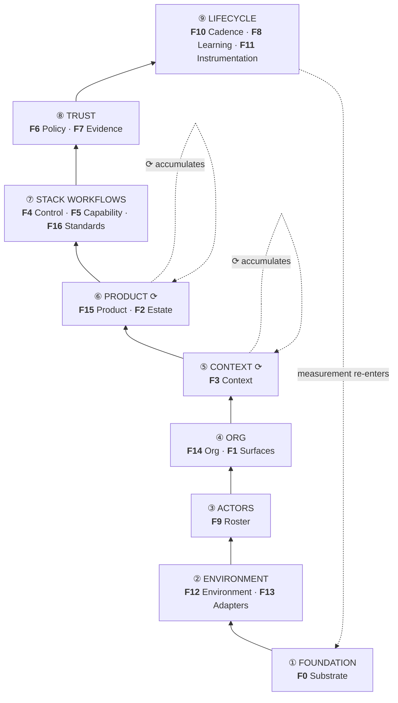

# The architecture

**What this is.** The harness as a **layered architecture**, built bottom-up from a foundation, rather
than as a flat list of things to grade. [`02-functions.md`](./02-functions.md) answers *what must the
harness do*. This answers *what sits on what*, *what plugs in where*, and *which layers accumulate*.

**Why it is separate from `02`.** They are different objects and the corpus's own rule applies:
mapping one onto another is *"a translation, not an identity"*
([`06-frameworks-addendum.md`](../comparisons/2026-08-research/06-frameworks-addendum.md)
§0). `02` is a **readiness grid** — rows you can be independently good or bad at. This is a **stack** —
layers that constrain the layers above them. The crosswalk is §5.

**Provenance.** Designed across four rounds of KD feedback in thread `b6965999` and never built; the
design is recorded in
[`../../SESSION-2026-08-28-v0-framework-architecture-rebuild.md`](../sessions/SESSION-2026-08-28-v0-framework-architecture-rebuild.md)
§2. This file is that design landed.

> **This adds five functions and does not renumber any.** `F0`–`F11` keep their IDs and meanings.
> `F12`–`F16` are the additions, per [`02-functions.md`](./02-functions.md) §0.5: *"If the model is
> wrong again, the fix is a new **function**, not a new **letter**."* That is exactly what this is.

---

## 1. The stack, bottom-up

**Read from the bottom.** This is an architecture: you build a foundation, then up and out. Nothing at
a given layer can be chosen before the layers beneath it are settled — you cannot pick a Control model
before you know your Substrate, and you cannot write an adapter for a system you have not declared.

```
                                          ⟳ = the layers that accumulate

  ⑨  LIFECYCLE       F10 Cadence          what runs on a schedule, and what it emits
     work on the     F8  Learning         how convention graduates into the sanctioned way
     harness itself  F11 Instrumentation  what it costs, and what limits us
                          ▲
  ⑧  TRUST           F6  Policy           what is allowed, and the hardening bar
     why we          F7  Evidence         how we know it happened
     trust it
                          ▲
  ⑦  STACK           F4  Control          how work is scoped, sequenced and recovered
     WORKFLOWS       F5  Capability       what the team can do, packaged
     n per team      F16 Standards        what good looks like
                          ▲
  ⑥  PRODUCT      ⟳  F15 Product          where outcomes land, and the directives on them
     what we         F2  Estate           what code exists
     deliver
                          ▲
  ⑤  CONTEXT      ⟳  F3  Context          what the agent knows
     what we know
                          ▲
  ④  ORG             F14 Org              accountability and decision rights
     who answers     F1  Surfaces         where work is seen and done
                          ▲
  ③  ACTORS          F9  Roster           who exists, human and agent
     who does it
                          ▲
  ②  ENVIRONMENT     F12 Environment      the declared work environment — the ontology map
     what we reach   F13 Adapters         how the harness reaches it: adapters, middleware, hooks
                          ▲
  ①  FOUNDATION      F0  Substrate        what we run on: the model(s) and the runtime
     what we run on
```


> KD note: This is great to see this mapped out. But I think that I disagree with how this is getting structured and want to discuss and try to provide a counter-argument that we should understand and validate: 
```
0: Foundation Layer.  
1: Harness Layer(s). 
2: System Stacks Layer. 
  2a: Control Layer
  2b: routing
  2b: composition
  2d: Configuration
  2e: Standards
3: Capabilities
  3a. Tool Repo
  3b. MCP and services
  3c. Permissions and policies
4: Context Layer. 
  4a. Individual Memory and Context
  4b. Team Memory and Context
  4c. llm-wiki and rag
5: Workspaces Layer. 
  5a. Project codebase and sandbox
  5b. Project infrastructure
  5c. Project stack
  5d. Project delivery 
6: Workflow Tasks.  
7: Trust
  7a: Evals
  7b: Evidence
  7c: Observability
  7d: Efficiency
8: Anti-fragile Lifecycle
  8a: Hooks
  8b: Learning flywheel
  8c: Rituals
9: Teams & Agents
10: Surfaces
```

> KD Note: was trying to think gabout this and felt like capabilities might need to grow to a higher order pillar.  maybe these are too many pillars and some might only be applicable to the team context. 

---

## 2. The `⟳` pair — the only two layers that accumulate

**This is the sharpest structural claim in the architecture, and it is KD's.**

> *"This alongside the product layer are the dynamic growing deliverable that makes your agent and
> agent harness better over time."*

**`⑤ CONTEXT` and `⑥ PRODUCT` are the only layers that grow.** Everything below them is *configured*
— chosen once, revisited rarely. Everything above them is *machinery* — it runs, it does not
accumulate. Between them sits the pair that gets larger and more valuable every time the system is
used.

| | Configured | Accumulates | Runs |
|---|:--:|:--:|:--:|
| ① FOUNDATION · ② ENVIRONMENT · ③ ACTORS · ④ ORG | ● | | |
| **⑤ CONTEXT · ⑥ PRODUCT** | | **⟳** | |
| ⑦ STACK WORKFLOWS · ⑧ TRUST · ⑨ LIFECYCLE | | | ● |

**Why this is sharper than the factor it refines.** Factor `XI` says *"knowledge compounds or it is
not knowledge."* True, and it does not say **where**. This does: compounding happens physically, in two
named layers, and **those are the two a team cannot buy.** You can rent a model, adopt a harness,
install a policy tier and import a standards pack. You cannot import the context your team has
accumulated about its own product, and you cannot import the product.

**The consequence for the maturity grid.** A team whose `⑤` and `⑥` are thin has bought a harness and
grown nothing. That is a different diagnosis from a low minimum on any single row, and
[`03-maturity.md`](./03-maturity.md) does not currently express it.

---

## 3. `② ENVIRONMENT` — declare it, derive the rest

**The load-bearing idea in the whole architecture**, and the layer with no counterpart in the shipped
model. KD:

> *"As a user, I just might list all the components and tools I use and then **the AI builds the
> taxonomy and creates connections**… this is a similar function that MCP is handling as an adapter,
> but **my harness isn't aware of it until it happens.**"*

This is **ports and adapters**. The architect *declares* the work environment; the system *derives* the
ontology and the adapters that reach it.

| | |
|---|---|
| **`F12 Environment`** | The **declared inventory** — org · teams · projects · repos with path aliases and definitions · SaaS · execution environments · data systems. Each entry names its **adapter**, **interface**, **auth** and **owner** |
| **`F13 Adapters`** | The **derived reach** — the adapter per declared system, and the middleware/hook points where it attaches to the loop |

**The gap this closes, stated precisely.** MCP adapts **per call**. Nothing in the harness holds a
model of *what exists* before the call is made. So the harness cannot answer *"what can I reach?"*,
*"who owns it?"*, or *"what breaks if it goes away?"* — three questions a team asks constantly and a
per-call adapter cannot.

### 3.1 The mechanism layer — where configuration actually attaches

`F13`'s attachment points are not ours to invent. They are published and empirically measured across
2,853 repositories and five tools — the **eight configuration mechanisms**, reproduced with full
per-tool paths in
[`07-verified-inventories.md`](../comparisons/2026-08-research/07-verified-inventories.md)
§1 (Galster et al., arXiv:2602.14690v5, ✅ read at source):

| Mechanism | What attaches | Band it serves |
|---|---|---|
| **Context Files** | instructions loaded every session | ⑤ CONTEXT |
| **Settings** | project-level tool behaviour | ① FOUNDATION · ⑧ TRUST |
| **Skills** | reusable knowledge and invocable workflows | ⑦ STACK WORKFLOWS |
| **Subagents** | specialized agents, own context, parallel to the loop | ③ ACTORS |
| **Commands** | user-triggered shortcuts | ⑦ STACK WORKFLOWS |
| **Hooks** | scripts at agent lifecycle points | ⑧ TRUST · ⑨ LIFECYCLE |
| **Rules** | system-level behavioural instruction | ⑧ TRUST |
| **MCP** | external tool and data connections | ② ENVIRONMENT |

**Two findings from that source that bear directly on this architecture:**

- **Skills execute in the calling agent's context; Subagents do not.** They *"operate in parallel to
  the central agent loop, in their own context"* and return results to the parent. That is a
  **context-isolation** boundary, not a capability one, and it is why `Skills` and `Subagents` land in
  different bands above.
- **85.5% of Skills ship no executable resource** — *"static instructions rather than executable
  scripts."* Any claim that skills are a capability-*distribution* mechanism has to reckon with that.

> ⚠️ **The published paper contains no agent-loop diagram and no insertion-point taxonomy.** The
> band assignments in the table above are **ours**, derived from each mechanism's published
> description. The mechanisms and their descriptions are ✅ direct; the mapping is a claim of this
> document.

---

## 4. Primitives and machinery — the line we have not drawn

Adopted from Gas City, which defines *primitive* not abstractly but **by contrast**
([`07-verified-inventories.md`](../comparisons/2026-08-research/07-verified-inventories.md) §2):

> *"Three pieces of role-agnostic plumbing run the primitives, and you configure no role around any of
> them… **None of this machinery knows what your agents do. It's the substrate the six primitives sit
> on.**"*

> ### A primitive is a thing you **configure**. Machinery is a thing that **runs**.

**Applied to us, this is uncomfortable and worth stating plainly.**

| Ours | Kind | Currently |
|---|---|---|
| registry entry · context bundle · work contract · capability package · risk tier · evidence bundle | **primitives** | correctly modelled as configurable |
| **`router.py`** — resolves the dependency graph and owns state transitions | **machinery** | **graded as though configurable** |
| **`dispatch.py`** — dispatches from a contract | **machinery** | **graded as though configurable** |

`F4 Control` is graded on a ladder whose upper rungs describe *"a declared dependency graph,
deterministic resolver"* — which is machinery. **A team does not configure a resolver; it configures
the contract the resolver reads.** The gradeable thing is the work contract; the resolver is plumbing
that either exists or does not.

### 4.1 The six words, each doing one job

Settled empirically 2026-08-27/28 by reading how the field actually uses them. Recorded here because
the corpus has spent three renames discovering that **one unit called four things is four vocabularies**,
and the fix is not a better word but a stated division of labour.

| Word | Means | Genre it belongs to |
|---|---|---|
| **Primitive** | the one sanctioned way to express something — **you configure it** | beneath all genres |
| **Machinery** | role-agnostic plumbing that **runs** primitives; not configured | — |
| **Component** | a part that is *present* in a harness | A · function taxonomy |
| **Function** | what it *does* → the seventeen jobs | A |
| **Element** | the gradeable *pillar* → a Grid row | B · readiness grid |
| **Factor** | a *principle* you hold or violate | C · manifesto |

**Neither Gas City nor foursignals defines `primitive` abstractly.** Both define the *set* by binding
each member to an unavoidable question — WHO · WHAT · HOW · WHERE · CONFIGURES · OBSERVE. That is a
construction rather than a definition, and it is falsifiable in a way a definition is not: **a seventh
question would mean a seventh primitive.** Worth applying to our own set before publishing it.

This is recorded as `C-24` and is **not** resolved here — fixing it means re-writing `F4`'s ladder in
[`03-maturity.md`](./03-maturity.md), which is out of scope for this document.

---

## 5. Crosswalk — nine bands ↔ five bands

**Nothing is renumbered. Nothing is removed.** The five-band model in
[`02-functions.md`](./02-functions.md) §1 is a **coarser partition of the same stack**, and both are now
in that file's map.

| Nine bands (this file) | Five bands (`02-functions.md`) | Functions |
|---|---|---|
| ① FOUNDATION | FOUNDATION | `F0` |
| **② ENVIRONMENT** | *(absent)* | **`F12` `F13` — new** |
| ③ ACTORS | STRUCTURE | `F9` |
| ④ ORG | FOUNDATION *(`F1`)* + *(absent)* | `F1`, **`F14` — new** |
| ⑤ CONTEXT ⟳ | STRUCTURE | `F3` |
| **⑥ PRODUCT ⟳** | STRUCTURE *(`F2` only)* | `F2`, **`F15` — new** |
| ⑦ STACK WORKFLOWS | PROCESS | `F4` `F5`, **`F16` — new** |
| ⑧ TRUST | TRUST | `F6` `F7` |
| ⑨ LIFECYCLE | LIFECYCLE | `F8` `F10` `F11` |

### 5.1 The five additions, and why each is not a rename

| # | Function | Why it is genuinely new, not a re-cut |
|---|---|---|
| **`F12 Environment`** | Nothing in `F0`–`F11` holds a **declared inventory of systems the team works across**. `F2 Estate` is *what code exists* — repos only, and inventory rather than reach. §3 |
| **`F13 Adapters`** | `C-4` ruled adapters *"a property of `F0`, not a peer function"* on the evidence that runtime-neutrality is a per-task property. **That ruling stands for model portability and does not cover this.** `F13` is not "can we swap harnesses" — it is the middleware and hook surface by which the harness reaches every declared system. §3.1 |
| **`F14 Org`** | `F9 Roster` answers *who exists*. It does not answer *who answers for the result*, or *who may decide what*. [`04-decision-layers.md`](./04-decision-layers.md) §3 already carries a decision-rights table with **no function to hang it on** |
| **`F15 Product`** | **The largest hole.** There is no layer for **where outcomes land**. KD: *"in software the deliverable is to the codebase and likely has directives (eg. LoomWarp can only be configured as a monorepo or virtual-monorepo)."* Those directives are constraints on the deliverable and currently have no home |
| **`F16 Standards`** | `F5 Capability` holds two systems — *The Standards* (what good looks like) and *The Catalog* (how it travels). `02-functions.md` §6 already records that grading them as one *"averages a 4 and a 2 into a 2, and the standards work disappears."* `C-11` ruled *grade at the system level, roll up as the minimum*; this takes the split one step further, because **Standards is one of the four rows carrying LoomWarp's real claim** |

### 5.2 What this does not change

- **No ID is reused, re-ordered, merged or split-with-renumber.** `F0`–`F11` mean exactly what they
  meant on 2026-08-27.
- **The evidence layer is untouched.** Jobs `J1`–`J17` keep their IDs and their mapping.
- **The provider model is untouched.** `F12`–`F16` inherit the same `FUNCTION × SCOPE × PROVIDER` axes.
- **No provider contract is claimed for the five additions.** Per `02-functions.md` §0.4, *"a function
  whose provider is a named product needs a contract, or 'pluggable' is a slogan."* Only `F3` has one
  ([`09-context-layer.md`](./09-context-layer.md) §6). **`F12`–`F16` carry provider names at most, and
  must not be described as pluggable.**

---

## 6. Open

| # | Question | Why it is not settled here |
|---|---|---|
| **`OPEN-15`** | Does `F2 Estate` survive alongside `F15 Product`, or fold into it? | Estate is *what code exists*; Product is *where outcomes land*. They are distinguishable, but a team with one repo cannot tell them apart, and the grid would show two rows moving together |
| **`OPEN-16`** | Is `F13 Adapters` a function, or the mechanism layer *beneath* all functions? | §3.1's table maps mechanisms to **seven different bands**, which is evidence it is cross-cutting. Kept as a function because it has an owner, an artifact and an independent maturity — but the argument is not closed |
| **`OPEN-17`** | Does the nine-band stack **replace** the five-band partition in `02-functions.md` §1, or coexist as a second view? | Currently both are in that map. Two partitions of one set is exactly the multiplicity `C-14` ruled against, and this may be the same error in a new place |
| **`OPEN-18`** | **Which candidate bands fold into which?** KD's counter-proposal at §1 raises `Workspaces`, `Capabilities`, `Configuration`, `Surfaces` and `Rituals` as bands, and notes *"some of these do get folded into some of these systems and layers."* | **Folding is likely and the fold-lines are not established.** A test exists and is recorded here rather than run: **a candidate is a band if it can be created, named, reattached to, and destroyed independently of the layers above and below it.** On that test `Workspaces` passes (QM `scope` · HumanLayer `worktree` · Deep Agents `SandboxBackendProtocol.id` — three peers, three names) and `Configuration` does not (it attaches to other bands and has no lifecycle of its own) — which is the same failure mode as `OPEN-16`'s. **Not settled here:** renumbering bands mid-flight is the `FM-3` defect this corpus punishes in competitors, and the horizon of each candidate should be recorded before its position is. See [`12-horizon.md`](../spec/v1-framework/12-horizon.md) §3.2 |

---

*The model: [`02-functions.md`](./02-functions.md) · The first function spec:
[`09-context-layer.md`](./09-context-layer.md) · The sourced inventories:
[`07-verified-inventories.md`](../comparisons/2026-08-research/07-verified-inventories.md)
· The design record:
[`../../SESSION-2026-08-28-v0-framework-architecture-rebuild.md`](../sessions/SESSION-2026-08-28-v0-framework-architecture-rebuild.md)*
