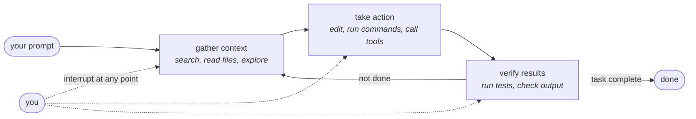
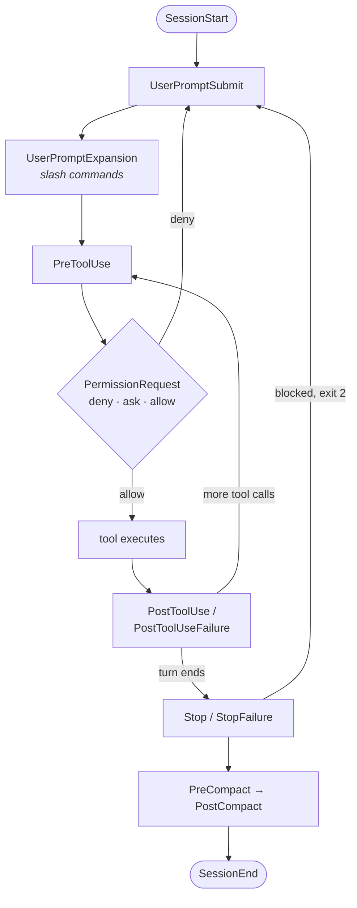
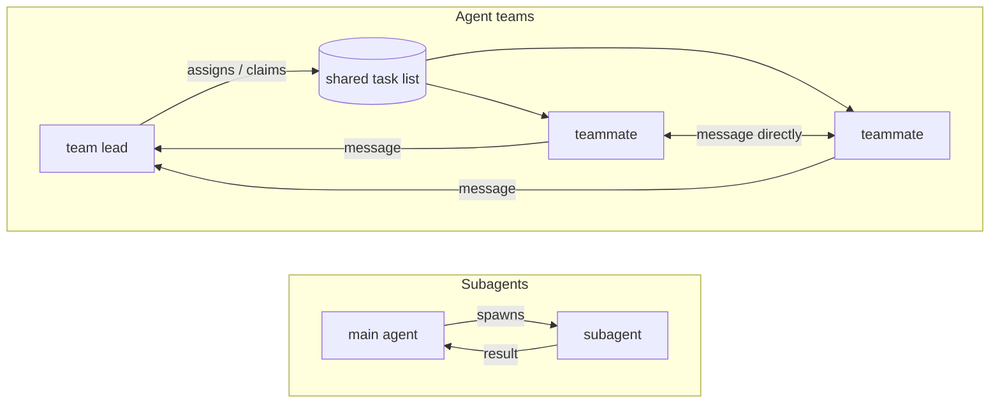
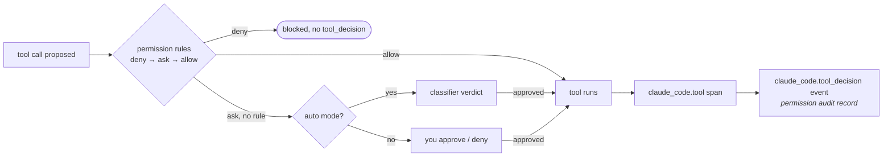

# Claude Code — Anthropic

***An agent loop wrapped in an "agentic harness" that supplies tools, context management, and an execution environment; it optimises for a single operator's turn binding mechanically at the tool-call boundary, with everything upstream of that boundary — CLAUDE.md, auto memory, skills — shaping behaviour by prose rather than enforcing it.***

## 1. At a glance

| | |
|---|---|
| **Altitude** | Runtime, plus an org-policy layer over many single-operator runtimes → [§7](#7-identity-and-inclusion-test) |
| **Primitives** | 8, ⚠️ contestable — skill · subagent · hook · plugin · MCP server · agent team · dynamic workflow · (instruction file) → [§5](#5-primitives) |
| **Structured output** | The `claude_code.interaction` OTel trace, whose `claude_code.tool` spans carry the `tool_decision` permission-audit record → [8c](#8c-observability) |
| **Binds mechanically?** | Partly — permission rules, sandbox and managed settings bind; CLAUDE.md and auto memory are prose only → [2c](#2c-enforcement) |
| **State persists** | `CLAUDE.md` (git, per-scope) and auto memory (`~/.claude/projects/<project>/memory/*.md`, machine-local) → [5a](#5a-individual-memory) |
| **Serves** | One operator per session; managed settings, Code Review and analytics run org-wide → [10b](#10b-org) |
| **Refuses** | No published refusal list — checked `glossary.md`, `overview.md`, `how-claude-code-works.md` → [§5](#5-primitives) |
| **Coverage** | ● 17 · ◐ 14 · ○ 2 · n/a 0 → [§4](#4-component-matrix) |
| **Deep read** | [`content/claude-code/`](claude-code/00-README.md) — 12-document extensibility reference (2026-08-10 read, relayed here) |
| **Source** | anthropics/claude-code @ v2.1.261 (`d7dbd9a09f5977…`) · code.claude.com/docs/en/ · read 2026-09-04 |
| **Unverified** | 9 items → [§10](#10-unverified) |

### 1a. Positioning stats

`+1 · +1 · +3 · +1 · +2† · −3 · +3` — the seven DX dimensions, in order.

> **⚠️ Drafted 2026-09-07, not yet verified.** Derived from Anthropic's documentation, the repo's
> README and tag history, and the product page — grounded against §4, §5 and §7 below. No person has
> re-read these seven values yet. [`01-scorecard.md`](../spectrums/01-scorecard.md) §1 R11 says how the
> banner comes off.

| | | | | |
|:-:|---|---:|:-:|---|
| **1** | Org scale | single operator | `────●──` | multi-tenant, many teams |
| **2** | Weight class | light-weight | `────●──` | heavy-weight |
| **3** | Surfaces & extendability | one surface | `──────●` | many surfaces, environments, a platform |
| **4** | Context | nothing survives | `────●──` | shared, durable, retrievable |
| **5** | Ecosystem **†** | tribal, low adoption | `▰▰▰▰▰▱` | wide adoption, longevity, network economies |
| **6** | Ownership | rented | `●──────` | yours |
| **7** | Cost controls & efficiency | unmetered, unrestricted | `──────●` | observability, efficiency, routing |

**†** the one **graded** dimension; every other row is a position, not a score. **Neither end is
better.** Ten axes sit beneath these seven — `I +1 · II 0 · III +3 · IV +3 · V 0 · VI +1 · VII 0 ·
VIII 0 · IX 0 · X +3` — and four of them feed no cell above by design.

→ the rendered card and the reasoning per dimension:
[`spectrums/positioning.md`](../spectrums/positioning.md#2-claude-code) ·
the scored source of truth: [`positions/claude-code.yaml`](../spectrums/positions/claude-code.yaml) ·
what each dimension means: [`spectrums/01-scorecard.md`](../spectrums/01-scorecard.md) ·
the ten axes: [`spectrums/00-README.md`](../spectrums/00-README.md)

*Scored 2026-09-07 against this profile as read 2026-09-04, then re-scored the same day against the
revised seven (ruling `2026-09-07-dx-revision`). Two values moved: dimension 4's polarity reversed
(`−2` → `+2`, one observation), and dimension 5 fell to `+2` when its anchors narrowed to adoption.
This table is the **one sanctioned echo** of the scorecard — it is derived from the same YAML that
renders `positioning.md`, so the two match by construction. Re-score in the YAML, never here.*

### 1b. Contents

[§1 At a glance](#1-at-a-glance) · [1a Positioning stats](#1a-positioning-stats) ·
[§2 System map](#2-system-map) · [§3 Workflows](#3-workflows) ·
[§4 Component matrix](#4-component-matrix) · [§5 Primitives](#5-primitives) ·
[§6 Details](#6-details) · [§7 Identity and inclusion test](#7-identity-and-inclusion-test) ·
[§8 Limits](#8-limits) · [§9 Sources](#9-sources) · [§10 Unverified](#10-unverified)

**Deep read** — [`content/claude-code/`](claude-code/00-README.md), a 12-document extensibility
reference set at a finer grain than §6: [extension surfaces](claude-code/01-extension-surfaces.md) ·
[skills](claude-code/02-skills.md) · [hooks](claude-code/03-hooks.md) ·
[subagents](claude-code/04-subagents.md) ·
[multi-agent orchestration](claude-code/05-multi-agent-orchestration.md) ·
[plugins and distribution](claude-code/06-plugins-and-distribution.md) ·
[context and memory](claude-code/07-context-and-memory.md) ·
[policy and governance](claude-code/08-policy-and-governance.md) ·
[telemetry and evidence](claude-code/09-telemetry-and-evidence.md) ·
[programmatic and SDK](claude-code/10-programmatic-and-sdk.md) ·
[the consolidated guide](claude-code/20-consolidated-guide.md)

## 2. System map

Redrawn from Anthropic's own "The agentic loop" diagram on `how-claude-code-works` (re-read 2026-09-04, same page and image the vendor's glossary entry for *Agentic loop* cites). Four other vendor diagrams exist at different altitudes: the hook lifecycle and the subagent/agent-team comparison are transcribed into [§3](#3-workflows); the session-continuity and SDK message-loop diagrams are undrawn — see [§9](#9-sources).

**How it thinks about work.** A unit of work is one turn: a prompt enters, Claude decides whether it needs to gather context, act, or verify, and the loop repeats until no tool call remains (*"Claude decides what each step requires based on what it learned from the previous step"*). Nothing gates entry — the operator's prompt is the only admission check. What decides the loop may proceed is the permission layer wrapped around each tool call ([2c](#2c-enforcement)), not the loop itself. Work lands as file edits, shell effects, or a text answer; the loop does not itself decide where the result goes next.

## 3. Workflows

### The turn, plus the hook lifecycle

Combines the agentic loop above with the per-turn hook sequence from Anthropic's own lifecycle diagram and event table on `hooks` (raw `.md` fetch, 2026-09-04). 33 named events; async/standalone ones omitted here for space.

### Delegation — subagents vs. agent teams

Transcribed from Anthropic's own comparison diagram on `agent-teams` (2026-09-04): *"Subagents are spawned by the main agent, do work, and report results back. Agent teams coordinate through a shared task list, with teammates communicating directly with each other."*

### The permission-decision audit — nearest the structured output

Transcribed from the rule-evaluation order on `permissions` (*"Rules are evaluated in order: deny, then ask, then allow"*) joined to the telemetry event it produces, per `monitoring-usage` (both 2026-09-04). This is the sequence that produces the card's structured output.

## 4. Component matrix

`● named primitive · ◐ partial, present-not-first-class · ○ absent (pages named in §6) · n/a does not apply at this altitude`

| # | Component | Mark | Primitive / note |
|---|---|:-:|---|
| **0 · Foundation** | | | |
| [0a](#0a-substrate) | Substrate | ● | Model swap (Sonnet/Opus/Fable) + 5-provider substrate (API, Bedrock, Vertex, Foundry, Claude Platform on AWS) |
| **1 · Environment** | | | |
| [1a](#1a-environment) | Environment | ◐ | `additionalDirectories`/`--add-dir` + sandbox domain allowlist — reach configured, not a declared systems inventory |
| **2 · Agent Harness** | | | |
| [2a](#2a-adapters--middleware) | Adapters & Middleware | ● | [**MCP server**](#5-primitives) — 4 transports; no ACP found |
| [2b](#2b-hooks) | Hooks | ● | [**Hook**](#5-primitives) — 33 events, fail-open by default, 5 handler types |
| [2c](#2c-enforcement) | Enforcement | ● | Permission rules (deny→ask→allow) + OS sandbox (Seatbelt/bwrap) + managed settings |
| **3 · System Stacks** | | | |
| [3a](#3a-control) | Control | ● | Plan mode + `/goal` — *"a wrapper around a session-scoped prompt-based Stop hook"* |
| [3b](#3b-routing) | Routing | ◐ | Per-role model assignment + `availableModels` substitution; no message→agent resolver |
| [3c](#3c-composition) | Composition | ● | [**Subagent**](#5-primitives) + [**Agent team**](#5-primitives) (experimental, off by default) |
| [3d](#3d-configuration) | Configuration | ● | [**Instruction file**](#5-primitives) (`CLAUDE.md`) load order + settings-layer precedence + managed policy |
| [3e](#3e-standards) | Standards | ◐ | Agent Skills open standard (co-published) + JSON Schema for structured output |
| **4 · Capabilities** | | | |
| [4a](#4a-capability) | Capability | ● | [**Skill**](#5-primitives) + MCP + [**Plugin**](#5-primitives) bundling both |
| [4b](#4b-capability-permissions) | Capability Permissions | ● | `allowed-tools`/`disallowedTools` + `skillOverrides` + `strictPluginOnlyCustomization` |
| **5 · Context ⟳** | | | |
| [5a](#5a-individual-memory) | Individual Memory | ● | `CLAUDE.md` + auto memory (`MEMORY.md`) + subagent `memory:` scopes |
| [5b](#5b-team-memory) | Team Memory | ◐ | Project `CLAUDE.md` is shared instructions, not shared learnings; auto memory is machine-local |
| [5c](#5c-knowledge) | Knowledge | ◐ | MCP resources/prompts/connectors surface external data; no dedicated knowledge component |
| **6 · Workspaces ⟳** | | | |
| [6a](#6a-product) | Product | ○ | |
| [6b](#6b-infrastructure) | Infrastructure | ● | Sandbox, cloud environments, self-hosted environments, devcontainers |
| [6c](#6c-estate) | Estate | ◐ | Monorepo per-directory config + worktrees; no declared repo/service inventory |
| [6d](#6d-delivery) | Delivery | ● | GitHub Actions/GitLab CI/CD + Code Review (non-blocking) |
| **7 · Workflow Tasks** | | | |
| [7a](#7a-workflow-tasks) | Workflow Tasks | ◐ | `TodoWrite` + agent-team shared task list — session/team-scoped, not durable |
| **8 · Trust** | | | |
| [8a](#8a-evals) | Evals | ◐ | Code Review's multi-agent verification pipeline — explicitly non-blocking |
| [8b](#8b-evidence) | Evidence | ● | `claude_code.tool_decision` permission-audit event |
| [8c](#8c-observability) | Observability | ● | OTel metrics/events + beta distributed traces, `agent_id`/`workflow.run_id` |
| [8d](#8d-efficiency) | Efficiency | ● | `/usage`, prompt-cache stats, `modelPricing`, spend limits, effort levels |
| **9 · IMPROVE** | | | |
| [9a](#9a-learning) | Learning | ◐ | Auto memory's `feedback` notes; no core promote-to-shared-rule pipeline |
| [9b](#9b-rituals) | Rituals | ◐ | Code Review triggers on PR open/push as an automated review ritual |
| [9c](#9c-cadence) | Cadence | ● | `/loop`, cron tools, Routines (cloud), Desktop scheduled tasks |
| [9d](#9d-anti-fragile-lifecycle) | Anti-fragile Lifecycle | ○ | |
| [9e](#9e-raise-the-floor) | Raise the Floor | ◐ | `/doctor`, `/init`, curated official plugin marketplace |
| [9f](#9f-diagnose-the-bottleneck) | Diagnose the Bottleneck | ◐ | `/insights` (friction points) + analytics' PRs-per-user chart |
| **10 · Teams & Agents** | | | |
| [10a](#10a-roster) | Roster | ◐ | Built-in subagents (Explore/Plan/general-purpose) + team `members` array — session-scoped |
| [10b](#10b-org) | Org | ◐ | Owner/Primary Owner/Admin/Billing/Developer roles; no custom-role mechanism |
| **11 · Surfaces** | | | |
| [11a](#11a-surfaces) | Surfaces | ● | CLI, VS Code, JetBrains, Desktop, web, Slack — *"the same underlying Claude Code engine"* |
| **● 17 · ◐ 14 · ○ 2 · n/a 0** | | | |

## 5. Primitives

| Primitive | Path / key | Project's own definition (verbatim) | Source |
|---|---|---|---|
| Skill | `.claude/skills/<name>/SKILL.md` (alias: `.claude/commands/*.md`) | *"A `SKILL.md` file containing instructions, knowledge, or a workflow that Claude adds to its toolkit."* | `glossary.md` |
| Subagent | `.claude/agents/*.md` | *"A specialized AI assistant that runs in its own context window with a custom system prompt, specific tool access, and independent permissions."* | `glossary.md` |
| Hook | `hooks` block in settings / `hooks/hooks.json` | *"A user-defined handler that executes automatically at a specific point in Claude Code's lifecycle."* | `glossary.md` |
| Plugin | `.claude-plugin/plugin.json` — bundles: skills, hooks, subagents, MCP servers, LSP servers, monitors, workflows | *"A bundle of skills, hooks, subagents, and MCP servers packaged as a single installable unit."* | `glossary.md` |
| MCP server | `.mcp.json` / `claude mcp add` | *"A program that gives Claude tools, prompts, or resources over MCP."* | `glossary.md` |
| Agent team (experimental, off by default) | `~/.claude/teams/{name}/config.json` | *"Multiple independent Claude Code sessions coordinated by a team lead, with a shared task list and peer-to-peer messaging."* | `glossary.md` |
| Dynamic workflow | `.claude/workflows/*.js` | *"A dynamic workflow is a JavaScript script that orchestrates many subagents at once."* | `workflows.md` |
| Instruction file | `CLAUDE.md` / `.claude/CLAUDE.md` (alias: imported `AGENTS.md`) | *"A markdown file of persistent instructions you write for Claude, loaded at the start of every session."* | `glossary.md` |
| (supporting) Permission rule | `permissions.allow`/`.deny`/`.ask` | *"A settings entry that allows, asks about, or denies a tool invocation."* | `glossary.md` |
| (supporting) Settings layers | `~/.claude/settings.json` → `.claude/settings.json` → managed | *"The hierarchy Claude Code reads configuration from."* — bundles: `.claude/rules/*.md`, `permissions.defaultMode` | `glossary.md` |
| (supporting) Auto memory | `~/.claude/projects/<project>/memory/` | *"Notes Claude writes for itself based on your corrections and preferences."* | `glossary.md` |
| (supporting) Sandbox | `sandbox.enabled` | *"OS-level filesystem and network isolation for the Bash tool."* | `glossary.md` |

**Count:** 8 primitives, 4 supporting. **Verdict:** ⚠️ contestable — Anthropic's docs never assert a canonical primitive set the way MCP asserts *tool · resource · prompt*; this count is built from the glossary's headword list plus `docs/workflows`' own four-way comparison table (*"Subagents, skills, agent teams, and workflows can all run a multi-step task"*). At 8 it sits one past this corpus's 5–7 healthy band; a narrower reading that treats the instruction file as `(supporting)` memory substrate rather than an authored-intent unit gives 7. Both readings are defensible; neither is a pad. No published refusal list was found.

## 6. Details

`✅ direct · ↪ relayed · ⚠️ unverified`

### 0 · Foundation

#### 0a Substrate

● Model swap (Sonnet/Opus/Fable) + 5-provider substrate (API, Bedrock, Vertex, Foundry, Claude Platform on AWS)

**Ships.** Model switch mid-session (`/model`, `--model`) across Sonnet/Opus/Haiku/Fable families, with `effort` levels (`low`→`max`) trading reasoning depth for cost. The same CLI runs against the Anthropic API, Amazon Bedrock, Google Cloud's Agent Platform, Microsoft Foundry, or Claude Platform on AWS.
**Path.** `/model`, `claude --model <name>`, `ANTHROPIC_DEFAULT_HAIKU_MODEL`
**Source.** ✅ `model-config.md` (↪ relayed, not reopened today) · ✅ `admin-setup.md`

### 1 · Environment

#### 1a Environment

◐ <code>additionalDirectories</code>/<code>--add-dir</code> + sandbox domain allowlist — reach configured, not a declared systems inventory

**Ships.** Reach is configured, not declared: the working directory plus `additionalDirectories`/`--add-dir` set what Claude can touch; the Bash sandbox's `sandbox.network.allowedDomains` gates network reach at the OS level. No component inventories *which* systems a team owns (no estate registry — see [6c](#6c-estate)).
**Path.** `permissions.additionalDirectories`, `--add-dir`, `sandbox.network.allowedDomains`
**Source.** ✅ `large-codebases.md` · ✅ `sandboxing.md`

### 2 · Agent Harness

#### 2a Adapters & Middleware

● <b>MCP server</b> — 4 transports; no ACP found

**Ships.** MCP client over four transports (stdio, HTTP, SSE-deprecated, WebSocket), with tool-schema deferral (`ToolSearch`) so idle servers cost little context. No Agent Client Protocol (ACP) support found. The Agent SDK (TypeScript/Python) embeds the same binary for programmatic use.
**Path.** `claude mcp add`, `.mcp.json`
**Source.** ✅ `mcp.md` · ✅ `agent-sdk/agent-loop.md`

#### 2b Hooks

● <b>Hook</b> — 33 events, fail-open by default, 5 handler types

**Ships.** 33 named lifecycle events (`SessionStart` through `ElicitationResult`, counted directly from the `###` headings in the raw reference page), five handler types (command, HTTP, MCP tool, prompt, agent), and a decision protocol where most events fail open (*"The hook can deny the call, but staying silent doesn't approve it"*) while `PreToolUse`/`UserPromptSubmit`/`Stop` and others fail closed on exit 2. Full event list and matcher syntax: [`content/claude-code/03-hooks.md`](claude-code/03-hooks.md) (↪, 2026-08-10 read, 29 events at that date — the count has grown).
**Path.** `hooks` block in settings; `hooks/hooks.json` in a plugin
**Source.** ✅ `hooks.md` (raw fetch) · ✅ `hooks-guide.md`

#### 2c Enforcement

● Permission rules (deny→ask→allow) + OS sandbox (Seatbelt/bwrap) + managed settings

**Ships.** A four-rung ladder: permission rules (*"Rules are evaluated in order: deny, then ask, then allow. The first match... determines the outcome"*) → `PreToolUse` hooks → managed settings (org-wide, higher precedence, `strictPluginOnlyCustomization` locks capability sources to plugins) → the Bash sandbox (Seatbelt on macOS, bwrap/seccomp on Linux/WSL2, OS-enforced). *"Permission rules are enforced by Claude Code, not by the model."*
**Path.** `permissions.{allow,ask,deny}`, `sandbox.enabled`, `managed-settings.json`
**Source.** ✅ `permissions.md` · ✅ `sandboxing.md` · ✅ `admin-setup.md`

### 3 · System Stacks

#### 3a Control

● Plan mode + <code>/goal</code> — <i>"a wrapper around a session-scoped prompt-based Stop hook"</i>

**Ships.** Plan mode gives a read-only proposal-then-approve gate (*"Claude explores and proposes an approach for your approval"*). `/goal` layers a completion contract on top: *"a wrapper around a session-scoped prompt-based Stop hook"* — a small model judges *not yet met · met · impossible* after every turn, capped at three idle check-ins. Auto mode's classifier reviews most tool calls in the background.
**Path.** `/goal <condition>`, `--permission-mode plan`
**Source.** ✅ `goal.md` · ✅ `permission-modes.md`

#### 3b Routing

◐ Per-role model assignment + <code>availableModels</code> substitution; no message→agent resolver

**Ships.** Per-invocation model choice resolves through a fixed fallback chain (spawn prompt → subagent-definition `model` → `CLAUDE_CODE_SUBAGENT_MODEL` → session model), with `availableModels` allowlist substitution. No message-to-agent dispatch resolver comparable to a gateway's routing table was found — routing here is model selection, not agent selection.
**Path.** `model:` frontmatter field, `CLAUDE_CODE_SUBAGENT_MODEL`
**Source.** ✅ `sub-agents.md` · ✅ `agent-teams.md`

#### 3c Composition

● <b>Subagent</b> + <b>Agent team</b> (experimental, off by default)

**Ships.** Subagents run in an isolated context window and report a summary back; agent teams (experimental, `CLAUDE_CODE_EXPERIMENTAL_AGENT_TEAMS=1`, disabled by default) are peer sessions coordinating over a shared, file-locked task list and direct messaging. Forks share the parent's full context and prompt cache. Nesting capped at depth 3, concurrency at 20 subagents / one team per session. Full reference: [`content/claude-code/04-subagents.md`](claude-code/04-subagents.md), [`05-multi-agent-orchestration.md`](claude-code/05-multi-agent-orchestration.md) (↪, 2026-08-10).
**Path.** `.claude/agents/*.md`; `CLAUDE_CODE_EXPERIMENTAL_AGENT_TEAMS`
**Source.** ✅ `sub-agents.md` · ✅ `agent-teams.md`

#### 3d Configuration

● <b>Instruction file</b> (<code>CLAUDE.md</code>) load order + settings-layer precedence + managed policy

**Ships.** `CLAUDE.md` loads from four scopes in precedence order (managed policy → user → project → `CLAUDE.local.md`), concatenated broadest-to-narrowest; `.claude/rules/` adds path-scoped instructions via `paths:` frontmatter. Settings resolve managed → CLI → project-local → project → user, with arrays merging and a named list of managed-only keys (`strictPluginOnlyCustomization`, `allowManagedHooksOnly`, …).
**Path.** `CLAUDE.md`, `.claude/rules/*.md`, `settings.json`
**Source.** ✅ `memory.md` · ✅ `settings-reference.md`

#### 3e Standards

◐ Agent Skills open standard (co-published) + JSON Schema for structured output

**Ships.** Skills *"follow the Agent Skills open standard; Claude Code extends it with invocation control and subagent execution"* — a co-published schema, not one Anthropic alone authors. Structured output validates against JSON Schema draft-07. No standards layer of its own (guides, conventions doc) comparable to a process layer's was found.
**Path.** `SKILL.md` frontmatter; `--json-schema`
**Source.** ✅ `skills.md` (↪ for full frontmatter table, `content/claude-code/02-skills.md`) · ✅ `agent-sdk/structured-outputs.md`

### 4 · Capabilities

#### 4a Capability

● <b>Skill</b> + MCP + <b>Plugin</b> bundling both

**Ships.** Skills (model-invoked or `/name`-invoked, progressive disclosure — description always loads, body on demand), MCP servers, and plugins that bundle both plus hooks, subagents, LSP servers and monitors under one namespaced (`plugin-name:skill-name`) install. Official and community marketplaces distribute plugins pinned to a commit SHA. Full reference: [`content/claude-code/02-skills.md`](claude-code/02-skills.md), [`06-plugins-and-distribution.md`](claude-code/06-plugins-and-distribution.md) (↪, 2026-08-10).
**Path.** `.claude/skills/`, `.claude-plugin/plugin.json`
**Source.** ✅ `skills.md` · ✅ `plugins.md`

#### 4b Capability Permissions

● <code>allowed-tools</code>/<code>disallowedTools</code> + <code>skillOverrides</code> + <code>strictPluginOnlyCustomization</code>

**Ships.** A subagent's `tools`/`disallowedTools` allow/deny lists; a skill's own `allowed-tools` frontmatter pre-approves what it needs; `skillOverrides` withholds a skill from Claude entirely; managed `strictPluginOnlyCustomization` locks skills/hooks/agents/MCP to plugin-or-managed sources only.
**Path.** `tools:`/`disallowedTools:` frontmatter; `skillOverrides`
**Source.** ✅ `sub-agents.md` · ✅ `settings-reference.md`

### 5 · Context ⟳

#### 5a Individual Memory

● <code>CLAUDE.md</code> + auto memory (<code>MEMORY.md</code>) + subagent <code>memory:</code> scopes

**Ships.** Two mechanisms: `CLAUDE.md` (operator-written, git-tracked, ≤200-line target, survives compaction by re-reading from disk) and auto memory (Claude-written, four typed notes — `user`/`feedback`/`project`/`reference` — indexed by `MEMORY.md`, first 200 lines/25KB loaded every session). Subagents get their own `memory:` scope (`user`/`project`/`local`). Both are explicitly *"context, not enforced configuration."*
**Path.** `CLAUDE.md`; `~/.claude/projects/<project>/memory/MEMORY.md`
**Source.** ✅ `memory.md`

#### 5b Team Memory

◐ Project <code>CLAUDE.md</code> is shared instructions, not shared learnings; auto memory is machine-local

**Ships.** Project-scope `CLAUDE.md` is git-shared instructions, not accumulated learnings. Auto memory is explicitly machine-local (*"all worktrees... share one auto memory directory... not shared across machines"*) — no shared-learnings store surviving the team was found.
**Path.** `.claude/CLAUDE.md` (git-committed)
**Source.** ✅ `memory.md`

#### 5c Knowledge

◐ MCP resources/prompts/connectors surface external data; no dedicated knowledge component

**Ships.** MCP servers expose external resources/prompts (`tools/list`, `prompts/list`, `resources/list`) and claude.ai connectors surface Google Drive/Notion/etc. — retrievable, but no dedicated curated-and-cited knowledge-base component distinct from a tool call.
**Path.** MCP `resources`/`prompts`
**Source.** ✅ `mcp.md`

### 6 · Workspaces ⟳

#### 6a Product

○

**Nothing here** — checked `overview.md`, `how-claude-code-works.md`, `artifacts.md` (name only, not reopened today). No statement of what the harness's own output must not become.

#### 6b Infrastructure

● Sandbox, cloud environments, self-hosted environments, devcontainers

**Ships.** Local execution by default; cloud sessions run in Anthropic-managed VMs with network access controls and audit logging; self-hosted environments run on org infrastructure; devcontainer support for a fixed dev image.
**Path.** `--worktree`; cloud/self-hosted environment config
**Source.** ✅ `security.md` (Cloud execution security) · ✅ `worktrees.md`

#### 6c Estate

◐ Monorepo per-directory config + worktrees; no declared repo/service inventory

**Ships.** `worktree.sparsePaths` and per-directory `CLAUDE.md`/skills scope a monorepo; `additionalDirectories`/`--add-dir` reach a sibling package or repo. No inventory object naming the team's repos/services was found — this is per-task reach, not a registry.
**Path.** `worktree.sparsePaths`, `additionalDirectories`
**Source.** ✅ `large-codebases.md`

#### 6d Delivery

● GitHub Actions/GitLab CI/CD + Code Review (non-blocking)

**Ships.** GitHub Actions/GitLab CI/CD run Claude on `@claude` mentions or a schedule; the managed Code Review service posts inline PR comments ranked by severity but *"the check run always completes with a neutral conclusion so it never blocks merging."*
**Path.** `.github/workflows/claude.yml`; Code Review admin toggle
**Source.** ✅ `github-actions.md` · ✅ `code-review.md`

### 7 · Workflow Tasks

#### 7a Workflow Tasks

◐ <code>TodoWrite</code> + agent-team shared task list — session/team-scoped, not durable

**Ships.** `TodoWrite` gives an in-session, ephemeral checklist; an agent team's shared task list adds dependencies and file-locked claiming, but both are session- or team-scoped — neither is a durable, cross-session ticket that *"owns lifecycle truth"* the way a peer's kanban does.
**Path.** `TodoWrite` tool; team `~/.claude/tasks/{team-name}/`
**Source.** ✅ `agent-teams.md`

### 8 · Trust

#### 8a Evals

◐ Code Review's multi-agent verification pipeline — explicitly non-blocking

**Ships.** Code Review runs a fleet of specialized agents in parallel, verifies each candidate against actual code behavior, ranks by severity (Important/Nit/Pre-existing) — but is explicitly advisory: *"Findings are tagged by severity and don't approve or block your PR."* `/code-review --fix` is the local, session-scoped equivalent.
**Path.** GitHub check run "Claude Code Review"
**Source.** ✅ `code-review.md`

#### 8b Evidence

● <code>claude_code.tool_decision</code> permission-audit event

**Ships.** `claude_code.tool_decision` is a named permission-decision audit event (accept/reject); `claude_code.permission_mode_changed` and `claude_code.auth` add adjacent audit events. Full attribute list: [`content/claude-code/09-telemetry-and-evidence.md`](claude-code/09-telemetry-and-evidence.md) (↪, 2026-08-10).
**Path.** OTel Logs/Events exporter
**Source.** ✅ `monitoring-usage.md`

#### 8c Observability

● OTel metrics/events + beta distributed traces, <code>agent_id</code>/<code>workflow.run_id</code>

**Ships.** OpenTelemetry metrics (`claude_code.token.usage`, `.cost.usage`, …), events, and beta distributed traces with a span hierarchy (`claude_code.interaction` → `llm_request`/`hook`/`tool` → `tool.execution`), carrying `agent_id`/`parent_agent_id`/`workflow.run_id`/`skill.name`/`plugin.name` for full-tree attribution.
**Path.** `CLAUDE_CODE_ENHANCED_TELEMETRY_BETA=1`
**Source.** ✅ `monitoring-usage.md`

#### 8d Efficiency

● <code>/usage</code>, prompt-cache stats, <code>modelPricing</code>, spend limits, effort levels

**Ships.** `/usage` shows session cost, prompt-cache hit rate, and per-skill/subagent/plugin/MCP-server attribution; `modelPricing` lets an org report contracted rates instead of list price; per-plan spend limits and usage credits; effort levels trade reasoning depth for token cost.
**Path.** `/usage`, `modelPricing`, `--max-budget-usd`
**Source.** ✅ `costs.md`

### 9 · IMPROVE

#### 9a Learning

◐ Auto memory's <code>feedback</code> notes; no core promote-to-shared-rule pipeline

**Ships.** Auto memory's `feedback`-typed notes capture corrections privately, per machine, per repository. No core mechanism was found that promotes a captured lesson into a shared, reviewed rule — the `skill-creator` eval loop cited in the 2026-08-10 deep read is plugin-scoped, not core harness (per that read's own finding).
**Path.** `~/.claude/projects/<project>/memory/feedback_*.md`
**Source.** ✅ `memory.md`

#### 9b Rituals

◐ Code Review triggers on PR open/push as an automated review ritual

**Ships.** Code Review's per-repo trigger (*"Once after PR creation"/"After every push"/"Manual"*) is a recurring, harness-known review ritual with severity-tagged output; adoption materials (`champion-kit.md`, `communications-kit.md`) exist but were not reopened today. No retro/standup object found.
**Path.** Code Review "Review Behavior" per repo
**Source.** ✅ `code-review.md` · ⚠️ `champion-kit.md`/`communications-kit.md` not reopened

#### 9c Cadence

● <code>/loop</code>, cron tools, Routines (cloud), Desktop scheduled tasks

**Ships.** Three scheduling tiers compared in the vendor's own table: `/loop` (session-scoped, fixed or Claude-chosen interval, 7-day expiry), Routines (cloud, ≥1 hour, survives restarts, no local files), and Desktop scheduled tasks (local, ≥1 minute). Cron syntax with jitter to spread load.
**Path.** `/loop`, `CronCreate`, Routines
**Source.** ✅ `scheduled-tasks.md`

#### 9d Anti-fragile Lifecycle

○

**Nothing here** — checked `troubleshooting.md`/`errors.md` (titles only, not reopened today) and `security.md`. No defect ledger, post-mortem object, or closed-loop *lesson → rule* mechanism found; the changelog is release notes, not a root-caused defect record.

#### 9e Raise the Floor

◐ <code>/doctor</code>, <code>/init</code>, curated official plugin marketplace

**Ships.** `/doctor` diagnoses config and trims an over-long `CLAUDE.md`; `/init` scaffolds a starting `CLAUDE.md` from the codebase; the curated `claude-plugins-official` marketplace is a vetted golden-path set an org can force-enable.
**Path.** `/doctor`, `/init`, `claude-plugins-official`
**Source.** ✅ `memory.md` · ✅ `plugins.md`

#### 9f Diagnose the Bottleneck

◐ <code>/insights</code> (friction points) + analytics' PRs-per-user chart

**Ships.** `/insights` analyzes up to 200 recent sessions and writes a report on *"friction points such as misunderstood requests or buggy code."* The Team/Enterprise analytics dashboard's PRs-per-user chart is framed *"to understand how individual productivity changes as Claude Code adoption increases"* — adoption/ROI framing, not a throughput-loss instrument for a pipeline.
**Path.** `/insights`, `claude.ai/analytics/claude-code`
**Source.** ✅ `costs.md` · ✅ `analytics.md`

### 10 · Teams & Agents

#### 10a Roster

◐ Built-in subagents (Explore/Plan/general-purpose) + team <code>members</code> array — session-scoped

**Ships.** Three built-in subagents (Explore, Plan, general-purpose) plus custom `.claude/agents/*.md` definitions; an agent team's `config.json` holds a `members` array teammates can read to discover each other. Scoped to one session — not an org-wide named roster of agents or people.
**Path.** `.claude/agents/*.md`; team `config.json`
**Source.** ✅ `sub-agents.md` · ✅ `agent-teams.md`

#### 10b Org

◐ Owner/Primary Owner/Admin/Billing/Developer roles; no custom-role mechanism

**Ships.** Named roles beyond a single "Owner": Console dashboards gate on Developer/Billing/Admin/Owner/Primary Owner; Code Review setup requires *"the Owner or Primary Owner role."* Org-wide managed settings, model restrictions, and effort limits exist — no custom-role or fine-grained RBAC mechanism was found.
**Path.** `claude.ai/admin-settings`
**Source.** ✅ `admin-setup.md` · ✅ `costs.md` · ✅ `code-review.md`

### 11 · Surfaces

#### 11a Surfaces

● CLI, VS Code, JetBrains, Desktop, web, Slack — <i>"the same underlying Claude Code engine"</i>

**Ships.** CLI, VS Code, JetBrains, Desktop, web (`claude.ai/code`), Slack, and Claude Tag — *"Each surface connects to the same underlying Claude Code engine, so your repo's CLAUDE.md files, settings, and MCP servers work across all of them."* Local surfaces share config; cloud sessions start from a fresh clone and don't read `~/.claude/`.
**Path.** `claude`, VS Code/JetBrains extensions, Desktop app
**Source.** ✅ `platforms.md` · ✅ `glossary.md` (Surface)

## 7. Identity and inclusion test

Identity · inclusion test · loop question

| Field | Value |
|---|---|
| Canonical name | Claude Code |
| Prior names / homes | None found — checked repo description and docs index ✅ ⚠️ (not exhaustive) |
| Owner / maintainer | Anthropic (PBC) ✅ `gh api repos/anthropics/claude-code` |
| GitHub URL | `github.com/anthropics/claude-code` ✅ |
| License | No OSS license — `LICENSE.md`: *"© Anthropic PBC. All rights reserved. Use is subject to Anthropic's Commercial Terms of Service."* GitHub reports `license: null`. ✅ `gh api` |
| Stars | 144,088 (2026-09-04) ✅ `gh api` |
| Language | Python per GitHub's linguist ✅ `gh api` — but root tree carries no `src/` application tree (`.claude-plugin`, `.claude`, `.devcontainer`, `.github`, `Script`, `demo.gif`, `examples`, `feed.xml`, `plugins`, `scripts`, `CHANGELOG.md`, `LICENSE.md`); the CLI installs as a compiled binary. Whether this repo is the actual source or a docs/plugins staging mirror is ⚠️ unverified |
| Repo created | 2025-02-22 ✅ `gh api` |
| First release | ⚠️ unverified — earliest tag/release is `v2.0.73` (published 2025-12-19); 213 tags total, none earlier, a ~10-month gap from repo creation |
| Latest release | v2.1.261, published 2026-09-04 ✅ `gh api` |
| Install | `curl -fsSL https://claude.ai/install.sh \| bash` · Homebrew · WinGet · apt/dnf/apk ✅ `overview.md` |
| Website / docs | `code.claude.com/docs/en/` · `claude.com/product/claude-code` ✅ |
| What it says it is, verbatim | Docs (2026-09-04): *"Claude Code is an agentic coding tool that reads your codebase, edits files, runs commands, and integrates with your development tools."* (`overview.md`) ✅. Repo description (`gh api`, same day) differs: *"Claude Code is an agentic coding tool that lives in your terminal, understands your codebase, and helps you code faster by executing routine tasks, explaining complex code, and handling git workflows - all through natural language commands."* ✅ (conflicting; docs wins per rule 5a as the actively-maintained source) |

**Does state persist across sessions, where, in what format?** **Yes.** *"Each Claude Code session begins with a fresh context window. Two mechanisms carry knowledge across sessions"* — `CLAUDE.md` (markdown, git) and auto memory (markdown, `~/.claude/projects/<project>/memory/`). ✅ `memory.md`

**Does it serve more than one person?** **Split by layer.** A session is single-operator; *"Claude Code enforces organization policy through managed settings that take precedence over local developer configuration"* — managed settings, Code Review, and analytics run org-wide. ✅ `admin-setup.md`

**Does it bind mechanically, or only by prose?** **Both, by layer.** CLAUDE.md/auto memory: *"Claude treats them as context, not enforced configuration... there's no guarantee of strict compliance."* Permission rules: *"Permission rules are enforced by Claude Code, not by the model."* ✅ `memory.md` · ✅ `permissions.md`

**Loop question.** **Runs the loop itself:** *"Claude Code serves as the agentic harness around Claude: it provides the tools, context management, and execution environment that turn a language model into a capable coding agent."* Ships no adapter for another harness's loop. Every first-party surface shares *"the same underlying Claude Code engine."* Other systems install into it or host it as one runtime among many — recorded in this corpus's own `content/loomwarp.md` and `content/gas-city.md` (↪, not reopened today). ✅ `how-claude-code-works.md` · ✅ `overview.md`

**Altitude.** **Runtime** — runs the agentic loop directly, per session, one operator at a time. **+ managed-settings/gateway layer** — org policy sits over many single-operator runtimes: server-managed settings, the Claude apps gateway, and Code Review are configured and monitored org-wide. ✅ `admin-setup.md` · ✅ `monitoring-usage.md`

## 8. Limits

Blockquotes, grouped by source document

**`security.md`**
> "While these protections significantly reduce risk, no system is completely immune to all attacks."

**`memory.md`**
> "Claude treats them as context, not enforced configuration... there's no guarantee of strict compliance, especially for vague or conflicting instructions."

**`agent-teams.md`** (Limitations)
> "No session resumption with in-process teammates"
> "One team per session: a session has exactly one team, scoped to that session."
> "No nested teams: teammates cannot spawn their own teammates."
> "No background subagents from in-process teammates... a teammate's background work can't outlive the lead's process."

**`code-review.md`**
> "Findings are tagged by severity and don't approve or block your PR, so existing review workflows stay intact."
> "The check run always completes with a neutral conclusion so it never blocks merging through branch protection rules."

**`workflows.md`** (Behavior and limits)
> "No mid-run user input... No direct filesystem or shell access from the workflow itself."
> "1,000 agents total per run" — "Prevents runaway loops."

**`sub-agents.md`**
> "This is not a security boundary—tool calls still go through permission checks." (on subagent output scanning)

## 9. Sources

Primary, secondary, placement, undrawn diagrams

**Primary** (all `code.claude.com/docs/en/…`, read 2026-09-04 unless noted): `overview` · `how-claude-code-works` · `glossary` · `hooks` (raw `.md`) · `hooks-guide` · `sub-agents` · `agent-teams` · `skills` · `plugins` · `mcp` · `memory` · `permissions` · `permission-modes` · `sandboxing` · `settings-reference` · `workflows` · `monitoring-usage` · `goal` · `admin-setup` · `cli-reference` · `agent-sdk/structured-outputs` · `agent-sdk/agent-loop` · `code-review` · `large-codebases` · `costs` · `scheduled-tasks` · `worktrees` · `platforms` · `analytics` · `agent-view` · `github-actions` · `security`.

`gh api` commands run: `gh api repos/anthropics/claude-code`, `gh api repos/anthropics/claude-code/tags[?page=]`, `gh api repos/anthropics/claude-code/releases/latest`, `gh api repos/anthropics/claude-code/releases/tags/v2.0.73`, `gh api repos/anthropics/claude-code/git/refs/tags/v2.1.261`, `gh api repos/anthropics/claude-code/contents/LICENSE.md`, `gh api repos/anthropics/claude-code/git/trees/main`.

**Secondary** (↪): [`content/claude-code/`](claude-code/00-README.md) — 12-document deep read, sourced 2026-08-10, used for full field/event tables this profile summarises and links out to; `comparisons/systems/claude-code.md` — the prior pointer page.

**Placement.** [`comparisons/systems/90-short-profiles.md`](../comparisons/systems/90-short-profiles.md) §1 · [`comparisons/04-harness-alignment.md`](../comparisons/04-harness-alignment.md) §2 (Claude Code column) · [`comparisons/02-component-matrix.md`](../comparisons/02-component-matrix.md) §1 (Claude Code column).

**Diagrams not redrawn:**
- "Diagram of session continuity: resume continues the same session, fork creates a new branch with a new ID" — `how-claude-code-works.md#work-with-sessions`
- "Diagram of the agent loop: your prompt enters the agentic loop, where Claude evaluates and either requests tool calls..." — `agent-sdk/agent-loop.md` (SDK message-level loop, one altitude below the system map)

## 10. Unverified

9 items

- **True first release date.** Earliest tag/release is `v2.0.73` (2025-12-19); repo created 2025-02-22, a ~10-month gap with no `v0.x`/`v1.x` tag. ⚠️
- **Whether `anthropics/claude-code` is the actual CLI source or a docs/plugins staging mirror.** No `src/` in the root tree; `license: null`; CLI installs as a compiled binary. Directory listing read directly (✅); Anthropic's intent for the repo not confirmed. ⚠️
- **ACP (Agent Client Protocol) absence on `mcp.md`.** Confirmed absent by a WebFetch summarization pass, not a raw-text grep of the page. ⚠️ low confidence
- **9d Anti-fragile Lifecycle's absence** rests on page titles (`troubleshooting.md`, `errors.md`) rather than a full read of either today. ⚠️
- **9b/9f's thinner citations** (`champion-kit.md`, `communications-kit.md`) were named, not opened, today. ⚠️
- **3e Standards' "no standards layer" absence** was not checked against a dedicated non-goals or philosophy page — none was found in the docs index. ⚠️
- **Several rows rely on the 2026-08-10 local deep read** (`content/claude-code/02-*` through `09-*`) for exhaustive field/event lists this profile summarises rather than reopening in full today — marked ↪ at each row; the events/fields quoted directly were re-verified today. ↪
- **The primitive count (7 vs. 8)** turns on whether the instruction file counts as an authored-intent primitive or supporting memory substrate — genuinely contestable, not resolved here. ⚠️ (also in §5)
- **Prior names or homes for the product.** Checked the repo description and docs index only; not a systematic search of blog/changelog history. ⚠️

