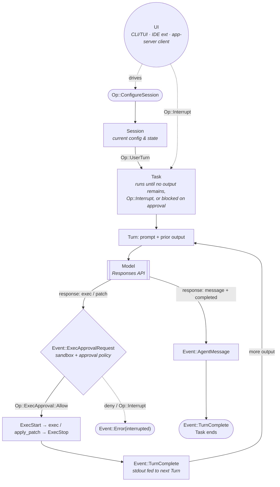

# Codex CLI — OpenAI

**Why this file exists.** [`../comparisons/systems/90-short-profiles.md`](../comparisons/systems/90-short-profiles.md)
§1 carried Codex CLI as a one-line `[V]` entry — *"Reads `AGENTS.md` + skills. Supported by gstack
`--host`, SageOx, Gas City FWP"* — first in the W4 queue because, per that PRD, *"two systems in the
corpus embed its app-server as a runtime."* [`../comparisons/04-harness-alignment.md`](../comparisons/04-harness-alignment.md)
already lists "Codex app-server" under the **Runtime** altitude in its §4.1 proposal, sight unseen;
this is the primary-source read that confirms it. Synthesis: this file's `●`/`◐`/`○` cells feed a new
Codex column in that document's §2, and in [`../comparisons/02-component-matrix.md`](../comparisons/02-component-matrix.md) §1.

**In one screen.** A Rust rewrite of an OpenAI-only coding agent (the npm package now just launches a
prebuilt binary) whose defining move is **splitting into an engine and a wire protocol** rather than
splitting into extensions the way Pi does. The core (`Codex`, `Session`, `Task`, `Turn`) talks to every
surface — CLI/TUI, the ChatGPT desktop app, an IDE extension, a TypeScript/Python SDK, MCP clients, and
other harnesses — through the same **app-server** JSON-RPC protocol, so "embed Codex" and "drive Codex
from the terminal" are the same integration. Its primitives: **AGENTS.md · Skill · Plugin · Subagent ·
Hook · MCP server · Permission profile · Execpolicy rule**. It refuses nothing by name the way Pi does,
but it is mid-migration on two fronts it says so about: `sandbox_mode` and the newer named
`[permissions.<profile>]` system coexist for the same job, and `codex mcp-server` is marked
**deprecated in favor of the app-server** while a separate in-tree doc still calls the same interface
"experimental." Its individual-memory pipeline is unusually strong for a coding runtime — an automatic,
git-baselined, two-phase consolidation that can rewrite the user's own `skills/` directory with **no
approval gate and no network**, which is the opposite default from the two peers in this corpus that
ship an explicit human review step on model-authored skills.

**What it does not claim.** §D. The load-bearing lines: `codex mcp-server` "is deprecated," websocket
transport on the app-server is "experimental and unsupported... Do not rely on it for production
workloads," `danger-full-access` "removes the filesystem and network boundaries," and repository-level
config "can't grant workspace, model, Platform API, or connected-system access" — the org, not the
repo, owns those.

---

Access date for every source: **2026-09-03**. Marks: ✅ direct (primary read) · ◐ relayed (secondary) ·
⚠️ unverified.

URL shorthands used below:
- `REPO` = https://github.com/openai/codex
- `RS` = https://github.com/openai/codex/blob/main/codex-rs
- `SDK` = https://github.com/openai/codex/blob/main/sdk
- `LEARN` = https://learn.chatgpt.com (the current docs host; `developers.openai.com/codex` 308-redirects here)

---

## A. Identity

| Field | Value | Mark / source |
|---|---|---|
| Canonical name | **Codex CLI** — binary `codex`; npm package `@openai/codex`; Rust workspace `codex-rs` | ✅ `REPO/blob/main/README.md`, `REPO/blob/main/codex-cli/package.json` |
| Prior names / homes | Same repo since creation; no redirect. **But "Codex" now names three OpenAI products that share nothing but the word**: this CLI/runtime, **Codex Web** (the hosted cloud agent at `chatgpt.com/codex`, a different product this same repo's README points to), and OpenAI's 2021 code-completion model of the same name (unrelated, retired API). Rule 8 applies: every claim below is about the CLI/runtime only. Language also changed under the name: the CLI launched as a TypeScript tool; `codex-cli/` is now only an npm launcher (`bin/codex.js`) for a prebuilt Rust binary — the implementation, not just the version, was replaced | ✅ `REPO/blob/main/README.md` ("Codex Web… go to chatgpt.com/codex"); ✅ `REPO/blob/main/codex-cli/package.json` (`"bin": {"codex": "bin/codex.js"}`, no source beyond `bin/`, `scripts/`) |
| Owner / maintainer | OpenAI | ✅ `gh api repos/openai/codex` |
| GitHub URL | https://github.com/openai/codex | ✅ |
| License | Apache-2.0 | ✅ `gh api repos/openai/codex` (`license.spdx_id: Apache-2.0`); `REPO/blob/main/LICENSE` |
| Stars | **121,310** stars, 18,591 forks (2026-09-03) | ✅ `gh api repos/openai/codex` |
| Language | Rust (`codex-rs/`, Bazel + Cargo) | ✅ `gh api repos/openai/codex` |
| Repo created | 2025-04-13 (GitHub `created_at`); first commit **2025-04-16** ("Initial commit", signed off by an OpenAI engineer) | ✅ `gh api repos/openai/codex`; ✅ `gh api repos/openai/codex/commits` (last page, sha `59a180d`) |
| First release | npm `0.1.2504161551`, published 2025-04-16 (same day as the initial commit) | ✅ `https://registry.npmjs.org/@openai/codex` |
| Latest release | **`rust-v0.153.2`**, 2026-09-03 (npm `dist-tags.latest` = `0.153.2`, matching) | ✅ `gh api repos/openai/codex/releases` (last page); npm registry |
| Install | `curl -fsSL https://chatgpt.com/codex/install.sh \| sh` (Mac/Linux) or the PowerShell equivalent (Windows), downloading from `releases.openai.com/codex` with a GitHub Releases fallback; or `npm install -g @openai/codex`; or `brew install --cask codex` | ✅ `REPO/blob/main/README.md` |
| Website / docs | https://developers.openai.com/codex (308-redirects to `https://learn.chatgpt.com/docs`); product page `https://openai.com/codex/`; Codex Web at `https://chatgpt.com/codex` | ✅ (redirect observed directly) |
| What it says it is (verbatim) | "**Codex CLI** is a coding agent from OpenAI that runs locally on your computer." | ✅ `REPO/blob/main/README.md`; identical wording in `codex-cli/package.json` `"description"` |

### Inclusion test

**1. Does state persist across sessions? Where, in what format?** — **Yes, on multiple tracks.**
- Every conversation is a **rollout**: JSONL history plus SQLite-backed metadata/search under
  `$CODEX_HOME` (default `~/.codex`), owned by the `codex-rollout` crate (compaction, search, session
  index) and exposed through a `ThreadStore` trait with local and in-memory implementations. ✅
  `RS/rollout/src/lib.rs` ("Rollout persistence and discovery for Codex session files"), `RS/thread-store/README.md`
- `AGENTS.md` / `AGENTS.override.md` and `config.toml` persist instructions and settings at global,
  project, system and managed scopes (row 3d). ✅
- A **two-phase memory pipeline** (row 5a) turns old rollouts into `~/.codex/memories/{raw_memories.md,
  rollout_summaries/, MEMORY.md, memory_summary.md, skills/}` under a git-baselined directory. ✅
  `RS/memories/README.md`
- Agent-to-agent structure persists too: `agent-graph-store` tracks parent/child **thread-spawn edges**
  (`Open`/`Closed`) across subagent delegation. ✅ `RS/agent-graph-store/src/types.rs`

**2. Does it serve more than one person? — Answered per layer (Rule 7).**
- **Local CLI, one operator.** Nothing in the CLI itself models a second user; sandboxing and approval
  apply to the local account that started `codex`. ✅ (checked `LEARN/codex/cli`, `LEARN/codex/sandboxing`)
- **ChatGPT Business/Enterprise/Edu workspace layer, yes.** Admins push `requirements.toml` "through a
  supported cloud, device, or system channel" and a `managed_config.toml`; named **permission
  profiles** are allowlisted per workspace (`allowed_permission_profiles`); feature keys
  (`computer_use`, `browser_use`, `browser_use_full_cdp_access`) can be disabled org-wide; a separate
  "Roles and workspace permissions" page is referenced (not read this pass — §F). ✅ `LEARN/codex/enterprise/admin-setup`

**3. Does it bind mechanically, or only by prose?** — **Mechanically, and more natively than most of
this corpus** — Codex drives the operating system's own sandbox on every platform rather than an
in-process approximation:
- macOS: Seatbelt (`sandbox-exec`); a `workspace-write` policy keeps `.git` and `.codex` read-only even
  inside writable roots. ✅ `RS/core/README.md`
- Linux: Landlock, falling back to bubblewrap (`bwrap`) — including a bundled `bwrap` binary if the
  system one is missing or too old — for policies Landlock can't express directly. ✅ `RS/core/README.md`
- Windows: an elevated sandbox backend and an unelevated restricted-token backend, each with a defined
  subset of split-filesystem policies they can enforce; anything neither can enforce directly "fail[s]
  closed instead of running with weaker enforcement." ✅ `RS/core/README.md`
- A separate local **network proxy** (HTTP + SOCKS5) enforces per-domain allow/deny lists and can MITM
  HTTPS for scoped header-stripping hooks; "Hosts must match the allowlist (unless denied)... If no
  domain entries are marked `allow`, the proxy blocks requests until an allowlist is configured." ✅
  `RS/network-proxy/README.md`
- A dedicated policy language, **execpolicy** (`prefix_rule(...)`, decisions `allow`/`prompt`/`forbidden`),
  classifies shell invocations before they run — "still in preview." ✅ `RS/execpolicy/README.md`
- Admin policy in `requirements.toml` is the hard floor: "Requirements.toml — Enforces restrictions that
  'local configuration cannot relax.'" ✅ `LEARN/docs/config-file/config-reference`

### Harness or process layer? — the loop question

**Altitude: Runtime.** Codex runs one prepared model loop itself — `Codex`/`Session`/`Task`/`Turn`,
talking to the OpenAI Responses API over a Submission-Queue/Event-Queue pair, documented in a design
doc in the tree (diagram below). ✅ `RS/docs/protocol_v1.md`

- **What it exposes for others to embed:** the **app-server** — JSON-RPC 2.0 over stdio (default),
  an experimental/unsupported websocket, or a Unix-socket-with-websocket-upgrade — with three
  "core primitives representing an interaction between a user and Codex: **Thread**... **Turn**...
  **Item**." The VS Code extension is the vendor's own worked example of an embedder. A TypeScript and
  a Python **SDK** wrap the same interface ("Use the SDK when you need to control Codex as part of your
  CI/CD pipeline… or integrate Codex within your own application"). ✅ `RS/app-server/README.md`;
  ✅ `LEARN/codex/app-server`; ✅ `LEARN/codex/codex-sdk`
- **What reads others' files, one-way:** `external-agent-migration` imports Claude Code (`hooks_cla.rs`,
  `source_cla.rs`) and Cursor (`hooks_cur.rs`, `source_cur.rs`) hooks, MCP config, memory files,
  subagents and model settings into Codex's own shapes — "Migration helpers for importing
  external-agent configuration into Codex." No adapter runs the reverse direction; Codex does not ship
  an ACP implementation (checked the `codex-rs` crate list — no `acp` crate) the way OpenClaw, Hermes,
  OpenCode and Grok Build each do. ✅ `RS/external-agent-migration/src/lib.rs` (module list, doc comment)
- **Who embeds Codex as a runtime, from outside:** per this corpus's own prior read, "Hermes hands
  `openai/*` turns to the Codex app-server" and OpenClaw's docs name an `agentRuntime` slot that can
  select Codex. ◐ (relayed from [`04-harness-alignment.md`](../comparisons/04-harness-alignment.md)
  §1.2, §4.1 — not re-verified against Hermes's or OpenClaw's own source this pass)
- Codex does not host other harnesses' loops itself; it has nothing resembling OpenClaw's `agentRuntime`
  selector or Gas City's `provider` field.

### Primitive set (see §C for definitions)

**AGENTS.md · Skill · Plugin · Subagent · Hook · MCP server · Permission profile · Execpolicy rule**

Supporting, harness-owned objects: `config.toml` / Settings, the rollout (session store), the memory
pipeline (automatic, not user-authored), Thread/Turn/Item (the app-server's own object model).

### Structured output

**The Thread** — the app-server's persisted, resumable, forkable conversation record (`Turn`s of
`Item`s: user messages, agent reasoning, agent messages, shell commands, file edits), written locally
as a rollout (JSONL + SQLite state) and addressed identically from the CLI, the app-server, the SDK,
and the (deprecated) MCP-server interface. One artifact, not a list. ✅ `RS/app-server/README.md`

---

## Diagram

`codex-rs/docs/protocol_v1.md` carries two mermaid sequence diagrams illustrating the `Session`/`Task`/
`Turn` loop. The one nearer this file's loop question — "Basic UI Flow," *"a single user input,
followed by a 2-turn task"* — is redrawn in house notation at
[`assets/projects/codex/basic-ui-flow.mmd`](../assets/projects/codex/basic-ui-flow.mmd). The second,
"Task Interrupt," is listed rather than redrawn — see §F.

---

## B. Component table (33 rows)

| # | Component | What it ships | Path / mechanism | Source (accessed 2026-09-03) | Mark |
|---|---|---|---|---|---|
| 0a | Substrate | OpenAI Responses API is the wire protocol for every provider, including custom ones: three reserved built-in provider IDs (`openai` default, `ollama`, `lmstudio`) that "cannot be overridden," plus `[model_providers.<id>]` for any endpoint that speaks Responses. Default model example in the docs is `gpt-5.6`; per-turn overrides (`model`, `model_reasoning_effort`, `model_verbosity`) are supported by the app-server and MCP-server call surfaces. Auth: ChatGPT sign-in (OAuth), API key, or an enterprise Codex access token; a separate `agent-identity` crate signs Ed25519/Curve25519 "AgentAssertion" headers for automated/containerized callers | `~/.codex/config.toml` `[model_providers.*]`; `codex login` / `codex login --with-api-key` / `--with-access-token` | ✅ `LEARN/docs/config-file/config-advanced`; ✅ `LEARN/codex/auth`; ✅ `RS/agent-identity/src/lib.rs`; ✅ `LEARN/docs/config-file/config-basic` (`model = "gpt-5.6"`) | ✅ |
| 1a | Environment | Local shell + filesystem under the sandbox backend for the host OS (row 2c); a local HTTP/SOCKS5 network proxy gates outbound traffic; `codex exec-server` spawns and controls subprocesses over a PTY, with a remote mode that registers with an "environment registry" over a Noise-relay websocket for containerized callers. Cloud/Codex-Web environments are separately containerized (row 6b) | `codex exec-server [--remote URL --environment-id ID]`; `permissions.<profile>.network` | ✅ `RS/exec-server/README.md`; ✅ `RS/network-proxy/README.md` | ✅ |
| 2a | Adapters & Middleware | MCP **client** (stdio and streamable-HTTP servers, `codex mcp add`, `[mcp_servers.<name>]`); the **app-server** (JSON-RPC 2.0, stdio/websocket/unix-socket, "Similar to MCP"); a TypeScript + Python **SDK** over the app-server; **connectors/Apps** — MCP servers that can return UI components (`io.modelcontextprotocol/ui` capability), distributed through a plugin marketplace. `codex mcp-server` (Codex *as* an MCP server) is explicitly superseded — see §D | `~/.codex/config.toml` `[mcp_servers.*]`; `codex app-server [--listen ...]`; `@openai/codex-sdk` / `openai-codex` | ✅ `LEARN/codex/extend/mcp`; ✅ `RS/app-server/README.md`; ✅ `LEARN/codex/codex-sdk`; ✅ `RS/connectors/src/lib.rs` | ✅ |
| 2b | Hooks | Eleven named lifecycle events — `SessionStart`/`SessionEnd`, `PreToolUse`/`PostToolUse`, `PermissionRequest`, `UserPromptSubmit`, `Stop`/`Interrupt`, `PreCompact`/`PostCompact`, `SubagentStart`/`SubagentStop` — configured in `hooks.json` or an inline `[hooks]` table, matched by regex "matcher groups," discovered from `~/.codex/`, project `.codex/`, and plugin bundles. External processes, any language (examples in Python). MCP-tool hooks fail open: "Errors, missing servers, and unavailable tools don't block the operation." Command hooks block via exit code `2` or `{"decision": "block"}`. Admins can force `allow_managed_hooks_only = true` in `requirements.toml`; "Non-managed hooks must be reviewed and trusted before they run" | `~/.codex/hooks.json`, `.codex/hooks.json`, `[hooks]` in `config.toml` | ✅ `LEARN/codex/hooks`; ✅ `REPO/blob/main/docs/config.md` | ✅ |
| 2c | Enforcement | `sandbox_mode` (`read-only` / `workspace-write` / `danger-full-access`) enforced by the native OS backend (row A, Q3) **and**, in parallel, a newer named `[permissions.<profile>]` system selected by `default_permissions`, with admin-side `allowed_permission_profiles` allowlisting which profiles a user may pick — **two configuration surfaces for the same job, coexisting** (the core README documents both as "still supported"), which is the accommodation smell Rule 4 names, here mid-migration rather than settled. `execpolicy`'s `prefix_rule` DSL classifies commands `allow`/`prompt`/`forbidden` independent of the sandbox. `requirements.toml` is the floor neither layer can relax | `sandbox_mode`, `[permissions.<name>]`, `default_permissions`; `execpolicy check --rules <file>` | ✅ `RS/core/README.md`; ✅ `RS/execpolicy/README.md`; ✅ `LEARN/codex/sandboxing`; ✅ `LEARN/codex/enterprise/admin-setup` | ✅ |
| 3a | Control | `approval_policy` (`untrusted` / `on-request` / `never`) gates each `ExecApprovalRequest`; a **Collaboration mode** primitive ships two built-in prompt templates, `plan.md` and `default.md` (`collaboration-mode-templates` crate), and the wire protocol streams a typed `EventMsg::PlanDelta` when the model emits a `<proposed_plan>` block — a first-class plan mode, not a bolt-on example. `guardian-context`'s synchronous review + async scoring backs an `auto_review.policy` config key | `approval_policy`; `collaborationMode/list` (app-server); `auto_review.policy` | ✅ `RS/collaboration-mode-templates/src/lib.rs`; ✅ `RS/docs/protocol_v1.md`; ✅ `RS/guardian-context/src/lib.rs`; ◐ `LEARN/docs/config-file/config-reference` (`auto_review.policy` listed, page not read for behavior) | ✅ |
| 3b | Routing | `agents.default_subagent_model` / `agents.default_subagent_reasoning_effort` route delegated subagent work to a model/effort distinct from the main turn's; per-call overrides (`model`, `sandbox`, `approval-policy`) are also accepted when Codex is driven as an MCP tool. No general "which job goes to which model" router beyond the subagent split was found | `[agents]` in `config.toml` | ✅ `LEARN/codex/agent-configuration/subagents` | ✅ |
| 3c | Composition | **Subagents**: standalone TOML files at `~/.codex/agents/` (personal) or `.codex/agents/` (project), each requiring `name`, `description`, `developer_instructions`, optionally `model`/`sandbox_mode`/`mcp_servers`/`skills.config`; three built-in roles ship by default — "default, worker, and explorer." `/agent` switches between active threads. `agent-roles` resolves named role config + spawn-time nickname candidates; `agent-graph-store` persists the parent/child thread-spawn graph (`Open`/`Closed` edges) so delegation is a queryable structure, not just files on disk | `~/.codex/agents/*.toml`, `.codex/agents/*.toml`; `agents.max_concurrent_threads_per_session` | ✅ `LEARN/codex/agent-configuration/subagents`; ✅ `RS/agent-roles/src/agent_role_config.rs`; ✅ `RS/agent-graph-store/src/types.rs` | ✅ |
| 3d | Configuration | `AGENTS.md` (alias `AGENTS.override.md`, always wins at its level): global `~/.codex/AGENTS.md`, then git-root-down project files, concatenated root→leaf, truncated at `project_doc_max_bytes` (32 KiB default), rebuilt every run. `config.toml` at four-plus scopes — user (`~/.codex/config.toml`), project (`.codex/config.toml`, only once the project is trusted, and unable to override "machine-local provider, auth, host-owned app request metadata, notification, configuration profile selection, or telemetry routing" keys), system (`/etc/codex/config.toml`), `managed_config.toml`, macOS MDM profiles, and `requirements.toml` as the top admin layer — echoing Grok Build's "three files, three authors" pattern from this corpus's prior read, with two more rungs | `~/.codex/AGENTS.md`, `AGENTS.override.md`; `~/.codex/config.toml`, `.codex/config.toml`, `/etc/codex/config.toml`, `managed_config.toml`, `requirements.toml` | ✅ `LEARN/codex/agent-configuration/agents-md`; ✅ `LEARN/docs/config-file/config-basic`, `config-advanced`, `config-reference`; ✅ `LEARN/codex/enterprise/managed-configuration` | ✅ |
| 3e | Standards | **Nothing here** as a "what good looks like" artifact — checked `README.md`, `AGENTS.md` (the repo's own, 322 lines — a concrete instance, not a standards *product*), `LEARN/codex/build-skills`, `LEARN/codex/build-plugins`, `LEARN/docs/config-file/config-reference`. Nearest: `execpolicy`'s optional `justification` field, "surfaced in different contexts (for example, in approval prompts or rejection messages)" — a reason attached to a rule, not a bar a change must clear | — | ✅ (absence) |
| 4a | Capability | **Skills**: `SKILL.md` + optional `scripts/`, `references/`, `assets/`, `agents/openai.yaml`; "Use agent skills to extend ChatGPT and Codex with task-specific capabilities. A skill packages instructions, resources, and optional scripts so either product can follow a workflow reliably," built on the open `agentskills.io` standard; five-tier discovery from repo `.agents/skills` up to bundled system skills. **Plugins**: "A plugin is an installable package that can include skills, an MCP server, or both," manifest `.codex-plugin/plugin.json`, distributed through a marketplace (OpenAI / workspace / personal tabs, GitHub marketplace sync). The repo dogfoods ten of its own project skills at `.codex/skills/` (`code-review`, `code-review-breaking-changes`, `codex-pr-body`, `babysit-pr`, …) | `.agents/skills/`, `~/.agents/skills/`, `/etc/codex/skills`; `.codex-plugin/plugin.json` | ✅ `LEARN/codex/build-skills`; ✅ `LEARN/codex/build-plugins`; ✅ `LEARN/codex/plugins`; ✅ `gh api repos/openai/codex/contents/.codex/skills` | ✅ |
| 4b | Capability Permissions | Per-MCP-server `enabled_tools`/`disabled_tools`/`default_tools_approval_mode` (`auto`/`prompt`/`writes`/`approve`); `apps.*` config for connector/app tool controls; `skills.config` context-token budgets and per-skill enable/disable; admin-side `allowed_permission_profiles` and per-feature-key gating (`computer_use`, `browser_use`, `browser_use_full_cdp_access`) that can zero out a capability workspace-wide | `[mcp_servers.<name>]` keys; `[apps]`; `[skills.config]`; `allowed_permission_profiles` | ✅ `LEARN/codex/extend/mcp`; ✅ `LEARN/docs/config-file/config-reference`; ✅ `LEARN/codex/enterprise/admin-setup` | ✅ |
| 5a | Individual Memory | An automatic, two-phase pipeline, triggered on a non-ephemeral root session when the memory feature is enabled: **Phase 1** claims eligible rollouts, sends each to a model for a structured `raw_memory`/`rollout_summary`, redacts secrets, stores results in the state DB, with lease/retry backoff so failures don't hot-loop. **Phase 2** (single global lock) consolidates the top-N stage-1 outputs into `~/.codex/memories/{raw_memories.md, rollout_summaries/, MEMORY.md, memory_summary.md, skills/}` under a **git-baselined** directory, then spawns an internal consolidation sub-agent that runs "with no approvals, no network, and local write access only," with collaboration/delegation disabled to prevent recursion, and resets the git baseline after it succeeds. Read-side injection is a separate crate (`codex-memories-read`) | `~/.codex/memories/` (git repo); `codex-memories-read`, `codex-memories-write` crates | ✅ `RS/memories/README.md` (full pipeline, direct read) | ✅ |
| 5b | Team Memory | **Nothing here** as a shared/team memory object — checked `RS/memories/README.md` (keyed to one machine's state DB, no sync described), `LEARN/codex/enterprise/admin-setup`, `LEARN/codex/enterprise/skills`. Project-scoped `AGENTS.md` and repo-checked-in skills/plugins are shared *configuration*, not memory | — | ✅ (absence) |
| 5c | Knowledge | `web_search` config (`disabled` / `cached` / `indexed` / `live`) is retrieval, not a curated/cited store; the rollout crate's `search.rs` provides SQLite full-text search over the operator's own past sessions — similar in shape to Pi's optional SQLite session backend, but over Codex's own history only. No RAG/embeddings/wiki feature found | `web_search` in `config.toml`; `RS/rollout/src/search.rs` | ✅ `LEARN/docs/config-file/config-reference`; ✅ `RS/rollout` directory listing | ✅ |
| 6a | Product | **Nothing here** — checked `README.md`, `AGENTS.md`, `LEARN/codex/cli`. No PRD/spec object; the closest is a **cloud task** (row 7a), which is a work unit, not a deliverable boundary | — | ✅ (absence) |
| 6b | Infrastructure | Local process under the native sandbox (2c). Cloud/Codex-Web environments run agents in a per-task **container**, checked out at a branch or commit SHA from a "universal image with pre-installed languages and tools"; "Agent internet access is off by default"; all outbound traffic passes an HTTP/HTTPS proxy; container state is cached "for up to 12 hours." Separately, a `code-mode` crate wires a remote gRPC "code-mode-host" session for out-of-process code execution, and `exec-server`'s remote mode registers with an environment registry over a Noise-relay websocket for containerized callers | — | ✅ `LEARN/codex/environments/cloud-environment`; ✅ `RS/code-mode/src/lib.rs`; ✅ `RS/exec-server/README.md` | ✅ |
| 6c | Estate | Git worktrees are supported at the product layer (ChatGPT desktop app; the repo's own `.codex/environments/` directory is a worked local example) — "The repository, worktree, and commands remain on the computer or remote development environment that contains the project." No cross-repo estate inventory or impact-analysis object was found in the CLI itself | `.codex/environments/` | ✅ `LEARN/codex/environments/git-worktrees` (thin); ✅ `gh api repos/openai/codex/contents/.codex` | ✅ |
| 6d | Delivery | `codex exec` is named as the non-interactive/CI entry point ("Compose with scripts and CI"), though the dedicated `docs/exec.md` page 404s both in-repo and on the docs site as of this read (§F). The repo's own dogfood skills (`codex-pr-body`, `babysit-pr`, four `code-review-*` skills) are worked examples of PR-flow automation built *on* Skills, not a shipped delivery primitive comparable to OpenCode's GitHub Action | `.codex/skills/{codex-pr-body,babysit-pr,code-review*}` | ✅ `LEARN/codex/cli`; ✅ `gh api repos/openai/codex/contents/.codex/skills`; ⚠️ `docs/exec.md`, `LEARN/codex/exec` both 404 | ✅ |
| 7a | Workflow Tasks | A **cloud task** object exists at the product layer (`codex-cloud-tasks` crate: `new_task.rs`, `scrollable_diff.rs` — task creation with a diff-review UI). Nothing comparable was found as a local CLI primitive; the plan-mode `PlanDelta` stream is text, not a persisted task object | `RS/cloud-tasks/src/*` | ✅ (crate/file listing; contents not read beyond names) | ◐ |
| 8a | Evals | `guardian-context`'s "synchronous Guardian review and asynchronous scoring" backs `auto_review.policy`; no public docs page describing its user-facing behavior was found (checked `LEARN/codex/cli`, `LEARN/codex/enterprise/admin-setup`). This is a review/gate mechanism, not a benchmark harness comparable to Pi's `vitest-evals` baseline/candidate lift | `[auto_review]` in `config.toml`; `RS/guardian-context/` | ✅ `RS/guardian-context/src/lib.rs` (doc comment); ⚠️ no user-facing docs page found | ◐ |
| 8b | Evidence | The rollout (JSONL + SQLite state DB) is the receipt, keyed by `ThreadId`/`RolloutId`, with compaction, search and a `ThreadStore` write boundary that separates raw history appends from metadata mutation. `agent-identity` additionally signs Ed25519/Curve25519 "AgentAssertion" headers when a containerized caller registers an agent task — a cryptographic per-agent identity layer not seen elsewhere in this corpus's reads | `RS/rollout/`, `RS/thread-store/README.md`, `RS/agent-identity/src/lib.rs` | ✅ (all three, direct file reads) | ✅ |
| 8c | Observability | `codex-otel`: OTLP HTTP/gRPC trace, log and metric exporters, an in-memory exporter for tests, a `SessionTelemetry` API for "session-scoped business event emission," W3C tracestate propagation, and a `Statsig` exporter shorthand. `analytics.enabled` is a separate opt-in config key. App-server tracing can emit JSON to stderr via `LOG_FORMAT=json` | `RS/otel/README.md` (code examples); `analytics.enabled` | ✅ `RS/otel/README.md`; ✅ `RS/app-server/README.md` | ✅ |
| 8d | Efficiency | `model_reasoning_effort` / `model_verbosity` are the only cost/quality knobs found; `Event::TurnComplete` carries token usage per turn. No spend cap or dollar-denominated budget was found — checked `LEARN/docs/config-file/config-reference`'s full key list and `LEARN/codex/enterprise/admin-setup` (which gates *features*, not spend) | `model_reasoning_effort`, `model_verbosity` | ✅ `RS/docs/protocol_v1.md` (`TurnComplete` carries usage); ✅ `LEARN/docs/config-file/config-reference` | ◐ |
| 9a | Learning | The memory Phase 2 agent is explicitly allowed to update "`MEMORY.md`, `memory_summary.md`, and `skills/`" as part of consolidation, running with **no approvals, no network, local write only** — the harness's own words describe an autonomous write to the user's skill directory with no stated human review step. That is the opposite default from this corpus's two prior peers with a review gate on model-authored skills (Hermes's `skills.write_approval` + Curator; OpenClaw's Skill Workshop + `skill_proposal_evaluate`) — worth flagging rather than assuming parity | `RS/memories/README.md` §Phase 2 | ✅ (direct read; the absence of a review-gate mention is a checked absence, not an inference from silence about an unrelated topic) | ◐ |
| 9b | Rituals | **Nothing here** — checked `LEARN/codex/hooks`' full event list (no "review"/"retro" event), `LEARN/codex/build-skills`, `AGENTS.md`. The repo's own dogfood skills (`code-review-*`, `babysit-pr`) are the nearest thing: a ritual encoded as a skill an operator chooses to run, not a harness-level object | — | ✅ (absence) |
| 9c | Cadence | **Nothing here** in the CLI itself — checked the hooks event list, `LEARN/docs/config-file/config-reference`'s key list, `LEARN/codex/agent-configuration/subagents`. No cron/schedule primitive found; whether Codex Web's cloud tasks support scheduling was not confirmed this pass | — | ⚠️ (absence checked in the CLI; cloud-product scheduling unconfirmed) |
| 9d | Anti-fragile Lifecycle | No single named "lifecycle" object, but real recovery machinery: memory Phase-1 jobs are "leased/claimed... before processing" with "retry backoff... instead of hot-looping"; `PreCompact`/`PostCompact` hooks bracket rollout compaction (`RS/rollout/src/compression.rs`); a `Turn`'s `response_id` bookmark lets a task resume after `Op::Interrupt`; `exec-server`'s forward mode lets "the existing harness reconnect flow... resume a retained destination session" | `RS/memories/README.md`; `RS/rollout/src/compression.rs`; `RS/docs/protocol_v1.md`; `RS/exec-server/README.md` | ✅ (all four, direct reads) | ◐ |
| 9e | Raise the Floor | The managed-config layer's stated behavior when a value conflicts with an enforced rule — falling back to "a compatible value" rather than erroring — is the nearest vendor-side floor-raising mechanism found; no `codex doctor`/onboarding-wizard command was found in the surfaces read | `requirements.toml` conflict resolution | ✅ `LEARN/codex/enterprise/managed-configuration`; checked `LEARN/codex/cli`, install docs for a doctor-equivalent — none found | ◐ |
| 9f | Diagnose the Bottleneck | **Nothing here** — checked `RS/otel/README.md`, `LEARN/codex/enterprise/admin-setup`, `LEARN/codex/cli`. No self-scorecard comparable to OpenClaw's | — | ✅ (absence) |
| 10a | Roster | `agent-roles` resolves named role configuration (description, nickname candidates) for spawned subagents; three built-in roles ship — "default, worker, and explorer"; `agent-identity` gives each spawned agent a signed, verifiable identity. No single user-facing "roster" doc page was found describing the two together as one object | `RS/agent-roles/`, `RS/agent-identity/` | ✅ (both crates, direct reads); ⚠️ no roster-framed docs page found | ◐ |
| 10b | Org | A "Roles and workspace permissions" page is referenced from `LEARN/codex/enterprise/skills` but was not itself read this pass (§F). What was read: `managed_config.toml` (fleet) sits over user `config.toml`, with `requirements.toml` pins neither can override — the same "who writes which configuration file" shape this corpus found in Grok Build, one file short of its three-author split (no separate signed-pin file distinct from `requirements.toml` was found) | `requirements.toml`, `managed_config.toml` | ✅ `LEARN/codex/enterprise/admin-setup`, `LEARN/codex/enterprise/managed-configuration`; ⚠️ roles-and-workspace-permissions page not read | ◐ |
| 11a | Surfaces | CLI/TUI (terminal); an **app-server** for arbitrary product embedding (VS Code extension is the named example; Cursor and Windsurf via the same extension; Xcode has a native integration; JetBrains ships its own AI Assistant integration with Codex support); the ChatGPT desktop app's integrated terminal ("scoped to its current project or worktree," reads live terminal output) and local environments; **Codex Web** at `chatgpt.com/codex`; a TypeScript/Python SDK; MCP (client always, server deprecated). One of the widest surface counts read in this corpus's harness rows | — | ✅ `LEARN/codex/ide`; ✅ `LEARN/codex/integrated-terminal`; ✅ `LEARN/codex/environments/local-environment`; ✅ `REPO/blob/main/README.md` (Codex Web pointer) | ✅ |

---

## C. Primitive set (name · path · project's own definition)

| Primitive | Path / key | Project's definition (verbatim) | Source |
|---|---|---|---|
| **AGENTS.md** (alias: `AGENTS.override.md`, always wins at its level) | `~/.codex/AGENTS.md`; `AGENTS.md`/`AGENTS.override.md` from git root down to cwd | "Codex reads `AGENTS.md` files before doing any work. By layering global guidance with project-specific overrides, you can start each task with consistent expectations, no matter which repository you open." | ✅ `LEARN/codex/agent-configuration/agents-md` |
| **Skill** | `SKILL.md` + optional `scripts/`, `references/`, `assets/`, `agents/openai.yaml`; five-tier discovery, `.agents/skills` up to bundled | "Use agent skills to extend ChatGPT and Codex with task-specific capabilities. A skill packages instructions, resources, and optional scripts so either product can follow a workflow reliably." | ✅ `LEARN/codex/build-skills` |
| **Plugin** (bundles: skills, MCP server) | `.codex-plugin/plugin.json` | "A plugin is an installable package that can include skills, an MCP server, or both." | ✅ `LEARN/codex/build-plugins` |
| **Subagent** | `~/.codex/agents/*.toml` (personal), `.codex/agents/*.toml` (project); required keys `name`, `description`, `developer_instructions` | "you can additionally define custom agents with different model configurations and instructions for different tasks" — distinct from the built-in "default, worker, and explorer" roles | ✅ `LEARN/codex/agent-configuration/subagents` |
| **Hook** | `hooks.json`, `.codex/hooks.json`, inline `[hooks]` in `config.toml` | "Hooks are an extensibility framework for Codex... enabling features such as: Send the chat to a custom logging/analytics engine" | ✅ `LEARN/codex/hooks` |
| **MCP server** (client-side config) | `[mcp_servers.<name>]` in `config.toml`; `codex mcp add` | a stdio or streamable-HTTP server definition — "command that starts the server" / "Server address" — that the model can call as a tool | ✅ `LEARN/codex/extend/mcp` |
| **Permission profile** | `[permissions.<name>]`; selected via `default_permissions`; admin `allowed_permission_profiles` | a named bundle of filesystem/network rules ("`[permissions.workspace.network]`... Hosts must match the allowlist (unless denied)") selected by name rather than a single global mode | ✅ `RS/network-proxy/README.md` |
| **Execpolicy rule** | `prefix_rule(pattern=[...], decision?, justification?, match?, not_match?)` in a `.rules` file | "Policy engine and CLI built around `prefix_rule(...)` plus `host_executable(...)`... `decision` defaults to `allow`; valid values: `allow`, `prompt`, `forbidden`." | ✅ `RS/execpolicy/README.md` |
| (supporting) **config.toml / Settings** | `~/.codex/config.toml`, `.codex/config.toml`, `/etc/codex/config.toml`, `managed_config.toml`, `requirements.toml` | the layered settings surface every other primitive is configured through; harness-owned per Rule 4, not itself authored as "the single sanctioned way to express" one thing | ✅ `LEARN/docs/config-file/config-reference` |
| (supporting) **Rollout** (session store) | `$CODEX_HOME` (default `~/.codex`), JSONL + SQLite | "Rollout persistence and discovery for Codex session files." | ✅ `RS/rollout/src/lib.rs` |
| (supporting) **Memory pipeline** | `~/.codex/memories/` (git-baselined) | automatic two-phase consolidation (§B, row 5a); not user-authored, so not a primitive under Rule 4 despite being a first-class shipped capability | ✅ `RS/memories/README.md` |
| (supporting) **Thread / Turn / Item** | app-server object model | "Thread: A conversation between a user and the Codex agent... Turn: One turn of the conversation... Item: Represents user inputs and agent outputs as part of the turn" | ✅ `RS/app-server/README.md` |

**Count:** 8 primitives, 4 supporting. **Verdict: ⚠️ contestable, nearer 5–7 healthy than 12+
accommodation failure — but not settled.** OpenAI publishes no list of "these are Codex's primitives"
the way Pi publishes a refusal list or OpenClaw types its hook tiers; this count is built from eight
independently-documented, singly-named authoring surfaces, and a defensible reader could argue it down
to six (folding Execpolicy rule into Permission profile as one enforcement primitive) or up to nine
(splitting stdio vs. streamable-HTTP MCP servers). Two pieces of primary evidence say this harness is
mid-consolidation rather than finished: `sandbox_mode` and `[permissions.<profile>]` coexist for the
same job (row 2c), and `codex mcp-server` is deprecated in favor of the app-server while an in-tree doc
for the same interface still calls it "experimental" (§D) — a primitive being retired and its
replacement not yet fully landed in the same release.

---

## D. Stated limitations / "what it does not claim" (quoted)

From `LEARN/codex/mcp-server` (✅):
> "`codex mcp-server` is deprecated. Use the Codex app server instead."

From `codex-rs/docs/codex_mcp_interface.md` (✅, direct file read — the same interface, a different
document, dated differently):
> "This document describes Codex's experimental MCP server interface... Status: experimental and
> subject to change without notice."

From `RS/app-server/README.md` (✅):
> "Websocket transport is currently experimental and unsupported. Do not rely on it for production
> workloads."

From `LEARN/codex/sandboxing` (✅):
> "read-only: The agent can inspect files, but it can't edit files or run commands without approval."
> "workspace-write: The agent can read files, edit within the workspace, and run routine local commands
> inside that boundary."
> "danger-full-access: The agent runs without sandbox restrictions. This removes the filesystem and
> network boundaries and should be used only when you want the agent to act with full access."

From `LEARN/codex/enterprise/admin-setup` (✅):
> "Repository configuration can supply defaults and reusable workflows. It can't grant workspace,
> model, Platform API, or connected-system access."

From `LEARN/codex/hooks` (✅):
> "Non-managed hooks must be reviewed and trusted before they run."
> "Errors, missing servers, and unavailable tools don't block the operation." (MCP-tool hooks fail open)

From `LEARN/codex/environments/local-environment` (✅):
> "Local environments are available only in Codex in the ChatGPT desktop app."

From `RS/execpolicy/README.md` (✅):
> "Note: `execpolicy` commands are still in preview. The API may have breaking changes in the future."

From `RS/memories/README.md` (✅ — a limitation by omission, not a quoted disclaimer): the Phase 2
consolidation agent runs "with no approvals, no network, and local write access only" — a statement of
what constrains the agent's *own* actions, not a statement bounding what the pipeline is allowed to
change (`MEMORY.md`, `memory_summary.md`, `skills/`).

---

## E. Sources (all accessed 2026-09-03)

**Primary — GitHub API / repo:**
- `gh api repos/openai/codex` (metadata: license, stars, forks, language, `created_at`, `pushed_at`)
- `gh api repos/openai/codex/releases` (paged to the last page: oldest release `codex-rs-...-rust-v0.0.2504301219`, 2025-04-30); `gh api repos/openai/codex/git/refs/tags/rust-v0.153.2` (commit `79016fc`)
- `gh api repos/openai/codex/commits` (paged to the last page: first commit `59a180d`, 2025-04-16, "Initial commit")
- `gh api repos/openai/codex/contents/{README.md,AGENTS.md,LICENSE,docs,codex-rs,codex-cli,sdk,.codex,.codex/skills}`
- `REPO/blob/main/README.md`, `REPO/blob/main/AGENTS.md`, `REPO/blob/main/codex-cli/package.json`
- `REPO/blob/main/docs/{agents_md,authentication,config,sandbox}.md` (stub files that redirect to `LEARN`)
- `RS/docs/protocol_v1.md` (diagram source), `RS/docs/codex_mcp_interface.md`
- `RS/{execpolicy,memories,otel,core,thread-store,thread-manager-sample,network-proxy,exec-server,app-server}/README.md`
- `RS/external-agent-migration/src/lib.rs` (+ `src/` directory listing)
- `RS/{agent-roles/src/agent_role_config.rs, agent-identity/src/lib.rs, code-mode/src/lib.rs, guardian-context/src/lib.rs, connectors/src/lib.rs, collaboration-mode-templates/src/lib.rs, agent-graph-store/src/types.rs, rollout/src/lib.rs, rollout/src/rollout_file_name.rs, rollout/src/config.rs}`
- `https://registry.npmjs.org/@openai/codex` (first/latest version, publish dates)

**Primary — vendor docs (via WebFetch, directed at the vendor's own URL; quoted fragments reproduced
verbatim from the fetch, unquoted summary text is this profile's own paraphrase):**
- `LEARN/codex/{cli,security-administration,sandboxing,hooks,app-server,mcp-server,auth,codex-sdk,ide,integrated-terminal,plugins}`
- `LEARN/codex/agent-configuration/{agents-md,subagents}`
- `LEARN/codex/{build-skills,build-plugins,extend/mcp}`
- `LEARN/codex/environments/{local-environment,cloud-environment,git-worktrees}`
- `LEARN/codex/enterprise/{admin-setup,managed-configuration,skills}`
- `LEARN/docs/config-file/{config-basic,config-advanced,config-reference}`
- `https://developers.openai.com/codex` (308 redirect, observed directly) → `LEARN/docs`

**Secondary (◐, used only for orientation, nothing named rests solely on them):**
- WebSearch snippets: morphllm.com and codex.danielvaughan.com (custom-provider config walkthroughs,
  used only to confirm which docs URLs to fetch directly — the config claims above are all re-verified
  against `LEARN/docs/config-file/*`); dev.to `claude2codex`, bit.fan, htx.com, softwaredmind Medium
  post, pasqualepillitteri.it (all migration-tooling commentary — the migration *mechanism* claims
  above rest on `RS/external-agent-migration/src/lib.rs`, read directly, not on these); deepwiki.com's
  architecture-overview page (surfaced by WebSearch, not opened).

---

## F. Things I could NOT verify

- **The exact rollout/session directory name under `$CODEX_HOME`.** `RS/rollout/src/config.rs` confirms
  `codex_home` as the root and `RS/rollout/src/rollout_file_name.rs` confirms the filename shape
  (timestamp + `ThreadId` + `RolloutId`), but no file I read states the subdirectory literally
  (commonly cited elsewhere as `~/.codex/sessions/`, not confirmed at a primary source this pass). ⚠️
- **"Roles and workspace permissions"** (`LEARN/codex/enterprise/roles-and-workspace-permissions`,
  referenced from `LEARN/codex/enterprise/skills`) was not itself fetched — row 10b's org answer rests
  on the admin-setup and managed-configuration pages only. ◐
- **`docs/exec.md` / `codex exec`'s full flag surface** — both the in-repo stub and
  `LEARN/codex/exec` returned 404 this pass; row 6d's CI-entrypoint claim rests on one line from
  `LEARN/codex/cli`'s overview ("Compose with scripts and CI"), not a dedicated page. ⚠️
- **`docs/slash_commands.md`** similarly 404s in-repo and at `LEARN/codex/slash-commands`; the built-in
  slash-command list (beyond `/agent`, mentioned incidentally) was not enumerated. ⚠️
- **Whether Codex Web's cloud tasks support scheduled/cron execution** (row 9c) — the `cloud-tasks`
  crate's file names (`new_task.rs`, `env_detect.rs`) were read as a listing only; contents were not
  opened. ⚠️
- **Whether Hermes and OpenClaw in fact embed the Codex app-server as described** — reused from this
  corpus's own prior read (`04-harness-alignment.md` §1.2, §4.1) rather than re-verified against
  Hermes's or OpenClaw's source this pass. ◐
- **`guardian-context`'s user-facing behavior** (row 8a) — the crate's doc comment confirms the
  mechanism exists and `auto_review.policy` is a real config key, but no docs page describing what a
  user sees when Guardian review fires was found. ◐
- **WebFetch-mediated quotes carry residual paraphrase risk.** Every `LEARN/*` citation in this profile
  was read by directing a fetch at the vendor's own URL and receiving back a processed summary, not raw
  HTML I viewed myself; material reproduced here in quotation marks was returned already quoted by that
  process, but I cannot rule out minor wording drift the way a direct-HTML read would. Marked ✅
  throughout per this corpus's existing convention (`content/pi.md`'s `pi.dev/packages "via WebFetch"`
  citation), flagged here rather than silently assumed exact.
- **The second protocol diagram, "Task Interrupt"** (`RS/docs/protocol_v1.md`, same file as the redrawn
  diagram) — listed, not redrawn, per the diagram rule's instruction for multiple diagrams in one
  document.
