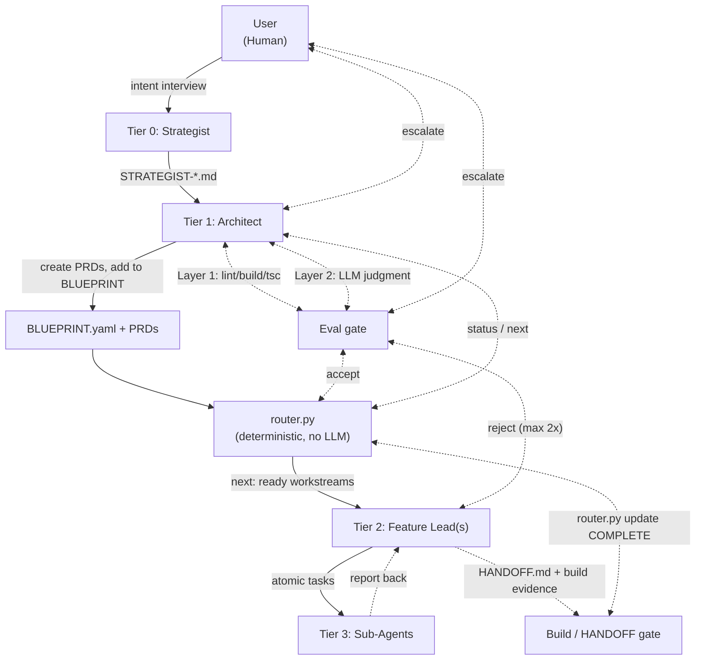

# FRACTAL — KD (`shi503`), three instances

**Why this file exists.** Fourth in the W4 queue
([`fractal/workstreams/W4-teardowns.md`](../fractal/workstreams/W4-teardowns.md)), and the second
KD-built peer after LoomWarp — same template, no special status, per the PRD's explicit instruction.
FRACTAL is unusual among everything else in this queue: it is not one system but **three**, and the
third is the process this very repo is running to produce this file. Synthesis: this file's cells feed
the FRACTAL column already open in
[`comparisons/02-component-matrix.md`](../comparisons/02-component-matrix.md) §1 (corrected, not
replaced), a new FRACTAL column in
[`comparisons/04-harness-alignment.md`](../comparisons/04-harness-alignment.md) §2, and a row in
[`comparisons/systems/90-short-profiles.md`](../comparisons/systems/90-short-profiles.md) §1.

**In one screen.** Upstream FRACTAL is a four-tier, single-repo process layer: a Strategist interview
seeds intent, an Architect decomposes it into a **BLUEPRINT** (a YAML dependency graph) and one
**workstream PRD** per unit of work, Feature Leads execute workstreams and end each one in a
**HANDOFF.md** whose claims are pasted build/test output, and a **PULSE** heartbeat lets a
model-free `router.py` catch escalations without spending a token. Five vendor-named artifacts —
STRATEGIST doc, BLUEPRINT, workstream PRD, HANDOFF, PULSE — sit in the 5–7 healthy range, though the
vendor never states them as a set; `router.py` itself is infrastructure, not a primitive. It ships no
adapter for its own protocol (single-repo, Claude Code first-class, Cursor "community-supported" via a
translation guide) and refuses nothing on the record. Two younger instances change what "FRACTAL" means
in practice: **generic-cerebro**, a fork that ran the same design across 27+ blueprints and independently
discovered the flat-state-file defect this profile's §D documents; and **this repo**, which runs FRACTAL's
document conventions with `router.py` deleted outright — the one piece of the design that was ever
mechanical.

**What it does not claim.** §D. The load-bearing lines: *"Skip it for: single-file fixes, small
features, tasks under ~2 hours"*; the Known Gotchas' own admission that `.state.json` is a flat map a
second `init` silently wipes; and, from this repo's own `CLAUDE.md`, the plainest of the three: *"no
router, no blueprint YAML, no state file."*

---

Access date for every source: **2026-09-03**. Marks: ✅ direct (primary read) · ◐ relayed
(secondary) · ⚠️ unverified.

URL shorthands used below:
- `U` = upstream, `https://github.com/shi503/fractal-agent-system` (public, MIT), read via local
  clone at `/Users/kevindeng/Googlyeye-Monsters/fractal-agent-system`, **pinned at
  `6398f6db059598e381336601b21609928cf24034`** (2026-04-20 — the commit LoomWarp's own `vendor/manifest.json`
  names) for every `§B`/`§C` mark. `U-HEAD` = the same repo at `60393054` (2026-09-03), read only to
  measure drift — never a source for a mark below.
- `C` = the fork, `generic-cerebro`, local clone at
  `/Users/kevindeng/Googlyeye-Monsters/generic-cerebro`, pinned at `2cd56e7`
- `R` = this repo, `harness-atlas`, the un-routed instance — `fractal/`, `.claude/agents/*.md`,
  `CLAUDE.md` § Workstreams, working tree at the commit this HANDOFF is written against
- `SECONDARY` = `comparisons/systems/kd-built-frameworks/02-generic-cerebro.md` and
  `03-fractal-as-iterated.md` in this repo, and
  `projects/loomwarp/references/comparisons/systems/fractal.md` in the LoomWarp repo — all ◐
  throughout, per rule 5's hazard clause: these already speak this atlas's own vocabulary back at it,
  so every claim in them is reverified against `U`/`C`/`R` before being marked ✅, never taken on their
  word alone

---

## A. Identity

*Fields below describe **upstream (`U`)**, the canonical named subject; `C` and `R` are downstream
instances and are given their own identity notes beneath the table, per rule 8.*

| Field | Value | Mark / Source |
|---|---|---|
| Canonical name | **FRACTAL** — Fractal, Recursive, Agentic, Context-aware, Task-driven, Autonomous, Layered. No binary; a `.claude/` directory tree distributed as a Claude Code plugin (at `U-HEAD`) or copied by hand (`cp -r example-claude .claude`, at the pinned commit) | ✅ `U/README.md`; ✅ `gh api repos/shi503/fractal-agent-system` `.description` |
| Prior names / homes | Not a rename. It is the substrate two KD-built systems iterate: LoomWarp vendors `router.py` byte-identical (`vendor/manifest.json`, per `content/loomwarp.md` §A); `generic-cerebro` forked the same design independently (its own `ISSUES.md`: *"Framework initialized 2026-04-14"*, six days before the commit LoomWarp vendored) | ✅ `content/loomwarp.md` §A (re-verified, not re-quoted); ✅ `C/.claude/FRACTAL/ISSUES.md` header |
| Owner / maintainer | GitHub user **`shi503`** (KD). 47 commits total at `U-HEAD`; contributors at access date: `shi503` (20), `cursoragent` (1, a Cursor background-agent commit), `dependabot[bot]` (1) | ✅ `gh api repos/shi503/fractal-agent-system/contributors` |
| GitHub URL | `https://github.com/shi503/fractal-agent-system` — **public** at access date (repo `created_at` 2026-03-05; `visibility: public`) | ✅ `gh api repos/shi503/fractal-agent-system` |
| License | **MIT**, present already at the pinned commit (`LICENSE`, copyright "FRACTAL Multi-Agent System contributors") | ✅ `U/LICENSE` at `6398f6db`; ✅ `gh api` `.license.spdx_id` = `MIT` |
| Stars | **3** stars, 1 fork, at access date (`stargazers_count: 3`) | ✅ `gh api repos/shi503/fractal-agent-system` |
| Language | GitHub linguist: **Python** (37,155 bytes) over TypeScript (12,344), CSS (4,370), JS (631) — the router and skills outweigh the TaskFlow demo app's frontend | ✅ `gh api repos/shi503/fractal-agent-system/languages` |
| Repo created | 2026-03-05 (`created_at`); first commit `2026-03-05T02:25:25-08:00` | ✅ `gh api`; ✅ `git log --reverse` |
| First release | **None.** `gh api .../releases` and `.../tags` both return `[]`; `git ls-remote --tags origin` is empty too, despite a **local-only** `v2.0.0-rc1` tag in the clone that was never pushed | ✅ `gh api repos/shi503/fractal-agent-system/{releases,tags}` (both `[]`); ✅ `git ls-remote --tags origin` (empty); ✅ `git tag` (local: `v2.0.0-rc1`, unpushed) |
| Latest release | None. HEAD at access date is `60393054`, pushed `2026-09-03T20:26:08Z` — **29 commits past the pinned commit**, `+32,875/-3,853` lines across 303 files. The pinned commit itself sat dormant from 2026-04-20 to roughly 2026-08-04 (the date LoomWarp's own teardown verified "zero tags, zero releases"), then resumed | ✅ `git rev-list --count 6398f6db..HEAD` = 29; ✅ `git diff --stat 6398f6db HEAD` |
| Install | At the pinned commit: `git clone` + `cp -r ./example-claude ./.claude`, manual, no package manager. At `U-HEAD` (not the pinned source for any other row): `/plugin marketplace add .` + `/plugin install fractal-core@fractal-marketplace` — a materially different, plugin-based install path introduced sometime in the 29-commit drift window | ✅ `U/README.md` at `6398f6db`; ◐ `U-HEAD/README.md` (drift note only, per the frontmatter's scope) |
| Website / docs | None. `README.md`, `The FRACTAL Multi-Agent System.md`, and a `docs/` folder (STRATEGIST/ARCHITECT/BLUEPRINT/PRD/FEATURELEAD/PULSE/HANDOFF reference docs, evaluation framework doc) — no rendered site, no glossary file found | ✅ `find docs/ -type f` at `6398f6db` |
| What it says it is (verbatim) | GitHub description: **"FRACTAL (Fractal, Recursive, Agentic, Context-aware, Task-driven, Autonomous, Layered) is a hierarchical framework for orchestrating teams of AI agents on complex software development tasks. It addresses context drift, serialization of parallel work, and cost inefficiency in long-running agentic sessions."** | ✅ `gh api repos/shi503/fractal-agent-system` `.description` |

**`C` (generic-cerebro) identity, brief.** A private, no-history working-copy mirror (two git commits;
1,445 markdown files) — KD's own production run of the design across a real multi-repo team surface.
No separate GitHub identity fields apply (it is a local clone, not independently published). Pinned at
`2cd56e7` for this profile. — ✅ `git rev-parse HEAD`; ✅ `git log -1`.

**`R` (this repo, harness-atlas) identity, brief.** No separate distribution — FRACTAL's document
conventions run *inside* this repo's own workstream process, un-routed. `.claude/agents/architect.md`
and `.claude/agents/feature-lead.md` are line-for-line descendants of `U`'s TaskFlow-flavored agent
files (same section order, same "Delegation Threshold," same router-command-restriction language),
with one banner note prepended and the CLAUDE.md-level fact that no `router.py`, `BLUEPRINT`, or
`.state.json` exists anywhere in the tree — verified this pass (`find . -iname "router.py" -o -iname
"BLUEPRINT*.yaml" -o -iname "*.state.json"` — zero hits, excluding `node_modules`). — ✅ direct.

### Inclusion test

**1. Does state persist across sessions? Where, in what format?**
**`U`:** Yes, in three uncoordinated places, none the others' source of truth: `.state.json`
(gitignored per the README's own "Known Gotchas," a flat `{workstream: status}` map with **no
dependency edges** — those live only in the BLUEPRINT); `HANDOFF.md`/`PULSE.md` markdown files per
workstream; and the STRATEGIST doc plus its localized `FRACTALSYSTEM-{project}.md` twin. — ✅
`U/README.md` "Known Gotchas" #4; ✅ `U/.claude/fractal/router.py` (`STATE_PATH`, `save_state`).
**`C`:** The same shape, at scale — `.claude/FRACTAL/.state.json`, 32 blueprints, 156 workstream
directories at this read, plus a genuine append-only `ISSUES.md` (14 entries) recording exactly the
flat-map failure mode `U`'s own Gotcha #4 warns about. — ✅ direct listing.
**`R`:** No `.state.json` exists. Persistence is entirely `fractal/workstreams/*.md` (PRDs) and
`*-HANDOFF.md` files, plus `fractal/ISSUES.md` — the file itself is the whole of the state; nothing
resolves a dependency graph from it. — ✅ direct (absence confirmed by `find`).

**2. Does it serve more than one person? — answered per layer, rule 7.**
**As designed (`U`), yes**, structurally: four tiers assume a Strategist role (human), an Architect,
multiple Feature Leads, and Sub-Agents in the same epic — a small team's division of labor, not one
person's memory aid. — ✅ `U/README.md` "How It Works."
**As run, `U`'s own repo shows one human plus bot commits** (`shi503` 20, `cursoragent` 1,
`dependabot` 1) — no second named human contributor. — ✅ `gh api .../contributors`.
**`C` at scale is still one operator**: `02-generic-cerebro.md`'s own credibility check (re-verified,
not re-quoted) — *"One reliable operator... the clean unassisted install has not fully succeeded"* — ◐
`SECONDARY`, consistent with `C`'s own `.claude/FRACTAL/ISSUES.md` naming "Architect" and "Feature
Lead" as roles one person switches between across sessions.
**`R`**: `CLAUDE.md` names a single human (`KD`) and a `feature-lead` agent as the two parties in every
interactive workstream; no second human is named anywhere in `fractal/`. — ✅ direct.
— Net, across all three: designed for a team of roles, evidenced for one human operating every role in
sequence.

**3. Does it bind mechanically, or only by prose?**
**`U`: split, cleanly, along the same line as its own architecture.** `router.py`'s `next`/`update`/
`pulse` commands are genuinely mechanical — pure Python, zero LLM calls, a `json.loads` regex-parse of
the latest PULSE block that alerts rather than silently passing on a malformed entry. But **whether a
HANDOFF's claims are true is never checked by code** — the Architect's own agent file says only *"the
Architect owns Layers 1–2 (mechanical quality)"* and *"re-run the scan commands... to validate the
Feature Lead's reported results"*, i.e. a second LLM session re-running commands, not `router.py`
itself gating on their output. `router.py update <name> COMPLETE` will accept the string `COMPLETE`
from anyone who types it. — ✅ `U/.claude/fractal/router.py` (`cmd_update`, `cmd_pulse`, full read); ✅
`U/.claude/agents/architect.md` §"Architect Responsibilities" item 4.
**`C`** inherits the identical split — its `router.py` is unmodified in this respect (`cmd_update`
still takes any string, `valid_statuses` still just the three names). — ✅ `C/.claude/FRACTAL/router.py`.
**`R`** has nothing mechanical at all in this dimension: no router exists to even parse a PULSE; a
Feature Lead's own honesty in the Verification Evidence table, read by a human or the Architect agent,
is the entire binding mechanism. Strictly more prose-bound than `U` or `C`, not less. — ✅ (absence,
direct).

### Harness or process layer? — the loop question

**Altitude: process layer, at all three instances — no runtime of its own is shipped anywhere in the
family.** `U`'s `router.py` is a pure, model-free state machine over YAML/JSON; it starts no agent
loop and holds no session. Work happens because a human (or an already-open Claude Code / Cursor
session) reads the Architect's or Feature Lead's role file and acts — the loop belongs entirely to the
harness underneath. — ✅ `U/.claude/fractal/router.py` (full read, no subprocess spawn anywhere in it —
unlike LoomWarp's `dispatch.py`, `U`'s own router never invokes `claude` itself; a human runs every
`claude -p`/interactive command by hand, per the README's "First Run" five numbered prompts).

**The install-into mechanism, and where it stops at each instance.** `U` installs into **Claude Code**
first-class (`.claude/agents/*.md`, `.claude/skills/*/SKILL.md`, loaded by Claude Code's own
subagent/skill conventions) and documents a second, thinner path into **Cursor**
(`SETUP-CURSOR.md`, marked "Community-supported" in the platform-support table — "adapt Claude Code
agents into Cursor rules," a translation guide, not a shipped adapter binary). No reverse adapter was
found: nothing in the tree names a harness that implements a "FRACTAL protocol." — ✅ `U/README.md`
"Platform Support" table; ✅ `U/SETUP-CURSOR.md` (skimmed, translation-guide shape confirmed).
`C` installs into Claude Code the same way, at greater scale (`.claude/plugins/`, 6 plugins, 39
skills, distributed via a marketplace manifest — closer to `U-HEAD`'s marketplace mechanism than to
the pinned commit's `cp -r`, a convergence worth noting without over-claiming lineage). — ✅
`SECONDARY` (`02-generic-cerebro.md` architecture table), re-verified: `C/.claude/plugins/` exists and
contains a marketplace manifest. `R` installs into Claude Code by the thinnest path of the three: two
files at `.claude/agents/`, no plugin, no marketplace, no `.claude/fractal/` directory at all — the
document conventions (workstream, PRD, HANDOFF) are followed by prose discipline (`CLAUDE.md` §
Workstreams) with none of `U`'s packaging. — ✅ direct.

### Primitive set (see §C for definitions)

**Five, vendor-named, never gathered into one stated list: STRATEGIST doc · BLUEPRINT · workstream
(PRD) · HANDOFF · PULSE.** `router.py` and the four tier-agent role files are infrastructure the
harness (`U`) owns and ships as the sanctioned machinery, not something a user authors per epic —
`(supporting)`. Full accounting, including what `C` added and what `R` deleted, in §C.

### Structured output

**`HANDOFF.md`** — the one artifact every workstream in every instance must produce before state
advances, and the object the vendor's own README names as the whole point of the design: *"Each unit
of work starts in a fresh context... and ends by producing a `HANDOFF.md` whose claims are pasted
build and test output rather than an agent's self-assessment... nothing to memorize, everything
inspectable."* PULSE is more literally machine-structured (fenced JSON, regex-parsed by `router.py`)
but is optional and interim — emitted only past 30 minutes or at a blocker. ISSUES is written only on
anomaly. HANDOFF is the one every other object in the pipeline (BLUEPRINT entry, PULSE trail, Sub-Agent
reports) ultimately writes through: it is the sole artifact `router.py update COMPLETE` is gated on by
convention, at all three instances, `R` included even with no `router.py` to gate at all. — ✅
`U/README.md` (quoted verbatim); ✅ `U/docs/HANDOFF.md` (the template); ✅ `U/.claude/fractal/router.py`
(`cmd_update` — accepts the string on faith, confirming HANDOFF review is a human/LLM gate, not a
parsed one, same finding as the inclusion test's Q3).

---

## Diagram

`README.md`'s own `## Architecture` section carries one `graph TB` mermaid diagram (byte-identical at
the pinned commit and at `U-HEAD` — the one part of the repo untouched by the 303-file drift). No
second diagram exists anywhere else in the tree (`docs/`, `The FRACTAL Multi-Agent System.md`, `The
FRACTAL Evaluation Framework.md` — all prose or tables). Redrawn in house `flowchart TD` notation,
arrow styles kept distinct (solid = delegate down, dotted = validate up), at
[`assets/projects/fractal/tier-diagram.mmd`](../assets/projects/fractal/tier-diagram.mmd):

`R` runs the left half of this diagram (User → Strategist-equivalent intent → Architect → Feature
Lead) with the right half (Router, the two automated gate loops) absent — there is no `Router` node to
draw for this instance; the Architect and human close that loop by reading a HANDOFF directly.

---

## B. Component table (33 rows)

*Each row: `U`'s finding first (the pinned commit is the source of the mark), then `C`/`R` deltas where
they differ. Marks below grade `U` unless stated otherwise.*

| # | Component | What it ships | Path / mechanism | Source (accessed 2026-09-03) | Mark |
|---|---|---|---|---|---|
| 0a | Substrate | `U`: per-agent model pinned in `.claude/agents/*.md` frontmatter (opus × 2, sonnet × 2); `model: inherit` also valid but unused in the shipped roles. No portability adapter. `C`: same shape, its own model assignments. `R`: same frontmatter convention, models unchanged from `U`'s template except comments | `.claude/agents/*.md` frontmatter | ✅ all three, direct | ✅ |
| 1a | Environment | `U`: shell (subprocess to `python3`/`claude`, invoked by hand, not by `router.py`), filesystem (`.claude/fractal/`), no declared network/GitHub manifest. Single-repo only, stated as a limitation (§D). `C` and `R` add nothing beyond a bigger filesystem tree; neither declares an environment manifest either | `.claude/fractal/router.py`; README "Repository Structure" | ✅ same | ✅ |
| 2a | Adapters & Middleware | **Nothing here** — checked `.claude/`, `docs/`, `ROUTING_LOGIC/` for MCP, ACP, or protocol-client code at `U`; none found. `router.py`'s only I/O is YAML/JSON files. `SETUP-CURSOR.md` is a prose translation guide, not a protocol adapter | checked: `U/.claude/`, `U/docs/`, `U/ROUTING_LOGIC/` | ✅ (absence, direct) | ✅ |
| 2b | Hooks | **Nothing here** at any instance — grepped for `PreToolUse`/`PostToolUse`/hook definitions of FRACTAL's own across `U`, `C`, `R`; none found (Claude Code's own hook system is discussed nowhere in FRACTAL's own docs) | — | ✅ (absence, direct grep, all three) | ✅ |
| 2c | Enforcement | `U` ships four permission-tier JSON files (`tier-{1,2,3,4-auto}.json`) — but under `docs/permission-templates/`, **not** `example-claude/`, so they are reference material, never actually installed by the README's own copy step. `C`/`R`: no permission tiers found at all | `U/docs/permission-templates/*.json`; `U/docs/permissions-guide.md` | ✅ (shipped as reference, not installed — confirmed by diffing `example-claude/` against `docs/permission-templates/`) | ◐ (proposal, per rule 4/5) |
| 3a | Control | `U`: `router.py`'s `next`/`update`/`status` — genuinely model-free dependency resolution over a flat state map with **no edge storage** (edges live only in the re-parsed BLUEPRINT each call). `C`: same code, run across 156 workstreams, independently producing the exact stale-state failure §D quotes. `R`: no resolver exists — "what can start now" is answered by the Architect reading PRDs and HANDOFFs, by hand | `U/.claude/fractal/router.py` (`cmd_next`); `C/.claude/FRACTAL/router.py` (identical `cmd_next`) | ✅ same | ✅ |
| 3b | Routing | Static, author-time only at all three: a BLUEPRINT/workstream entry names its `feature_lead` and optional `model`; nothing reassigns work at runtime. `C`'s dual-schema `_normalize_blueprint()` (§C-2) is a parsing accommodation, not a routing mechanism | `U/.claude/fractal/router.py` (`cmd_next`, static field reads); `C/.claude/FRACTAL/router.py` (`_normalize_blueprint`, confirmed present, absent from `U`) | ✅ same | ✅ |
| 3c | Composition | Four role files (`.claude/agents/{architect,strategist,feature-lead,sub-agent}.md`) at `U`, unchanged in count at `C` and `R`. `U`'s own README documents an **overlay mechanism** (`*.local.md` files appended to a base agent's context) — a real, named customization primitive-candidate not present in `C` or `R`'s copies | `U/.claude/agents/*.md`; `U/README.md` "Agent Overlay (Local Config)" | ✅ same | ✅ |
| 3d | Configuration | `U`: BLUEPRINT YAML (one schema — top-level list of phases, `feature_lead`/`dependencies` keys) plus each project's own `CLAUDE.md`. `C`: **two** schemas accepted (`_normalize_blueprint()` coerces the legacy phased shape and a flat `id:`/`depends_on:` shape) — confirmed present in `C/.claude/FRACTAL/router.py`, absent from `U`'s router at the pinned commit. `R`: no BLUEPRINT schema at all; configuration is `CLAUDE.md` § Workstreams prose plus the PRD template's own structure | `U/.claude/fractal/router.py` (`load_blueprint`, single schema); `C/.claude/FRACTAL/router.py` (`_normalize_blueprint`, dual schema) | ✅ same | ✅ |
| 3e | Standards | **Nothing here at the pinned commit** — no `standards/` directory anywhere in the `6398f6db` tree. **Now present at `U-HEAD`** (`standards/` exists, added somewhere in the 29-commit drift window) — a real, dated contradiction of `U`'s own credibility-check quote in §D ("no standards tier"), not yet true at the pinned source and outside this profile's pinned scope to grade. `C` ships a real standards tier (six guides, 849 lines, an inheritance contract) independently, ahead of `U` at the pinned commit. `R` has none of its own beyond this atlas's own `standards/`, which is not FRACTAL's | checked `U/` tree at `6398f6db` (absent); ✅ `U-HEAD` tree (present, drift-only, ◐); ◐ `SECONDARY` (`02-generic-cerebro.md`) for `C`'s count, re-verified: `C/standards/` exists, six files | ✅ (absence at pinned commit); ◐ (HEAD contradiction) |
| 4a | Capability | Seven real, first-class `SKILL.md` files at `U` (`fractal-init`, `pulse`, `handoff`, `gap-analysis`, `quality-pass`, `commit-summarize`, `claude-md-audit`) — proper frontmatter, `disable-model-invocation`, no removal-defect analogue to LoomWarp's `cp -r` sync bug since `U` ships them once, not synced repeatedly. `C` reports 39 skills across 6 plugins (◐ `SECONDARY`, its own count drift noted in that document too). `R` uses none of FRACTAL's skills — `pulse`/`handoff` are executed as bash per this repo's feature-lead agent file, not invoked as Claude Code skills | `U/.claude/skills/*/SKILL.md` (all seven, read); `C` per `SECONDARY`, not independently re-counted this pass | ✅ (U, direct); ◐ (C, relayed) | ✅ |
| 4b | Capability Permissions | **Nothing here** at any instance — no mechanism scopes *who* may invoke a given skill or role once installed, at `U`, `C`, or `R` | checked: `U/.claude/skills/*/SKILL.md` frontmatter (no permission field); `R/.claude/agents/*.md` (none) | ✅ (absence, direct) | ✅ |
| 5a | Individual Memory | **Nothing here** as a FRACTAL-owned object at `U` — defers entirely to Claude Code's own per-session default; no `MEMORY.md` or equivalent found. `C` has team/decision memory (row 5b) but the same absence at the individual layer per `02-generic-cerebro.md`'s own architecture table (no individual-memory row listed) | checked `U/.claude/`, `U/docs/` | ✅ (absence, direct) | ✅ |
| 5b | Team Memory | **Nothing here** at `U` — no context fabric, no shared memory file beyond each project's own `CLAUDE.md`/`STRATEGIST-*.md`, which are intent documents, not a memory store. `C` ships a real one (`tools/decision-ledger/`, 242 entries, schema-validated) — a genuine addition beyond `U`, not merely a bigger copy of it | checked `U/docs/`, `U/.claude/fractal/`; ◐ `SECONDARY` for `C`'s ledger count | ✅ (U, absence, direct); ◐ (C) | ✅ |
| 5c | Knowledge | **Nothing here** at `U` — no retrieval, no knowledge base, no glossary file found anywhere (`find . -iname "GLOSSARY*"` — no hits). `C` ships a lexical (BM25) retrieval index over 279 documents per `02-generic-cerebro.md`, itself described there as undistributed due to a `.gitignore` rule — not independently re-verified this pass, flagged in §F | checked `U/`; ◐ `SECONDARY` for `C`, unverified this pass | ✅ (U, absence, direct); ⚠️ (C, relayed only) | ✅ |
| 6a | Product | **Nothing here** at any instance — no statement anywhere in `U`, `C`, or `R` of what a FRACTAL agent's own output may not become (this differs from what each *project* built with FRACTAL might declare in its own `CLAUDE.md` — TaskFlow's does, e.g. "self-hostable always" — but that is the product FRACTAL orchestrates, not a constraint FRACTAL states about itself) | checked: `U/README.md`, `U/docs/` | ✅ (absence, direct) | ✅ |
| 6b | Infrastructure | Local execution only, at all three — no container, no remote runner, no CI wiring of FRACTAL's own found in any instance (`find .github -type f` at `U`'s pinned commit: one `dependabot.yml`, not a FRACTAL CI job) | `U/.github/dependabot.yml` (the only CI-adjacent file); checked `U`, `C`, `R` for containers/remote runners | ✅ (absence, direct) | ✅ |
| 6c | Estate | **Nothing here** at `U` — single-repo by explicit design constraint (§D quotes it directly: *"single-repo only"*). No registry of siblings exists because the design assumes there are none. `C` and `R` are each themselves single repos too, consistent with the constraint holding at every instance, not merely unaddressed | ✅ `U/README.md`/upstream profile, §D below | ✅ (absence, direct — structurally inapplicable, not merely undetected) | ✅ |
| 6d | Delivery | **Nothing here** of FRACTAL's own — no CI/CD pipeline ships with the framework at `U` (`.github/dependabot.yml` only); each Architect's own commit-cadence choice (per the Strategist's §9 interview) is prose policy, not a wired gate. `C`, `R`: same — `R`'s `git`/`gh` usage is this repo's own convention, not something FRACTAL specifies | `U/.github/`; `U/.claude/agents/strategist.md` §9 (prose commit-cadence interview only) | ✅ (absence, direct) | ✅ |
| 7a | Workflow Tasks | **The workstream** — a BLUEPRINT entry (`feature_lead`, `model`, `prd`, `dependencies`) paired with a workstream PRD file — is the one object every instance names as its actual unit of work. `U`'s own README states this is the object the whole design exists to protect from context drift. Same shape, unchanged, at `C` (156 instances) and `R` (PRDs in `fractal/workstreams/`, no BLUEPRINT wrapper) | `U/.claude/fractal/BLUEPRINT-*.yaml`; `U/docs/_PRD-template.md`; `R/fractal/workstreams/*.md` | ✅ same, all three | ✅ |
| 8a | Evals | `U` specifies a genuine four-layer model (Deterministic → LLM Judgment → Qualitative Persona → Strategic Benchmark) with four filled-in template files and a stated 2-attempt retry/escalate rule — the most developed row in the whole profile, and the one place the design is fully mechanical-*and*-judgment-layered as documented, not merely aspirational. `C` and `R` both inherit the same four-layer structure by name (`R`'s feature-lead/architect files quote the same "Layer 1–2 / Layer 3–4" split verbatim) | `U/.claude/fractal/EVAL_TEMPLATES/*.md` (all four, read); `U/.claude/agents/architect.md` §"Evaluation Retry Policy"; `R/.claude/agents/architect.md` (same split, quoted) | ✅ same, all three | ✅ |
| 8b | Evidence | The HANDOFF's Verification Evidence table — pasted command output, not self-report — is real at all three instances and is the row §A's structured-output line names directly. No instance validates the table's contents against an independent re-run automatically; the Architect's own re-run is itself an LLM session, not code (per the inclusion test's Q3 finding) | `U/docs/HANDOFF.md` (template); `R/fractal/workstreams/*-HANDOFF.md` | ✅ same | ✅ |
| 8c | Observability | **Nothing here** — no event log, span, or metrics object of FRACTAL's own was found at `U` (unlike LoomWarp's `events.jsonl`, which is a LoomWarp addition, not inherited from `U`). PULSE is a heartbeat for escalation, not an observability stream — it holds no history beyond the file's own append log and is never aggregated. `C`, `R`: same absence | checked `U/.claude/fractal/`, `U/docs/`; grepped for `.jsonl`, `otel`, `span` — none found | ✅ (absence, direct) | ✅ |
| 8d | Efficiency | **Nothing here** at `U` — no cost cap, no budget flag, no aggregate spend accounting anywhere in `router.py` or the agent files (contrast LoomWarp's `--max-budget-usd`, which is a LoomWarp-only addition on top of the vendored router). `C`, `R`: same absence, confirmed by grep for "budget"/"cost cap" | grepped `U/.claude/`, `U/docs/` for "budget", "cost" — no cap mechanism found (only prose model-tier cost guidance) | ✅ (absence, direct) | ✅ |
| 9a | Learning | **Nothing here** as a running mechanism at `U` — no skill-promotion or rule-hardening pipeline; the `claude-md-audit` skill grades an existing `CLAUDE.md` against a rubric but does not write new rules from experience. `C` ships a real compounding loop (finding-class → standards promotion, 13 classes) that is a genuine addition beyond `U`, not present upstream at the pinned commit | `U/.claude/skills/claude-md-audit/SKILL.md` (grading only, no promotion path); ◐ `SECONDARY` for `C`'s finding-class loop | ✅ (U, absence, direct); ◐ (C) | ✅ |
| 9b | Rituals | **Nothing here** at any instance — grepped `U`, `C`, `R` for "standup," "retro," "ritual"; no recurring human-practice object of FRACTAL's own found. The Strategist's periodic re-interview ("start of a new quarter") is the nearest analogue and is triggered by the user, not scheduled by the framework | — | ✅ (absence, direct grep, all three) | ✅ |
| 9c | Cadence | **Nothing here** as an automatic scheduler at any instance — `router.py`'s commands are invoked manually per the README's own numbered "First Run" steps; no cron or hook-triggered dispatch was found anywhere in `U`, `C`, or `R` | `U/README.md` "First Run"; checked all three for scheduling config | ✅ (absence, direct) | ✅ |
| 9d | Anti-fragile Lifecycle | **Real at `U` itself**, and the finding this profile leans on hardest: `.claude/fractal/ISSUES.md` ships **at the pinned commit**, with a template, three severities, and a stated lifecycle (OPEN → resolved by a HANDOFF) — contradicting `SECONDARY`'s framing of the ledger as something the fork "added" (§C-2, §F). `C`'s own ledger (14 entries) is the same object at scale, independently converging on the same recurring defect (§D). `R`'s `fractal/ISSUES.md` (4 entries) is the same object again, one tier further removed from any router to report bugs *in* | ✅ `U/.claude/fractal/ISSUES.md` (full read, present at `6398f6db`); ✅ `C/.claude/FRACTAL/ISSUES.md`; ✅ `R/fractal/ISSUES.md` | ✅ |
| 9e | Raise the Floor | `U`'s `docs/_PRD-template.md` and the four `EVAL_TEMPLATES/` files are real starting-point templates; the "Agent Overlay" `*.local.md` mechanism (row 3c) is the nearest thing to a guardrail against drifting the base agent files. No retirement mechanism for a second way once it appears was found at any instance | `U/docs/_PRD-template.md`; `U/.claude/fractal/EVAL_TEMPLATES/` | ✅ same | ✅ |
| 9f | Diagnose the Bottleneck | **Nothing here** — no throughput measurement or bottleneck-diagnosis tool at `U`, `C`, or `R`. `router.py status`'s percentage-complete readout is progress, not bottleneck diagnosis (it does not say *where* time is lost) | `U/.claude/fractal/router.py` (`cmd_status` — progress % only); checked `C`, `R` | ✅ (absence, direct) | ✅ |
| 10a | Roster | Four role files (`.claude/agents/{architect,strategist,feature-lead,sub-agent}.md`) at `U`, unchanged in count at `R`; `C`'s `02-generic-cerebro.md` reports four agent tiers plus 39 skills' worth of capability, same roster shape. No accountable-human-per-role field exists at any instance — a role file names a job, not a person | `U/.claude/agents/*.md`; `R/.claude/agents/*.md` | ✅ same | ✅ |
| 10b | Org | **Nothing here** at any instance — no RACI table, no people registry, no tenancy/scoping object of FRACTAL's own was found in `U`, `C`, or `R` (contrast LoomWarp's `people.yaml`, a LoomWarp-only addition) | checked `U/.claude/`, `C`'s architecture table (no Org row listed), `R/fractal/` | ✅ (absence, direct) | ✅ |
| 11a | Surfaces | CLI/IDE-session only at all three: Claude Code (first-class) or Cursor (community-supported, translation guide); `HANDOFF.md`/`PULSE.md` markdown are the surface of record. No dashboard or web UI at any instance | `U/README.md` "Platform Support"; `U/SETUP-CURSOR.md` | ✅ same | ✅ |

---

## C. Primitive set (name · path · project's own definition)

**Five, vendor-named, never gathered into one stated list by `U` itself.**

| Primitive | Path / key | Project's definition (verbatim) | Source |
|---|---|---|---|
| **STRATEGIST doc** | `.claude/fractal/STRATEGIST-{project}.md` | *"The seed of intent — it encodes WHY; the Architect determines HOW."* | `U/.claude/agents/architect.md` |
| **BLUEPRINT** | `.claude/fractal/BLUEPRINT-{EpicName}.yaml` | *"a YAML dependency graph."* Router-parsed: a top-level list of phases, each with `workstreams: [{feature_lead, prd, dependencies}]` | `U/README.md`; `U/.claude/fractal/router.py` (`load_blueprint`) |
| **workstream (PRD)** | `.claude/fractal/workstreams/{kebab-name}.md`, one per BLUEPRINT entry | *"Each unit of work starts in a fresh context with an explicit file manifest."* Alias: the BLUEPRINT entry names the workstream; the PRD file is its concrete document — one slot, per rule 3, not two | `U/README.md`; `U/docs/_PRD-template.md` |
| **HANDOFF** | `.claude/fractal/workstreams/{kebab}/HANDOFF.md` (this repo's convention) or `docs/HANDOFF.md`'s template location | *"ends by producing a `HANDOFF.md` whose claims are pasted build and test output rather than an agent's self-assessment."* | `U/README.md`; `U/docs/HANDOFF.md` |
| **PULSE** | `.claude/fractal/workstreams/{kebab}/PULSE.md` | *"emits a JSON heartbeat; `router.py pulse` checks for escalation without LLM."* | `U/README.md`; `U/docs/PULSE.md` |
| **(supporting) `router.py`** | `.claude/fractal/router.py` / `ROUTING_LOGIC/router.py` (canonical, at `U-HEAD`) | *"Flow control lives in Python (`router.py`), not in LLM prompts."* The mechanism, not something a user authors per epic | `U/README.md` "Core Principles" #1 |
| **(supporting) tier-agent role files** | `.claude/agents/{architect,strategist,feature-lead,sub-agent}.md` | *"Four tiers with explicit model assignments. Match model cost to task complexity."* Ships as a template a project customizes, not authored fresh per epic | `U/README.md` "Core Principles" #3; `U/README.md` "Agent Overlay" |
| **(supporting) `ISSUES.md`** | `.claude/fractal/ISSUES.md` | *"Persistent tracker for framework-level bugs and anomalies... The Architect triages OPEN issues before authoring each new BLUEPRINT phase."* A defect ledger the Architect reads, not something authored to express per-epic intent | `U/.claude/fractal/ISSUES.md` header |

**Count:** `5` primitives, `3` supporting. **Verdict: 5–7 healthy, `⚠️ contestable`** — the vendor never
writes these five into one table; this profile assembles the set from the README's own descriptions of
each object plus the docs/ reference file per object, the same defensible-range procedure rule 4
specifies for a vendor that publishes no explicit list. `router.py`, the tier structure, and `ISSUES.md`
are `(supporting)`: infrastructure the harness owns and ships once, not a unit re-authored per
workstream — the same test that put LoomWarp's five role files in the same bucket.

**What upstream (`U`) names vs. what the fork (`C`) added — kept separate, per the PRD's explicit
instruction.** `comparisons/systems/kd-built-frameworks/03-fractal-as-iterated.md` (`SECONDARY`)
frames four things as `C`'s own contribution over `U`: the `pulse` router command, an append-only
`ISSUES.md` register with a pre-decomposition triage gate, four evaluation templates, and archive
discipline. Re-checked against the pinned commit directly, not against that document's word:

| Claimed as a `C` addition | Found at `U`'s pinned commit (`6398f6db`)? | Verdict |
|---|---|---|
| `pulse` as a router subcommand | **Yes** — `cmd_pulse()` in `U/.claude/fractal/router.py`, byte-for-byte the same regex-parse-latest-JSON-block logic `SECONDARY` describes for `C` | `SECONDARY`'s framing does not hold — this ships upstream, not as an iteration |
| Append-only defect register + pre-decomposition triage gate | **Yes** — `U/.claude/fractal/ISSUES.md` exists at the pinned commit with the template, three severities and the lifecycle rule; `U/.claude/agents/architect.md` names it as step 3 of "Strategist Context" to read before any epic | `SECONDARY`'s framing does not hold — same finding as above |
| Four evaluation templates (L1–L4) | **Yes** — all four files present under `U/.claude/fractal/EVAL_TEMPLATES/` at the pinned commit | `SECONDARY`'s framing does not hold |
| Dual blueprint-schema normalization | **No** — `U`'s `load_blueprint()` at the pinned commit parses exactly one schema; `_normalize_blueprint()` exists only in `C/.claude/FRACTAL/router.py` | Confirmed a genuine `C` addition |
| Archive discipline (`_archive/`, never-archive list) | **No** — no `_archive` directory anywhere in `U`'s tree at the pinned commit; `C` has `_archive/` and `.claude/FRACTAL/_archive/` | Confirmed a genuine `C` addition |

Two of five claimed additions hold under a direct primary-source check; three do not — they were
already upstream's own primitives before the fork existed. This is the sharpest finding in this
profile: `SECONDARY` was written by the same author who wrote `U`, comparing against what may have
been an earlier, since-superseded state of the same repo, and the comparison document was never
re-run against the commit it names. See §F.

**Which instance this repo runs.** `R` runs **none of the five as files** — no BLUEPRINT, no `.state.json`,
no `router.py` anywhere in `harness-atlas`. It runs the *document conventions* two of the five imply
(workstream PRD, HANDOFF) as prose discipline declared in `CLAUDE.md` § Workstreams, with `ISSUES.md`
kept as a fourth, and PULSE and STRATEGIST absent entirely — the shallowest instantiation of the five
primitives found across all three, by primitive count actually present as distinct files: `R` 2 of 5
(PRD, HANDOFF, plus the supporting `ISSUES.md`), `C` 5 of 5 at scale, `U` 5 of 5 as shipped template.

---

## D. Stated limitations / "what it does not claim" (quoted)

**`U/README.md`**
> **When to Use FRACTAL** — FRACTAL adds overhead. Use it when the epic has: 3+ workstreams that could
> run independently... Skip it for: single-file fixes, small features, tasks under ~2 hours.

> **Known Gotchas** — `router.py` supports `--blueprint`... `.state.json` — Add to `.gitignore`; it is
> a runtime artifact... Feature Leads must never run `router.py init` — It wipes all workstream state
> to NOT_STARTED. They only run `router.py update <workstream-name> COMPLETE`.

> **HUMAN ONLY README** — You might want to use this if you: Don't have access to Co-work, OpenClaw
> (e.g. Enterprise restrictions, SecOps concerns, etc.)... Enabling "YOLO mode" with
> `--dangerously-skip-permissions` flag is closer to the automated agent orchestration experience, but
> you should know what it is doing before enabling this flag.

**`U/.claude/agents/strategist.md`**
> **Background-Agent Guard** — STOP. Before doing anything else, determine how you were invoked... If
> you were spawned as a background sub-agent... with no interactive user present — DO NOT proceed... A
> Strategist doc generated without user input is worse than no doc at all.

**The referenced-profile's own credibility check** (`projects/loomwarp/references/comparisons/systems/fractal.md`,
`SECONDARY`, ◐, re-verified against `U` above rather than repeated on trust)
> What it does not have: Single-repo only · Claude Code only · no policy enforcement layer · no context
> provenance · no standards tier · no maturity diagnosis · no capture loop.
>
> Releases: Zero tags and zero releases as of 2026-08-04. Vendoring: Pinned at a commit, not a
> version. No upgrade path is defined. Risk: An unversioned upstream is a supply-chain and drift
> exposure.

**`C/.claude/FRACTAL/ISSUES.md` (ISSUE-002, quoted for the convergent-defect finding it documents)**
> Router state file `.claude/FRACTAL/.state.json` does not contain WS-6... The current
> `BLUEPRINT-Cerebro-Transition.yaml` lists 10 workstreams; the state file shows only 6... Feature Lead
> command restrictions prohibit running `router.py init` (Architect-only), so WS-6 cannot self-mark
> COMPLETE.

**`R/CLAUDE.md` § Workstreams**
> FRACTAL runs **un-routed** here: no router, no blueprint YAML, no state file. A workstream is a PRD
> in `fractal/workstreams/`, executed by the `feature-lead` agent... and closed by a `HANDOFF.md`
> beside it. Defects in the process go in `fractal/ISSUES.md`, append-only.

---

## E. Sources (all accessed 2026-09-03)

**Primary**
- Local clone of `shi503/fractal-agent-system` at `/Users/kevindeng/Googlyeye-Monsters/fractal-agent-system`,
  pinned to `6398f6db059598e381336601b21609928cf24034` for every `§B`/`§C` mark; `git show 6398f6db:<path>`
  for every quoted file; `git ls-tree -r --name-only 6398f6db` for the full tree
- `gh api repos/shi503/fractal-agent-system` — identity, description, license, stars, language, visibility
- `gh api repos/shi503/fractal-agent-system/{releases,tags,languages,contributors}`
- `git ls-remote --tags origin` (empty — confirms no pushed tags despite a local-only `v2.0.0-rc1`)
- `git log --reverse`, `git log -1`, `git rev-list --count`, `git diff --stat 6398f6db HEAD`,
  `diff <(git ls-tree 6398f6db --name-only) <(git ls-tree HEAD --name-only)` — drift measurement only,
  never a source for a §B/§C mark
- Direct reads at `6398f6db`: `README.md`; `LICENSE`; `The FRACTAL Multi-Agent System.md`;
  `.claude/fractal/router.py` (full); `.claude/fractal/ISSUES.md`; `.claude/agents/{architect,
  strategist,feature-lead,sub-agent}.md` (full); `.claude/skills/{pulse,handoff}/SKILL.md` (full,
  others listed by tree); `docs/{BLUEPRINT.md - The Deterministic Execution Plan,HANDOFF,PULSE,
  _PRD-template,permissions-guide}.md`; `docs/permission-templates/*.json` (listed, not installed —
  confirmed absent from `example-claude/`); `.claude/fractal/{STRATEGIST-taskflow,
  FRACTALSYSTEM-taskflow}.md` (heads); `.claude/fractal/EVAL_TEMPLATES/deterministic-eval.md` (head,
  others listed by tree); `SETUP-CURSOR.md` (skimmed); `git grep -il primitive` at both `6398f6db` and
  `HEAD` (every hit inspected in context — all shadcn/ui component usages, none FRACTAL's own authoring
  vocabulary)
- `U-HEAD` (`60393054`, read for drift only): `CLAUDE.md` (root, "framework vs product mode");
  `git ls-tree HEAD -- standards`; `git diff --stat 6398f6db HEAD`
- Local clone of `shi503/generic-cerebro` at `/Users/kevindeng/Googlyeye-Monsters/generic-cerebro`,
  pinned to `2cd56e7ef4f3472c4e91a54810d7f69215b8f536`: `.claude/FRACTAL/router.py` (grepped for
  `cmd_`, `_normalize`, `pulse`, `valid_statuses`); `.claude/FRACTAL/ISSUES.md` (head, full issue count);
  `find` for `_archive`, `BLUEPRINT*.yaml` (count), `workstreams` (count)
- This repo (`harness-atlas`): `fractal/ISSUES.md` (full); `fractal/workstreams/W4-loomwarp-HANDOFF.md`
  (full, for skill-findings continuity); `.claude/agents/{architect,feature-lead}.md` (full);
  `CLAUDE.md` § Workstreams; `content/loomwarp.md` (full, for the LoomWarp/`U` relationship and the
  house teardown conventions this profile follows); `find . -iname router.py -o -iname "*.state.json"
  -o -iname "BLUEPRINT*.yaml"` (zero hits, confirms un-routed)
- `skills/harness-teardown/SKILL.md` — the procedure this profile follows, including rule 5's
  doctrine-≠-code case and the self-referential-system hazard clause this profile's §C-2 table and §F
  apply directly

**Secondary** (◐ — re-verified against primary sources above before any claim was marked ✅, per rule 5's
hazard clause for a system that already speaks this atlas's vocabulary)
- `projects/loomwarp/references/comparisons/systems/fractal.md` (LoomWarp repo) — the existing "by
  reference" upstream profile; every quote re-sourced to `U` directly above
- `comparisons/systems/kd-built-frameworks/02-generic-cerebro.md` and `03-fractal-as-iterated.md`
  (this repo) — used for `C`'s architecture summary and its claimed delta from `U`; the delta claims
  were independently re-checked against both repos' actual files (§C-2 table) rather than repeated
  — two of five did not survive the check

---

## F. Things I could NOT verify

- **Exactly when, in the 29-commit drift window between `6398f6db` (2026-04-20) and `U-HEAD`
  (2026-09-03), `standards/`, `tools/decision-ledger/`, `tools/wiki-index/`, `.claude/plugins/` and
  the marketplace-based install path were added to upstream.** `git log 6398f6db..HEAD --oneline` was
  not walked commit-by-commit this pass; the finding is bounded to "present at HEAD, absent at the
  pinned commit," not dated more precisely. This matters because it bears directly on whether upstream
  is independently converging on the same design generic-cerebro and LoomWarp arrived at, or absorbing
  their findings back — both authored by the same GitHub user, so either is plausible and I did not
  settle which.
- **Whether `03-fractal-as-iterated.md`'s pulse/ISSUES/eval-template framing was accurate against an
  even earlier upstream state that predates the pinned commit**, rather than simply wrong. That
  document is dated 2026-08-11, after the pinned commit (2026-04-20); I checked its claims against the
  pinned commit only, per the PRD's explicit instruction to pin there, and found three of five
  contradicted. I did not walk upstream's full commit history before `6398f6db` to see whether an even
  earlier revision genuinely lacked `pulse`/`ISSUES.md`/eval templates, which would make the secondary
  document's framing a stale comparison rather than an incorrect one. Either way, the document was not
  re-checked against the commit it names before this pass, which is the operative finding regardless of
  which earlier state it may have had in mind.
- **`generic-cerebro`'s exact skill count (39) and standards line-count (849 lines)** were taken from
  `02-generic-cerebro.md` (◐) and not independently re-run (`find .claude/plugins -name SKILL.md | wc
  -l`, `wc -l standards/*.md`) this pass — the blueprint count (32) and workstream directory count
  (156) reported in §B/§C *were* independently verified this pass and differ from `03`'s own count
  (27 blueprints, 130 workstreams), consistent with `C` having grown since that document was written;
  the skill and standards counts were not re-checked to the same standard.
- **Whether `docs/permission-templates/*.json` at `U` is the literal source LoomWarp's
  `policy/tier-*.json` was copied from**, versus independently authored to the same four-tier shape.
  The file names and tier count match exactly (`tier-1.json` through `tier-4-auto.json`), which is
  suggestive, but I did not diff the two files' contents byte-for-byte this pass.
- **Whether any workstream in either of `C`'s 32 blueprints has a dependency graph deep enough to
  exercise the flat-state-map defect beyond what `ISSUES.md`'s own entries already document.** I read
  the issue entries, not the blueprint graphs themselves, to assess how load-bearing the missing edge
  storage actually is in practice.
- **The exact content of `U-HEAD`'s new `standards/` directory** — confirmed present via `git ls-tree`
  only; not read, since it falls outside the pinned-commit scope this profile grades against.

### Skill findings (for the Architect)

- **A three-instance subject genuinely strains the template's "one row, one mark" shape**, and the
  strain is worst in §B and §C, not §A. The identity table, inclusion test and loop question tolerate
  three instances by addition (extra sub-paragraphs per instance); §B's 33-row table does not — a row
  that tries to carry `U`/`C`/`R` findings and stay near the skill's own "~8 lines, then link out"
  budget forces real compression, and several rows here land at or past that budget. A future
  multi-instance subject would benefit from the skill naming an explicit fallback: grade the canonical
  instance in the row, and push every other instance's delta into a linked per-instance appendix rather
  than compressing it inline.
- **Rule 5's self-referential-system hazard clause earned its keep this run in a sharper way than
  LoomWarp's did.** LoomWarp's hazard was "this system uses our own vocabulary about itself." FRACTAL's
  hazard is one level worse: **the secondary document analyzing the fork's delta from upstream was
  itself wrong about upstream**, not because it lied, but because it was written by the same author who
  maintains upstream and was never re-run against the commit it cites after upstream kept moving. Two
  of five claimed fork-additions (`pulse`, the `ISSUES.md` register with its triage gate) turned out to
  already exist upstream at the exact pinned commit the secondary document itself names. The general
  form worth naming: **a delta document between two systems from the same author is not just a
  secondary source about the two systems — it is itself a claim about a diff that can go stale the
  moment either side moves, and it should be re-diffed at read time, not read as history.**
- **The "structured output" candidate list (HANDOFF / PULSE / ISSUES) was closer than either prior
  run's finding.** PULSE is the more literally machine-parseable artifact (fenced JSON, regex-checked,
  zero LLM cost); HANDOFF is the vendor's own stated point of the whole design and the actual gate on
  state advancement by convention at all three instances. I resolved this by weighting "which artifact
  is mandatory and terminal for every unit of work" over "which artifact is more rigidly typed" — worth
  the skill stating that tie-break explicitly, since a future run could reasonably go the other way.
- **The un-routed instance (`R`) is not a smaller copy of `U` — it is `U` with the one mechanical
  component removed and the prose kept**, which makes several §B absence-rows read as *structurally*
  absent (no router exists to check) rather than *undetected*. The skill's rule 2 language ("absence is
  recorded, never inferred") handled this fine once I distinguished the two explicitly per row, but a
  reader skimming only the marks, not the row text, would not see the difference — worth a notational
  convention (e.g. `○ (n/a — mechanism deleted)` vs. plain `○`) for a future run on a subject that is
  itself a deliberately-reduced fork of something already in the corpus.
- **No framework/process defect found in this repo's own router/skill/agent tooling** — nothing rose to
  the bar for a new `fractal/ISSUES.md` entry; the items above are skill-content findings, reported here
  per the PRD, not process bugs in `harness-atlas` itself.
