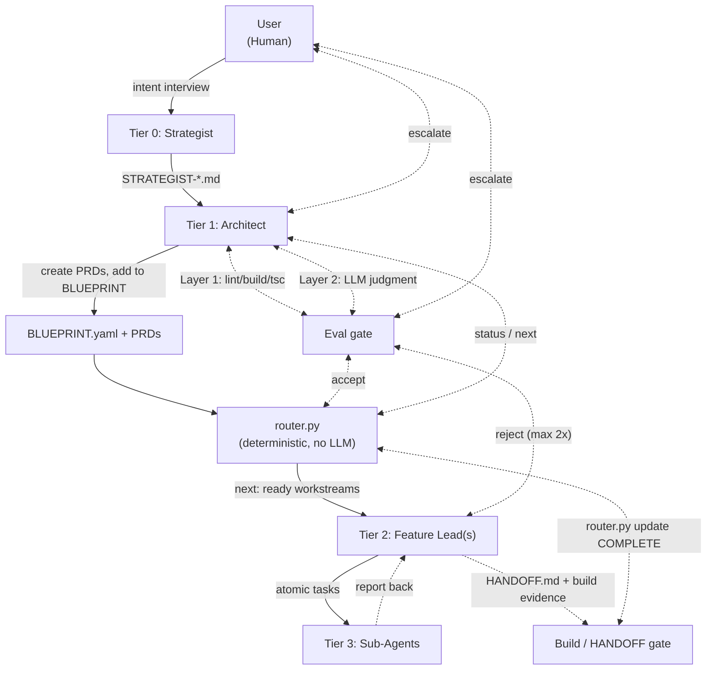

# FRACTAL — KD (`shi503`), three instances

***A four-tier process layer whose defining move is a model-free `router.py` state machine that gates a workstream's advancement on a HANDOFF's pasted build output — but never checks whether that output is true — running atop whichever harness's session is already open, at all three instances observed.***

> **Profile drafted 2026-09-03 by `claude-opus-5`, not yet verified.** Attested, not captured — see `verification:` above.

*Three instances throughout: **U** = upstream (`shi503/fractal-agent-system`) pinned at `6398f6db`, 2026-04-20 · **C** = the fork `generic-cerebro`, pinned at `2cd56e7` · **R** = this repo (`harness-atlas`), the un-routed instance. §4's coverage marks grade **U**; `C`/`R` deltas are in each §6 row.*

## 1. At a glance

| | |
|---|---|
| **Altitude** | Process layer, all three instances — no runtime of its own is shipped anywhere in the family → [§7](#7-identity-and-inclusion-test) |
| **Primitives** | 5, ⚠️ contestable — STRATEGIST doc · BLUEPRINT · workstream (PRD) · HANDOFF · PULSE → [§5](#5-primitives) |
| **Structured output** | **HANDOFF.md** — the one artifact every workstream must produce before state advances, at all three instances → [8b](#8b-evidence) |
| **Binds mechanically?** | Partly — `router.py`'s state transitions are mechanical; whether a HANDOFF's claims are true is never checked by code → [2c](#2c-enforcement) |
| **State persists** | U: `.state.json` (flat, no edges) + HANDOFF/PULSE + STRATEGIST doc; R: no `.state.json` at all → [§7](#7-identity-and-inclusion-test) |
| **Serves** | Designed for a team of roles; evidenced as one human at every instance → [10b](#10b-org) |
| **Refuses** | No published refusal list — checked `U/README.md`, `U/docs/` → [§5](#5-primitives) |
| **Coverage** | ● 3 · ◐ 11 · ○ 19 · n/a 0 → [§4](#4-component-matrix) |
| **Source** | shi503/fractal-agent-system (U) @ 6398f6db · generic-cerebro (C) @ 2cd56e7 · harness-atlas (R) · read 2026-09-03 |
| **Unverified** | 6 items → [§10](#10-unverified) |

### 1a. Positioning stats

`−2 · +2 · −1 · −3 · −3† · +2 · −3` — the seven DX dimensions, in order.

> **⚠️ Drafted 2026-09-07, not yet verified.** Derived from this profile's own §7 identity table, README quotes and `ISSUES.md` entries as read 2026-09-03, grounded against §4, §5 and §7 below. No person has re-read these seven values yet. Scored against the **upstream (U)** instance as the primary subject, per the workstream PRD; fork (`C`) divergence is recorded in `split:` only where it changes the scored half. [`01-scorecard.md`](../spectrums/01-scorecard.md) §1 R11 says how the banner comes off.

| | | | | |
|:-:|---|---:|:-:|---|
| **1** | Org scale | single operator | `─●─────` | multi-tenant, many teams |
| **2** | Weight class | light-weight | `─────●─` | heavy-weight |
| **3** | Surfaces & extendability | one surface | `──●────` | many surfaces, environments, a platform |
| **4** | Context | nothing survives | `●──────` | shared, durable, retrievable |
| **5** | Ecosystem **†** | tribal, low adoption | `▱▱▱▱▱▱` | wide adoption, longevity, network economies |
| **6** | Ownership | rented | `─────●─` | yours |
| **7** | Cost controls & efficiency | unmetered, unrestricted | `●──────` | observability, efficiency, routing |

**†** the one **graded** dimension; every other row is a position, not a score. **Neither end is better.** Ten axes sit beneath these seven — `I −2 · II 0 · III −2 · IV −3 · V −2 · VI 0 · VII 0 · VIII +3 · IX 0 · X −3` — and four of them feed no cell above by design.

→ [`spectrums/positioning.md`](../spectrums/positioning.md) ·
[`positions/fractal.yaml`](../spectrums/positions/fractal.yaml) ·
[`01-scorecard.md`](../spectrums/01-scorecard.md) · [`00-README.md`](../spectrums/00-README.md)

*Scored 2026-09-07 against this profile as read 2026-09-03. This table is the **one sanctioned echo**
of the scorecard — derived from the same YAML that renders `positioning.md`, so the two match by
construction. Re-score in the YAML, never here.*

### 1b. Contents

[§1 At a glance](#1-at-a-glance) · [1a Positioning stats](#1a-positioning-stats) ·
[§2 System map](#2-system-map) · [§3 Workflows](#3-workflows) ·
[§4 Component matrix](#4-component-matrix) · [§5 Primitives](#5-primitives) ·
[§6 Details](#6-details) · [§7 Identity and inclusion test](#7-identity-and-inclusion-test) ·
[§8 Limits](#8-limits) · [§9 Sources](#9-sources) · [§10 Unverified](#10-unverified)

No deep-read folder exists for FRACTAL.

## 2. System map

Redrawn from upstream FRACTAL's own `README.md` `## Architecture` diagram (a `graph TB`), at the pinned commit `6398f6db` (2026-04-20), re-checked byte-identical at HEAD `60393054` (2026-09-03). A **tier** picture — who delegates to whom — not a loop picture: no node here is a turn boundary, tool call, or gate a single agent loop passes through. Read 2026-09-03.

**How it thinks about work.** A unit of work is a **workstream**: a BLUEPRINT entry paired with a PRD file, decomposed by the Architect from a Strategist's intent document. Nothing about FRACTAL runs a turn itself — the loop belongs entirely to whichever harness (Claude Code, Cursor) hosts the Architect or Feature Lead session; this diagram is tiers of delegation, not turns inside one loop. Work is allowed to advance only by a HANDOFF whose Verification Evidence table is pasted command output; `router.py` (upstream only) tracks that advancement mechanically but never checks whether the HANDOFF's claims are true. `R` runs the diagram's left half only — no `Router` node, no automated `Eval` gate — the Architect and a human close that loop by reading a HANDOFF directly.

## 3. Workflows

**Not written at the 2026-09-03 read — pending the diagram pass.** A recorded gap: no vendor sequence diagram beyond the one architecture diagram redrawn in §2 was inventoried. Three sequences a later pass should draw, each already evidenced in §6 and needing no new source read:

1. **The turn** — Strategist intent → Architect decomposition into BLUEPRINT/PRD → Feature Lead executes → HANDOFF → `router.py update COMPLETE` (§7 loop question, [3a](#3a-control), [7a](#7a-workflow-tasks), [8b](#8b-evidence)).
2. **The eval gate** — HANDOFF → Architect Layer 1 (deterministic) → Layer 2 (LLM judgment) → accept / reject (max 2×) / escalate ([8a](#8a-evals), [8b](#8b-evidence)).
3. **PULSE escalation** — heartbeat past 30 minutes or at a blocker → `router.py pulse`'s regex-parse of the latest JSON block → escalate without an LLM call ([§5](#5-primitives), [9d](#9d-anti-fragile-lifecycle)).

## 4. Component matrix

`● named primitive · ◐ partial, present-not-first-class · ○ absent (pages named in §6) · n/a does not apply at this altitude`

**Marks copied verbatim from FRACTAL's column (field 12) in [`04-harness-alignment.md`](../comparisons/04-harness-alignment.md) §2; not re-derived at the restructure.**

| # | Component | Mark | Primitive / note |
|---|---|:-:|---|
| **0 · Foundation** | | | |
| [0a](#0a-substrate) | Substrate | ◐ | Per-agent model in agent-file frontmatter; no portability adapter |
| **1 · Environment** | | | |
| [1a](#1a-environment) | Environment | ◐ | Local shell/filesystem via the host harness; no environment manifest |
| **2 · Agent Harness** | | | |
| [2a](#2a-adapters--middleware) | Adapters & Middleware | ○ | Nothing here — no MCP/ACP/protocol client of its own |
| [2b](#2b-hooks) | Hooks | ○ | Nothing here — no hook system of its own, any instance |
| [2c](#2c-enforcement) | Enforcement | ◐ | Permission-tier JSON shipped as reference, never installed |
| **3 · System Stacks** | | | |
| [3a](#3a-control) | Control | ◐ | `router.py` dependency resolution; no edge storage, no approval gate |
| [3b](#3b-routing) | Routing | ○ | Static author-time field only; no runtime resolver |
| [3c](#3c-composition) | Composition | ◐ | Four tier-agent role files; overlay mechanism (`*.local.md`) |
| [3d](#3d-configuration) | Configuration | ◐ | BLUEPRINT YAML + project `CLAUDE.md`; R has no BLUEPRINT schema |
| [3e](#3e-standards) | Standards | ○ | Nothing here at the pinned commit; C ships six guides |
| **4 · Capabilities** | | | |
| [4a](#4a-capability) | Capability | ● | 7 first-class `SKILL.md` files at U |
| [4b](#4b-capability-permissions) | Capability Permissions | ○ | Nothing here — no per-user or per-skill ACL of its own |
| **5 · Context ⟳** | | | |
| [5a](#5a-individual-memory) | Individual Memory | ○ | Nothing here — defers to the host harness's own default |
| [5b](#5b-team-memory) | Team Memory | ○ | Nothing here at U; C ships a schema-validated decision ledger |
| [5c](#5c-knowledge) | Knowledge | ○ | Nothing here at U; no glossary or retrieval of its own |
| **6 · Workspaces ⟳** | | | |
| [6a](#6a-product) | Product | ○ | Nothing here — no statement of what output may not become |
| [6b](#6b-infrastructure) | Infrastructure | ○ | Nothing here — local execution only, no container or remote runner |
| [6c](#6c-estate) | Estate | ○ | Nothing here — single-repo by explicit design constraint |
| [6d](#6d-delivery) | Delivery | ○ | Nothing here — no CI/CD pipeline of its own |
| **7 · Workflow Tasks** | | | |
| [7a](#7a-workflow-tasks) | Workflow Tasks | ● | [**Workstream (PRD)**](#5-primitives) — the stated unit of work |
| **8 · Trust** | | | |
| [8a](#8a-evals) | Evals | ◐ | Four-layer model (Deterministic→LLM→Persona→Benchmark), dev-facing |
| [8b](#8b-evidence) | Evidence | ◐ | [**HANDOFF**](#5-primitives) — pasted build/test output, reviewed not parsed |
| [8c](#8c-observability) | Observability | ○ | Nothing here — no event log, span, or metrics object |
| [8d](#8d-efficiency) | Efficiency | ○ | Nothing here — no cost cap or aggregate spend accounting |
| **9 · IMPROVE** | | | |
| [9a](#9a-learning) | Learning | ○ | Nothing here as a running mechanism — grading only, no promotion |
| [9b](#9b-rituals) | Rituals | ○ | Nothing here — no recurring human-practice object of its own |
| [9c](#9c-cadence) | Cadence | ○ | Nothing here — router commands invoked manually, no scheduler |
| [9d](#9d-anti-fragile-lifecycle) | Anti-fragile Lifecycle | ● | [**ISSUES.md**](#5-primitives) — append-only defect ledger, OPEN→resolved |
| [9e](#9e-raise-the-floor) | Raise the Floor | ◐ | PRD/eval templates + agent-overlay mechanism; no retirement path |
| [9f](#9f-diagnose-the-bottleneck) | Diagnose the Bottleneck | ○ | Nothing here — `router.py status` is progress %, not bottleneck diagnosis |
| **10 · Teams & Agents** | | | |
| [10a](#10a-roster) | Roster | ◐ | Four tier-agent role files; no accountable-human-per-role field |
| [10b](#10b-org) | Org | ○ | Nothing here — no RACI, tenancy or scoping object of its own |
| **11 · Surfaces** | | | |
| [11a](#11a-surfaces) | Surfaces | ◐ | CLI/IDE session + HANDOFF/PULSE markdown; no dashboard or web UI |
| **● 3 · ◐ 11 · ○ 19 · n/a 0** | | | |

## 5. Primitives

| Primitive | Path / key | Project's own definition (verbatim) | Source |
|---|---|---|---|
| STRATEGIST doc | `.claude/fractal/STRATEGIST-{project}.md` | *"The seed of intent — it encodes WHY; the Architect determines HOW."* | ✅ `U/.claude/agents/architect.md` |
| BLUEPRINT | `.claude/fractal/BLUEPRINT-{EpicName}.yaml` | *"a YAML dependency graph."* Router-parsed: phases, each with `workstreams: [{feature_lead, prd, dependencies}]` | ✅ `U/README.md`; ✅ `U/.claude/fractal/router.py` |
| Workstream (PRD) | `.claude/fractal/workstreams/{kebab-name}.md` | *"Each unit of work starts in a fresh context with an explicit file manifest."* Alias — BLUEPRINT names it, the PRD file is its document | ✅ `U/README.md`; ✅ `U/docs/_PRD-template.md` |
| HANDOFF | `.claude/fractal/workstreams/{kebab}/HANDOFF.md` | *"ends by producing a `HANDOFF.md` whose claims are pasted build and test output rather than an agent's self-assessment."* | ✅ `U/README.md`; ✅ `U/docs/HANDOFF.md` |
| PULSE | `.claude/fractal/workstreams/{kebab}/PULSE.md` | *"emits a JSON heartbeat; `router.py pulse` checks for escalation without LLM."* | ✅ `U/README.md`; ✅ `U/docs/PULSE.md` |
| (supporting) `router.py` | `.claude/fractal/router.py` / `ROUTING_LOGIC/router.py` (canonical at U-HEAD) | *"Flow control lives in Python (`router.py`), not in LLM prompts."* | ✅ `U/README.md` "Core Principles" #1 |
| (supporting) tier-agent role files | `.claude/agents/{architect,strategist,feature-lead,sub-agent}.md` | *"Four tiers with explicit model assignments. Match model cost to task complexity."* Ships as a template a project customizes | ✅ `U/README.md` "Core Principles" #3, "Agent Overlay" |
| (supporting) `ISSUES.md` | `.claude/fractal/ISSUES.md` | *"Persistent tracker for framework-level bugs and anomalies... The Architect triages OPEN issues before authoring each new BLUEPRINT phase."* | ✅ `U/.claude/fractal/ISSUES.md` header |

**Count:** 5 primitives, 3 supporting *(as assembled at the 2026-09-03 read)*. **Verdict:** ⚠️ contestable
— the vendor never gathers these five into one table; this profile assembles the set from the README's
own descriptions of each object plus the `docs/` reference file per object, the same defensible-range
procedure rule 4 specifies for a vendor that publishes no explicit list. `router.py`, the tier-agent role
files, and `ISSUES.md` are `(supporting)`: infrastructure the harness owns and ships once, not a unit
re-authored per workstream. No published refusal list was found — checked `U/README.md`, `U/docs/`.

## 6. Details

`✅ direct · ↪ relayed · ⚠️ unverified`

### 0 · Foundation

#### 0a Substrate

◐ Per-agent model in agent-file frontmatter; no portability adapter

**Ships.** U: model pinned per role in `.claude/agents/*.md` frontmatter (opus × 2, sonnet × 2); `model: inherit` is valid but unused in the shipped roles. No provider abstraction or protocol adapter of FRACTAL's own — model choice is a hand-edited text field. C and R carry the same frontmatter convention, models unchanged from U's template.
**Path.** `.claude/agents/*.md` frontmatter (`model:` key)
**Source.** ✅ all three, direct

### 1 · Environment

#### 1a Environment

◐ Local shell/filesystem via the host harness; no environment manifest

**Ships.** Shell (subprocess to `python3`/`claude`, invoked by hand, not by `router.py`) and filesystem (`.claude/fractal/`) at all three instances; no declared network or GitHub manifest. Single-repo only, stated as a design limitation (§8). C and R add nothing beyond a bigger filesystem tree.
**Path.** `.claude/fractal/router.py`; README "Repository Structure"
**Source.** ✅ same, all three

### 2 · Agent Harness

#### 2a Adapters & Middleware

○ Nothing here — no MCP/ACP/protocol client of its own

**Nothing here** — checked `U/.claude/`, `U/docs/`, `U/ROUTING_LOGIC/` for MCP, ACP, or protocol-client code; none found. `router.py`'s only I/O is YAML/JSON files. `SETUP-CURSOR.md` is a prose translation guide, not a protocol adapter.
**Source.** ✅ absence, direct

#### 2b Hooks

○ Nothing here — no hook system of its own, any instance

**Nothing here**, at U, C or R — grepped for `PreToolUse`/`PostToolUse`/hook definitions of FRACTAL's own; none found. (Claude Code's own hook system is discussed nowhere in FRACTAL's own docs.)
**Source.** ✅ absence, direct grep, all three

#### 2c Enforcement

◐ Permission-tier JSON shipped as reference, never installed

**Ships.** U ships four permission-tier JSON files (`tier-{1,2,3,4-auto}.json`) — but under `docs/permission-templates/`, **not** `example-claude/`, so they are reference material never actually installed by the README's own copy step (confirmed by diffing the two trees). C and R ship no permission tiers at all.
**Path.** `U/docs/permission-templates/*.json`; `U/docs/permissions-guide.md`
**Source.** ✅ direct — shipped as reference, not installed

### 3 · System Stacks

#### 3a Control

◐ <code>router.py</code> dependency resolution; no edge storage, no approval gate

**Ships.** U: `router.py`'s `next`/`update`/`status` — genuinely model-free dependency resolution over a flat state map with **no edge storage** (edges live only in the re-parsed BLUEPRINT each call). C runs the identical code across 156 workstreams, independently producing the exact stale-state failure §8 quotes. R: no resolver exists at all — what can start now is answered by the Architect reading PRDs and HANDOFFs by hand.
**Path.** `.claude/fractal/router.py` (`cmd_next`)
**Source.** ✅ same, all three

#### 3b Routing

○ Static author-time field only; no runtime resolver

**Nothing here** as a runtime resolver, at any instance. A BLUEPRINT/workstream entry names its `feature_lead` and optional `model`; nothing reassigns work at runtime. C's dual-schema `_normalize_blueprint()` (§9-C2) is a parsing accommodation, not a routing mechanism.
**Path.** `router.py` (`cmd_next`, static field reads)
**Source.** ✅ same, all three

#### 3c Composition

◐ Four tier-agent role files; overlay mechanism (<code>*.local.md</code>)

**Ships.** Four role files (`.claude/agents/{architect,strategist,feature-lead,sub-agent}.md`) at U, unchanged in count at C and R. U's README documents a real **agent overlay** mechanism — `*.local.md` files appended to a base agent's context — a customization primitive not present in C's or R's copies.
**Path.** `.claude/agents/*.md`; `U/README.md` "Agent Overlay (Local Config)"
**Source.** ✅ same, all three

#### 3d Configuration

◐ BLUEPRINT YAML + project <code>CLAUDE.md</code>; R has no BLUEPRINT schema

**Ships.** U: BLUEPRINT YAML (one schema — phases, `feature_lead`/`dependencies` keys) plus each project's own `CLAUDE.md`. C accepts **two** schemas via `_normalize_blueprint()` (legacy phased plus a flat `id:`/`depends_on:` shape), confirmed absent from U's router at the pinned commit. R has no BLUEPRINT schema at all — configuration is `CLAUDE.md` § Workstreams prose plus the PRD template's own structure.
**Path.** `router.py` (`load_blueprint`); `R/CLAUDE.md` § Workstreams
**Source.** ✅ same, all three

#### 3e Standards

○ Nothing here at the pinned commit; C ships six guides

**Nothing here** at U's pinned commit — no `standards/` directory anywhere in the `6398f6db` tree. **Now present at U-HEAD** (added somewhere in the 29-commit drift window since 2026-04-20) — outside this profile's pinned scope to grade. C ships a real standards tier (six guides, 849 lines, an inheritance contract) independently, ahead of U at the pinned commit. R has none beyond this atlas's own `standards/`, which is not FRACTAL's.
**Path.** `U-HEAD/standards/`; `C/standards/`
**Source.** ✅ absence at pinned commit; ↪ HEAD contradiction (drift only)

### 4 · Capabilities

#### 4a Capability

● 7 first-class <code>SKILL.md</code> files at U

**Ships.** Seven real, first-class `SKILL.md` files at U (`fractal-init`, `pulse`, `handoff`, `gap-analysis`, `quality-pass`, `commit-summarize`, `claude-md-audit`) — proper frontmatter, `disable-model-invocation`, shipped once rather than synced repeatedly. C reports 39 skills across 6 plugins (↪, not independently re-counted this pass). R uses none of FRACTAL's skills — `pulse`/`handoff` are executed as bash per this repo's feature-lead agent file, not invoked as Claude Code skills.
**Path.** `.claude/skills/*/SKILL.md`
**Source.** ✅ U, direct; ↪ C, relayed

#### 4b Capability Permissions

○ Nothing here — no per-user or per-skill ACL of its own

**Nothing here** at any instance — no mechanism scopes *who* may invoke a given skill or role once installed. Checked `.claude/skills/*/SKILL.md` frontmatter (no permission field) and `.claude/agents/*.md`.
**Source.** ✅ absence, direct

### 5 · Context ⟳

#### 5a Individual Memory

○ Nothing here — defers to the host harness's own default

**Nothing here** as a FRACTAL-owned object at U — defers entirely to Claude Code's own per-session default; no `MEMORY.md` or equivalent found. C has team/decision memory ([5b](#5b-team-memory)) but the same absence at the individual layer.
**Source.** ✅ absence, direct

#### 5b Team Memory

○ Nothing here at U; C ships a schema-validated decision ledger

**Nothing here** at U — no context fabric, no shared memory file beyond each project's own `CLAUDE.md`/`STRATEGIST-*.md`, which are intent documents, not a memory store. C ships a real one (`tools/decision-ledger/`, 242 entries, schema-validated) — a genuine addition beyond U, not merely a bigger copy of it.
**Source.** ✅ U, absence, direct; ↪ C

#### 5c Knowledge

○ Nothing here at U; no glossary or retrieval of its own

**Nothing here** at U — no retrieval, no knowledge base, no glossary file found anywhere (`find . -iname "GLOSSARY*"` — no hits). C ships a lexical (BM25) retrieval index over 279 documents per a secondary document, itself noting the index is undistributed (`.gitignore`'d) — not independently re-verified this pass.
**Source.** ✅ U, absence, direct; ↪ C, relayed only

### 6 · Workspaces ⟳

#### 6a Product

○ Nothing here — no statement of what output may not become

**Nothing here** — checked `README.md`, `docs/` — at any instance. What a FRACTAL agent's own output may not become is never stated (a project a BLUEPRINT orchestrates may declare its own such constraint — that is the product FRACTAL orchestrates, not a constraint FRACTAL states about itself).
**Source.** ✅ absence, direct

#### 6b Infrastructure

○ Nothing here — local execution only, no container or remote runner

**Nothing here** — no container, no remote runner, no CI wiring of FRACTAL's own at any instance (`find .github -type f` at U's pinned commit: one `dependabot.yml`, not a FRACTAL CI job).
**Source.** ✅ absence, direct

#### 6c Estate

○ Nothing here — single-repo by explicit design constraint

**Nothing here** at U — single-repo by explicit design constraint (§8 quotes it directly: *"single-repo only"*). No registry of siblings exists because the design assumes there are none. C and R are each themselves single repos too, consistent with the constraint holding at every instance.
**Source.** ✅ absence, direct — structurally inapplicable

#### 6d Delivery

○ Nothing here — no CI/CD pipeline of its own

**Nothing here** of FRACTAL's own — no CI/CD pipeline ships with the framework at U (`.github/dependabot.yml` only); each Architect's own commit-cadence choice (per the Strategist's interview) is prose policy, not a wired gate. C, R: same.
**Source.** ✅ absence, direct

### 7 · Workflow Tasks

#### 7a Workflow Tasks

● <b>Workstream (PRD)</b> — the stated unit of work

**Ships.** The workstream — a BLUEPRINT entry (`feature_lead`, `model`, `prd`, `dependencies`) paired with a workstream PRD file — is the one object every instance names as its actual unit of work; U's own README states this is the object the whole design exists to protect from context drift. Same shape, unchanged, at C (156 instances) and R (PRDs in `fractal/workstreams/`, no BLUEPRINT wrapper).
**Path.** `.claude/fractal/BLUEPRINT-*.yaml`; `docs/_PRD-template.md`; `R/fractal/workstreams/*.md`
**Source.** ✅ same, all three

### 8 · Trust

#### 8a Evals

◐ Four-layer model (Deterministic→LLM→Persona→Benchmark), dev-facing

**Ships.** U specifies a genuine four-layer model (Deterministic → LLM Judgment → Qualitative Persona → Strategic Benchmark) with four filled-in template files and a stated 2-attempt retry/escalate rule — the most developed row in this profile. C and R both inherit the same four-layer structure by name (R's feature-lead/architect files quote the same "Layer 1–2 / Layer 3–4" split verbatim).
**Not a mechanical gate** — the split remains real-vs-run, per [2c](#2c-enforcement) and [3a](#3a-control).
**Path.** `.claude/fractal/EVAL_TEMPLATES/*.md`; `.claude/agents/architect.md` §"Evaluation Retry Policy"
**Source.** ✅ same, all three

#### 8b Evidence

◐ <b>HANDOFF</b> — pasted build/test output, reviewed not parsed

**Ships.** The HANDOFF's Verification Evidence table — pasted command output, not self-report — is real at all three instances and the card's structured output. No instance validates the table's contents against an independent re-run automatically; the Architect's own re-run is itself an LLM session, not code.
**Path.** `docs/HANDOFF.md` (template); `R/fractal/workstreams/*-HANDOFF.md`
**Source.** ✅ same, all three

#### 8c Observability

○ Nothing here — no event log, span, or metrics object

**Nothing here** — no event log, span, or metrics object of FRACTAL's own at U (unlike LoomWarp's `events.jsonl`, which is a LoomWarp addition, not inherited from U). PULSE is a heartbeat for escalation, not an observability stream. C, R: same absence.
**Source.** ✅ absence, direct

#### 8d Efficiency

○ Nothing here — no cost cap or aggregate spend accounting

**Nothing here** at U — no cost cap, no budget flag, no aggregate spend accounting anywhere in `router.py` or the agent files (contrast LoomWarp's `--max-budget-usd`, a LoomWarp-only addition). C, R: same absence, confirmed by grep.
**Source.** ✅ absence, direct

### 9 · IMPROVE

#### 9a Learning

○ Nothing here as a running mechanism — grading only, no promotion

**Nothing here** as a running mechanism at U — no skill-promotion or rule-hardening pipeline; the `claude-md-audit` skill grades an existing `CLAUDE.md` against a rubric but does not write new rules from experience. C ships a real compounding loop (finding-class → standards promotion, 13 classes) — a genuine addition beyond U at the pinned commit.
**Source.** ✅ U, absence, direct; ↪ C

#### 9b Rituals

○ Nothing here — no recurring human-practice object of its own

**Nothing here** at any instance — grepped for "standup," "retro," "ritual"; none found. The Strategist's periodic re-interview is the nearest analogue and is user-triggered, not scheduled by the framework.
**Source.** ✅ absence, direct grep, all three

#### 9c Cadence

○ Nothing here — router commands invoked manually, no scheduler

**Nothing here** as an automatic scheduler at any instance — `router.py`'s commands are invoked manually per the README's own numbered "First Run" steps; no cron or hook-triggered dispatch was found.
**Source.** ✅ absence, direct

#### 9d Anti-fragile Lifecycle

● <b>ISSUES.md</b> — append-only defect ledger, OPEN→resolved

**Ships, real at U itself.** `.claude/fractal/ISSUES.md` ships **at the pinned commit**, with a template, three severities, and a stated lifecycle (OPEN → resolved by a HANDOFF) — contradicting a secondary document's framing of the ledger as something the fork "added." C's own ledger (14 entries) is the same object at scale, independently converging on the same recurring defect (§8). R's `fractal/ISSUES.md` (4 entries) is the same object again, one tier further removed from any router to report bugs *in*.
**Path.** `.claude/fractal/ISSUES.md`
**Source.** ✅ full read, all three

#### 9e Raise the Floor

◐ PRD/eval templates + agent-overlay mechanism; no retirement path

**Ships.** U's `docs/_PRD-template.md` and the four `EVAL_TEMPLATES/` files are real starting-point templates; the [Agent Overlay](#3c-composition) `*.local.md` mechanism is the nearest thing to a guardrail against drifting the base agent files. No retirement mechanism for a second way once it appears was found at any instance.
**Path.** `docs/_PRD-template.md`; `.claude/fractal/EVAL_TEMPLATES/`
**Source.** ✅ same, all three

#### 9f Diagnose the Bottleneck

○ Nothing here — <code>router.py status</code> is progress %, not bottleneck diagnosis

**Nothing here** — no throughput measurement or bottleneck-diagnosis tool at any instance. `router.py status`'s percentage-complete readout is progress, not diagnosis of *where* time is lost.
**Path.** `router.py` (`cmd_status`)
**Source.** ✅ absence, direct

### 10 · Teams & Agents

#### 10a Roster

◐ Four tier-agent role files; no accountable-human-per-role field

**Ships.** Four role files (`.claude/agents/{architect,strategist,feature-lead,sub-agent}.md`) at U, unchanged in count at R; C reports four agent tiers plus 39 skills' worth of capability, same roster shape. No accountable-human-per-role field exists at any instance — a role file names a job, not a person.
**Path.** `.claude/agents/*.md`
**Source.** ✅ same, all three

#### 10b Org

○ Nothing here — no RACI, tenancy or scoping object of its own

**Nothing here** at any instance — no RACI table, no people registry, no tenancy/scoping object of FRACTAL's own (contrast LoomWarp's `people.yaml`, a LoomWarp-only addition).
**Source.** ✅ absence, direct

### 11 · Surfaces

#### 11a Surfaces

◐ CLI/IDE session + HANDOFF/PULSE markdown; no dashboard or web UI

**Ships.** CLI/IDE-session only at all three: Claude Code (first-class) or Cursor (community-supported, translation guide); `HANDOFF.md`/`PULSE.md` markdown are the surface of record. No dashboard or web UI at any instance.
**Path.** `README.md` "Platform Support"; `SETUP-CURSOR.md`
**Source.** ✅ same, all three

## 7. Identity and inclusion test

Identity · inclusion test · loop question

*Fields below describe **upstream (U)**, the canonical named subject; `C` and `R` are downstream instances and are given their own identity notes beneath the table.*

| Field | Value |
|---|---|
| Canonical name | **FRACTAL** — Fractal, Recursive, Agentic, Context-aware, Task-driven, Autonomous, Layered; a `.claude/` tree, not a binary ✅ |
| Prior names / homes | Not a rename — the substrate two KD-built systems iterate (LoomWarp vendors it byte-identical; `generic-cerebro` forked it independently, six days before the commit LoomWarp vendored) ✅ |
| Owner / maintainer | GitHub user `shi503` (KD); 47 commits, contributors `shi503` (20), `cursoragent` (1), `dependabot[bot]` (1) ✅ |
| GitHub URL | `github.com/shi503/fractal-agent-system` — public ✅ |
| License | MIT, present at the pinned commit ✅ |
| Stars | 3 stars, 1 fork (2026-09-03) ✅ |
| Language | Python (router, skills, 37,155 bytes) over TypeScript/CSS/JS (the TaskFlow demo app's frontend) ✅ |
| Repo created | 2026-03-05 ✅ |
| First release | None — `releases` and `tags` both empty via `gh api` and `git ls-remote`; a local-only, never-pushed `v2.0.0-rc1` tag ✅ |
| Latest release | None; HEAD `60393054` (2026-09-03) is 29 commits past the pinned read, `+32,875/-3,853` lines across 303 files ✅ |
| Install | Pinned commit: `git clone` + `cp -r example-claude .claude`, manual, no package manager. U-HEAD: `/plugin marketplace add` — a materially different path introduced in the drift window ✅ / ↪ |
| Website / docs | None — `README.md`, a `docs/` reference folder (STRATEGIST/ARCHITECT/BLUEPRINT/PRD/FEATURELEAD/PULSE/HANDOFF); no rendered site, no glossary file ✅ |
| What it says it is, verbatim | *"a hierarchical framework for orchestrating teams of AI agents on complex software development tasks. It addresses context drift, serialization of parallel work, and cost inefficiency in long-running agentic sessions."* ✅ |

**`C` (generic-cerebro) identity, brief.** A private working-copy fork with no independent GitHub identity — pinned `2cd56e7`, 1,445 markdown files, KD's own production run of the design at scale (32 blueprints, 156 workstream directories). ✅ direct.

**`R` (this repo) identity, brief.** No separate distribution — FRACTAL's document conventions run inside this repo's own workstream process, un-routed. `.claude/agents/architect.md` and `feature-lead.md` are line-for-line descendants of U's role files, with `router.py`, BLUEPRINT and `.state.json` all confirmed absent (`find` — zero hits, excluding `node_modules`). ✅ direct.

**Does state persist across sessions, where, in what format?** **Yes, in uncoordinated files, never a store.** U: `.state.json` (gitignored, a flat `{workstream: status}` map with **no dependency edges** — those live only in the BLUEPRINT), `HANDOFF.md`/`PULSE.md` per workstream, and a STRATEGIST doc plus its localized twin. C: the same shape at scale, plus an append-only `ISSUES.md` (14 entries) recording exactly the flat-map failure §8 quotes. R: no `.state.json` exists — the workstream PRDs, `*-HANDOFF.md` files and `fractal/ISSUES.md` are the whole of the state; nothing resolves a dependency graph from it. ✅ direct, all three.

**Does it serve more than one person? — answered per layer.** **As designed (U), yes** — four tiers assume a Strategist (human), an Architect, multiple Feature Leads and Sub-Agents: division of labor, not one person's memory aid. **As run, U's own repo shows one human contributor** plus bot commits; C's own credibility check names *"one reliable operator"*; R's `CLAUDE.md` names a single human and one `feature-lead` agent per workstream. No RACI, scope or tenant object exists at any instance ([10b](#10b-org)). Net: designed for a team of roles, evidenced for one human operating every role in sequence. ✅ direct.

**Does it bind mechanically, or only by prose?** **Split, cleanly, along the same line as its own architecture.** U's `router.py` `next`/`update`/`pulse` are genuinely mechanical — pure Python, zero LLM calls — but whether a HANDOFF's claims are *true* is never checked by code: `router.py update <name> COMPLETE` accepts the string from anyone who types it, and the Architect's own agent file names re-running scan commands to validate a Feature Lead's results, i.e. a second LLM session, not `router.py` itself gating on their output. C inherits the identical split, unmodified. R has nothing mechanical in this dimension at all — no router exists to even parse a PULSE; a Feature Lead's own honesty in the Verification Evidence table is the entire binding mechanism, strictly more prose-bound than U or C. ✅ direct.

**Loop question.** **Runs no loop at any instance — process layer.** U's `router.py` is a pure, model-free state machine over YAML/JSON; it starts no agent loop and holds no session, and unlike LoomWarp's `dispatch.py`, it never invokes `claude` itself — a human or an already-open session reads a role file and acts. Installs into Claude Code first-class (`.claude/agents/*.md`, `.claude/skills/*/SKILL.md`) and Cursor via a translation guide (`SETUP-CURSOR.md`, "Community-supported"); no reverse adapter was found. C installs the same way at greater scale (a plugin marketplace, closer to U-HEAD's own marketplace mechanism). R installs by the thinnest path of the three — two agent files, no plugin, no `.claude/fractal/` directory at all. ✅ direct.

**Altitude.** **Process layer, at all three instances — no runtime of its own is shipped anywhere in the family.** No subprocess dispatcher of its own (contrast LoomWarp's `dispatch.py`), no event log, no per-dispatch budget cap — thinner than a hosting gateway, let alone a runtime.

## 8. Limits

What it does not claim, in the vendor's words

**From `U/README.md`** ✅

> **When to Use FRACTAL** — FRACTAL adds overhead. Use it when the epic has: 3+ workstreams that could
> run independently... Skip it for: single-file fixes, small features, tasks under ~2 hours.

> **Known Gotchas** — `router.py` supports `--blueprint`... `.state.json` — Add to `.gitignore`; it is
> a runtime artifact... Feature Leads must never run `router.py init` — It wipes all workstream state
> to NOT_STARTED. They only run `router.py update <workstream-name> COMPLETE`.

> **HUMAN ONLY README** — You might want to use this if you: Don't have access to Co-work, OpenClaw
> (e.g. Enterprise restrictions, SecOps concerns, etc.)... Enabling "YOLO mode" with
> `--dangerously-skip-permissions` flag is closer to the automated agent orchestration experience, but
> you should know what it is doing before enabling this flag.

**From `U/.claude/agents/strategist.md`** ✅

> **Background-Agent Guard** — STOP. Before doing anything else, determine how you were invoked... If
> you were spawned as a background sub-agent... with no interactive user present — DO NOT proceed... A
> Strategist doc generated without user input is worse than no doc at all.

**A secondary profile's own credibility check**, re-verified against U above rather than repeated on trust ↪

> What it does not have: Single-repo only · Claude Code only · no policy enforcement layer · no context
> provenance · no standards tier · no maturity diagnosis · no capture loop.
>
> Releases: Zero tags and zero releases as of 2026-08-04. Vendoring: Pinned at a commit, not a
> version. No upgrade path is defined. Risk: An unversioned upstream is a supply-chain and drift
> exposure.

**`C/.claude/FRACTAL/ISSUES.md` (ISSUE-002)**, quoted for the convergent-defect finding it documents ✅

> Router state file `.claude/FRACTAL/.state.json` does not contain WS-6... The current
> `BLUEPRINT-Cerebro-Transition.yaml` lists 10 workstreams; the state file shows only 6... Feature Lead
> command restrictions prohibit running `router.py init` (Architect-only), so WS-6 cannot self-mark
> COMPLETE.

**`R/CLAUDE.md` § Workstreams** ✅

> FRACTAL runs **un-routed** here: no router, no blueprint YAML, no state file. A workstream is a PRD
> in `fractal/workstreams/`, executed by the `feature-lead` agent... and closed by a `HANDOFF.md`
> beside it. Defects in the process go in `fractal/ISSUES.md`, append-only.

## 9. Sources

Primary · secondary · placement · diagrams not redrawn

**All primary sources accessed 2026-09-03. No source was re-read at the 2026-09-07 restructure.**

**Primary.** Local clone of `shi503/fractal-agent-system` pinned to `6398f6db059598e381336601b21609928cf24034` for every §4/§6 mark; `gh api repos/shi503/fractal-agent-system` and `.../{releases,tags,languages,contributors}`; `git ls-remote --tags origin`; `git log --reverse`, `git rev-list --count`, `git diff --stat` (drift measurement only). Direct reads at `6398f6db`: `README.md`, `LICENSE`, `The FRACTAL Multi-Agent System.md`, `.claude/fractal/router.py` (full), `.claude/fractal/ISSUES.md`, `.claude/agents/*.md` (full), `.claude/skills/{pulse,handoff}/SKILL.md`, `docs/{BLUEPRINT,HANDOFF,PULSE,_PRD-template,permissions-guide}.md`, `docs/permission-templates/*.json`, `EVAL_TEMPLATES/deterministic-eval.md`, `SETUP-CURSOR.md`. U-HEAD (`60393054`, drift only): root `CLAUDE.md`, `git ls-tree HEAD -- standards`. Local clone of `shi503/generic-cerebro` pinned to `2cd56e7ef4f3472c4e91a54810d7f69215b8f536`: `router.py` (grepped), `ISSUES.md` (head), `find` for `_archive`/blueprints/workstreams counts. This repo: `fractal/ISSUES.md` (full), `.claude/agents/{architect,feature-lead}.md` (full), `CLAUDE.md` § Workstreams, `content/loomwarp.md` (full). `skills/harness-teardown/SKILL.md` — the procedure this profile follows.

**Secondary (↪).** A LoomWarp-repo profile of upstream FRACTAL (every quote re-sourced to U directly above); two this-repo documents summarizing `generic-cerebro`'s architecture and its claimed delta from U — the delta claims were independently re-checked against both repos' actual files (§6, 9d, 3d) rather than repeated; two of five claimed fork-additions did not survive the check (see `fractal/ISSUES.md` ISSUE-005).

**Placement.** Short-profiles row: [`comparisons/systems/90-short-profiles.md`](../comparisons/systems/90-short-profiles.md) §1 · grid columns: [`comparisons/04-harness-alignment.md`](../comparisons/04-harness-alignment.md) §2 and [`comparisons/02-component-matrix.md`](../comparisons/02-component-matrix.md) §1 · index row: [`index.md`](../index.md) · positioning: [`spectrums/positioning.md`](../spectrums/positioning.md).

**Diagrams not redrawn.** None outstanding — the one vendor diagram found (`README.md`'s `## Architecture`) was redrawn in §2; no second diagram exists anywhere else in the tree (`docs/`, both prose files — all prose or tables).

## 10. Unverified

6 items

- **Exactly when, in the 29-commit drift window between `6398f6db` (2026-04-20) and U-HEAD (2026-09-03), `standards/`, `tools/decision-ledger/`, `tools/wiki-index/`, `.claude/plugins/` and the marketplace install path were added upstream.** Bounded to "present at HEAD, absent at the pinned commit," not dated more precisely.
- **Whether a secondary this-repo document's pulse/ISSUES/eval-template framing was accurate against an even earlier upstream state predating the pinned commit**, rather than simply wrong. Checked against the pinned commit only, per the workstream's explicit instruction; not walked further back.
- **`generic-cerebro`'s exact skill count (39) and standards line-count (849 lines)** were taken from a secondary document and not independently re-run this pass; the blueprint count (32) and workstream directory count (156) *were* independently verified and differ from that document's own count (27/130), consistent with growth since it was written.
- **Whether `docs/permission-templates/*.json` at U is the literal source LoomWarp's `policy/tier-*.json` was copied from**, versus independently authored to the same four-tier shape. File names and tier count match exactly; contents were not diffed byte-for-byte.
- **Whether any workstream in either of C's 32 blueprints has a dependency graph deep enough to exercise the flat-state-map defect beyond what `ISSUES.md`'s own entries already document.** The issue entries were read, not the blueprint graphs themselves.
- **The exact content of U-HEAD's new `standards/` directory** — confirmed present via `git ls-tree` only; not read, since it falls outside the pinned-commit scope this profile grades against.

