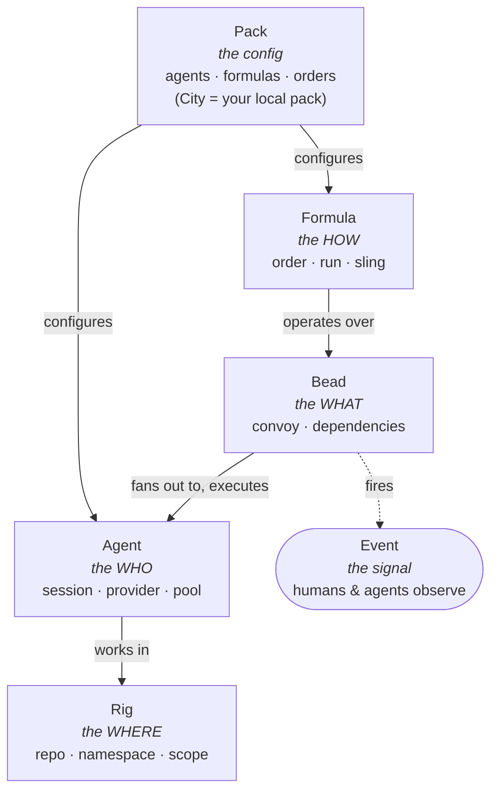

# Gas City — Gas Town Hall

***A Go orchestration SDK, extracted out of the earlier, more opinionated Gas Town product, that runs fleets of external coding-agent CLIs as managed sessions coordinated entirely through a shared, Dolt-backed work store — hardcoding zero roles, built from six named primitives gated by a documented admission test, and refusing to be a sandbox: command execution is stated as a trusted-operator feature, not a security boundary.***

## 1. At a glance

| | |
|---|---|
| **Altitude** | Dual — hosts many agent-CLI sessions **and** installs into each one's skill/hook conventions → [§7](#7-identity-and-inclusion-test) |
| **Primitives** | 6, healthy (5–7) — Agent · Bead · Formula · Rig · Pack · Event → [§5](#5-primitives) |
| **Structured output** | The **Bead** — one durable, queryable work-item record every other primitive writes through → [8b](#8b-evidence) |
| **Binds mechanically?** | Partly — commands are *"a feature, not a sandbox"*; secret-stripping and CSRF bind by default → [2c](#2c-enforcement) |
| **State persists** | Dolt-backed bead store under `.gc/`, queried live; append-only `.gc/events.jsonl` → [5a](#5a-individual-memory) |
| **Serves** | Per layer — single-operator dashboard; agents coordinate via a shared store; hosted layer refuses tenancy → [10b](#10b-org) |
| **Refuses** | No published refusal list — command execution is *"a feature, not a sandbox"* by explicit design → [§5](#5-primitives) |
| **Coverage** | ● 13 · ◐ 14 · ○ 6 · n/a 0 → [§4](#4-component-matrix) |
| **Source** | gastownhall/gascity @ 4071143 (main/edge; v1.4.1 @ 6106663) · docs/, engdocs/ · read 2026-09-03 |
| **Unverified** | 7 items → [§10](#10-unverified) |

### 1a. Positioning stats

> **⚠️ Drafted 2026-09-07, not yet verified.** Derived entirely from the restructured profile below —
> no source was opened at scoring time (R3). [`01-scorecard.md`](../spectrums/01-scorecard.md) §1 R11
> says how the banner comes off.

`−1 · +1 · +2 · −1 · −1† · +2 · −2` — the seven DX dimensions, in order.

| | | | | |
|:-:|---|---:|:-:|---|
| **1** | Org scale | single operator | `──●────` | multi-tenant, many teams |
| **2** | Weight class | light-weight | `────●──` | heavy-weight |
| **3** | Surfaces & extendability | one surface | `─────●─` | many surfaces, environments, a platform |
| **4** | Context | nothing survives | `──●────` | shared, durable, retrievable |
| **5** | Ecosystem **†** | tribal, low adoption | `▰▰▱▱▱▱` | wide adoption, longevity, network economies |
| **6** | Ownership | rented | `─────●─` | yours |
| **7** | Cost controls & efficiency | unmetered, unrestricted | `─●─────` | observability, efficiency, routing |

**†** graded; every other row is a position, not a score. Ten axes beneath: `I −1 · II +3 · III −2 · IV 0/−3(dual) · V +2 · VI 0 · VII +2 · VIII +2 · IX 0 · X −3` — four feed no cell above, by design.

→ [`positions/gas-city.yaml`](../spectrums/positions/gas-city.yaml) · [`01-scorecard.md`](../spectrums/01-scorecard.md) · [`00-README.md`](../spectrums/00-README.md). *A `spectrums/positioning.md` row is an outstanding downstream obligation, out of write manifest (§9). Scored 2026-09-07 against the 2026-09-03 read; re-score in the YAML, never here.*

### 1b. Contents

[§1 At a glance](#1-at-a-glance) · [1a Positioning stats](#1a-positioning-stats) · [§2 System map](#2-system-map) · [§3 Workflows](#3-workflows) · [§4 Component matrix](#4-component-matrix) · [§5 Primitives](#5-primitives) · [§6 Details](#6-details) · [§7 Identity and inclusion test](#7-identity-and-inclusion-test) · [§8 Limits](#8-limits) · [§9 Sources](#9-sources) · [§10 Unverified](#10-unverified)

No deep-read folder exists; `content/gas-city-draft.md` is a superseded `--sanity` draft (history only).

## 2. System map

Gas City's own docs carry this diagram where the six primitives are introduced (`docs/getting-started/how-gas-city-works.md` @ 4071143, source `primitives.excalidraw`; confirmed unchanged since the 2026-09-03 sanity read). It pictures the **primitive set**, not the **loop**.

**How it thinks about work.** A unit of work is a **Bead** that a **Formula** operates over, fanning work to **Agents** executing inside a registered **Rig**; a **Pack** declares which agents, formulas and orders exist, and an **Event** fires for humans and agents to observe. This diagram is the *primitive set*, not the *loop*: the control loop (`internal/dispatch`, health patrol, the session reconciler) sits one layer beneath, closing through the bead store and event bus, never a callback.

## 3. Workflows

**Not written at the 2026-09-03 read — pending the diagram pass (W8c).** A recorded gap. Three sequences a workflow pass should draw, evidenced already in §6:

1. **A formula run over a convoy** — an Order pairs a trigger with a Formula; the Formula operates
over a Bead/Convoy, fanning work to Agents, which execute in a Rig; a Bead fires an Event ([3a](#3a-control), [9c](#9c-cadence), [§2](#2-system-map)).
2. **Session lifecycle through the shared store** — the orchestrator spawns, stops and restarts a
session, reading progress from the bead store and event bus, not a direct callback ([2a](#2a-adapters--middleware), [8c](#8c-observability), [9d](#9d-anti-fragile-lifecycle)).
3. **Skill materialization into a provider's own convention** — a pack/role skill is symlinked into
`.claude/skills/`, `.agents/skills/`, `.gemini/skills/`, `.opencode/skills/`; `gc hook` injects mail into a running agent's context each turn ([4a](#4a-capability), [2b](#2b-hooks)).

## 4. Component matrix

`● named primitive · ◐ partial, present-not-first-class · ○ absent (pages named in §6) · n/a does not apply at this altitude`

**Marks copied verbatim from Gas City's column in [`04-harness-alignment.md`](../comparisons/04-harness-alignment.md) §2; not re-derived at the restructure.**

| # | Component | Mark | Primitive / note |
|---|---|:-:|---|
| **0 · Foundation** | | | |
| [0a](#0a-substrate) | Substrate | ● | 15 named provider CLIs; per-agent `provider`/`option_defaults`/`upstream` |
| **1 · Environment** | | | |
| [1a](#1a-environment) | Environment | ◐ | Shell, rig filesystem, HTTP+SSE API, GitHub, k8s, Dolt — no declared inventory |
| **2 · Agent Harness** | | | |
| [2a](#2a-adapters--middleware) | Adapters & Middleware | ● | `runtime.Provider` (tmux/subprocess/exec/ACP/k8s/herdr); MCP catalog-only |
| [2b](#2b-hooks) | Hooks | ● | `on_boot`/`pre_start`/`session_*`/`work_query`/order triggers/`gc hook` |
| [2c](#2c-enforcement) | Enforcement | ◐ | No sandbox on agent tool calls, stated non-goal; secret-stripping, CSRF bind |
| **3 · System Stacks** | | | |
| [3a](#3a-control) | Control | ◐ | v2 control beads (`check`,`retry`,`fanout`,`drain`) gate steps on `needs` edges |
| [3b](#3b-routing) | Routing | ● | `sling_query` stamps `gc.routed_to`; per-agent `scale_check` pool sizing |
| [3c](#3c-composition) | Composition | ◐ | No sub-agent delegation; composition happens by **importing packs** |
| [3d](#3d-configuration) | Configuration | ● | [**Pack**](#5-primitives) `pack.toml` + city `city.toml`, scoped inheritance |
| [3e](#3e-standards) | Standards | ○ | Generated schemas + OpenAPI 3.1 + a wire-typing refusal list exist, scoped narrowly ⚠️ mark and detail disagree at the v1 read |
| **4 · Capabilities** | | | |
| [4a](#4a-capability) | Capability | ● | [**Pack**](#5-primitives) bundles agents/formulas/orders/skills; `gascity-packs` registry |
| [4b](#4b-capability-permissions) | Capability Permissions | ◐ | City-wide vs role-local scope; webhook visibility default-closed to `tenant` |
| **5 · Context ⟳** | | | |
| [5a](#5a-individual-memory) | Individual Memory | ◐ | Per-agent session logs, `wake_mode`; Beads' `bd remember`/`bd prime` one layer down |
| [5b](#5b-team-memory) | Team Memory | ◐ | The shared bead store itself — Dolt-backed, survives any agent's crash |
| [5c](#5c-knowledge) | Knowledge | ○ | Nothing here — checked guides and reference indexes |
| **6 · Workspaces ⟳** | | | |
| [6a](#6a-product) | Product | ○ | Work lands as commits/PRs; no "must not become" statement found |
| [6b](#6b-infrastructure) | Infrastructure | ● | tmux/subprocess/exec/k8s/herdr runtime backends; `gc supervisor` host process |
| [6c](#6c-estate) | Estate | ◐ | `gc rig add` registers a repo; namespace/scope per rig on one shared store |
| [6d](#6d-delivery) | Delivery | ◐ | Strong self-delivery (CI, SBOM, attestations); thin agent-work delivery guidance |
| **7 · Workflow Tasks** | | | |
| [7a](#7a-workflow-tasks) | Workflow Tasks | ● | [**Bead**](#5-primitives) `open`→`in_progress`→`closed`; **Convoy** groups related work |
| **8 · Trust** | | | |
| [8a](#8a-evals) | Evals | ○ | Nothing here — only a `retry-eval` control-bead *kind*, not a quality gate |
| [8b](#8b-evidence) | Evidence | ● | Per-bead audit trail, per-session logs, city-wide event log, release attestations |
| [8c](#8c-observability) | Observability | ● | Event Bus (`events.Provider`); optional `gascity-otel` OpenTelemetry stack |
| [8d](#8d-efficiency) | Efficiency | ◐ (proposal) | `usage-facts-v0.md` proposed; no shipped top-level cost command |
| **9 · IMPROVE** | | | |
| [9a](#9a-learning) | Learning | ○ | Hand-authored skills only; no auto-capture pipeline found |
| [9b](#9b-rituals) | Rituals | ○ | Nothing here; Gas Town's role ladder is a sibling-product example |
| [9c](#9c-cadence) | Cadence | ● | [**Order**](#5-primitives) pairs a trigger with a Formula; health patrol ticks |
| [9d](#9d-anti-fragile-lifecycle) | Anti-fragile Lifecycle | ◐ | Changelog narrates fixes in prose; no formal defect ledger |
| [9e](#9e-raise-the-floor) | Raise the Floor | ◐ | `gc agent add`/`gc init` scaffolding; vetted first-party pack registry |
| [9f](#9f-diagnose-the-bottleneck) | Diagnose the Bottleneck | ◐ | Dashboard health view (system/tool/store/Dolt); `gc convoy` batch tracking |
| **10 · Teams & Agents** | | | |
| [10a](#10a-roster) | Roster | ● | [**Agent**](#5-primitives) folder is the roster entry; Gastown pack ships an example roster |
| [10b](#10b-org) | Org | ◐ | Config-level nesting exists; hosted identity refuses an org/tenant field |
| **11 · Surfaces** | | | |
| [11a](#11a-surfaces) | Surfaces | ● | `gc session attach` TUI, web dashboard, HTTP+SSE API, `gc`/`bd` CLIs |
| **● 13 · ◐ 14 · ○ 6 · n/a 0** | | | |

## 5. Primitives

| Primitive | Path / key | Project's own definition (verbatim) | Source |
|---|---|---|---|
| **Agent** | `agents/<name>/agent.toml` + `prompt.template.md` | "WHO — a configured worker — name, provider, prompt template, scope — pure configuration, so define as many as you like; the platform assumes none exists" | ✅ `DOCS/getting-started/how-gas-city-works.md` |
| **Bead** | `beads.Store` (Dolt-backed; file/mem/exec variants) | "WHAT — one unit of work — ID, title, status, type — the universal substrate: tasks, mail, sessions, convoys are all beads differing only by `type`" | ✅ same |
| **Formula** | `formulas/*.toml` | "HOW — a reusable, written-down method applied over work — applying it *produces* work: a formula materializes as beads that outlive the file and any session" | ✅ same |
| **Rig** | `city.toml` `[[rigs]]` | "WHERE — an external project (usually a git repo) registered with the city — each rig gets its own bead namespace and agent scope" | ✅ same |
| **Pack** | `pack.toml` + directory | "CONFIGURES — the unit of configuration — declares agents, formulas, orders — the City *is* a pack: the one rooted at this deployment" | ✅ same |
| **Event** | `events.Provider` / `.gc/events.jsonl` | "OBSERVE — an outbound notification fired by activity — *fired, not polled*; humans and agents both watch the stream" | ✅ same |
| (supporting) **Order** | `orders/*.toml` | "automates *when* a formula runs, pairing a trigger (cooldown, cron, condition, event, or manual) with the formula to fire" | ✅ same |
| (supporting) **Convoy** | a Bead of container type | "a container bead that groups related work so you track a batch as a unit" | ✅ same |
| (supporting) **Session** | `internal/session/` | "When an agent is *running* it is a **session** — a live process the platform can start, stop, prompt, and observe" | ✅ same |
| (supporting) **Provider** | `agent.toml` `provider` field | the named coding-agent-CLI backend an Agent runs on (claude, codex, gemini, …) | ✅ `DOCS/guides/harness-recipes.md` |
| (supporting) **Skill** | pack/role `skills/<name>/` | materialized into each provider's own skill convention; "it doesn't translate them" | ✅ `DOCS/guides/capabilities-for-coding-agent-users.md` |

**Count:** 6 primitives, 5 supporting. **Verdict:** 5–7, healthy. The vendor names a decision framework for what may join the SDK layer, and a documented instance of a primitive *removed* rather than accreted — a prior "Agent Protocol" interface named until commit `dd90ac0a` (2026-03-08), folded into `internal/session`/`internal/runtime` (not independently re-verified — shallow clone, §10).

**No published refusal list for the primitive count.** Instead a narrower admission test gates whether a *capability* joins the SDK layer versus the consumer layer:

> "A capability belongs in the SDK **only if all three hold** ... **1. Atomicity** — can two agents
> hit this operation simultaneously? **2.** Does it become MORE useful as models improve? **3. Is it
> transport or cognition?** — does any line of Go contain a judgment call? If yes, it belongs in the
> prompt, not the code." — ✅ `ENGDOCS/contributors/primitive-test.md`

Two primary sources describe this test differently — `nine-concepts.md` frames it as gating new primitives, which the canonical `primitive-test.md` never states. Recorded, not resolved; the six-primitive count is unaffected, since it is stated directly in `how-gas-city-works.md`.

## 6. Details

`✅ direct · ↪ relayed · ⚠️ unverified`

### 0 · Foundation
#### 0a Substrate

● 15 named provider CLIs; per-agent <code>provider</code>/<code>option_defaults</code>/<code>upstream</code>

**Ships.** A `provider` field per agent selects the underlying coding-agent CLI (15 named, incl. claude/codex/gemini/grok/pi); `option_defaults.model`/`upstream` pick model/endpoint — a config edit. **Path/Source.** `agents/<name>/agent.toml` · ✅ `DOCS/guides/harness-recipes.md`, `DOCS/reference/config.md`

### 1 · Environment
#### 1a Environment

◐ Shell, rig filesystem, HTTP+SSE API, GitHub, k8s, Dolt — no declared inventory

**Ships.** Shell (via hooks, order `exec`), the rig's filesystem, an HTTP+SSE API, GitHub (`gh`, optional), Kubernetes as a runtime backend, Dolt as storage — no declared systems inventory. **Path/Source.** ✅ `DOCS/reference/trust-boundaries.md` "Execution Surfaces" table

### 2 · Agent Harness
#### 2a Adapters & Middleware

● <code>runtime.Provider</code> (tmux/subprocess/exec/ACP/k8s/herdr); MCP catalog-only

**Ships.** A `runtime.Provider` interface (tmux/subprocess/exec/ACP/k8s/herdr) for sessions, separate from the model `provider`. MCP is catalog-only — *"list-only... you wire the servers yourself."* **Path/Source.** `internal/runtime/` · ✅ `DOCS/guides/capabilities-for-coding-agent-users.md`, `DOCS/reference/herdr-provider.md`

#### 2b Hooks

● <code>on_boot</code>/<code>pre_start</code>/<code>session_*</code>/<code>work_query</code>/order triggers/<code>gc hook</code>

**Ships.** `on_boot`/`on_death`, `pre_start`, `session_setup*`, `work_query`, `scale_check`, order `check`/`exec`, `gc hook` — shell-command templates; pool failures log and continue, the OpenAPI hook fails closed. **Path/Source.** ✅ `DOCS/reference/trust-boundaries.md`, `REPO/CONTRIBUTING.md`

#### 2c Enforcement

◐ No sandbox on agent tool calls, stated non-goal; secret-stripping, CSRF bind

**Ships.** No sandbox around agent tool calls — a deliberate non-goal (§7, §8). What binds by default: secret-shaped env vars stripped, a same-origin CSRF header, non-loopback read-only binds, digest-matched webhook grants. **Path/Source.** ✅ `DOCS/reference/trust-boundaries.md`, `DOCS/reference/config.md`

### 3 · System Stacks
#### 3a Control

◐ v2 control beads (<code>check</code>,<code>retry</code>,<code>fanout</code>,<code>drain</code>) gate steps on <code>needs</code> edges

**Ships.** Formula compiler contracts (v1 inert-after-apply, v2 graph-native); v2 control beads gate each step on `needs` edges before it's visible; `gc sling` creates+routes a bead — no approval gate, only dependency-gated config. **Path/Source.** ✅ `DOCS/reference/specs/formula-spec-v2.md`, `DOCS/guides/understanding-formulas.md`

#### 3b Routing

● <code>sling_query</code> stamps <code>gc.routed_to</code>; per-agent <code>scale_check</code> pool sizing

**Ships.** `sling_query` stamps a bead with `gc.routed_to=<qualified-name>`; per-agent `scale_check` sizes a pool. Routing is config the operator writes — *"the orchestrator hardcodes zero roles."* **Path/Source.** ✅ `DOCS/reference/config.md`, `DOCS/getting-started/how-gas-city-works.md`

#### 3c Composition

◐ No sub-agent delegation; composition happens by <b>importing packs</b>

**Ships.** No in-session sub-agent delegation — an agent *role* is a folder (`agents/<name>/`), and multi-agent composition happens by importing packs, not delegating within a turn. **Path/Source.** ✅ `DOCS/guides/capabilities-for-coding-agent-users.md`, `DOCS/guides/understanding-packs.md`

#### 3d Configuration

● <b>Pack</b> <code>pack.toml</code> + city <code>city.toml</code>, scoped inheritance

**Ships.** Two-file split: `pack.toml` (reusable) vs `city.toml` (this deployment) — "Pack config **is** the feature flag." Scoped inheritance: agent → rig → workspace. No managed-settings/MDM channel. **Path/Source.** ✅ `ENGDOCS/architecture/nine-concepts.md` §4, `DOCS/reference/config.md`

#### 3e Standards

○ Generated schemas + OpenAPI 3.1 + a wire-typing refusal list exist, scoped narrowly ⚠️ mark and detail disagree at the v1 read

**Ships.** Auto-generated JSON Schemas + an OpenAPI 3.1 contract from the same Go structs; formula/pack/service-protocol specs; a refusal list scoped to wire-typing only. **The copied matrix mark is `○`**; this row's evidence argues for at least `◐` — flagged, not resolved. **Path/Source.** ✅ `DOCS/reference/schema/`, `ENGDOCS/architecture/invariants.md` §7

### 4 · Capabilities
#### 4a Capability

● <b>Pack</b> bundles agents/formulas/orders/skills; <code>gascity-packs</code> registry

**Ships.** **Skills** (authored at pack/role scope, symlinked into each provider's skill directory — Claude Code, Codex, Gemini CLI, OpenCode confirmed); **Packs** bundle agents+formulas+orders+skills; a public registry (`gascity-packs`) ships `gascity`, `gastown`, `cass`, `discord`, `github`, Slack. **Path/Source.** ✅ `DOCS/guides/capabilities-for-coding-agent-users.md`, `DOCS/guides/registry-showcase.md`

#### 4b Capability Permissions

◐ City-wide vs role-local scope; webhook visibility default-closed to <code>tenant</code>

**Ships.** Skill/agent scope is city-wide or role-local; rig- vs. city-scoped instantiation; webhook `visibility` default-closed to `tenant`. No human-facing RBAC — single-tier "trusted operator code." **Path/Source.** ✅ `DOCS/reference/config.md`, `DOCS/reference/trust-boundaries.md`

### 5 · Context ⟳
#### 5a Individual Memory

◐ Per-agent session logs, <code>wake_mode</code>; Beads' <code>bd remember</code>/<code>bd prime</code> one layer down

**Ships.** Per-agent session logs; `wake_mode=resume` reuses the provider's session key, `=fresh` starts new ("polecat pattern"). One layer down, **Beads** ships `bd remember`/`bd prime` + memory decay. **Path/Source.** ✅ `DOCS/reference/config.md` (`wake_mode`), `BEADS/README.md`

#### 5b Team Memory

◐ The shared bead store itself — Dolt-backed, survives any agent's crash

**Ships.** The shared bead store: Dolt-backed, survives any agent's crash, and is what packs let a team "reuse... without copying files." Mail (a `message`-type bead) persists across sessions. **Path/Source.** ✅ `DOCS/guides/capabilities-for-coding-agent-users.md`, `DOCS/guides/understanding-packs.md`

#### 5c Knowledge

○ Nothing here — checked guides and reference indexes

**Nothing here** — checked guide/reference indexes, grepped `docs/` for "RAG," "embedding," "knowledge base," "retriev*"; nothing distinct from Bead/mail/skill above. **Source.** ✅ (absence, checked 2026-09-03)

### 6 · Workspaces ⟳
#### 6a Product

○ Work lands as commits/PRs; no "must not become" statement found

**Nothing here** as a boundary statement — checked getting-started/guides. Work lands as commits/PRs against the registered rig's git repo. **Source.** ✅ (absence, checked 2026-09-03)

#### 6b Infrastructure

● tmux/subprocess/exec/k8s/herdr runtime backends; <code>gc supervisor</code> host process

**Ships.** Runtime backends: tmux (default), subprocess, exec, Kubernetes, third-party `herdr`; Docker Compose install; `gc supervisor` is the always-on host process for every registered city. **Path/Source.** ✅ `DOCS/reference/herdr-provider.md`, `REPO/README.md`

#### 6c Estate

◐ <code>gc rig add</code> registers a repo; namespace/scope per rig on one shared store

**Ships.** `gc rig add <path>` registers an external git repo; each rig gets its own bead namespace and agent scope — the rig list is the estate inventory, isolated by bead-ID prefix on one store. **Path/Source.** ✅ `DOCS/getting-started/how-gas-city-works.md`

#### 6d Delivery

◐ Strong self-delivery (CI, SBOM, attestations); thin agent-work delivery guidance

**Ships.** Rich self-delivery: a pre-commit spec-regen hook, dozens of Actions workflows, releases with SHA-256 checksums, SBOMs, attestations. Thinner for agent-produced work — no PR-automation guide. **Path/Source.** ✅ `REPO/CONTRIBUTING.md`, `REPO/.github/workflows/`, `REPO/SECURITY.md`

### 7 · Workflow Tasks
#### 7a Workflow Tasks

● <b>Bead</b> <code>open</code>→<code>in_progress</code>→<code>closed</code>; <b>Convoy</b> groups related work

**Ships.** The Bead, moving `open` → `in_progress` → `closed`; a Convoy groups related work; `needs` edges order work "with no central scheduler." **Path/Source.** ✅ `DOCS/getting-started/how-gas-city-works.md`

### 8 · Trust
#### 8a Evals

○ Nothing here — only a <code>retry-eval</code> control-bead <i>kind</i>, not a quality gate

**Nothing here** as a quality gate — grepped guides/reference/tutorials for "eval," "benchmark," "judge," "rubric"; only `retry-eval` (a retry mechanism) and `ScaleCheck`'s "evaluation" surfaced. **Source.** ✅ (absence, checked 2026-09-03)

#### 8b Evidence

● Per-bead audit trail, per-session logs, city-wide event log, release attestations

**Ships.** Per-bead audit trail (`bd show <id>`); per-session logs; a city-wide sequenced event log; SBOM + GitHub attestations on Gas City's own releases. **This is the card's structured output.** **Path/Source.** ✅ `BEADS/README.md`, `REPO/SECURITY.md`, `ENGDOCS/architecture/nine-concepts.md`

#### 8c Observability

● Event Bus (<code>events.Provider</code>); optional <code>gascity-otel</code> OpenTelemetry stack

**Ships.** The Event Bus (`events.Provider`; `.gc/events.jsonl`) underlies `gc events`, the SSE API, the dashboard's live view. A separate optional repo (`gascity-otel`) adds OpenTelemetry — not bundled. **Path/Source.** ✅ `DOCS/reference/events.md`, `gh api repos/gastownhall/gascity-otel`

#### 8d Efficiency

◐ (proposal) <code>usage-facts-v0.md</code> proposed; no shipped top-level cost command

**Ships.** Nothing shipped. A design doc (*"proposal, adversarially reviewed"*) specs a `UsageFact` record — tokens, wall-clock, cost per run. Command map: *"`gt costs` → no matching command today."* **Path/Source.** ✅ `ENGDOCS/design/usage-facts-v0.md`, `DOCS/reference/gastown-command-map.md`

### 9 · IMPROVE
#### 9a Learning

○ Hand-authored skills only; no auto-capture pipeline found

**Nothing here** as capture — checked capabilities guide, `BEADS/README.md`. Skills are hand-authored and shared by scope — human-curated; no mechanism promotes a finding without a human writing it. **Source.** ✅ checked `docs/guides/index.md`

#### 9b Rituals

○ Nothing here; Gas Town's role ladder is a sibling-product example

**Nothing here** — checked `CONTRIBUTING.md`, contributors/guides indexes, grepped "retro," "postmortem," "standup." Gas Town's Escalation ladder is one optional example pack (rule 8). **Source.** ✅ (absence, checked 2026-09-03)

#### 9c Cadence

● <b>Order</b> pairs a trigger with a Formula; health patrol ticks

**Ships.** Orders pair a trigger (cooldown, cron, condition, event, manual) with a Formula — "no human runs a verb." Health patrol is "one kind of order: each tick, due triggers fire." **Path/Source.** ✅ `DOCS/getting-started/how-gas-city-works.md`, `ENGDOCS/architecture/health-patrol.md`

#### 9d Anti-fragile Lifecycle

◐ Changelog narrates fixes in prose; no formal defect ledger

**Nothing here** as a dedicated mechanism — checked "defect ledger," "postmortem," "blameless." `CHANGELOG.md` narrates bugs in prose — an incident record, not a ledger. Gas Town's ladder is optional. **Source.** ✅ (checked 2026-09-03)

#### 9e Raise the Floor

◐ <code>gc agent add</code>/<code>gc init</code> scaffolding; vetted first-party pack registry

**Ships.** `gc agent add` scaffolds a new agent; `gc init` a runnable city; tutorials ship named starters; the first-party pack registry is vetted starting points — for getting started, not output quality. **Path/Source.** ✅ `DOCS/reference/cli.md`, `DOCS/guides/registry-showcase.md`

#### 9f Diagnose the Bottleneck

◐ Dashboard health view (system/tool/store/Dolt); <code>gc convoy</code> batch tracking

**Ships.** Narrow but real: the dashboard's health view surfaces system/tool/store/Dolt-trend health; `gc convoy` tracks a batch of related work. **Path/Source.** ✅ `DOCS/reference/cli.md`, `DOCS/getting-started/dashboard.md`

### 10 · Teams & Agents
#### 10a Roster

● <b>Agent</b> folder is the roster entry; Gastown pack ships an example roster

**Ships.** The Agent primitive *is* the roster entry (`agents/<name>/`); `gc session list` shows who's live. The Gastown pack ships an example seven-role roster, "not a type system." **Path/Source.** ✅ `DOCS/getting-started/how-gas-city-works.md`, `DOCS/getting-started/coming-from-gastown.md`

#### 10b Org

◐ Config-level nesting exists; hosted identity refuses an org/tenant field

**Ships.** Config nesting: agent → rig → workspace inherit downward. But hosted identity refuses tenancy: *"no org or tenant field... no tenancy identity."* Webhook `visibility: tenant` still exists — a vocabulary seam (rule 3). **Path/Source.** ✅ `DOCS/reference/config.md`, `DOCS/reference/specs/service-protocol-v0.md`

### 11 · Surfaces
#### 11a Surfaces

● <code>gc session attach</code> TUI, web dashboard, HTTP+SSE API, <code>gc</code>/<code>bd</code> CLIs

**Ships.** `gc session attach` (tmux-backed TUI); a web dashboard (TypeScript SPA reading the supervisor's typed API); an HTTP+SSE API for chat clients; `gc`/`bd` CLIs. Bead store + event bus is the one source of truth. **Path/Source.** ✅ `DOCS/getting-started/dashboard.md`, `DOCS/guides/connected-clients.md`

## 7. Identity and inclusion test

Identity · inclusion test · loop question

| Field | Value |
|---|---|
| Canonical name | **Gas City** (binary `gc`) ✅ |
| Prior names / homes | Not a rename. **Gas Town** is the earlier, still-maintained, more opinionated product; Gas City is "the platform that machinery was extracted into" — both ship releases in the same period. Rule 8 applies throughout ✅ |
| Owner / maintainer | Org `gastownhall`; `LICENSE` copyright holder is "Gas City Contributors," not an individual; `public_members` empty. Steve Yegge is top committer on `gastown`, a lighter contributor to `gascity` ✅ |
| GitHub URL | `github.com/gastownhall/gascity` ✅ |
| License | MIT ✅ |
| Stars | 1,219 stars, 390 forks (2026-09-03) — Gas Town 17,921, Beads 26,863, for scale ✅ |
| Language | Go (backend); TypeScript SPA for the bundled dashboard ✅ |
| Repo created | 2026-02-22 ✅ |
| First release | `v0.13.0-rc1`, 2026-03-17 ✅ |
| Latest release | **v1.4.1** (2026-08-15, `6106663`); `edge` tracks `main`, 32 commits ahead at this read (`4071143`, 2026-09-03) ✅ |
| Install | `brew install gascity`; source build (Go 1.26.4+, ICU4C for Dolt CGO) ✅ |
| Website / docs | `docs.gascityhall.com` (Mintlify, rooted at `docs/`) ✅ |
| What it says it is, verbatim | **"Orchestration-builder SDK for multi-agent coding workflows"**; README: **"Composable orchestration infrastructure for multi-agent coding workflows"** — extracting Gas Town's infrastructure into a toolkit with runtime providers, routing, formulas, orders, health patrol, city config ✅ |

**Does state persist across sessions?** **Yes.** Every unit of work is a **bead**, Dolt-backed (or file store) under `.gc/`, queried live: *"Sessions come and go; the beads remain."* Events are a separate `.gc/events.jsonl`. ✅ `ENGDOCS/architecture/nine-concepts.md`

**Does it serve more than one person? — per layer (rule 7).** Local CLI/dashboard: *"intended for local, single-operator use."* Many agents via the shared store: yes — the point of Mail/Event Bus. The hosted Service Protocol v0 supports an account, pointedly not an org: *"no org or tenant field... no tenancy identity."* ✅ `DOCS/reference/specs/service-protocol-v0.md`

**Does it bind mechanically, or only by prose?** **Mostly prose, by design.** *"Those commands are a feature, not a sandbox... treat [them] as trusted code with the same review expectations as shell scripts committed to the repository."* A few things bind: secret-stripping, CSRF, non-loopback read-only binds, digest-pinned webhooks — none sandboxes the agent's own tool calls (whichever CLI Gas City drives). ✅ `DOCS/reference/trust-boundaries.md`

**Loop question.** Gas City runs a **controller/orchestrator loop** (`internal/dispatch`, health patrol, the session reconciler), reconciling "desired state to running state." It does not run the coding loop — it starts/stops/restarts sessions running external CLIs, never calling back directly: *"reads progress from the bead store and event bus... closes through shared state."* That is a **host**. Nested exception: skills are symlinked into each provider's convention, and `gc hook` injects mail each turn — "install into a loop," nested inside the host. No adapter runs the reverse direction. ✅ `ENGDOCS/architecture/nine-concepts.md`

**Altitude: Gateway/host** — many coding-agent sessions, coordinated through the shared store/event bus. **Altitude (nested): installs into the loop** — skills and `gc hook` (rule 7: both recorded).

## 8. Limits

What it does not claim, in the vendor's words

**`docs/reference/trust-boundaries.md`**
> Gas City intentionally runs operator-configured commands. Those commands are a feature, not a
> sandbox. Treat city config, imported packs, exec provider scripts, and agent startup commands as
> trusted code with the same review expectations as shell scripts committed to the repository.

**`docs/getting-started/dashboard.md`**
> The dashboard is served on the supervisor's bind address, which defaults to loopback (`127.0.0.1`).
> It is intended for local, single-operator use.

**`docs/reference/specs/service-protocol-v0.md`**
> There is no org or tenant field. An account is addressed only by opaque `id`/`handle`; the wire
> carries no tenancy identity.
>
> The CLI MUST NOT contain — and this protocol MUST NOT define wire fields for — trial/credit/
> billing/plan/quota/subscription semantics, provisioning steps, expiry math, or org/tenant identity.

**`docs/guides/capabilities-for-coding-agent-users.md`**
> MCP is list-only today (`gc mcp list` shows what's catalogued; you wire the servers yourself).
>
> Providers whose convention isn't confirmed (copilot, cursor, pi, omp) are skipped for now.

**`docs/reference/gastown-command-map.md`**
> `gt costs` → no direct equivalent — No matching top-level cost accounting command today.

**`engdocs/design/usage-facts-v0.md`**
> Status: **proposal, adversarially reviewed**

**`engdocs/architecture/invariants.md` §7**
> What is out of scope: the `/svc/*` proxy; outbound HTTP; storage-layer (de)serialization; the
> generated Go client as a Go SDK surface; WebSocket transport.

## 9. Sources

Primary · secondary · placement · diagrams not redrawn

**All primary sources accessed 2026-09-03; none re-read at the 2026-09-07 restructure.**

**Primary — GitHub API.** `gh api repos/gastownhall/gascity`; `.../{gastown,beads}`; `orgs/gastownhall` + `public_members` (`[]`); `.../releases --paginate`, `.../tags`; `git/refs/tags/{edge,v1.4.1}`; `commits/main`; `.../contributors`; `search/code?q="Factory+Worker+Protocol"` (zero hits); `search/code?q="FWP"` (5 incidental lockfile hits); `repos/gastownhall/gascity-otel`.

**Primary — files**, cloned at `gascity` HEAD `4071143`: `README.md`, `CONTRIBUTING.md`, `SECURITY.md`, `CHANGELOG.md`, `LICENSE`; `docs/{getting-started,guides,reference}/*` (incl. `specs/*`); `engdocs/architecture/*`, `engdocs/contributors/primitive-test.md`, `engdocs/design/usage-facts-v0.md`; `internal/bootstrap/packs/core/formulas/mol-review-quorum.toml`; `.github/workflows/` (listing); `gastown`/`beads`/`wasteland` READMEs; `docs/docs.json`.

**Secondary (↪).** Two Gas City/Gas Town blog posts (sellsbrothers.com, steve-yegge.medium.com); yegge.ai/gastown; Maggie Appleton, "Gas Town's Agent Patterns"; Software Engineering Daily.

**Placement.** Short-profiles: [`90-short-profiles.md`](../comparisons/systems/90-short-profiles.md) §1 · grid columns: [`04-harness-alignment.md`](../comparisons/04-harness-alignment.md) §2, [`02-component-matrix.md`](../comparisons/02-component-matrix.md) §1 · index: [`index.md`](../index.md). **A `spectrums/positioning.md` row is not yet added** — out of this restructure's write manifest.

**Diagrams not redrawn.** Sixteen `.excalidraw` sources exist beyond `primitives.excalidraw` (bead-lifecycle, convoy-tracks-membership, cooldown-vs-cron, coordination-through-store, formula-apply-pipeline/drain-fanout/v1-vs-v2/whole-job, gastown-agents-by-scope, hand-rolled-to-city, import-binding-namespace, json-discover-validate, pack-loading, pancakes-dag, work-lifecycle) — only the one nearest the loop question is redrawn.

## 10. Unverified

7 items

- **`primitive-test.md` vs. `nine-concepts.md`'s characterization** (§5) — "Atomicity" isn't the same test as the latter's paraphrase. Count unaffected. ⚠️
- **Whether Steve Yegge holds any formal maintainer role** — `public_members` empty; commit count (top on `gastown`, lighter on `gascity`) is the only signal. ⚠️
- **Whether Wasteland integrates with Gas City specifically**, vs. Gas Town — its README says "federation protocol for Gas Towns"; neither codebase was opened. ⚠️
- **Whether `mol-review-quorum.toml` matches a prior profile's three-way claim** — read verbatim it is two provider/model lanes plus synthesis, not three. ◐/⚠️
- **The "Agent Protocol" deletion commit (`dd90ac0a`)**, quoted from `nine-concepts.md`, not independently re-verified — clone is `--depth 1`, no history beyond `main` HEAD. ◐
- **`identity-separator-contract-v1.md`** — surfaced in `docs.json`'s nav but not opened; unclear if it bears on 10b Org or the identity model. ⚠️
- **The exact SVG connector endpoints for the primitives diagram** (§2) — reconstructed from the docs page's prose caption, not raw path coordinates. ⚠️

**A removal, not an unverified item.** A prior short profile named a "Factory Worker Protocol"/"FWP" as a seventh primitive; `gh api search/code` found zero hits for the name, only incidental lockfile matches for "FWP." It appears nowhere on this page outside this note (`ISSUES.md` ISSUE-004).

