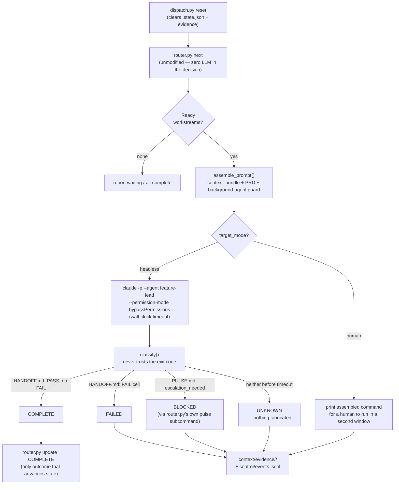

# LoomWarp — KD (`shi503`)

***A Python control plane — an unmodified `router.py` plus an additive `dispatch.py` — that decomposes a BLUEPRINT into scoped workstreams, dispatches each to a Claude Code session, and classifies the outcome from filesystem evidence rather than the process exit code, while naming no primitive of its own for a user to author.***

> **Profile drafted 2026-09-03 by `claude-opus-5`, not yet verified.** Attested, not captured — see `verification:` above.

## 1. At a glance

| | |
|---|---|
| **Altitude** | Two altitudes, both true (rule 7) — host and process layer → [§7](#7-identity-and-inclusion-test) |
| **Primitives** | 0 named, current — stated once, superseded; six candidates recorded → [§5](#5-primitives) |
| **Structured output** | `events.jsonl` — CloudEvents-shaped log, no schema file anywhere → [8c](#8c-observability) |
| **Binds mechanically?** | Mostly prose — four deny lists exist; the live run bypassed them → [2c](#2c-enforcement) |
| **State persists** | Four uncoordinated stores; none is the others' source of truth → [§7](#7-identity-and-inclusion-test) |
| **Serves** | Designed for independently-owned repos; run by one contributor, zero adopters → [§7](#7-identity-and-inclusion-test) |
| **Refuses** | No published refusal list — nothing on the record is refused → [§5](#5-primitives) |
| **Coverage** | ● 3 · ◐ 19 · ○ 11 · n/a 0 → [§4](#4-component-matrix) |
| **Source** | shi503/loomwarp-team-system @ `8844df6` · repo root (private) · read 2026-09-03 |
| **Unverified** | 7 items → [§10](#10-unverified) |

### 1a. Positioning stats

`−2 · −1 · −3 · −2 · −3† · −3 · −2` — the seven DX dimensions, in order.

> **⚠️ Drafted 2026-09-07, not yet verified.** Derived from LoomWarp's own repo, specs and standards
> tier, grounded against §4, §5 and §7 below. No person has re-read these seven values yet.
> [`01-scorecard.md`](../spectrums/01-scorecard.md) §1 R11 says how the banner comes off.

| | | | | |
|:-:|---|---:|:-:|---|
| **1** | Org scale | single operator | `─●─────` | multi-tenant, many teams |
| **2** | Weight class | light-weight | `──●────` | heavy-weight |
| **3** | Surfaces & extendability | one surface | `●──────` | many surfaces, environments, a platform |
| **4** | Context | nothing survives | `─●─────` | shared, durable, retrievable |
| **5** | Ecosystem **†** | tribal, low adoption | `▱▱▱▱▱▱` | wide adoption, longevity, network economies |
| **6** | Ownership | rented | `●──────` | yours |
| **7** | Cost controls & efficiency | unmetered, unrestricted | `─●─────` | observability, efficiency, routing |

**†** the one **graded** dimension; every other row is a position, not a score. **Neither end is better.** Ten axes sit beneath these seven — `I −2 · II 0 · III 0 · IV −3 (dual 0) · V −3 · VI +3 · VII +1 · VIII +1 · IX 0 · X −2` — and four of them feed no cell above by design.

→ [`spectrums/positioning.md`](../spectrums/positioning.md) (LoomWarp's row is not yet added — see §9 Placement) · [`positions/loomwarp.yaml`](../spectrums/positions/loomwarp.yaml) · [`01-scorecard.md`](../spectrums/01-scorecard.md) · [`00-README.md`](../spectrums/00-README.md)

*Scored 2026-09-07 against this profile as restructured 2026-09-07 from the source read of 2026-09-03. This table is the **one sanctioned echo** of the scorecard — derived from the same YAML that renders `positioning.md`, so the two match by construction. Re-score in the YAML, never here.*

### 1b. Contents

[§1 At a glance](#1-at-a-glance) · [1a Positioning stats](#1a-positioning-stats) · [§2 System map](#2-system-map) · [§3 Workflows](#3-workflows) · [§4 Component matrix](#4-component-matrix) · [§5 Primitives](#5-primitives) · [§6 Details](#6-details) · [§7 Identity and inclusion test](#7-identity-and-inclusion-test) · [§8 Limits](#8-limits) · [§9 Sources](#9-sources) · [§10 Unverified](#10-unverified)

**Deep read** — [`content/loomwarp/`](loomwarp/00-README.md), a 10-document control-plane reference
set at a finer grain than §6: [the vendored core](loomwarp/01-the-vendored-core.md) ·
[the BLUEPRINT and the workstream](loomwarp/02-the-blueprint-and-the-workstream.md) ·
[dispatch and outcome classification](loomwarp/03-dispatch-and-outcome-classification.md) ·
[the context fabric](loomwarp/04-the-context-fabric.md) ·
[skill distribution and the registry](loomwarp/05-skill-distribution-and-the-registry.md) ·
[policy tiers](loomwarp/06-policy-tiers.md) ·
[the standards tier](loomwarp/07-the-standards-tier.md) ·
[the audit trail](loomwarp/08-the-audit-trail.md) ·
[the consolidated guide](loomwarp/20-consolidated-guide.md)

*Read 2026-09-08 against the same commit this profile pins, `8844df6`, five days later. Scope: the
control plane in code and in its own markdown — `projects/` and `specs/`, 167 files of design
specification, are excluded. There being no vendor, the deep read substitutes a stated-intent ledger
cited to file and commit for a claim ledger, and records fifteen places where a design document and
the source tree disagree.*

## 2. System map

Redrawn from `docs/ARCHITECTURE.md`'s dispatch-sequence diagram (shi503/loomwarp-team-system @ `8844df6`, private repo, read 2026-09-03), converted from a `sequenceDiagram` to house-notation `flowchart TD` — no node or edge not in the original. Two further vendor diagrams are listed, not redrawn, in [§9](#9-sources).

**How it thinks about work.** A unit of work is one **workstream** — a BLUEPRINT entry paired with a PRD file — and the loop that moves it is `router.py`'s dependency-driven state machine, entirely free of any model call. `dispatch.py` wraps that resolver: for each ready workstream it either prints an assembled prompt for a human to paste into a second Claude Code window, or spawns `claude -p --agent feature-lead` itself, wall-clock-timeout-wrapped. Nothing in the loop trusts the process exit code — the outcome is read back off the filesystem, from a HANDOFF's PASS/FAIL cell or a PULSE's escalation flag, and only that classification advances `router.py`'s own state. Work lands in a target repo Claude Code already owns; LoomWarp's own state lives in `.state.json`, an evidence directory, and an events log that never joins the other two.

## 3. Workflows

**Not written at the 2026-09-03 read — pending the diagram pass.** A recorded gap. The sequences a workflow pass should draw, each already evidenced in §6 and needing no new source read:

1. **BLUEPRINT dependency resolution** — `router.py next` walking `dependencies:` to find ready workstreams, before `dispatch.py` ever runs ([3a](#3a-control), [3b](#3b-routing)).
2. **Skill and role-file sync** — `control/sync-skills.sh` copying `.claude/agents/*.md` and `skills/*/SKILL.md` into a target repo's own Claude Code conventions, with the documented removal defect ([4a](#4a-capability), [3c](#3c-composition)).
3. **Decision-ledger write** — schema validation → atomic write → SQLite index update, the one genuinely schema-validated store in the tree ([5b](#5b-team-memory), [9d](#9d-anti-fragile-lifecycle)).

## 4. Component matrix

`● named primitive · ◐ partial, present-not-first-class · ○ absent (pages named in §6) · n/a does not apply at this altitude`

**Marks copied verbatim from LoomWarp's column in [`04-harness-alignment.md`](../comparisons/04-harness-alignment.md) §2; not re-derived at the restructure.**

| # | Component | Mark | Primitive / note |
|---|---|:-:|---|
| **0 · Foundation** | | | |
| [0a](#0a-substrate) | Substrate | ◐ | Claude Code only, model per agent role; own spec calls portability undecided |
| **1 · Environment** | | | |
| [1a](#1a-environment) | Environment | ◐ | Shell, filesystem, git, GitHub; no declared inventory beyond a two-repo registry |
| **2 · Agent Harness** | | | |
| [2a](#2a-adapters--middleware) | Adapters & Middleware | ◐ | One adapter — a `claude -p` CLI invocation; no MCP, no ACP |
| [2b](#2b-hooks) | Hooks | ○ | Checked `.claude/settings.local.json`, `policy/tier-*.json`; none of its own |
| [2c](#2c-enforcement) | Enforcement | ◐ | Four risk-tier deny lists; the one live dispatch bypassed all of them |
| **3 · System Stacks** | | | |
| [3a](#3a-control) | Control | ◐ | `router.py`+`dispatch.py`; the classifier is a regex over a markdown table |
| [3b](#3b-routing) | Routing | ○ | Static BLUEPRINT fields only; no resolver |
| [3c](#3c-composition) | Composition | ◐ | Five role files; the composition runtime itself is Claude Code's |
| [3d](#3d-configuration) | Configuration | ◐ | BLUEPRINT YAML, router-read vs. dispatch-only fields; no managed-settings layer |
| [3e](#3e-standards) | Standards | ● | [**Standards tier**](#5-primitives) — seven guides, a stated inheritance contract |
| **4 · Capabilities** | | | |
| [4a](#4a-capability) | Capability | ◐ | Seven skills, synced by `cp -r`; a documented removal defect |
| [4b](#4b-capability-permissions) | Capability Permissions | ○ | Tiers gate actions, not who may invoke a skill |
| **5 · Context ⟳** | | | |
| [5a](#5a-individual-memory) | Individual Memory | ○ | No operator-scoped object; own spec defers this to Claude Code's default |
| [5b](#5b-team-memory) | Team Memory | ◐ | Schema-validated decision ledger; five ADRs, a real SQLite index |
| [5c](#5c-knowledge) | Knowledge | ○ | Nothing distinct from the context fabric and decision ledger |
| **6 · Workspaces ⟳** | | | |
| [6a](#6a-product) | Product | ○ | No statement of what its own output may not become |
| [6b](#6b-infrastructure) | Infrastructure | ◐ | Local subprocess only, wall-clock-timeout-wrapped; no container layer |
| [6c](#6c-estate) | Estate | ◐ | `registry/repositories.yaml`, two entries; omits the control repo itself |
| [6d](#6d-delivery) | Delivery | ○ | No CI/CD of its own; `ci-cd.md` is doctrine, not a wired gate |
| **7 · Workflow Tasks** | | | |
| [7a](#7a-workflow-tasks) | Workflow Tasks | ● | [**Work contract**](#5-primitives) — a BLUEPRINT entry + PRD, named in the current spec |
| **8 · Trust** | | | |
| [8a](#8a-evals) | Evals | ◐ | A real five-layer doctrine; the shipped classifier is the anti-pattern it forbids |
| [8b](#8b-evidence) | Evidence | ◐ | `context/evidence/<workstream>/`, populated at run time for dispatched work only |
| [8c](#8c-observability) | Observability | ◐ | `events.jsonl`, 13 lines, three types; no schema file anywhere |
| [8d](#8d-efficiency) | Efficiency | ◐ | One crude spend cap, explicitly unmeasured; no aggregate reporting |
| **9 · IMPROVE** | | | |
| [9a](#9a-learning) | Learning | ○ | No promotion mechanism; own spec calls this layer designed only |
| [9b](#9b-rituals) | Rituals | ○ | No cron, standup, or retro object of its own |
| [9c](#9c-cadence) | Cadence | ○ | Dispatch is manually invoked only; no scheduler |
| [9d](#9d-anti-fragile-lifecycle) | Anti-fragile Lifecycle | ● | [**Defect ledger**](#5-primitives) — `ISSUES.md`, eight dated entries with required fix |
| [9e](#9e-raise-the-floor) | Raise the Floor | ◐ | `standards/` plus a bootstrap skill; no retirement mechanism for a second way |
| [9f](#9f-diagnose-the-bottleneck) | Diagnose the Bottleneck | ○ | No throughput measurement; own spec calls this unprovided by anyone |
| **10 · Teams & Agents** | | | |
| [10a](#10a-roster) | Roster | ◐ | Five role files; own field-level analysis calls the function unprovided by anyone |
| [10b](#10b-org) | Org | ◐ | A thin, schema-validated RACI registry — two entries |
| **11 · Surfaces** | | | |
| [11a](#11a-surfaces) | Surfaces | ◐ | CLI only — headless dispatch or a human-run second window; markdown is the record |
| **● 3 · ◐ 19 · ○ 11 · n/a 0** | | | |

## 5. Primitives

| Primitive | Path / key | Project's own definition (verbatim) | Source |
|---|---|---|---|
| — | — | *(no row — see verdict)* | — |

**Count:** 0 named, current. **Verdict:** *stated once, then dropped* — the now-superseded `V0` spec (`specs/archive/v0/02-functions.md` §3) once stated a concrete six-primitive table for LoomWarp itself. Two of the six — **work contract** and **capability package** — survive as scattered concrete objects in the current `V1` framework; the other four (**context bundle**, **risk tier**, **evidence bundle**, **registry entry**) do not appear anywhere in `V1` by exact string. What `V1` states instead is a claim about a different object — *"All thirty-three components are configurable primitives — that is the membership test"* — the framework's own grading rule for **any** harness it scores, LoomWarp included, not a bounded set for what a LoomWarp *user* authors. This repo's own comparison corpus already records the resulting blank: *"unstated — artifacts exist; a set does not"* — re-verified against the files at this restructure, not merely re-quoted.

**No published refusal list.** Nothing on the record is refused.

**A hazard, named directly.** `V1`'s own vocabulary work borrows this atlas's primitive definition verbatim — *"a minimal, named, composable unit that the harness makes the single sanctioned way to express something"* — and a 5–7-healthy-range argument, from the same corpus this repo's own concepts document draws on. That borrowing is evidence about LoomWarp's authorship, not about what LoomWarp itself ships; the verdict above is read from its files, not from its self-classification (rule 8).

**Candidates the files suggest but LoomWarp does not name** — quarantined from the count above:

| Candidate | What it would be | Status found |
|---|---|---|
| **Work contract** | a BLUEPRINT entry + workstream PRD ([7a](#7a-workflow-tasks)) | Named concretely in `V1`; real, shipped, used in every workstream on disk |
| **Capability package** | a skill, synced by `cp -r` ([4a](#4a-capability)) | Named concretely in `V1`; shipped, with a documented removal defect |
| **Context bundle** | the per-workstream file list `dispatch.py` concatenates into a prompt | Shipped as a mechanism; the *named* object ("the Briefing") is unbuilt |
| **Risk tier** | `policy/tier-{1,2,3,4-auto}.json` ([2c](#2c-enforcement)) | One of four wired; the only live run bypassed it |
| **Evidence bundle** | `context/evidence/<workstream>/` + `events.jsonl` ([8b](#8b-evidence)) | Real but unschema'd |
| **Registry entry** | `registry/repositories.yaml` ([6c](#6c-estate)) | Real, two entries; the control repo itself is missing from its own list |

## 6. Details

`✅ direct · ↪ relayed · ⚠️ unverified`

### 0 · Foundation

#### 0a Substrate

◐ Claude Code only, model per agent role; own spec calls portability undecided

**Ships.** Claude Code only; model chosen per agent role via `model:` in `.claude/agents/*.md` frontmatter — opus for architect/strategist/loomwarp-cto-architect, sonnet for feature-lead/sub-agent. No portability adapter of its own.
**Path.** `.claude/agents/*.md` frontmatter
**Source.** ✅ `REPO/.claude/agents/*.md`; ↪ `V1/00-README.md` ("Adapter: … LoomWarp: undecided")
**More.** [`loomwarp/03-dispatch-and-outcome-classification.md`](loomwarp/03-dispatch-and-outcome-classification.md) §3 — binary resolution, the full flag list, and the role files the `--agent` flag selects.

### 1 · Environment

#### 1a Environment

◐ Shell, filesystem, git, GitHub; no declared inventory beyond a two-repo registry

**Ships.** Shell via subprocess to the `claude` binary (past a common alias trap, `resolve_claude_binary()`), the filesystem (`context/`, `registry/`, `.claude/fractal/`), git (submodule status, `git reset --hard && git clean -fd` on reset), GitHub (`gh pr list`, named in the demo script as a manual check). No declared environment manifest beyond the two-repo registry.
**Path.** `control/dispatch.py` (`resolve_claude_binary`, `cmd_reset`); `registry/repositories.yaml`
**Source.** ✅ same

### 2 · Agent Harness

#### 2a Adapters & Middleware

◐ One adapter — a <code>claude -p</code> CLI invocation; no MCP, no ACP

**Ships.** One adapter: a CLI invocation of `claude -p` with `--agent`, `--permission-mode`, `--output-format json`, `--max-budget-usd`. No MCP, no ACP, no protocol beyond that CLI surface.
**Path.** `control/dispatch.py` (`dispatch_headless`)
**Source.** ✅ same
**More.** [`loomwarp/03-dispatch-and-outcome-classification.md`](loomwarp/03-dispatch-and-outcome-classification.md) §3 — both invocations side by side, and why the binary is resolved rather than named.

#### 2b Hooks

○ Checked <code>.claude/settings.local.json</code>, <code>policy/tier-*.json</code>; none of its own

**Nothing here** — checked `.claude/settings.local.json` (`{"outputStyle": "Concise"}` only), `policy/tier-*.json` (permission lists, not lifecycle hooks), and grepped the tree for `PreToolUse`/`PostToolUse` definitions of LoomWarp's own; none found.
**Path.** —
**Source.** ✅ (absence, direct grep + file read)

#### 2c Enforcement

◐ Four risk-tier deny lists; the one live dispatch bypassed all of them

**Ships.** Four risk-tier permission files (`policy/tier-{1,2,3,4-auto}.json`), Claude-Code-`settings.json`-shaped allow/deny lists. `tier-1.json` is real and would bind mechanically (`Bash(rm -rf *)`, `.env` reads denied) — but the one live dispatch used `--permission-mode bypassPermissions`, which skips all of it, a limitation the vendor's own code comment names directly.
**Path.** `policy/tier-1.json`; `control/dispatch.py` lines 183–190
**Source.** ✅ (doctrine ≠ code) same
**More.** [`loomwarp/06-policy-tiers.md`](loomwarp/06-policy-tiers.md) — all four files compared entry by entry, who loads them (nothing in-repo), and the `R0`–`R4` ladder beside them.

### 3 · System Stacks

#### 3a Control

◐ <code>router.py</code>+<code>dispatch.py</code>; the classifier is a regex over a markdown table

**Ships.** `router.py` (vendored, unmodified, model-free dependency resolver) plus `dispatch.py` (additive: prompt assembly, subprocess dispatch, outcome classification, evidence write, conditional state update). Deterministic decomposition and dispatch — but outcome classification itself is a regex over markdown (`re.search(r"\|\s*FAIL\s*\|", content)`), not structured evidence, against the vendor's own evaluation doctrine.
**Path.** `fractal/router.py`; `control/dispatch.py` (`classify()`)
**Source.** ✅ (doctrine ≠ code) same
**More.** [`loomwarp/01-the-vendored-core.md`](loomwarp/01-the-vendored-core.md) and [`loomwarp/03-dispatch-and-outcome-classification.md`](loomwarp/03-dispatch-and-outcome-classification.md) §4 — the router's five subcommands, and both classifier regexes run against the two shipped HANDOFF templates.

#### 3b Routing

○ Static BLUEPRINT fields only; no resolver

**Nothing here** as a resolver — checked the BLUEPRINT schema and `registry/repositories.yaml`. What exists instead: a BLUEPRINT entry's `repo` and `target_agent` fields fix which sibling and agent role handle a workstream, author-time and static.
**Path.** `fractal/BLUEPRINT-*.yaml`; `registry/repositories.yaml`
**Source.** ✅ same
**More.** [`loomwarp/02-the-blueprint-and-the-workstream.md`](loomwarp/02-the-blueprint-and-the-workstream.md) §2 — every field and which of the two programs reads it.

#### 3c Composition

◐ Five role files; the composition runtime itself is Claude Code's

**Ships.** Five role files in `.claude/agents/` (architect, feature-lead, loomwarp-cto-architect, strategist, sub-agent); `feature-lead.md` documents delegating up to 2 Sub-Agent sessions. Composition itself is Claude Code's native mechanism — LoomWarp supplies the role files, not the runtime.
**Path.** `.claude/agents/*.md`
**Source.** ✅ same
**More.** [`loomwarp/05-skill-distribution-and-the-registry.md`](loomwarp/05-skill-distribution-and-the-registry.md) §4 — the five role files against `vendor/manifest.json`'s four, and which is LoomWarp's own.

#### 3d Configuration

◐ BLUEPRINT YAML, router-read vs. dispatch-only fields; no managed-settings layer

**Ships.** BLUEPRINT YAML with two field classes, explicit in every blueprint's header comment: standard fields (`feature_lead`, `model`, `prd`, `dependencies`) read by the unmodified router; additive fields (`repo`, `target_agent`, `target_mode`, `kebab`, `context_bundle`) read only by `dispatch.py`, *"silently ignored by router.py."* No managed-settings/org-override layer of its own.
**Path.** `fractal/BLUEPRINT-*.yaml`; `.claude/settings.local.json`
**Source.** ✅ same
**More.** [`loomwarp/02-the-blueprint-and-the-workstream.md`](loomwarp/02-the-blueprint-and-the-workstream.md) §3 — four sources disagree about which fields are "standard"; `router.py` reads three.

#### 3e Standards

● <b>Standards tier</b> — seven guides, a stated inheritance contract

**Ships.** Seven guides under `standards/` (engineering-principles, architecture-patterns, definition-of-done, testing-patterns, evaluation-doctrine, ci-cd, process-improvement-model — 927 lines plus a 43-line index), with a stated three-tier inheritance contract: *"Reference, never copy... Tighten, never contradict."* The most developed row in this profile.
**Path.** `standards/README.md`; `standards/*.md`
**Source.** ✅ same
**More.** [`loomwarp/07-the-standards-tier.md`](loomwarp/07-the-standards-tier.md) — the seven guides by section, the three-rule contract, and the tension between rules 1 and 3.

### 4 · Capabilities

#### 4a Capability

◐ Seven skills, synced by <code>cp -r</code>; a documented removal defect

**Ships.** Seven skills (`commit-summarize`, `cross-repo-dispatch` — documentation-only, `fractal-init`, `gap-analysis`, `handoff`, `pulse`, `quality-pass`), distributed to sibling repos by a `cp -r` sync script; the self-assessment names a known defect — a deleted skill stays installed — not independently re-verified this pass.
**Path.** `skills/*/SKILL.md`; `docs/DEMO-SCRIPT.md` (`sync-skills.sh`)
**Source.** ✅ (skills, direct); ↪ (removal defect, `SELF`)
**Drift, both figures carried.** This row records `cp -r` and a removal defect, relayed from the self-assessment on **2026-09-03**. A direct read of `control/sync-skills.sh` at the same commit on **2026-09-08** finds `rsync --delete` scoped per skill with a `.synced-from-loomwarp` receipt driving removal, whose own header states it replaced the `cp -r` loop and its three defects. Neither read is wrong; one is relayed and one is direct.
**More.** [`loomwarp/05-skill-distribution-and-the-registry.md`](loomwarp/05-skill-distribution-and-the-registry.md) §2–§4.

#### 4b Capability Permissions

○ Tiers gate actions, not who may invoke a skill

**Nothing here** — checked every `SKILL.md` frontmatter and `policy/tier-*.json`; no mechanism scopes *who* may invoke a given skill or agent role once it is copied in. Permission tiers gate actions (shell commands, file reads), not capability access.
**Path.** —
**Source.** ✅ (absence, direct)

### 5 · Context ⟳

#### 5a Individual Memory

○ No operator-scoped object; own spec defers this to Claude Code's default

**Nothing here** as a LoomWarp-owned object — checked `context/org/`, `context/domain/`, `context/evidence/`, `context/memory/` in full; all team- or repo-scoped, none per-operator. The framework's own spec defers this layer explicitly to Claude Code's native default.
**Path.** —
**Source.** ✅ (absence, direct); ↪ (the deferral, `V1/00-README.md`)

#### 5b Team Memory

◐ Schema-validated decision ledger; five ADRs, a real SQLite index

**Ships.** `context/org/PRINCIPLES.md`, `context/domain/taskflow-platform/CONVENTIONS.md` (read into every dispatched prompt via a workstream's `context_bundle`), and `context/memory/decision-ledger/` — a genuine schema-validated ADR store (`schema/schema.yaml`, `schema/validate.ts`, atomic writes, locks, a SQLite index, a CLI with `list`/`audit`), five ADRs on disk.
**Path.** `context/org/PRINCIPLES.md`; `context/domain/taskflow-platform/CONVENTIONS.md`; `context/memory/decision-ledger/`
**Source.** ✅ same, direct read of schema + store
**More.** [`loomwarp/04-the-context-fabric.md`](loomwarp/04-the-context-fabric.md) §2–§4 — `schema.yaml` v2.0's fields, `people.yaml`'s two entries, and the fact that no control-plane code reads the store.

#### 5c Knowledge

○ Nothing distinct from the context fabric and decision ledger

**Nothing here** — checked `context/`, `skills/`, `standards/` and grepped for "RAG," "embedding," "knowledge base," "retriev*"; nothing distinct from the authored context fabric (5b). The framework's own spec calls the equivalent object (the Briefing) *"designed... no implementation was demonstrated"* — this pass finds the same.
**Path.** —
**Source.** ✅ (absence, direct); ↪ (the Briefing's status)

### 6 · Workspaces ⟳

#### 6a Product

○ No statement of what its own output may not become

**Nothing here** — no statement of what an agent's output may not become for LoomWarp's own deliverable was found; `registry/repositories.yaml`'s `role`/`notes` fields describe sibling repos, not directives on shape. The framework's own spec marks this layer `bet` horizon and *"owed"* for its own instance.
**Path.** —
**Source.** ✅ (absence, direct)

#### 6b Infrastructure

◐ Local subprocess only, wall-clock-timeout-wrapped; no container layer

**Ships.** Local subprocess execution only: `dispatch.py` spawns `claude` via `subprocess.run` inside a Python venv, wall-clock-timeout-wrapped (`LOOMWARP_DISPATCH_TIMEOUT_SEC`, default 600s). No container, remote execution, or Kubernetes layer; git submodules are the only isolation between siblings.
**Path.** `control/dispatch.py`; `.venv/`
**Source.** ✅ same

#### 6c Estate

◐ <code>registry/repositories.yaml</code>, two entries; omits the control repo itself

**Ships.** `registry/repositories.yaml` — a real, if thin, inventory schema: `name`, `path`, `origin`, `visibility`, `owner`, `role`, `modified_by_this_project`, `fractal_installed`, `notes`, per repo. Two entries at this read. The control repo itself is absent from its own registry despite being a dispatch target — a named, open defect.
**Path.** `registry/repositories.yaml`; `fractal/ISSUES.md` (`ISSUE-001`)
**Source.** ✅ same
**More.** [`loomwarp/05-skill-distribution-and-the-registry.md`](loomwarp/05-skill-distribution-and-the-registry.md) §1 — the registry's stated consumers against its one real one.

#### 6d Delivery

○ No CI/CD of its own; <code>ci-cd.md</code> is doctrine, not a wired gate

**Nothing here** as a wired pipeline — `find .github -type f` returns no matches. The demo script references `git push`/`gh pr` as a tier-3-permitted action and a manual `gh pr list` check between rehearsals; `standards/ci-cd.md` is prescriptive doctrine, not a gate here.
**Path.** `docs/DEMO-SCRIPT.md`; `standards/ci-cd.md`
**Source.** ✅ same

### 7 · Workflow Tasks

#### 7a Workflow Tasks

● <b>Work contract</b> — a BLUEPRINT entry + PRD, named in the current spec

**Ships.** The **work contract** — a BLUEPRINT entry (`feature_lead`, `model`, `prd`, `dependencies`, plus additive `repo`/`target_agent`/`target_mode`/`kebab`/`context_bundle` fields) paired with a workstream PRD file. The framework's own current spec names this object directly as the one genuinely surviving, concrete primitive at this layer — `router.py`/`dispatch.py` are named machinery, explicitly not graded.
**Path.** `fractal/BLUEPRINT-*.yaml`; `fractal/workstreams/*.md`
**Source.** ✅ same; ↪ (the machinery/primitive split, `V1/00-README.md`)
**More.** [`loomwarp/02-the-blueprint-and-the-workstream.md`](loomwarp/02-the-blueprint-and-the-workstream.md) — the file shape, every field, the graph counted, and the eight PRD paths that do not exist.

### 8 · Trust

#### 8a Evals

◐ A real five-layer doctrine; the shipped classifier is the anti-pattern it forbids

**Ships.** The vendor's own doctrine (`standards/evaluation-doctrine.md`) specifies a genuine five-layer model (L1 Deterministic → L5 Outcome) with hard rules — *"Never trust the exit code... Never parse prose for structure... Two-attempt maximum"* — but the shipped classifier this repo actually runs (`dispatch.py`'s `classify()`) is exactly the anti-pattern the doctrine names: a regex over a HANDOFF's markdown table.
**Path.** `standards/evaluation-doctrine.md`; `control/dispatch.py` (`classify()`)
**Source.** ✅ (doctrine ≠ code), both direct
**More.** [`loomwarp/03-dispatch-and-outcome-classification.md`](loomwarp/03-dispatch-and-outcome-classification.md) §4 — the two regexes are asymmetric, and both shipped HANDOFF templates classify as `COMPLETE` with their placeholders intact.

#### 8b Evidence

◐ <code>context/evidence/&lt;workstream&gt;/</code>, populated at run time for dispatched work only

**Ships.** `context/evidence/<workstream>/{run.json, <OUTCOME>.md}`, populated at dispatch time with exit code, duration, and the classifying HANDOFF/PULSE text verbatim — real, and genuinely populated (three named workstream directories at this read).
**Path.** `context/evidence/`; `control/dispatch.py` (`dispatch_headless`)
**Source.** ✅ same
**Drift, both figures carried.** Three workstream directories at the **2026-09-03** read; at the **2026-09-08** read of the same commit the tracked tree holds `.gitkeep` only, because `.gitignore` excludes `context/evidence/*`. A working tree and a committed tree, five days apart.
**More.** [`loomwarp/03-dispatch-and-outcome-classification.md`](loomwarp/03-dispatch-and-outcome-classification.md) §5 — `run.json`'s three fields, the missing stderr, and the inferred `timed_out`.

#### 8c Observability

◐ <code>events.jsonl</code>, 13 lines, three types; no schema file anywhere

**Ships.** `control/events.jsonl` — one append-only, one-JSON-object-per-line log every dispatch writes to, described in the product's own words as *"CloudEvents-shaped."* Verified at this read: 13 lines, three event types (`dispatch_start`, `dispatch_end`, `dispatch_printed`). **No schema file of any kind exists anywhere in this repository** (`find . -iname "*.schema.json"` — zero hits), against the vendor's own stated bar: *"An unvalidated event stream is a log, not evidence."* This is the card's structured output, by its own rule not yet earned.
**Path.** `control/events.jsonl`
**Source.** ✅ same; ✅ `find . -iname "*.schema.json"` (no matches); ✅ `standards/evaluation-doctrine.md` §3 (quoted)
**More.** [`loomwarp/03-dispatch-and-outcome-classification.md`](loomwarp/03-dispatch-and-outcome-classification.md) §6 — the three emitted shapes, the one logged line no code path produces, and the unpaired start.

#### 8d Efficiency

◐ One crude spend cap, explicitly unmeasured; no aggregate reporting

**Ships.** One crude cap: `LOOMWARP_DISPATCH_MAX_BUDGET` (default `5`), passed straight through as `--max-budget-usd`. The module's own docstring says this number is not evidence-based: *"this is a starting point, not a measured value; re-tune it from the actual spike run's real cost."* No aggregate cost reporting across workstreams.
**Path.** `control/dispatch.py` (module docstring, `MAX_BUDGET_USD`)
**Source.** ✅ same
**More.** [`loomwarp/03-dispatch-and-outcome-classification.md`](loomwarp/03-dispatch-and-outcome-classification.md) §3.

### 9 · IMPROVE

#### 9a Learning

○ No promotion mechanism; own spec calls this layer designed only

**Nothing here** as a running mechanism — the framework's own spec marks this layer *"designed only"* for LoomWarp, and `standards/process-improvement-model.md` is prescriptive doctrine about how improvement should flow, not a wired promotion pipeline.
**Path.** —
**Source.** ✅ (absence, direct); ↪ (the "designed only" framing, `SELF`)

#### 9b Rituals

○ No cron, standup, or retro object of its own

**Nothing here** — grepped `standards/`, `skills/`, `fractal/`, `context/`, `docs/` for "cron," "standup," "retro," "ritual"; no recurring human-practice object of LoomWarp's own was found.
**Path.** —
**Source.** ✅ (absence, direct grep)

#### 9c Cadence

○ Dispatch is manually invoked only; no scheduler

**Nothing here** as an automatic scheduler — `dispatch.py run`/`reset` are invoked manually per the demo script's own commands; no cron, hook-triggered, or scheduled-session mechanism was found anywhere in the tree.
**Path.** `docs/DEMO-SCRIPT.md`
**Source.** ✅ same

#### 9d Anti-fragile Lifecycle

● <b>Defect ledger</b> — <code>ISSUES.md</code>, eight dated entries with required fix

**Ships.** `fractal/ISSUES.md` — an append-only defect ledger, eight entries at this read (`ISSUE-001`–`004`, `OBS-005`, `FINDING-006`/`007`, `ISSUE-008`), each carrying Severity, Found-date, Assigned workstream, Consequence, Why-it-was-missed, Interim mitigation, Required fix. A genuine anti-fragile mechanism, not a changelog-as-narrative substitute.
**Path.** `fractal/ISSUES.md`
**Source.** ✅ same
**More.** [`loomwarp/08-the-audit-trail.md`](loomwarp/08-the-audit-trail.md) — the entry shape, the three prefixes, the severity vocabulary the header does not declare, and three practices the register demonstrates.

#### 9e Raise the Floor

◐ <code>standards/</code> plus a bootstrap skill; no retirement mechanism for a second way

**Ships.** `standards/` itself (vetted starting templates) plus `skills/fractal-init/SKILL.md` (a bootstrap checklist for a new epic session) function as raise-the-floor starting points; no per-output guardrail beyond the standards tier's own prose was found.
**Path.** `standards/README.md`; `skills/fractal-init/SKILL.md`
**Source.** ✅ same

#### 9f Diagnose the Bottleneck

○ No throughput measurement; own spec calls this unprovided by anyone

**Nothing here** — no throughput measurement or bottleneck-diagnosis tool was found; the framework's own spec explicitly says this function has no provider — *"nobody"* — and that finding held for LoomWarp's own instance too on this pass.
**Path.** —
**Source.** ✅ (absence, direct); ↪ (the "nobody" framing, `V0` §6)

### 10 · Teams & Agents

#### 10a Roster

◐ Five role files; own field-level analysis calls the function unprovided by anyone

**Ships.** `.claude/agents/*.md` — five role files (architect, feature-lead, loomwarp-cto-architect, strategist, sub-agent), each with a model tier and description. A genuine "who exists" list for LoomWarp's own control plane — though the framework's own field-level analysis, scoring the field including itself, calls this function unprovided by anyone, a tension recorded rather than resolved ([§10](#10-unverified)).
**Path.** `.claude/agents/*.md`
**Source.** ✅ same

#### 10b Org

◐ A thin, schema-validated RACI registry — two entries

**Ships.** `context/memory/decision-ledger/schema/people.yaml` — a small RACI-shaped registry (`KD`: Owner, default RACI `A`; `AGENT`: Implementer, default RACI `R`), validated by the ledger's own `validate.ts`. Thin but real and mechanically checked, ahead of the framework's own field-level finding that "nobody" ships this either.
**Path.** `context/memory/decision-ledger/schema/people.yaml`; `.../validate.ts`
**Source.** ✅ same

### 11 · Surfaces

#### 11a Surfaces

◐ CLI only — headless dispatch or a human-run second window; markdown is the record

**Ships.** CLI only: `claude -p` (headless) or an interactive `claude` session opened by a human from a printed command; `HANDOFF.md`/`PULSE.md` markdown files are the surface work is judged from. No dashboard or web UI. Stated source-of-truth default, quoted as the framework's own recommendation: *"Markdown plans and specs in the repository are the source of truth... they flow outward... which are views."*
**Path.** `control/dispatch.py` (`dispatch_human`); `docs/DEMO-SCRIPT.md`
**Source.** ✅ same; ↪ (the SoT quote, `V0/09-context-layer.md`, relayed via `V1/00-README.md`)
**More.** [`loomwarp/03-dispatch-and-outcome-classification.md`](loomwarp/03-dispatch-and-outcome-classification.md) §3 — what each mode prints, spawns and persists.

## 7. Identity and inclusion test

Identity · inclusion test · loop question

| Field | Value |
|---|---|
| Canonical name | **LoomWarp** — no binary; a directory layout plus `.claude/agents/*.md` copied into a target repo ✅ |
| Prior names / homes | Not a rename. Built as **FRACTAL** (`shi503/fractal-agent-system`), *"evolved into a federated, multi-repository control plane."* `router.py` is vendored byte-identical from that repo ✅ |
| Owner / maintainer | GitHub user `shi503` (KD). Single contributor, 51 commits total; repo is private ✅ |
| GitHub URL | `github.com/shi503/loomwarp-team-system` (private) ✅ |
| License | **None.** No `LICENSE` file in the tree; `gh api` reports `"license": null` ✅ |
| Stars | 0 (private repo; `stargazers_count: 0`, `forks: 0`) ✅ |
| Language | GitHub linguist reports **JavaScript**, by byte count — eight `.ts` files under the decision ledger outweigh the two `.py` control-plane files (323 + 345 lines); 219 of 264 tracked files are Markdown ✅ |
| Repo created | 2026-08-04; first commit 2026-08-03 ✅ |
| First release | None — no tags, no releases ✅ |
| Latest release | None. HEAD is `8844df6` (2026-09-03T05:06:49Z), 51 commits deep, one month old ✅ |
| Install | None published. `git clone --recursive` is blocked today by one private submodule; the observed pattern is copying `.claude/agents/*.md` and `fractal/` into a target repo by hand ✅ ↪ |
| Website / docs | None. `README.md` plus three `docs/*.md` files are the whole of it ✅ |
| What it says it is, verbatim | GitHub description: *"LoomWarp — federated context harness and multi-repo FRACTAL control plane."* README H1: *"LOOMWARP is a distributed context harness for structuring many threads of work into one coordinated system."* Its own self-assessment narrows this: *"Category: process layer, not a harness."* ✅ ↪ |

**Does state persist across sessions, where, in what format?** **Yes, in four uncoordinated places.** `fractal/.state.json` (gitignored, one flat map, overwritten wholesale by a second blueprint's `init`); `context/evidence/<workstream>/{run.json, <OUTCOME>.md}`, written by `dispatch.py` at run time; `control/events.jsonl`, one append-only log (13 lines, three event types); `context/memory/decision-ledger/`, a real schema-validated ADR store. None of the four is the others' source of truth, and nothing joins them. ✅

**Does it serve more than one person? — answered per layer (rule 7).** **As designed, yes** — the mandate states plainly: *"an open, runtime-neutral control plane for multi-repository agent work"* dispatching *"scoped work across independently owned repositories."* **As run, no** — *"No external adopters. No second person has installed it,"* and the blocking reason is structural: a private submodule means a stranger cannot `git clone --recursive`. Net: designed for more than one person, evidenced today for exactly one. ✅ ↪

**Does it bind mechanically, or only by prose?** **Mostly prose.** Four permission-tier files exist, shaped like a real Claude Code `settings.json` allow/deny list — `tier-1.json`'s deny list is genuine and would bind mechanically if loaded. But the one live dispatch used `--permission-mode bypassPermissions`, and `dispatch.py`'s own comment names why: *"bypassPermissions is the confirmed-working path for tonight's live dispatch — but it also skips the tier-3 DENY rules."* No hook, sandbox, or managed-settings layer of LoomWarp's own was found; the only mechanical binding that exists is Claude Code's own `settings.json`, used unevenly, not a LoomWarp-owned enforcement point. ✅

**Loop question.** `router.py` is a pure, model-free state machine; `dispatch.py` wraps it with a subprocess layer that either prints an assembled prompt for a human, or spawns `claude -p` itself, wall-clock-timeout-wrapped, and classifies the result **without trusting the exit code** — reading a HANDOFF's PASS/FAIL cell or a PULSE's `escalation_needed` flag. `.claude/agents/*.md` and `skills/*/SKILL.md` are copied into a target repo's own Claude Code conventions, where Claude Code loads them as its own subagent and skill definitions. No adapter runs the reverse direction; the framework's own `F0 Substrate` spec calls its own adapter posture **undecided**. ✅ ↪

**Altitude — two, both true (rule 7).** **Host / gateway.** An external controller starting, stopping and reading the state of independent Claude Code sessions through shared filesystem evidence, not by holding a socket into any of them. **Process layer.** LoomWarp installs into the loop it hosts — its own role files and skills become that same Claude Code's native conventions, translated through no LoomWarp-owned runtime.

## 8. Limits

What it does not claim, in the vendor's words

**From `fractal/STRATEGIST-loomwarp.md`** ✅

> §4 Constraints, Prior-work boundary: Prior private deployments are cited for quantitative facts and
> pattern shape only... LoomWarp is self-contained; no private repo is ever a live dependency.

**From the product's own self-assessment (secondary, ↪)**

> No external adopters. No second person has installed it. The v1 gate — clean-machine install ≤30
> min with no author help — is unmet.
>
> A private submodule means a stranger cannot `git clone --recursive`. Every claim about being
> runnable is blocked behind this.
>
> The only live run used `bypassPermissions`. The shipped diagram claimed `acceptEdits`. That is
> FM-2 (policy theater) caught in our own repo.
>
> Licence / distribution: Not established.

**From `control/dispatch.py` (code comment, `ADR-005`)** ✅

> `acceptEdits` — even with an explicit `--settings tier-3.json` override — is blocked by Claude
> Code's workspace-trust gate for a repo that has never been opened interactively...
> `bypassPermissions` is the confirmed-working path for tonight's live dispatch — but it also skips
> the tier-3 DENY rules, which is a real, named limitation, not a solved problem.

**From `standards/evaluation-doctrine.md`** ✅

> Never trust the exit code... Never trust the narrative... Never parse prose for structure —
> deriving pass/fail by pattern-matching a markdown table is brittle by construction... Emit
> structured evidence.
>
> Every event validates against a schema. An unvalidated event stream is a log, not evidence.

**From `fractal/ISSUES.md`** ✅

> `ISSUE-001`: a `repo: .` workstream runs to completion, writes its HANDOFF where the router lives,
> and the classifier never finds it — producing a 600-second wall-clock timeout and `UNKNOWN`,
> indistinguishable from a genuine failure.
>
> `ISSUE-002`: Running `init` for a second blueprint silently overwrites the first blueprint's
> completion record. `.state.json` is gitignored, so the loss is unrecoverable.

**From `V1/00-README.md` (the current framework spec, ↪ relayed via the corpus)**

> Briefing... narrowed 2026-08-26: the idea is claimed (OpenAI's "run receipt"); no implementation
> was demonstrated.

## 9. Sources

Primary · secondary · placement · diagrams not redrawn

**All primary sources accessed 2026-09-03. No source was re-read at the 2026-09-07 restructure.**

**Primary — GitHub API and repo.** Local clone of `shi503/loomwarp-team-system`, pinned to `8844df6f4bc48f8a563340eb3163401792e000d5`; `gh api repos/shi503/loomwarp-team-system` (identity, description, license, stars, language, timestamps, visibility); `gh api .../{releases,tags}` (both empty); `gh api .../contributors` (one contributor, 51 contributions); `git log`/`git ls-files` for commit and language counts.

**Primary — files.** `README.md`; `docs/{ARCHITECTURE,BUILD-LOG,DEMO-SCRIPT}.md`; `fractal/router.py`; `control/dispatch.py`; `fractal/{ISSUES.md, STRATEGIST-loomwarp.md, BLUEPRINT-LoomWarp-V1.yaml, BLUEPRINT-CrossRepo-Demo.yaml}`; `.claude/agents/*.md`; `.claude/settings.local.json`; `standards/README.md` and all seven guides; `skills/*/SKILL.md` (all seven); `policy/tier-{1,2,3,4-auto}.json`; `registry/repositories.yaml`; `context/org/PRINCIPLES.md`; `context/domain/taskflow-platform/CONVENTIONS.md`; `context/memory/decision-ledger/` (full listing plus schema); `control/events.jsonl` (parsed whole); `vendor/README.md`; `.gitmodules`; `.gitignore`; `V0` (`specs/archive/v0/02-functions.md`) and `V1` (`specs/v1-framework/00-README.md`), read as primary as the vendor's own design-document history.

**Secondary (↪).** `projects/loomwarp/references/comparisons/systems/loomwarp.md` in the source repo (`SELF`) — the product's own self-assessment, read in full, cited by section; used for corroboration and framing, never as the sole source for a ✅ cell.

**Placement.** Short-profiles row: [`comparisons/systems/90-short-profiles.md`](../comparisons/systems/90-short-profiles.md) §1 — **pending, not edited by this workstream** (see the report accompanying this restructure). Grid columns: [`comparisons/04-harness-alignment.md`](../comparisons/04-harness-alignment.md) §2 (marks copied from, not re-derived) and [`comparisons/02-component-matrix.md`](../comparisons/02-component-matrix.md) §1 (already open, corrected not replaced). Index row: [`index.md`](../index.md) — **pending, not edited by this workstream**. Positioning: [`spectrums/positioning.md`](../spectrums/positioning.md) — **pending, not edited by this workstream**.

**Diagrams not redrawn.** `docs/ARCHITECTURE.md` carries two further mermaid diagrams beyond the dispatch sequence redrawn in §2: a repo-topology `flowchart TB` (Control repo / WebRepo / NotifyRepo subgraphs), and a "six-plane architecture — built vs. designed" `flowchart TB` (Outcomes → Intake → Control → Workers → Repos → Evidence → Learning). Both named here, not redrawn.

## 10. Unverified

7 items

- **Whether `10a` Roster is a genuine contradiction or a scale mismatch.** LoomWarp ships its own
`.claude/agents/*.md` roster (five files, real) while its own field-level analysis, scoring the field including itself, calls the function unprovided by *anyone*. Both readings are defensible; no document reconciling them was found. ⚠️
- **The exact current status of `repos/notify-service`'s visibility** beyond the registry's `private`
field — not independently re-queried via `gh api` this pass, since the repo is a submodule outside this workstream's manifest. ↪
- **Whether `control/events.jsonl`'s three event types are the complete historical set**, or whether
an earlier, rotated log held more — `git log -p` on the file was not run. ⚠️
- **The two other diagrams in `docs/ARCHITECTURE.md`** — named in §9, not redrawn.
- **`context/memory/decision-ledger`'s provenance as "adapted from real prior art"** — named without
the prior art identified in-tree; not resolved. ⚠️
- **Whether any workstream in `BLUEPRINT-LoomWarp-V1.yaml`'s ten-workstream graph has actually been
dispatched to completion** — `.state.json` is gitignored and absent from the working tree; only partial evidence-directory traces were found. ⚠️
- **The exact line/byte count GitHub's linguist used to classify the repo as JavaScript** — inferred
from file-extension counts, not re-derived from linguist stats directly. ↪

