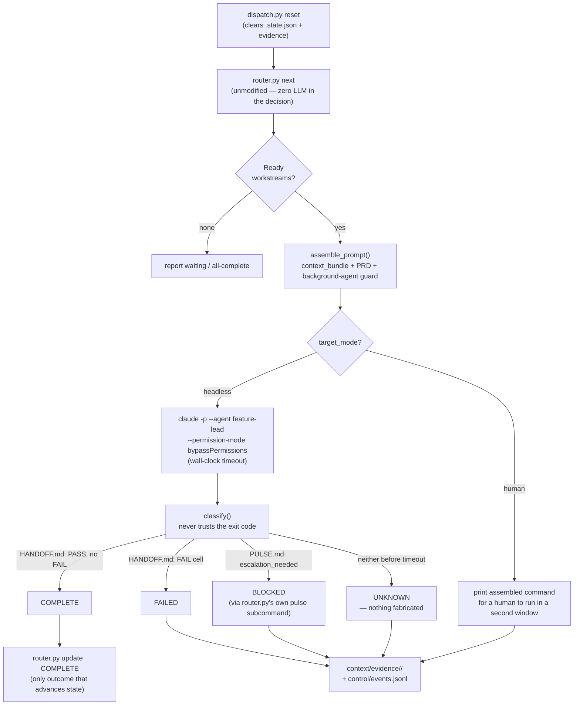

# LoomWarp — KD (`shi503`)

**Why this file exists.** [`RULING-2026-09-02-spinout.md`](../RULING-2026-09-02-spinout.md) moved the
harness-grading framework out of LoomWarp so it could grade LoomWarp without grading itself, and named
this file's obligation directly: *"`systems/loomwarp.md` is re-authored here in W4 as a peer teardown;
**its primitive-set row stays blank until someone earns it.**"* Third in the W4 queue
([`fractal/workstreams/W4-teardowns.md`](../fractal/workstreams/W4-teardowns.md)), read against the
product's actual files rather than its own self-assessment, which is a **secondary** source here (◐)
and stays exactly where it is:
[`comparisons/systems/loomwarp.md`](https://github.com/shi503/loomwarp-team-system/blob/master/projects/loomwarp/references/comparisons/systems/loomwarp.md)
in the source repo. Synthesis: this file's cells feed the LoomWarp column already open in
[`comparisons/02-component-matrix.md`](../comparisons/02-component-matrix.md) §1 (corrected, not
replaced), a new LoomWarp column in
[`comparisons/04-harness-alignment.md`](../comparisons/04-harness-alignment.md) §2, and a row in
[`comparisons/systems/90-short-profiles.md`](../comparisons/systems/90-short-profiles.md) §1.

**In one screen.** LoomWarp is a Python control plane — an unmodified, vendored `router.py` plus an
additive `dispatch.py` — that reads a BLUEPRINT, decomposes it into scoped **workstreams**, and either
prints an assembled prompt for a human to paste into a second Claude Code window or spawns `claude -p`
headlessly against a sibling repository, classifying the outcome from filesystem evidence (a HANDOFF's
PASS/FAIL cell, a PULSE's escalation flag) rather than trusting the process exit code. Around that core
sit a **context fabric** (org/domain markdown plus a real, schema-validated decision ledger), a
**standards tier** (seven guides, ~930 lines, with a stated inheritance contract), and a **policy**
layer (four risk-tier files, one wired). It ships no primitive it names as such: the analytical
33-component framework it also carries is a grading instrument for *any* harness, not a claim about
what LoomWarp itself asks a user to author, and its own comparison corpus already records the
resulting blank — *"Artifacts exist; a set does not"* — a finding this file verifies rather than
repeats. It refuses nothing on the record; the closest thing to a refusal is an admission the vendor's
own standards document makes about its own shipped classifier (§D).

**What it does not claim.** §D. The load-bearing lines: *"No external adopters. No second person has
installed it"*; *"the only live run used `bypassPermissions`, which skips deny rules entirely"*; and,
from the vendor's own evaluation doctrine, *"Never parse prose for structure... Emit structured
evidence"* and *"Every event validates against a schema. An unvalidated event stream is a log, not
evidence"* — both violated by the shipped `dispatch.py`/`events.jsonl` pair this same file inventories
below (§F).

---

Access date for every source: **2026-09-03**. Marks: ✅ direct (primary read) · ◐ relayed
(secondary) · ⚠️ unverified.

URL shorthands used below:
- `REPO` = `https://github.com/shi503/loomwarp-team-system` (private; read via local clone at
  `8844df6`, and via authenticated `gh api repos/shi503/loomwarp-team-system`)
- `SELF` = the product's own self-assessment,
  `projects/loomwarp/references/comparisons/systems/loomwarp.md` in `REPO` — secondary (◐) throughout
- `V0` = `projects/loomwarp/specs/archive/v0/` in `REPO` (the superseded twelve-function spec)
- `V1` = `projects/loomwarp/specs/v1-framework/` in `REPO` (the current framework spec — itself
  re-cut, unread here, as `spec/v1-framework/` in this repo per the spin-out ruling; cited at its
  `REPO` path since that is where LoomWarp's own current self-description lives)

---

## A. Identity

| Field | Value | Mark / Source |
|---|---|---|
| Canonical name | **LoomWarp** — no binary; a directory layout plus `.claude/agents/*.md` copied into a target repo | ✅ `REPO/README.md` |
| Prior names / homes | Not a rename. Built as **FRACTAL** (`shi503/fractal-agent-system`) *"evolved into a federated, multi-repository control plane."* `router.py` is vendored byte-identical from that repo (`vendor/manifest.json`, `ADR-001`); LoomWarp is the wrapper, not a fork | ✅ `REPO/README.md`; ✅ `REPO/vendor/README.md` |
| Owner / maintainer | GitHub user **`shi503`** (KD). Single contributor, 51 commits total; repo is **private** | ✅ `gh api repos/shi503/loomwarp-team-system/contributors` (one entry, 51 contributions) |
| GitHub URL | `REPO` (private) | ✅ `gh api repos/shi503/loomwarp-team-system` |
| License | **None.** No `LICENSE` file in the tree; `gh api` reports `"license": null` | ✅ `gh api repos/shi503/loomwarp-team-system`; ✅ `find . -iname "LICENSE*"` (no match) |
| Stars | 0 (private repo; `stargazers_count: 0`, `forks: 0`) | ✅ `gh api repos/shi503/loomwarp-team-system` |
| Language | GitHub linguist reports **JavaScript** (`.language`), by byte count — the eight `.ts` files under `context/memory/decision-ledger/` outweigh the two `.py` files (`router.py` 323 lines, `dispatch.py` 345 lines) that are the actual control plane. 219 of 264 tracked files are Markdown | ✅ `gh api repos/shi503/loomwarp-team-system`; ✅ `git ls-files` extension count |
| Repo created | 2026-08-04 (`created_at`); first commit 2026-08-03 | ✅ `gh api repos/shi503/loomwarp-team-system`; ✅ `git log --reverse` |
| First release | None — no tags, no releases | ✅ `gh api repos/shi503/loomwarp-team-system/{releases,tags}` (both `[]`) |
| Latest release | None. HEAD is `8844df6` (2026-09-03T05:06:49Z), 51 commits deep, one month old | ✅ `gh api repos/shi503/loomwarp-team-system/commits/master`; ✅ `git log -1` |
| Install | None published. `git clone --recursive` — blocked today by one private submodule per the product's own credibility check (`SELF`); the working pattern observed in the tree is copying `.claude/agents/*.md` and `fractal/` into a target repo by hand, the same `cp -r example-claude .claude` mechanism the vendored FRACTAL upstream documents for itself | ✅ `REPO/vendor/README.md`; ◐ `SELF` §*Credibility check* |
| Website / docs | None. `README.md` plus `docs/ARCHITECTURE.md`, `docs/BUILD-LOG.md`, `docs/DEMO-SCRIPT.md` are the whole of it — no rendered docs site | ✅ `find docs/ -type f` |
| What it says it is (verbatim) | GitHub description: **"LoomWarp — federated context harness and multi-repo FRACTAL control plane."** README H1: **"LOOMWARP is a distributed context harness for structuring many threads of work into one coordinated system."** Its own self-assessment narrows this to a category: **"Category: process layer, not a harness."** | ✅ `gh api repos/shi503/loomwarp-team-system` `.description`; ✅ `REPO/README.md`; ◐ `SELF` |

### Inclusion test

**1. Does state persist across sessions? Where, in what format?** **Yes, in four uncoordinated
places.** `fractal/.state.json` (gitignored, one flat `{workstream: status}` map, overwritten wholesale
by a second blueprint's `init` — `ISSUES.md#issue-002`); `context/evidence/<workstream>/{run.json,
COMPLETE.md|FAILED.md|BLOCKED.md|UNKNOWN.md}`, written by `dispatch.py` at run time; `control/events.jsonl`,
one append-only JSON-line-per-event file (13 lines at this read, three event types — see §F);
`context/memory/decision-ledger/store/*.md` plus a `.index.sqlite`, a real schema-validated ADR store.
None of the four is the others' source of truth, and nothing joins them.
— ✅ `REPO/fractal/router.py:39` (`STATE_PATH`); ✅ `REPO/control/dispatch.py` (`EVENTS_PATH`,
`EVIDENCE_ROOT`); ✅ `REPO/context/memory/decision-ledger/` (direct listing + `schema/schema.yaml`).

**2. Does it serve more than one person? — Answered per layer (Rule 7).**
- **As designed, yes.** The mandate states the product plainly: *"an open, runtime-neutral control
  plane for multi-repository agent work"* dispatching *"scoped work across independently owned
  repositories."* ✅ `REPO/fractal/STRATEGIST-loomwarp.md` §1
- **As run, no.** *"No external adopters. No second person has installed it."* And the blocking
  reason is structural, not incidental: *"A private submodule means a stranger cannot `git clone
  --recursive`. Every claim about being runnable is blocked behind this."* ◐ `SELF`
  §*Credibility check*, re-confirmed this pass — `repos/notify-service` is still a `private`
  submodule in `registry/repositories.yaml` at this read. ✅ (the submodule's visibility, direct)
— net: designed for more than one person, evidenced today for exactly one.

**3. Does it bind mechanically, or only by prose?** **Mostly prose.** Four permission-tier files
exist (`policy/tier-{1,2,3,4-auto}.json`), each shaped like a real Claude Code `settings.json`
allow/deny list — `tier-1.json`'s deny list (`Bash(rm -rf *)`, `Read(./.env*)`) is genuine and would
bind mechanically if loaded. But the one live dispatch this repo has run used
`--permission-mode bypassPermissions`, and `dispatch.py`'s own comment says why in the vendor's exact
words: *"`bypassPermissions` is the confirmed-working path for tonight's live dispatch — but it also
skips the tier-3 DENY rules, which is a real, named limitation, not a solved problem."* No hook,
sandbox, or managed-settings layer of LoomWarp's own was found anywhere in the tree (§B, row 2b/2c) —
the only mechanical binding that exists today is Claude Code's own `.claude/settings.json`, used
unevenly, not a LoomWarp-owned enforcement point.
— ✅ `REPO/control/dispatch.py` lines 183–190 (`ADR-005` comment, quoted directly); ✅
`REPO/policy/tier-1.json`.

### Harness or process layer? — the loop question

**Altitude: process layer.** LoomWarp runs no agent loop of its own. `router.py` is a pure,
model-free state machine (`load_blueprint` → dependency check → `next`/`update`/`status`/`pulse`); its
only outputs are printed text and a JSON status file. `dispatch.py` adds a subprocess layer around it:
for each ready workstream it either (a) prints an assembled prompt and the exact `claude -p --agent
feature-lead --permission-mode acceptEdits` invocation for **a human to run in a second window**, or
(b) spawns `claude -p --agent feature-lead --permission-mode bypassPermissions --output-format json`
itself, wall-clock-timeout-wrapped, and classifies the result **without trusting the exit code** —
reading a HANDOFF's PASS/FAIL table cell, or a PULSE's `escalation_needed` flag via the (unmodified)
router's own `pulse` subcommand — never fabricating an outcome on timeout. This is a **host**: an
external controller starting, stopping and reading the state of independent Claude Code sessions
through shared filesystem evidence, not by holding a socket into any of them.
— ✅ `REPO/fractal/router.py`; ✅ `REPO/control/dispatch.py` (`classify()`, `dispatch_headless()`,
`dispatch_human()`).

**The nested exception, and it is real: LoomWarp installs into the loop it hosts.** `.claude/agents/*.md`
(five role files — `architect`, `feature-lead`, `loomwarp-cto-architect`, `strategist`, `sub-agent`) are
copied into a target repo's own `.claude/agents/` directory, where Claude Code loads them as its own
subagent definitions; `skills/*/SKILL.md` are synced the same way (`control/sync-skills.sh`, `cp -r`,
untracked in each sibling — a known removal defect per `SELF`). Both mechanisms place files into Claude
Code's own convention rather than translating them through any LoomWarp-owned runtime — the same shape
Gas City's skill-symlinking uses, named in that profile as *"install into a loop, in miniature, nested
inside the larger host-many-loops architecture"* ([`content/gas-city.md`](gas-city.md) §A). No adapter
runs the reverse direction: nothing was found naming a LoomWarp protocol another harness implements, and
the framework's own `F0 Substrate` spec calls its own adapter posture **undecided** (§C).
— ✅ `REPO/.claude/agents/*.md`; ✅ `REPO/skills/*/SKILL.md`; ✅ `REPO/control/sync-skills.sh`
(referenced from `docs/DEMO-SCRIPT.md`); ◐ `V1/00-README.md` (*"Adapter: … LoomWarp: undecided"*).

### Primitive set (see §C for definitions)

**— none named.** LoomWarp's own current framework document states a generic grading rule (*"all
thirty-three components are configurable primitives"*) about **any harness it scores**, not a
concrete authoring-unit list for itself. §C states the count and the finding in full.

Real, concrete objects the files do name for LoomWarp's own machinery, none gathered into one
stated set: **BLUEPRINT**, **workstream**, **work contract** (`V1` `7a`), **capability package**
(`V1` `4a`), the **decision ledger** ADR, **risk tier** (`policy/tier-*.json`), **registry entry**
(`registry/repositories.yaml`).

### Structured output

**`control/events.jsonl`** — one append-only, one-JSON-object-per-line log that every dispatch writes
to, described in the product's own words as *"CloudEvents-shaped."* Verified at this read: **13 lines,
three event types** (`dispatch_start`, `dispatch_end`, `dispatch_printed`) — thinner than the
self-assessment's own count (*"8 real events"*) suggested growth but not shape change. **No schema file
of any kind exists anywhere in this repository** (`find . -iname "*.schema.json"` — zero hits, this
pass), which matters because the vendor's own standards document states the bar this artifact is
supposed to clear and records that it does not: *"Every event validates against a schema. An
unvalidated event stream is a log, not evidence."* This is the one artifact the control plane
optimises for; by its own stated rule it has not yet earned the name it is given.
— ✅ `REPO/control/events.jsonl` (read whole, line-parsed); ✅ `find . -iname "*.schema.json"`
(no matches); ✅ `REPO/standards/evaluation-doctrine.md` §3 (quoted verbatim).

---

## Diagram

`docs/ARCHITECTURE.md` carries three mermaid diagrams. Per the diagram rule, the one nearest the loop
question — the **dispatch sequence**, which shows the outcome-classification loop the "harness or
process layer?" section above describes — is redrawn in house notation below; the other two (a repo-
topology `flowchart TB`, and a "six-plane architecture, built vs. designed" `flowchart TB`) are listed,
not redrawn, in §F. Redrawn at
[`assets/projects/loomwarp/dispatch-loop.mmd`](../assets/projects/loomwarp/dispatch-loop.mmd):

---

## B. Component table (33 rows)

| # | Component | What it ships | Path / mechanism | Source (accessed 2026-09-03) | Mark |
|---|---|---|---|---|---|
| 0a | Substrate | Claude Code only, per agent role — `model:` in each `.claude/agents/*.md` frontmatter (opus for architect/strategist/loomwarp-cto-architect, sonnet for feature-lead/sub-agent). No portability adapter of its own; the framework's own spec marks this **undecided** for LoomWarp | `.claude/agents/*.md` frontmatter | ✅ `REPO/.claude/agents/*.md`; ◐ `V1/00-README.md` (*"Adapter: … LoomWarp: undecided"*) | ✅ |
| 1a | Environment | Shell (subprocess to the `claude` binary, resolved past a common alias trap — `resolve_claude_binary()`), the filesystem (`context/`, `registry/`, `.claude/fractal/`), git (submodule status, `git reset --hard && git clean -fd` on `reset`), GitHub (`gh pr list` named in the demo script as a manual check, not automated). No declared environment manifest beyond the two-repo registry | `control/dispatch.py` (`resolve_claude_binary`, `cmd_reset`); `registry/repositories.yaml` | ✅ same | ✅ |
| 2a | Adapters & Middleware | One adapter: a CLI invocation of `claude -p` with `--agent`, `--permission-mode`, `--output-format json`, `--max-budget-usd`. No MCP, no ACP, no protocol beyond that CLI surface | `REPO/control/dispatch.py` (`dispatch_headless`) | ✅ same | ✅ |
| 2b | Hooks | **Nothing here** — checked `.claude/settings.local.json` (`{"outputStyle": "Concise"}` only), `policy/tier-*.json` (permission lists, not lifecycle hooks), and grepped the tree for `PreToolUse`/`PostToolUse`/hook definitions of LoomWarp's own; none found. (Claude Code's own hook mechanism is discussed only in the comparison corpus, about other systems, not shipped here) | — | ✅ (absence, direct grep + file read) | ✅ |
| 2c | Enforcement | Four risk-tier permission files (`policy/tier-{1,2,3,4-auto}.json`), Claude Code `settings.json`-shaped allow/deny lists. `tier-1.json` is real and would bind mechanically (`Bash(rm -rf *)`, `.env` reads denied) — but the one live dispatch run used `bypassPermissions`, which skips all of it, a limitation the vendor's own code comment names directly (quoted in the inclusion test above) | `policy/tier-1.json`; `control/dispatch.py` lines 183–190 | ✅ same | ✅ |
| 3a | Control | `router.py` (vendored, unmodified, model-free dependency resolver) plus `dispatch.py` (additive: prompt assembly, subprocess dispatch, outcome classification, evidence write, conditional state update). Deterministic decomposition and dispatch, exactly as the mandate states; **outcome classification itself is a regex over markdown** (`re.search(r"\|\s*FAIL\s*\|", content)`), not structured evidence — a real gap against the vendor's own evaluation doctrine (§F) | `fractal/router.py`; `control/dispatch.py` (`classify()`) | ✅ same | ✅ |
| 3b | Routing | Static, author-time routing only: a BLUEPRINT entry's `repo` and `target_agent` fields fix which sibling and which agent role handle a workstream; `registry/repositories.yaml`'s `role` field documents ownership. No dynamic reassignment, load balancing, or resolve-against-a-roster mechanism was found | `fractal/BLUEPRINT-*.yaml`; `registry/repositories.yaml` | ✅ same | ✅ |
| 3c | Composition | Five role files in `.claude/agents/` (architect, feature-lead, loomwarp-cto-architect, strategist, sub-agent); `feature-lead.md` documents delegating "up to 2 Sub-Agent sessions" for atomic tasks. Composition itself (spawning a subagent in a turn) is Claude Code's native mechanism, not something LoomWarp implements — LoomWarp supplies the role files, not the composition runtime | `.claude/agents/*.md` | ✅ same | ✅ |
| 3d | Configuration | BLUEPRINT YAML with two field classes, explicit in every blueprint's header comment: standard fields (`feature_lead`, `model`, `prd`, `dependencies`) read by the unmodified router; additive fields (`repo`, `target_agent`, `target_mode`, `kebab`, `context_bundle`) read only by `dispatch.py` and *"silently ignored by router.py."* No managed-settings/org-wide override layer of LoomWarp's own was found | `fractal/BLUEPRINT-*.yaml`; `.claude/settings.local.json` | ✅ same | ✅ |
| 3e | Standards | Seven guides under `standards/` (engineering-principles, architecture-patterns, definition-of-done, testing-patterns, evaluation-doctrine, ci-cd, process-improvement-model — 927 lines of content plus a 43-line index), with a stated three-tier inheritance contract: *"Reference, never copy... Tighten, never contradict"* and an explicit rule that a distributed skill must never hard-depend on this directory's path. The most developed row in the profile | `standards/README.md`; `standards/*.md` | ✅ same | ✅ |
| 4a | Capability | Seven skills (`commit-summarize`, `cross-repo-dispatch` — explicitly documentation-only, `fractal-init`, `gap-analysis`, `handoff`, `pulse`, `quality-pass`), distributed to sibling repos by a `cp -r` sync script; the self-assessment names a known defect — *"a `cp -r` loop with a known removal defect"* (a deleted skill stays installed) — not independently re-verified this pass | `skills/*/SKILL.md`; `docs/DEMO-SCRIPT.md` (`sync-skills.sh`) | ✅ (skills, direct); ◐ (removal defect, `SELF`) | ✅ |
| 4b | Capability Permissions | **Nothing here** — checked every `SKILL.md` frontmatter and `policy/tier-*.json`; no mechanism scopes *who* may invoke a given skill or agent role once it is copied in. Permission tiers gate *actions* (shell commands, file reads), not *capability access* | — | ✅ (absence, direct) | ✅ |
| 5a | Individual Memory | **Nothing here** as a LoomWarp-owned object — checked `context/` in full; `org/`, `domain/`, `evidence/`, `memory/` are all team- or repo-scoped, none per-operator. The framework's own spec defers this layer explicitly to Claude Code's native default and lists it among the layers *"a member's personal stack may legitimately diverge on"* | checked: `context/org/`, `context/domain/`, `context/evidence/`, `context/memory/` | ✅ (absence, direct); ◐ `V1/00-README.md` (the deferral) | ✅ |
| 5b | Team Memory | Real and the strongest memory row: `context/org/PRINCIPLES.md`, `context/domain/taskflow-platform/CONVENTIONS.md` (read into every dispatched prompt via a workstream's `context_bundle`), and `context/memory/decision-ledger/` — a genuine schema-validated ADR store (`schema/schema.yaml`, `schema/validate.ts`, a `storage/` layer with atomic writes, locks, a SQLite index and a CLI with `list`/`audit`), five ADRs on disk | `context/org/PRINCIPLES.md`; `context/domain/taskflow-platform/CONVENTIONS.md`; `context/memory/decision-ledger/` | ✅ same, direct read of schema + store | ✅ |
| 5c | Knowledge | **Nothing here** — checked `context/`, `skills/`, `standards/` and grepped for "RAG," "embedding," "knowledge base," "retriev*"; nothing distinct from the authored context fabric (5b) and the decision ledger. The framework's own spec calls the equivalent object (**the Briefing**) *"designed... no implementation was demonstrated"* — this pass finds the same | checked: `context/`, `skills/`, `standards/` (grep) | ✅ (absence, direct); ◐ (the Briefing's status, `V0`/comparisons corpus) | ✅ |
| 6a | Product | **Nothing here** — no statement of what an agent's output may not become for LoomWarp's own deliverable was found; `registry/repositories.yaml`'s `role`/`notes` fields describe sibling repos, not directives on shape. The framework's own spec marks this layer `bet` horizon and *"owed"* for its own instance | checked: `registry/repositories.yaml`, `standards/definition-of-done.md` (generic, not LoomWarp-specific) | ✅ (absence, direct) | ✅ |
| 6b | Infrastructure | Local subprocess execution only: `dispatch.py` spawns `claude` via `subprocess.run` inside a Python venv (`.venv/`), wall-clock-timeout-wrapped (`LOOMWARP_DISPATCH_TIMEOUT_SEC`, default 600s). No container, remote execution, or Kubernetes layer; git submodules are the only isolation mechanism between siblings | `control/dispatch.py`; `.venv/` | ✅ same | ✅ |
| 6c | Estate | `registry/repositories.yaml` — a real, if thin, inventory schema: `name`, `path`, `origin`, `visibility`, `owner`, `role`, `modified_by_this_project`, `fractal_installed`, `notes`, per repo. Two entries at this read. The control repo itself is absent from its own registry despite being a dispatch target — a named, open defect (`ISSUES.md#issue-001`) | `registry/repositories.yaml`; `fractal/ISSUES.md` (`ISSUE-001`) | ✅ same | ✅ |
| 6d | Delivery | Thin: the demo script references `git push`/`gh pr` as a tier-3-permitted action and a manual `gh pr list` check between rehearsals; no CI/CD pipeline was found for LoomWarp's own repo (`find .github -type f` — no matches) beyond `standards/ci-cd.md`, which is prescriptive doctrine, not a wired gate here | `docs/DEMO-SCRIPT.md`; `standards/ci-cd.md`; `find .github` (no matches) | ✅ same | ✅ |
| 7a | Workflow Tasks | **The work contract** — a BLUEPRINT entry (`feature_lead`, `model`, `prd`, `dependencies`, plus the additive `repo`/`target_agent`/`target_mode`/`kebab`/`context_bundle` fields) paired with a workstream PRD file. The framework's own current spec names this object directly as the one genuinely surviving, concrete primitive at this layer: *"the work contract they read is the primitive"* — `router.py`/`dispatch.py` are named machinery, explicitly not graded | `fractal/BLUEPRINT-*.yaml`; `fractal/workstreams/*.md` | ✅ same; ◐ `V1/00-README.md` (the machinery/primitive split) | ✅ |
| 8a | Evals | The vendor's own doctrine (`standards/evaluation-doctrine.md`) specifies a genuine five-layer model (L1 Deterministic → L5 Outcome) with hard rules — *"Never trust the exit code... Never parse prose for structure... Two-attempt maximum"* — but the shipped classifier this repo actually runs (`dispatch.py`'s `classify()`) is exactly the anti-pattern the doctrine names: a regex over a HANDOFF's markdown table. Doctrine real and detailed; shipped mechanism contradicts it (§F) | `standards/evaluation-doctrine.md`; `control/dispatch.py` (`classify()`) | ✅ both, direct | ◐ (proposal vs. shipped, per Rule 4) |
| 8b | Evidence | `context/evidence/<workstream>/{run.json, <OUTCOME>.md}`, populated at dispatch time with exit code, duration, and the classifying HANDOFF/PULSE text verbatim — real, and genuinely populated (three named workstream directories at this read) | `context/evidence/`; `control/dispatch.py` (`dispatch_headless`) | ✅ same | ✅ |
| 8c | Observability | `control/events.jsonl` only — see §A's structured-output line for the full finding (13 lines, 3 types, unschema'd). No OTel, no spans, no metrics beyond the two timestamps and a duration per dispatch | `control/events.jsonl` | ✅ same | ✅ |
| 8d | Efficiency | One crude cap: `LOOMWARP_DISPATCH_MAX_BUDGET` (default `5`), passed straight through as `--max-budget-usd` to the `claude` CLI. The module's own docstring is explicit that this number is not evidence-based: *"this is a starting point, not a measured value; re-tune it from the actual spike run's real cost."* No aggregate cost reporting across workstreams was found | `control/dispatch.py` (module docstring, `MAX_BUDGET_USD`) | ✅ same | ✅ |
| 9a | Learning | **Nothing here** as a running mechanism — the framework's own spec marks this layer *"designed only"* for LoomWarp, and `standards/process-improvement-model.md` is prescriptive doctrine about how improvement *should* flow, not a wired promotion pipeline. Checked for an automatic skill/rule-promotion mechanism; none found | checked: `standards/process-improvement-model.md`, `skills/`, `fractal/` | ✅ (absence, direct); ◐ (the "designed only" framing, `SELF`) | ✅ |
| 9b | Rituals | **Nothing here** — grepped `standards/`, `skills/`, `fractal/`, `context/`, `docs/` for "cron," "standup," "retro," "ritual"; no recurring human-practice object of LoomWarp's own was found (the term "ritual" surfaces only inside two workstream PRDs quoting the framework's own `F10 Cadence` argument, not a shipped feature) | — | ✅ (absence, direct grep) | ✅ |
| 9c | Cadence | **Nothing here** as an automatic scheduler — `dispatch.py run`/`reset` are invoked manually (per `docs/DEMO-SCRIPT.md`'s own commands); no cron, hook-triggered, or scheduled-session mechanism was found anywhere in the tree | `docs/DEMO-SCRIPT.md`; checked `fractal/`, `control/`, `.claude/` for scheduling config | ✅ (absence, direct) | ✅ |
| 9d | Anti-fragile Lifecycle | **Real, and well-developed.** `fractal/ISSUES.md` — an append-only defect ledger, eight entries at this read (`ISSUE-001`–`004`, `OBS-005`, `FINDING-006`/`007`, `ISSUE-008`), each carrying Severity, Found-date, Assigned workstream, Consequence, Why-it-was-missed, Interim mitigation, and Required fix. This is a genuine anti-fragile mechanism, not a changelog-as-narrative substitute | `fractal/ISSUES.md` | ✅ same | ✅ |
| 9e | Raise the Floor | `standards/` itself (vetted starting templates for "what good looks like") plus `skills/fractal-init/SKILL.md` (a bootstrap checklist for a new epic session) function as raise-the-floor starting points; no per-output guardrail beyond the standards tier's own prose was found | `standards/README.md`; `skills/fractal-init/SKILL.md` | ✅ same | ✅ |
| 9f | Diagnose the Bottleneck | **Nothing here** — no throughput measurement or bottleneck-diagnosis tool was found; the framework's own spec explicitly says this function (`F11`/`9f`'s nearest analogue) has no provider — *"nobody"* — and that finding held for LoomWarp's own instance too on this pass | checked: `control/`, `fractal/`, `skills/` | ✅ (absence, direct); ◐ (the "nobody" framing, `V0` §6) | ✅ |
| 10a | Roster | `.claude/agents/*.md` — five role files (architect, feature-lead, loomwarp-cto-architect, strategist, sub-agent), each with a model tier and a description. A genuine "who exists" list for LoomWarp's own control plane, even though the framework's own `F9 Roster` analysis, scoring the *field* (LoomWarp included), calls this function unprovided by anyone — a tension the profile records rather than resolves (§F) | `.claude/agents/*.md` | ✅ same | ✅ |
| 10b | Org | `context/memory/decision-ledger/schema/people.yaml` — a small RACI-shaped registry (`KD`: Owner, default RACI `A`; `AGENT`: Implementer, default RACI `R`), validated by the ledger's own `validate.ts`. Thin (two entries) but real and mechanically checked, ahead of the framework's own field-level finding that *"nobody"* ships this either | `context/memory/decision-ledger/schema/people.yaml`; `context/memory/decision-ledger/schema/validate.ts` | ✅ same | ✅ |
| 11a | Surfaces | CLI only: `claude -p` (headless) or an interactive `claude` session opened by a human from a printed command; `HANDOFF.md`/`PULSE.md` markdown files are the surface work is judged from. No dashboard or web UI. The explicit, stated source-of-truth default (from the framework spec, quoted as KD's own recommendation): *"Markdown plans and specs in the repository are the source of truth... they flow outward... which are views."* | `control/dispatch.py` (`dispatch_human`); `docs/DEMO-SCRIPT.md` | ✅ same; ◐ (the SoT quote, `V0/09-context-layer.md`, relayed via `V1/00-README.md`) | ✅ |

---

## C. Primitive set (name · path · project's own definition)

**Zero named**, as a current, stated set for the product itself.

| Primitive | Path / key | Project's definition (verbatim) | Source |
|---|---|---|---|
| — | — | *(no row — see verdict)* | — |

**Count:** `0 named`. **Verdict: the honest reading is a fourth category this skill's rule 4 doesn't
yet have a slot for — not 5–7 healthy, not 12+ accommodation failure, not a refusal list, but a
**stated absence**, twice, at two different altitudes.**

**What the files actually show, and why zero is correct, not merely undetected.** The now-superseded
`V0` spec (`specs/archive/v0/02-functions.md` §3, status `SUPERSEDED`, dated 2026-08-27) did once state
a concrete six-primitive table for LoomWarp itself — **registry entry · context bundle · work contract
· capability package · risk tier · evidence bundle** — explicitly resolving a conflict it labelled
`C-6`: *"Is our primitive set stated? … **§3 states it once**."* That table did not survive the rewrite
into the current `V1` framework. Grepping every file under `V1` for those same six names finds exactly
**two** carried forward as concrete objects — *work contract* (`content/component-20-workflow-tasks.md`)
and *capability package* (`content/component-11-capability.md`) — scattered across separate component
files, never re-gathered into one "ours, stated once" table the way `V0` §3 did it. The other four —
*context bundle*, *risk tier*, *evidence bundle*, *registry entry* — do not appear anywhere in `V1` at
all, by exact string. What `V1` states instead, in its own words, is a claim about a different object:
*"All thirty-three components are configurable primitives — that is the membership test."* That
sentence is the framework's **grading rule for any harness it scores**, LoomWarp included — thirty-three
is a `12+`-shaped count by the skill's own rule 4, and the vendor's own machinery/primitive split
(`C-24`) exists precisely to keep that generic rule from being misread as LoomWarp's own product claim.
Nothing in either version states a current, bounded, five-to-seven set for what a LoomWarp *user*
authors, and this repo's own comparison corpus already says so in identical words:
*"LoomWarp — **unstated.** Artifacts exist; a set does not"* (`comparisons/02-component-matrix.md` §1,
re-verified against the files this pass, not merely re-quoted).

**Candidates the files suggest but LoomWarp does not name** — kept strictly separate from the verdict
above, per the PRD's instruction that this separation is the whole point:

| Candidate | What it would be | Status found this pass |
|---|---|---|
| **work contract** | a BLUEPRINT entry + workstream PRD (§B `7a`) | Named concretely in `V1`; real, shipped, and used in every workstream on disk |
| **capability package** | a skill, synced by `cp -r` (§B `4a`) | Named concretely in `V1`; shipped, with a documented removal defect |
| **context bundle** | the per-workstream `context_bundle:` file list dispatch.py concatenates into a prompt (§B row `3c`/`5b`) | Real and shipped as a mechanism (verified this pass, `build_prompt_for()`); the *named* object in `V0`/`V1` ("the Briefing" — provenance, hashing, versioning) is unbuilt |
| **risk tier** | `policy/tier-{1,2,3,4-auto}.json` (§B `2c`) | One of four wired; the only live run bypassed it |
| **evidence bundle** | `context/evidence/<workstream>/` + `control/events.jsonl` (§B `8b`/`8c`) | Real but unschema'd (§A structured output) |
| **registry entry** | `registry/repositories.yaml` (§B `6c`) | Real, two entries, the control repo itself missing from its own list |

Six candidates, none stated as a set by the product today — the same count `V0` once claimed and then
did not keep.

---

## D. Stated limitations / "what it does not claim" (quoted)

**`fractal/STRATEGIST-loomwarp.md`**
> §4 Constraints, Prior-work boundary: Prior private deployments are cited for **quantitative facts
> and pattern shape only**... LoomWarp is self-contained; no private repo is ever a live dependency.

**`SELF` — the product's own self-assessment (secondary, ◐)**
> No external adopters. No second person has installed it. The v1 gate — *clean-machine install
> ≤30 min with no author help* — is unmet.
>
> A private submodule means a stranger cannot `git clone --recursive`. Every claim about being
> runnable is blocked behind this.
>
> The only live run used `bypassPermissions`. The shipped diagram claimed `acceptEdits`. That is
> FM-2 (policy theater) caught in our own repo.
>
> Licence / distribution: Not established.

**`control/dispatch.py` (code comment, `ADR-005`)**
> `acceptEdits` — even with an explicit `--settings tier-3.json` override — is blocked by Claude
> Code's workspace-trust gate for a repo that has never been opened interactively... `bypassPermissions`
> is the confirmed-working path for tonight's live dispatch — but it also skips the tier-3 DENY rules,
> which is a real, named limitation, not a solved problem.

**`standards/evaluation-doctrine.md`**
> Never trust the exit code... Never trust the narrative... **Never parse prose for structure** —
> deriving pass/fail by pattern-matching a markdown table is brittle by construction... Emit
> structured evidence.
>
> Every event validates against a schema. **An unvalidated event stream is a log, not evidence.**
>
> Agent-work evaluation... is LoomWarp's own machinery... Product-AI evaluation... LoomWarp does
> **not** do this.

**`fractal/ISSUES.md`**
> `ISSUE-001`: a `repo: .` workstream runs to completion, writes its HANDOFF where the router lives,
> and the classifier never finds it — producing a 600-second wall-clock timeout and `UNKNOWN`,
> indistinguishable from a genuine failure.
>
> `ISSUE-002`: Running `init` for a second blueprint silently overwrites the first blueprint's
> completion record. `.state.json` is gitignored, so the loss is unrecoverable.

**`V1/00-README.md`** (the current framework spec, ◐ relayed via the corpus)
> Briefing... **narrowed 2026-08-26: the idea is claimed** (OpenAI's "run receipt"); no implementation
> was demonstrated.

---

## E. Sources (all accessed 2026-09-03)

**Primary**
- Local clone of `shi503/loomwarp-team-system` at `/Users/kevindeng/Googlyeye-Monsters/loomwarp-team-system`,
  pinned to `8844df6f4bc48f8a563340eb3163401792e000d5` (`git rev-parse HEAD`, `git log -1`)
- `gh api repos/shi503/loomwarp-team-system` — identity, description, license, stars, language,
  timestamps, visibility
- `gh api repos/shi503/loomwarp-team-system/{releases,tags}` — both empty
- `gh api repos/shi503/loomwarp-team-system/contributors` — one contributor, 51 contributions
- `git log --oneline`, `git log --reverse --format=%ad`, `git log -1 --format=%aI` — commit count,
  first/last commit dates
- `git ls-files`, extension breakdown, and `git ls-files | grep node_modules` (zero — confirms
  `.gitignore` excludes it) — for the Language field's discrepancy note
- Direct reads: `README.md`; `docs/{ARCHITECTURE,BUILD-LOG,DEMO-SCRIPT}.md`; `fractal/router.py`;
  `control/dispatch.py`; `fractal/{ISSUES.md, STRATEGIST-loomwarp.md, BLUEPRINT-LoomWarp-V1.yaml,
  BLUEPRINT-CrossRepo-Demo.yaml}`; `.claude/agents/*.md`; `.claude/settings.local.json`;
  `standards/README.md` and all seven guides (word counts via `wc -l`); `skills/*/SKILL.md` (all
  seven); `policy/tier-{1,2,3,4-auto}.json`; `registry/repositories.yaml`; `context/org/PRINCIPLES.md`;
  `context/domain/taskflow-platform/CONVENTIONS.md`; `context/memory/decision-ledger/` (full listing,
  `schema/schema.yaml`, `schema/people.yaml`, `schema/validate.ts`); `control/events.jsonl` (parsed
  whole); `vendor/README.md`; `.gitmodules`; `.gitignore`
- `V0` (`projects/loomwarp/specs/archive/v0/02-functions.md`, full read) and `V1`
  (`projects/loomwarp/specs/v1-framework/00-README.md`, full read, plus grep across
  `specs/v1-framework/` for the six `V0` primitive names) — the product's own architecture-spec
  history, read as primary because they are the vendor's own design documents, not a third party's
  account of them
- `grep -rl "primitive"` across `fractal/`, `.claude/`, `standards/`, `skills/`, `control/`, `docs/`,
  `README.md` — confirms the word "primitive" never appears describing LoomWarp's own shipped product
  outside the two spec documents above and the workstream PRDs quoting them
- `find . -iname "*.schema.json"` (repo-wide, excluding `.venv`/`node_modules`) — zero hits
- This repo's own [`comparisons/00-README.md`](../comparisons/00-README.md) §1.4 and
  [`comparisons/02-component-matrix.md`](../comparisons/02-component-matrix.md) §1 — re-verified
  against the files above rather than assumed correct; both held

**Secondary** (◐ — the product's own self-assessment; used for corroboration and framing, never as
the sole source for a `✅` cell)
- `projects/loomwarp/references/comparisons/systems/loomwarp.md` in `REPO` (`SELF`) — read in full,
  cited by section

---

## F. Things I could NOT verify

- **Whether `10a` Roster is a genuine contradiction or a scale mismatch.** LoomWarp ships its own
  `.claude/agents/*.md` roster (five files, real) while its own `F9 Roster` analysis, scoring the field
  including itself, calls the function unprovided by *anyone*. Both readings are defensible — a file of
  role definitions is not the same object as "who exists, with an accountable human, resolvable at
  routing time" that `F9`'s definition asks for — but the framework never states which reading it
  intends for its own instance, and I did not find a document that reconciles them. Recorded rather
  than resolved.
- **The exact current status of `repos/notify-service`'s visibility** beyond `registry/repositories.yaml`'s
  `private` field — I did not independently query `gh api repos/shi503/loomwarp-notify-service` this
  pass (the repo is a submodule of a private repo and outside this workstream's manifest to touch); the
  self-assessment's *"cannot `git clone --recursive`"* claim is taken on the registry field plus the
  self-assessment together, not re-confirmed against a fresh `gh api` call on that second repo.
- **Whether `control/events.jsonl`'s three event types are the complete historical set**, or whether an
  earlier, now-rotated log held more. `git log -p -- control/events.jsonl` was not run this pass; the
  13 lines read are the file's current, single-file content only.
- **The two other diagrams in `docs/ARCHITECTURE.md`**, per the diagram rule (redraw only the one
  nearest the loop question): a repo-topology `flowchart TB` (Control repo / WebRepo / NotifyRepo
  subgraphs) and a "six-plane architecture — built vs. designed" `flowchart TB` (Outcomes → Intake →
  Control → Workers → Repos → Evidence → Learning). Both are named here, not redrawn.
- **`context/memory/decision-ledger`'s provenance as "adapted from real prior art.**" `docs/ARCHITECTURE.md`
  calls it *"adapted from real prior art"* without naming the prior art in-tree; `docs/BUILD-LOG.md` was
  read for this but did not resolve the specific source beyond the general prior-work boundary
  constraint quoted in §D. ⚠️ unverified provenance claim, though the ledger's *existence and
  schema-validation* are ✅ direct.
- **Whether any workstream in `BLUEPRINT-LoomWarp-V1.yaml`'s ten-workstream, six-phase graph has
  actually been dispatched to completion.** `fractal/.state.json` is gitignored and was not present in
  the working tree at this read (only a `.bak` for the demo blueprint was found), so I could not
  determine from the repo alone how much of that blueprint, versus the two-workstream demo blueprint,
  has actually run. The evidence directories found (`FeatureLead-ActivityBadgeNotify`,
  `FeatureLead-VendorProvenance`, `FeatureLead-NotifyWebhookEndpoint`) suggest at least the demo
  blueprint plus one V1 phase ran; I did not reconstruct the full sequence.
- **The exact line/byte count GitHub's linguist used to classify the repo as JavaScript** — inferred
  from file-extension counts (`git ls-files`) rather than re-run through `gh api` linguist stats or
  `github-linguist` directly; the inference (TypeScript in the decision-ledger outweighs the two Python
  control-plane files) is a reasonable read of the evidence, not a re-derivation of GitHub's own byte
  count.

### Skill findings (for the Architect)

- **The skill's rule 4 has no named slot for "the vendor states a primitive set once, in a superseded
  document, and does not restate it in the current one."** Rule 4's existing branches are *stated and
  counted*, *stated as a range with `⚠️ contestable`*, or *not stated, so build a defensible range and
  mark it contestable*. LoomWarp is a fourth shape: **stated, then dropped**, with two of the six
  original names surviving as scattered concrete objects and four vanishing without a retraction
  statement. I treated this as "0 named" per the profile's own corpus precedent
  (`comparisons/02-component-matrix.md`'s *"unstated"*) rather than reconstructing the superseded
  six as `⚠️ contestable`, per the PRD's explicit instruction that the row must stay blank until earned
  — but a future run without that instruction would need the skill to say which of these two readings
  it wants, because they produce very different §C tables from the same evidence.
- **Rule 4's `(supporting)` carve-out and the machinery/primitive split (`C-24`) are the same idea,
  independently named by two different systems** (this skill's authoring-vs-owned distinction; the
  vendor's own *"a primitive is a thing you configure, machinery is a thing that runs"*). Worth noting
  as convergent evidence for the rule, not a gap — no change needed.
- **A system that grades other harnesses using this exact skill's vocabulary is a genuinely different
  research case than a system that merely ships primitives.** LoomWarp's `V1` spec borrows this
  skill's own inclusion-test language, its primitive definition (verbatim: *"a minimal, named,
  composable unit that the harness makes the single sanctioned way to express something"*), and even a
  5–7-count healthy-range argument — sourced, per its own citations, from the same corpus this repo's
  `01-concepts.md` also derives from. Distinguishing "the vendor's own primitives" from "the vendor's
  own copy of our vocabulary, applied to itself" took deliberate care this pass (§C's candidate table is
  explicitly quarantined from the verdict for exactly this reason) and is worth naming as a durable
  hazard for any future self-teardown of a system that already speaks this corpus's language.
- **The loop question's three-way ladder (process layer · gateway/host · runtime · hosted product) had
  no friction here** — LoomWarp is a clean process-layer case, unlike Gas City's two-altitude finding.
  No addition needed for this run.
- **No framework/process defect found** — nothing rose to the bar in `docs/agents/issue-tracker.md`;
  the items above are skill-content findings, reported here per the PRD, not process bugs.
