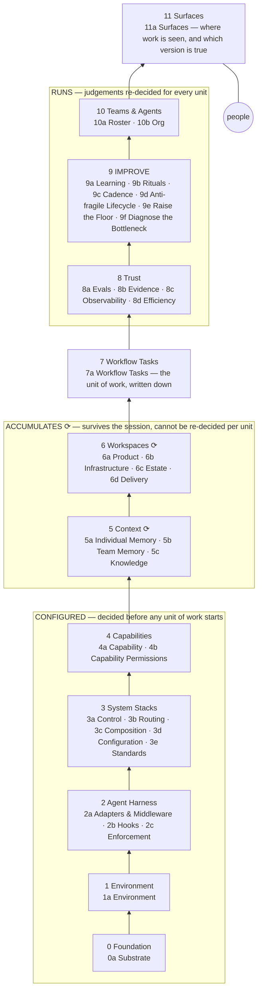

# The shape

The instrument first, the scorecard second, the range third, the layers fourth, the words last. Every noun links down.
The argument is in [`README.md`](./README.md).

## 1. The instrument

The grid: components down, harnesses across, every `●` a named primitive with a citation.

→ [`components/MATRIX.md`](./components/MATRIX.md) §1 — the grid, 19 concept rows × 14 columns
→ [`components/ALIGNMENT.md`](./components/ALIGNMENT.md) §2 — the 33-component view, harness columns only
→ [`archive/comparisons/01-concepts.md`](./archive/comparisons/01-concepts.md) §3.17 — what a primitive is, and why *one of it* is the whole point

**Profiles** — [`content/`](./content), one page per harness, in the shape [`skills/harness-teardown/SKILL.md`](./skills/harness-teardown/SKILL.md) prescribes:

| Harness | Altitude | Profile | State |
|---|---|---|---|
| Pi | runtime | [`content/pi.md`](./content/pi.md) | v2 (restructured 2026-09-07, diagrams pending); scored; deep read at [`content/pi/`](./content/pi/00-README.md), 5 docs |
| Hermes | gateway / host | [`content/hermes.md`](./content/hermes.md) | v2 (restructured 2026-09-07, diagrams pending); scored; deep read at [`content/hermes/`](./content/hermes/00-README.md), 13 docs |
| OpenClaw | gateway / host | [`content/openclaw.md`](./content/openclaw.md) | v2 (restructured 2026-09-07, diagrams pending); scored; deep read at [`content/openclaw/`](./content/openclaw/00-README.md), 21 docs |
| OpenCode | runtime | [`content/opencode.md`](./content/opencode.md) | v2 (restructured 2026-09-07, diagrams pending); scored; deep read at [`content/opencode/`](./content/opencode/00-README.md), 9 docs |
| Grok Bot / Grok Build | hosted product / runtime | [`content/grok.md`](./content/grok.md) | v2 (restructured 2026-09-07, diagrams pending); scored; deep read at [`content/grok/`](./content/grok/00-README.md), 13 docs |
| Codex CLI | runtime | [`content/codex.md`](./content/codex.md) | v2 (restructured 2026-09-07, diagrams pending); scored; deep read at [`content/codex/`](./content/codex/00-README.md), 12 docs |
| Gas City | gateway / host, install-into-a-loop nested | [`content/gas-city.md`](./content/gas-city.md) | v2 (restructured 2026-09-07, diagrams pending); scored; deep read at [`content/gas-city/`](./content/gas-city/00-README.md), 12 docs |
| LoomWarp | process layer | [`content/loomwarp.md`](./content/loomwarp.md) | v2 (restructured 2026-09-07, diagrams pending); scored; deep read at [`content/loomwarp/`](./content/loomwarp/00-README.md), 10 docs |
| FRACTAL (upstream · generic-cerebro fork · this repo) | process layer | [`content/fractal.md`](./content/fractal.md) | v2 (restructured 2026-09-07, diagrams pending); scored; deep read at [`content/fractal/`](./content/fractal/00-README.md), 10 docs |
| Claude Code | runtime | [`content/claude-code.md`](./content/claude-code.md) | v2 (2026-09-04); deep read at [`content/claude-code/`](./content/claude-code/00-README.md), 12 docs |
| HumanLayer · Deep Agents · Indigo HQ · QM · SageOx · gstack/gbrain | process layers | [`archive/comparisons/systems/`](./archive/comparisons/systems) | short teardowns, un-recut |
| QM (Quartermaster) | multi-tenant — **claimed, unmeasured** | [`archive/comparisons/systems/qm.md`](./archive/comparisons/systems/qm.md) | short teardown only; **promoted to the front of the queue** — it anchors axis I's `+3` and has never been scored |
| Cursor · Amp · Aider · Gemini CLI · Kiro · Antigravity · Droid · Windsurf · Cline | — | [`fractal/workstreams/W4-teardowns.md`](./fractal/workstreams/W4-teardowns.md) | queued, in that order |

## 2. The scorecard and the sheet

Where a harness sits, on axes with no good end. Seven headline dimensions for the reader who wants a
thirty-second read; ten axes beneath them for the reader who will open an anchor. **Neither grades**
— except one declared dimension, admitted by ruling.

→ [`spectrums/01-scorecard.md`](./spectrums/01-scorecard.md) — the seven DX dimensions, the character-sheet face
→ [`spectrums/00-README.md`](./spectrums/00-README.md) — the ten axes, and what makes one admissible
→ [`spectrums/positioning.md`](./spectrums/positioning.md) — where each harness sits, one card per harness, and how we decided

## 3. The range

Where a team is, and what breaks next. Six stages, from *resistant* to *AI-native*, with a
commitment threshold between four and five.

→ [`maturity/AI-Native-Organizational-Maturity-Framework.md`](./maturity/AI-Native-Organizational-Maturity-Framework.md) — the six stages
→ [`maturity/grid.html`](./maturity/grid.html) — the interactive grid
→ the graded-vs-catalogued split and the frontier past stage six: [`fractal/workstreams/W7-maturity-recut.md`](./fractal/workstreams/W7-maturity-recut.md)

## 4. The layers

Twelve layers, thirty-three components. IDs are `<layer><letter>`. The numbering is the original
twelve; the 13-layer renumber proposed in the consolidated guide §1 was **struck** in W0 (2026-09-03).

→ [`components/00-README.md`](./components/00-README.md) — **the roster**: all 33, the question each answers, and the profile anchor it lands on
→ [`components/`](./components) — Tier-2, one page per component: what it is, the best example, and a peer table
→ [`components/CROSSWALK.md`](./components/CROSSWALK.md) — the recorded gaps, six rulings, and the candidates register
→ source: [`assets/templates/layer-stack.mmd`](./assets/templates/layer-stack.mmd)

## 5. The words

→ [`vocabulary.md`](./vocabulary.md) — term → concept (vendor's words) → who says it → our component → instances
→ [`archive/comparisons/00-README.md`](./archive/comparisons/00-README.md) §1.2–1.4 — *harness* spans two altitudes; the inclusion test
→ [`components/ALIGNMENT.md`](./components/ALIGNMENT.md) §4.1 — the third altitude, and the loop question that finds it
