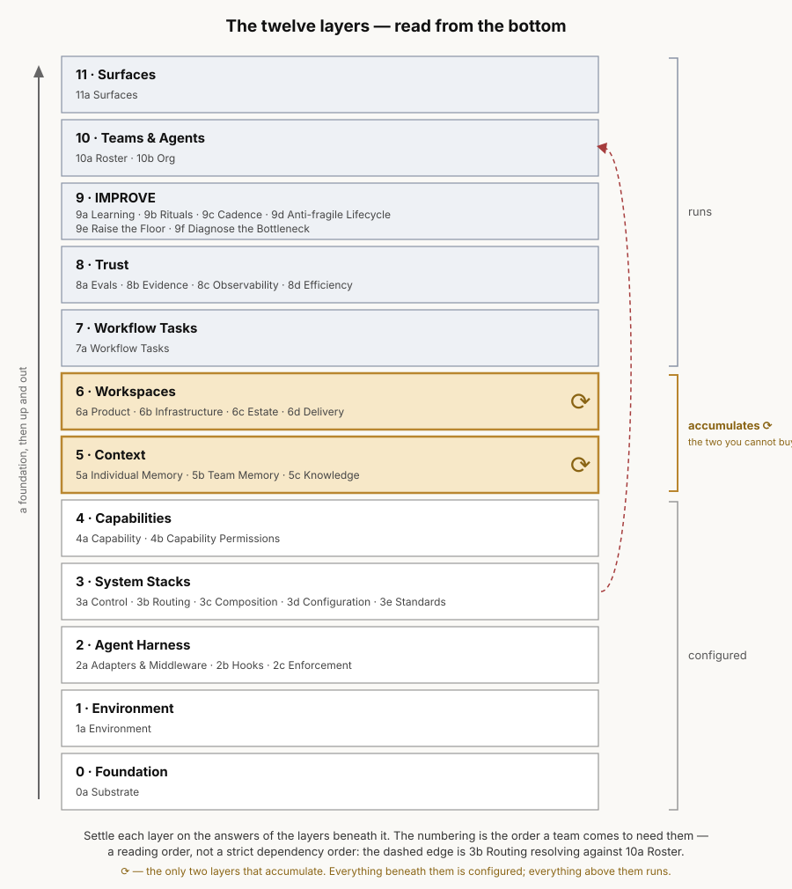

# LoomWarp — the twelve-layer framework

**What a team-scale agent harness must do, in twelve layers and thirty-three components** — each
component a function a team can be graded on, derived from the seventeen jobs and benchmarked against
the systems that ship today. The derivation and every supersession argument live in
[`CROSSWALK.md`](./CROSSWALK.md); the horizon rule the markers obey is
[`12-horizon.md`](./12-horizon.md) §2; the ancestor model at
[`02-functions.md`](../../archive/v0/02-functions.md) is re-argued, never copied, in
[`CROSSWALK.md`](./CROSSWALK.md).

**How to read it.** From the bottom. Each component file opens on the question it answers, carries one
*How do we work?* sentence a real team would say, and closes on a consequence. The table below already
runs in that order — layer 0 first. **Read the question column in sequence; the first question your
team cannot answer in one sentence is your weakest layer.**

Settle each layer on the answers of the layers beneath it: what you run on before what you can reach,
what you can reach before how the loop reaches it, what the loop enforces before what the stack
asserts. The numbering is **the order a team comes to need them** — a reading order, honestly held: one
published dependency runs upward ([`3b` Routing](../../components/3b-routing.md) resolves against
[`10a` Roster](../../components/10a-roster.md), seven layers above it), and other components publish
storage and resolution relations that cross layers too — so this is not a strict dependency order,
and the dashed edge in the picture is that admission drawn rather than buried. The map that would
carry those edges properly is owed, and named below.

## The short version: 12 layers, 33 components

| | Component | The question it answers | Horizon |
|---|---|---|---|
| **0 Foundation** | [`0a` Substrate](../../components/0a-substrate.md) | What do we run on? | `shipped` |
| **1 Environment** | [`1a` Environment](../../components/1a-environment.md) | What can we reach? | `bet` |
| **2 Agent Harness** | [`2a` Adapters & Middleware](../../components/2a-adapters-and-middleware.md) | How does the loop reach any of it? | `shipped` |
| | [`2b` Hooks](../../components/2b-hooks.md) | When does something happen without anyone remembering to run it? | `shipped` |
| | [`2c` Enforcement](../../components/2c-enforcement.md) | Where does a rule stop being a request? | `shipped` |
| **3 System Stacks** | [`3a` Control](../../components/3a-control.md) | How does intent become work that is allowed to start? | `shipped` |
| | [`3b` Routing](../../components/3b-routing.md) | Who picks this up? | `emerging` |
| | [`3c` Composition](../../components/3c-composition.md) | What is this agent made of? | `emerging` |
| | [`3d` Configuration](../../components/3d-configuration.md) | Where does our opinion attach? | `shipped` |
| | [`3e` Standards](../../components/3e-standards.md) | What does good look like here, before anyone writes anything? | `bet` |
| **4 Capabilities** | [`4a` Capability](../../components/4a-capability.md) | What can the team do, and how does it travel? | `shipped` |
| | [`4b` Capability Permissions](../../components/4b-capability-permissions.md) | Who may invoke this, and against what? | `emerging` |
| **5 Context ⟳** | [`5a` Individual Memory](../../components/5a-individual-memory.md) | What do I know that the team has not agreed to? | `emerging` |
| | [`5b` Team Memory](../../components/5b-team-memory.md) | What has to be true for anyone else's agent? | `emerging` |
| | [`5c` Knowledge](../../components/5c-knowledge.md) | Where does an agent go to find out what we know? | `shipped` |
| **6 Workspaces ⟳** | [`6a` Product](../../components/6a-product.md) | Where does the work land, and what is it not allowed to become? | `bet` |
| | [`6b` Infrastructure](../../components/6b-infrastructure.md) | Where does the work actually happen? | `emerging` |
| | [`6c` Estate](../../components/6c-estate.md) | What code exists, and what does a change here break there? | `emerging` |
| | [`6d` Delivery](../../components/6d-delivery.md) | How does a finished change get to production? | `bet` |
| **7 Workflow Tasks** | [`7a` Workflow Tasks](../../components/7a-workflow-tasks.md) | What is the unit of work, written down? | `emerging` |
| **8 Trust** | [`8a` Evals](../../components/8a-evals.md) | What does the work have to clear before it ships? | `shipped` |
| | [`8b` Evidence](../../components/8b-evidence.md) | How does someone who was not there come to believe it? | `shipped` |
| | [`8c` Observability](../../components/8c-observability.md) | What did it actually do? | `shipped` |
| | [`8d` Efficiency](../../components/8d-efficiency.md) | What did that cost, and was it worth buying again? | `emerging` |
| **9 IMPROVE** | [`9a` Learning](../../components/9a-learning.md) | What happens to a lesson after it is learned? | `emerging` |
| | [`9b` Rituals](../../components/9b-rituals.md) | Who is in the loop, and what are they there to do? | `emerging` |
| | [`9c` Cadence](../../components/9c-cadence.md) | What runs without anyone asking? | `shipped` |
| | [`9d` Anti-fragile Lifecycle](../../components/9d-anti-fragile-lifecycle.md) | What closes the loop? | `bet` |
| | [`9e` Raise the Floor](../../components/9e-raise-the-floor.md) | How does a second way of doing something get retired? | `bet` |
| | [`9f` Diagnose the Bottleneck](../../components/9f-diagnose-the-bottleneck.md) | What is limiting us, and what do we fix next? | `bet` |
| **10 Teams & Agents** | [`10a` Roster](../../components/10a-roster.md) | Who is on this team? | `emerging` |
| | [`10b` Org](../../components/10b-org.md) | Who answers for this, and who may change it? | `claimed` |
| **11 Surfaces** | [`11a` Surfaces](../../components/11a-surfaces.md) | Where is the work seen, and which version of it is true? | `emerging` |

The layer is navigation; **the component is the gradeable function** — and after the `O-6` ruling the
twelve layers are literally the Grid's warp threads, with the thirty-three as drill-down
([`CROSSWALK.md`](./CROSSWALK.md) §3.7, §3.10). Markers: `shipped` 12 · `emerging` 13 · `bet` 7 ·
`claimed` 1.

## The five ideas this framework stakes

**A · The product is a layer** *(layer 6)*. The deliverable — and the written directives on what it may
not become — is a graded function, not an inventory item. No peer taxonomy has a layer for where
outcomes land; [`6a`](../../components/6a-product.md) is that layer.

**B · Only two layers accumulate** *(layers 5 and 6, the `⟳` pair)*. Everything below them is
configured — chosen once, revisited rarely. Everything above them runs. Context and Workspaces are the
two that grow with use, and **the two a team cannot buy**: you can rent a model, adopt a harness and
import a standards pack; you cannot import what your team has learned or the product it has built.
**The falsifier, so the claim can be lost:** a third layer would have to accumulate, and the named
candidate is [`8b` Evidence](../../components/8b-evidence.md) — its ledger grows monotonically with
use and cannot be imported, and it is excluded today because its entries feed forward only as
*measurement*, never as *content* an agent reads to do the next unit of work better. Show an evidence
store whose prior entries are retrieved as context for a new run, and the pair becomes a triple. Named
and dated 2026-09-01; argued in full at [`5a`](../../components/5a-individual-memory.md).

**C · Declare the environment; derive the adapters** *(layers 1 and 2)*. MCP adapts per call while the
harness never holds a model of what exists — so the inventory is declared at
[`1a`](../../components/1a-environment.md) and the reach is derived at
[`2a`](../../components/2a-adapters-and-middleware.md), graded apart; the argument is owned at `1a`.

**D · Actors and Org are separate** *(layer 10)*. *Who exists* ([`10a`](../../components/10a-roster.md))
and *who answers* ([`10b`](../../components/10b-org.md)) are two rows that fail apart, and each file
names the failure the other cannot see.

**E · Standards is its own component** *(`3e`)*. *What good looks like* is authored, versioned and
inherited under *tighten, never loosen* — split from the catalog that distributes it and from the bar
that checks it ([`3e`](../../components/3e-standards.md)).

## Where the eight configuration mechanisms attach

The only empirically-derived inventory of where configuration attaches to an agent is Galster et al.'s
eight mechanisms, read at source in
[`07-verified-inventories.md`](../../comparisons/2026-08-research/07-verified-inventories.md)
§1. Each binds to exactly one component — except MCP, whose two-layer split is pre-ruled and argued at `1a`. Where a
binding revises the earlier band mapping at [`11-architecture.md`](../../archive/v0/11-architecture.md) §3.1, that
is deliberate: that mapping marked itself as its own claim, and two of its assignments predate the
`O-5` ruling that moved enforcement's mechanism out of Trust.

| Mechanism | Binds to | The argument |
|---|---|---|
| **Context Files** | [`5b` Team Memory](../../components/5b-team-memory.md) | *"Markdown file loaded into the context each session"* — committed to the repo, owned by the team, read by every agent. The per-user store is `5a`; the surveyed artifact is team-addressed |
| **Settings** | [`2c` Enforcement](../../components/2c-enforcement.md) | *"JSON/TOML config for project-level tool behavior"* — the file where the harness's posture binds: permission and deny rules, managed overrides, sandbox flags. The cheap rungs of `2c`'s ladder live here; what else it carries configures machinery, which is not graded |
| **Skills** | [`4a` Capability](../../components/4a-capability.md) | *"Reusable knowledge and invocable workflows"* — the catalog's unit. The uncomfortable measurement that most published skills ship no executable resource is owned at `4a` |
| **Subagents** | [`3c` Composition](../../components/3c-composition.md) | The survey's sharpest sentence is an isolation claim — subagents *"operate in parallel to the central agent loop, in their own context"* — and deciding what shares a context window is `3c`'s definition. Not `10a`: a list of agent definitions is not a roster, as `10a`'s own file rules |
| **Commands** | [`7a` Workflow Tasks](../../components/7a-workflow-tasks.md) | *"User-triggered shortcuts for predefined prompts"* — a person triggers a named piece of work, and the prompt behind it is the work contract in its weakest form. The strongest published instances are workflow entries: handoffs, phase prompts |
| **Hooks** | [`2b` Hooks](../../components/2b-hooks.md) | Pre-ruled. *"Scripts executed at specific agent lifecycle points"* — the harness defines the points, so the mechanism is the harness layer's |
| **Rules** | [`3e` Standards](../../components/3e-standards.md) | *"System-level instructions to control agent behavior"* — instructions, not mechanisms: the pre-hoc Guides half of the `O-5` split, and the surface a path-scoped standard lives on |
| **MCP** | [`1a`](../../components/1a-environment.md) declared · [`2a`](../../components/2a-adapters-and-middleware.md) adapted | Pre-ruled, and the split is the argument: an entry with an owner and an auth model at `1a`, a per-call resolution bound to the loop at `2a`. A tool list discovered at call time is reach without inventory |

What the survey does *not* contain is stated at the source and respected here: no per-mechanism
frequency table, no agent-loop diagram, no enumerated lifecycle points.

**And one plain statement about MCP's altitude, so nobody has to infer it from empty cells:**
seventeen of the eighteen MCP peer cells in layers 6–11 read *"Nothing here"* —
[`11a` Surfaces](../../components/11a-surfaces.md) is the only exception. That is one fact, not
seventeen gaps. MCP resolves connections per call, and the questions those layers ask — where work
lands, whether to believe it, who answers for it — sit **above the protocol's altitude**. Read the
empty cells as a boundary.

## Primitives and machinery

> **A primitive is a thing you configure. Machinery is a thing that runs.**

**All thirty-three components are configurable primitives — that is the membership test**
([`CROSSWALK.md`](./CROSSWALK.md) §3.10: the 33 are the primitive set, numbered in adoption order).
**Machinery is not graded** — and *machinery* here is a term of art for the runnable implements
inside a component, not for the layers above the `⟳` pair, whose judgements are graded like any other
row. Ours, named: `router.py` and `dispatch.py` are machinery and sit at
[`3a` Control](../../components/3a-control.md); **the work contract they read is the primitive**, and
it is graded at [`7a`](../../components/7a-workflow-tasks.md). The same line splits
[`9c` Cadence](../../components/9c-cadence.md): the trigger is machinery, and the row is graded on
what a run emits and who reads it. A grid that scores machinery has graded whether a team installed something —
`C-24`'s failure, fixed structurally by the `F4` split.

## The two answers a reader is owed

### Does "harness engineering" reduce to context engineering?

Galster et al.'s headline is a direct challenge to this document's premise: *"Harness
engineering in open source today is therefore mostly context engineering."* Their evidence is real —
context files reach 90.6% of surveyed repositories, and beyond Context Files, Skills, Subagents, Rules
and Settings, *"no other mechanism exceeds 20% adoption for Claude, Copilot, Cursor, or Gemini"*
([`07-verified-inventories.md`](../../comparisons/2026-08-research/07-verified-inventories.md) §1).

**About open source today, the paper is right, and this framework's own evidence corroborates it**:
our eight `bet`/`claimed` markers — the rows where no peer ships the object — concentrate at the top
of the stack, six of the eight at layer 6 or above. The field's shipped surface thins as you climb,
which is the paper's finding restated structurally.

**The claim this framework makes is a dated forward claim about where teams are going, not a
description of the present.** Context is one layer of twelve, and one of only two that accumulate.
What the other eleven do that it does not: they hold **decisions that bind** — the substrate chosen,
the environment declared, the loop enforced, the capability granted — and **judgements that run** —
work contracted, output gated, evidence kept, the bottleneck named, authority stated, truth located.
None of that can be accumulated into existence, and no volume of context substitutes for a deny rule,
a roster, or a named constraint. The team-scale failures this corpus documents — permissions bypassed
on a live run, one person's assumption promoted by proximity, a stale answer sourced from an unstated
surface — are failures of layers 2, 5's *boundary*, and 11, and better context files fix none of them.

**What would settle it:** the claim dies if teams reach layer-8-and-up outcomes — gated shipping,
provable completion, diagnosed bottlenecks — on context engineering alone; or if, by the re-check date
below, the mechanisms above the context altitude are still marginal *and* team-scale deployments are
succeeding without them. Either finding means the upper layers are over-modeled and this document
should shrink. Claimed 2026-09-01.

### Does the framework assume software?

**Yes — v1 assumes a team whose deliverable lives in version control, and says so rather than
implying otherwise.** The tells are structural: `J10` distributes to repos, `J8` proves against
commits, `J15` hardens code; the empirical base is 2,853 GitHub repositories and five coding
harnesses; [`6c` Estate](../../components/6c-estate.md) and
[`6d` Delivery](../../components/6d-delivery.md) are code-native by definition.

The honest boundary: the *shape* of layers 5, 8, 9, 10 and 11 — accumulated context, evidence over
claims, a diagnosed constraint, named authority, a decided source of truth — describes any team whose
work leaves auditable artifacts, but **every citation behind those layers is from software, so the
wider claim is not made.** What would settle it: a non-software team grades itself against the
question column above and the rows either hold or visibly fail. Until one does, this framework claims
software delivery, full stop. Stated 2026-09-01.

## The conformance spectrum

**Dated 2026-09-01** *(assigned by [`CROSSWALK.md`](./CROSSWALK.md) §3.11; sources:
[`3e`](../../components/3e-standards.md)'s inheritance contract and
[`09-context-layer.md`](../../archive/v0/09-context-layer.md) §7's conformance surface).* A member's personal
stack may legitimately diverge on the **vendor-providable core** — layers 0, 1, 2, and `3a`–`3d` — and
on [`5a` Individual Memory](../../components/5a-individual-memory.md): run a different harness,
different adapters, your own control stack, your own notes. Three things conform, under **tighten,
never loosen**: [`3e` Standards](../../components/3e-standards.md) (*reference, never copy; tighten,
never contradict*), [`5b`](../../components/5b-team-memory.md)'s governed tier including the decision
ledger (when copies disagree, the ledger wins), and [`6a` Product](../../components/6a-product.md)'s
directive set. **You may bring your own harness. You may not bring your own definition of good, your
own version of a decision, or your own product constraints.**

## What this is not, and what is still owed

- **The layer list is not the system map.** The typed-relations map — the prototyped relation set
  over the thirty-three, a `run-by` column naming who operates each, and the loop overlay, exactly as
  specified at [`CROSSWALK.md`](./CROSSWALK.md) §3.10 — is owed by the **`harness-map-v1`** workstream,
  assigned 2026-09-01. This README is the reading order; that map is the mechanism.
  **The skeleton is pre-drawn** at [`06-relations.md`](./06-relations.md) — thirteen cited `requires`
  edges, seven proposed, and five questions the working session has to answer. It is SCAFFOLD, not
  settled structure.
- **What the framework does not close is named, dated, in one place:**
  [`CROSSWALK.md`](./CROSSWALK.md) §3 — stewardship, RBAC over context, the Briefing's missing row,
  pre-decision judgment, and the rest.
- **The peer benchmark** runs through every component file's implementation row — Claude Code · Deep
  Agents · MCP · HumanLayer · ours — cited to teardowns by file and section.

## Re-check register

The claims above have shelf lives, in the register this corpus already keeps
([`comparisons/00-README.md`](../../comparisons/00-README.md) §6):

| Claim | Dies if | By |
|---|---|---|
| **The `⟳` pair** (idea B) | a third layer accumulates — the named candidate is `8b` Evidence, and the losing condition is an evidence store whose prior entries are retrieved as context for a new run | **2027-03-01**, or on any peer release that shows it |
| **The altitude claim** | teams reach layer-8-and-up outcomes on context engineering alone, or the above-context mechanisms stay marginal while team-scale deployments succeed without them | **2027-03-01** |
| **The scope boundary** | a non-software team grades itself and the rows visibly fail — that kills the shape claim; a non-software team naming its weakest layer instead *widens* it | opportunistically |
| **The mechanism bindings** | a survey successor publishes an attachment model that contradicts a binding argued above | on publication |

---

*The mental model, in one read: [`00-consolidated-guide-and-mental-model.md`](./00-consolidated-guide-and-mental-model.md) · The derivation: [`CROSSWALK.md`](./CROSSWALK.md) · The jobs:
[`03-jtbd.md`](../../comparisons/03-jtbd.md) · The horizon rule:
[`12-horizon.md`](./12-horizon.md) §2 · The design:
[`11-architecture.md`](../../archive/v0/11-architecture.md) §1*
